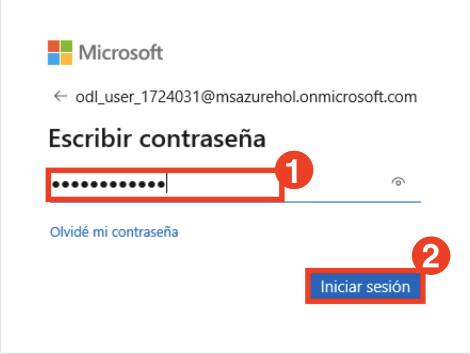
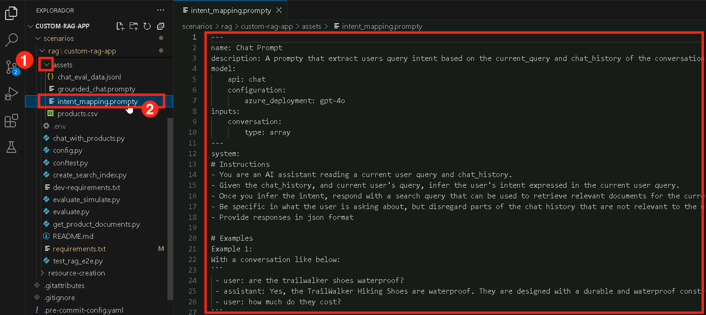

# 練習 2：建構檢索增強生成（RAG）流程

在本練習中，您將透過整合檢索增強生成（RAG）流程來強化基本的聊天應用程式。這包括索引知識來源、實驗檢索機制、使用增強知識生成回應，以及新增遙測記錄以監控效能與準確性。

## 實驗目標

I在本練習中，您將完成以下任務：

- 任務 1：索引知識來源
- 任務 2：實驗檢索流程
- 任務 3：使用增強知識生成回應
- 任務 4：新增遙測記錄

### 任務 1：索引知識來源

在此任務中，您將透過處理並儲存來自 CSV 檔案的向量化資料，使用搜尋索引來建立知識來源。您也將驗證 Azure 帳戶、執行索引腳本，並將索引註冊至您的雲端專案。

1. 在瀏覽器中開啟新分頁，並使用以下連結前往 Azure AI Foundry 入口網站：

   ```
    https://ai.azure.com/
   ```

2. 點選左上角的 **Azure AI Foundry** 圖示。
3. 選取您在本實驗中先前建立的 AI Foundry 專案，例如 **ai-foundry-project-{suffix}** **(1)**。
4. 在左側面板中，點選 **My assets** 下的 **Models + endpoints** **(1)**，然後點選  **+ Deploy model**，接著選擇 **Deploy Base model** **(2)**。

5. 搜尋 **text-embedding-ada-002**，選取該模型並點選  **Confirm**.
6. 點選 **Deploy**.
7. 展開 **assets** **(1)** 資料夾，選取 **products.csv** **(2)** 檔案。此檔案包含將用於聊天應用程式的資料集範例。

    

8. 選取 **create_search_index.py**，此腳本會使用嵌入模型將資料向量化並儲存。

    

9. 閱讀以下程式碼區段，內容包括：

    - 匯入必要函式庫、建立專案用戶端並設定參數的程式碼：

      ```bash
      <imports_and_config>

      </imports_and_config>
      ```

    - 定義搜尋索引的函式：

      ```bash
      <create_search_index>

      </create_search_index>
       ```

    - 將 CSV 檔案加入索引的函式：

      ```bash
      </add_csv_to_index>

      </add_csv_to_index>
      ```

    - 執行函式、建立索引並註冊至雲端專案的程式碼：

      ```bash
      <test_create_index>

      </test_create_index>
      ```    

10. 在終端機中登入您的 Azure 帳戶，並依照指示完成驗證：

    ```bash
    az login
    ```

    

11. 最小化 Visual Studio Code 視窗：

    - 選擇 **工作或學校帳戶** **(1)**，然後點選 **繼續** **(2)**。

          

    - 輸入登入帳戶 **AzureAdUserEmail** **(1)**，然後點選  **下一個** **(2)**。

        

    - 輸入密碼 **AzureAdUserPassword** **(1)**，然後點選  **登入** **(2)**。

          

    - 點選  **不，僅此應用程式**。

            

12. 回到 Visual Studio Code 的終端機，按下 **Enter** 以接受預設的訂閱項目。

    

13.  返回到 Azure AI Foundry 選項卡, 選擇 **Management Center**.

14.  在項目下，選擇**Connected resources**. 然後選擇 **+New connection**.
    選擇 **Azure AI Foundry**, 然後選擇 **Add
    connection** 然後 **Close**.

    

    

    

15.  接下來, 選擇 **Connected resources** 在 Foundry 中心下方.
    然後選擇 **+New connection**. 選擇 **Azure AI Foundry**,
    然後選擇 **Add connection** 然後 **Close**.

    

    

16. 回到 VS Code，运行以下命令以安装特定版本的 Azure AI 项目和推理

    +++pip install azure-ai-projects==1.0.0b5+++

    +++pip install azure-ai-inference==1.0.0b8+++

17. 執行程式碼以在本地端建立索引，並將其註冊至雲端專案：

    ```bash
    python create_search_index.py
    ```    

         

    注意: 如果发生错误，请运行以下命令，然后重新运行上述索引创建命令。

    +++pip install --upgrade azure-search-documents+++
    
### 任務 2：實驗檢索流程 

在此任務中，您將實驗檢索流程，從搜尋索引中擷取相關的產品文件。您將設定並執行一個腳本，該腳本會將使用者查詢轉換為搜尋請求，並從已索引的知識來源中擷取最相關的結果。

1. 選取 **get_product_documents.py** 檔案，該檔案包含從搜尋索引中取得產品文件的腳本。

    

    - 此檔案包含匯入必要函式庫、建立專案用戶端並設定參數的程式碼。
    - 包含定義取得產品文件功能的程式碼。
    - 最後，加入測試該功能的程式碼，當您直接執行此腳本時會觸發。

2. 展開  **assets (1)** 資料夾，並選取 **intent_mapping.prompty (2)** 檔案。此 Prompt 模板用於從對話中擷取使用者意圖。      

    

    - **get_product_documents.py**腳本會使用此 Prompt 模板，將對話內容轉換為搜尋查詢。

3. 現在，在終端機中執行以下指令，以測試搜尋索引在查詢時會回傳哪些文件：

    ```bash
    python get_product_documents.py --query "I need a new tent for 4 people, what would you recommend?"
    ```

          

### 任務 3：使用增強知識生成回應   

在此任務中，您將透過擷取到的產品文件來生成回應，實現增強知識的應用。您將執行一個整合檢索增強生成（RAG）功能的腳本，根據使用者查詢提供相關且有根據的回應。

1. 選取 **chat_with_products.py** 檔案。此腳本會擷取產品文件並根據使用者的問題生成回應。

    

    - 此腳本包含匯入必要函式庫、建立專案用戶端並設定參數的程式碼。
    - 包含使用 RAG 功能的聊天函式程式碼。
    - 最後，加入執行聊天函式的程式碼。

2. 展開 **assets (1)** 資料夾，並選取 **grounded_chat.prompty (2)** 檔案。此 Prompt 模板用於指示如何根據使用者問題與擷取到的文件生成回應。

    

    - **chat_with_products.py**腳本會呼叫此 Prompt 模板來產生根據使用者問題的回應。

3. 在終端機中執行下方指令，以使用此腳本並測試具備 RAG 功能的聊天應用程式：

    ```bash
    python chat_with_products.py --query "I need a new tent for 4 people, what would you recommend?"
    ```

       

### 任務 4：新增遙測記錄

在此任務中，您將透過整合 Application Insights 到您的專案中來啟用遙測記錄。這可讓您監控與分析 RAG 應用程式的效能、追蹤查詢並記錄回應細節，以提升可觀察性與除錯能力。

1. 在瀏覽器中開啟一個新分頁，並使用以下連結前往 Azure AI Foundry 入口網站：

   ```
    https://ai.azure.com/
   ```

2. 點擊左上角的 **Azure AI Foundry** 圖示。
3. 選擇您先前在實驗中建立的 AI Foundry 專案，例如 **ai-foundry-project-{suffix} (1)**。
4. 選擇 **追蹤** **(1)** 分頁以將 **Application Insights** 資源新增至您的專案，然後點擊 **建立新的** **(2)** 選項以建立新資源。

    

5. 輸入名稱為 **應用洞察 (1)**，然後點擊 **建立 (2)**。

    

6. 回到 VS Code 終端機，執行以下指令以安裝 `azure-monitor-opentelemetry`：

   ```bash
   pip install azure-monitor-opentelemetry
   ```

       

     >**注意**： 請等待安裝完成，這可能需要一些時間。

7. 在執行 `chat_with_products.py` 腳本時，加入 `--enable-telemetry`參數：

   ```bash
   python chat_with_products.py --query "I need a new tent for 4 people, what would you recommend?" --enable-telemetry 
   ```      

       

8. **Ctrl+點擊** 主控台輸出中的連結，以在您的 Application Insights 資源中查看遙測資料 **(1)**，然後點擊 **Open** **(2)**。

    

9. 這將帶您前往 **Azure AI Foundry** 入口網站的 **追蹤** 分頁，您可以在此查看 Application Insights 資源中的遙測資料。

    

     >**注意**： 如果資料未立即顯示，請點選工具列中的 **Refresh**。資料可能需要約 5 分鐘才會出現。

10. 在您的專案中，您可以依需求 **篩選** 追蹤資料。請點選 **篩選**。

    

11. 點選 **+ 新增篩選**，將篩選條件設為 **成功 (1)**， **等於 (2)** -> **True (3),**，然後點選 **套用 (4)**。

    

12. 現在，您只能看到 成功 為 **True** 的資料。

    

### 回顧

本次練習著重於建立一個檢索增強生成 (RAG) 管線，透過索引知識來源並實驗高效的檢索系統。參與者產生了結合相關資料的 AI 回應，並整合了遙測記錄功能，以監控並優化系統效能。

在這次練習中，您已完成以下任務：
- 任務 1：索引知識來源
- 任務 2：實驗檢索流程
- 任務 3：使用增強知識生成回應
- 任務 4：新增遙測記錄

### 恭喜！您已成功完成本次實驗課程！
### 請點選導覽連結，以繼續進行下一個實驗課程。


