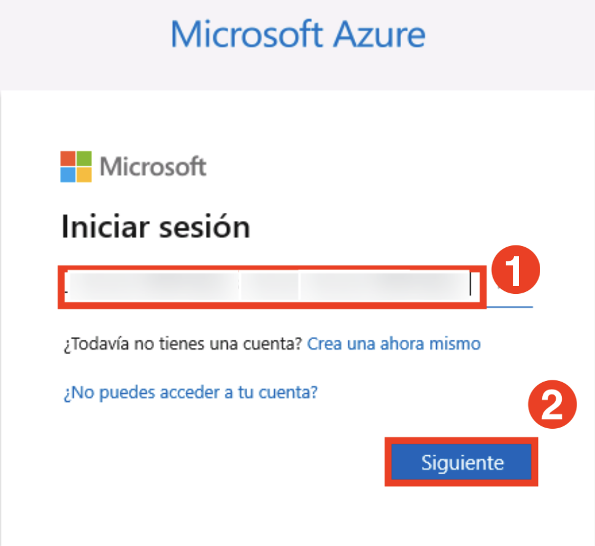
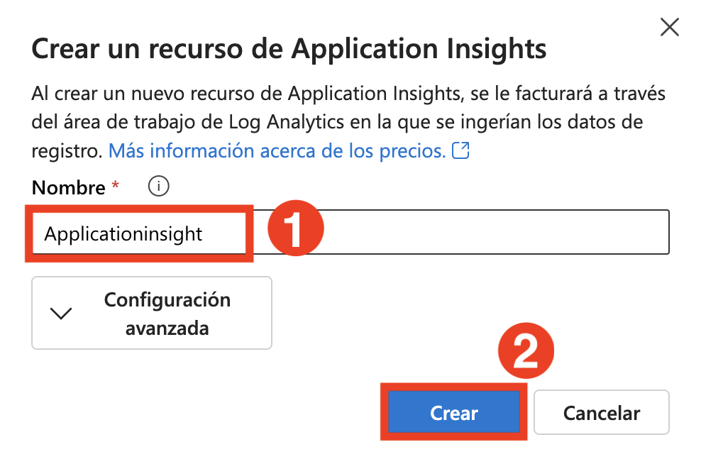

# 실습 2: 검색 증강 생성(RAG) 파이프라인 구축

이 실습에서는 기본 채팅 애플리케이션에 검색 증강 생성(Retrieval-Augmented Generation, RAG) 파이프라인을 통합하여 기능을 향상시킬 것입니다. 여기에는 지식 소스 인덱싱, 검색 메커니즘 구현, 지식이 보강된 응답 생성, 성능 및 정확성 모니터링을 위한 텔레메트리 로깅 추가가 포함됩니다.

## 목표

이 실습에서 수행할 작업은 다음과 같습니다:

- 과제 1: 지식 소스 인덱싱
- 과제 2: 검색 파이프라인 구현
- 과제 3: 보강된 지식을 기반으로 응답 생성
- 과제 4: 텔레메트리 로깅 추가

## 과제 1: 지식 소스 인덱싱

이 과제에서는 CSV 파일로부터 벡터화된 데이터를 처리하여 **검색 인덱스(Search Index)** 에 저장함으로써 지식 소스를 인덱싱하게 됩니다. 또한 Azure 계정에 인증하고, 색인 생성 스크립트를 실행하며, 생성된 인덱스를 클라우드 프로젝트에 등록합니다.

1. 브라우저의 새 탭을 열고 아래 링크를 통해 Azure AI Foundry 포털에 접속합니다:

   ```
   https://ai.azure.com/
   ```

1. 왼쪽 상단의 **Azure AI Foundry** 아이콘을 클릭합니다.
1. 이전 실습에서 생성한 **AI Foundry 프로젝트**, 즉 **ai-foundry-project-{suffix}** 를 선택합니다.
1. 왼쪽 메뉴의 **내 자산** 섹션에서 **모델 + 엔드포인트 (1)** 를 클릭한 후, **+ 모델 배포** 버튼을 눌러 **기본 모델 배포 (2)** 을 선택합니다.
1. **text-embedding-ada-002** 모델을 검색하고 선택한 후, **확인**을 클릭합니다.
1. **배포** 버튼을 클릭하여 모델을 배포합니다.
1. **Visual Stuiod Code**로 돌아가서 **assets (1)** 폴더를 확장하고, **products.csv (2)** 파일을 선택합니다. 이 파일은 챗봇 애플리케이션에서 사용할 데이터 세트 예시를 포함하고 있습니다.

   

1. **create\_search\_index.py** 파일을 선택합니다. 이 파일은 임베딩 모델로부터 생성된 벡터 데이터를 저장하는 스크립트입니다.

   

1. 다음 코드 구성을 검토합니다. 이 코드는 다음과 같은 내용을 포함하고 있습니다:

   - 필수 라이브러리 임포트, 프로젝트 클라이언트 생성, 설정 구성:

     ```bash
     <imports_and_config>
     </imports_and_config>
     ```

   - 검색 인덱스를 정의하는 함수 추가:

     ```bash
     <create_search_index>
     </create_search_index>
     ```

   - CSV 파일을 인덱스에 추가하는 함수 생성:

     ```bash
     <add_csv_to_index>
     </add_csv_to_index>
     ```

   - 위 함수를 실행하여 인덱스를 생성하고 클라우드 프로젝트에 등록하는 코드:

     ```bash
     <test_create_index>
     </test_create_index>
     ```

1. 터미널에서 다음 명령어를 실행하여 Azure 계정에 로그인하고 인증 절차를 진행합니다:

    ```bash
    az login
    ```

    

1. Visual Studio Code 창을 최소화한 후 아래 절차에 따라 로그인합니다:

    - **회사 또는 학교 계정 (1)** 선택 후 **계속 (2)** 클릭.
      

    - **Username AzureAdUserEmail (1)** 입력 후 **다음 (2)** 클릭.
      

    - **Password AzureAdUserPassword (1)** 입력 후 **로그인 (2)** 클릭.
      

    - **아니오, 이 앱에만 로그인 합니다.** 를 선택.
      

1. Visual Studio Code 터미널로 돌아가서 **Enter** 키를 눌러 기본 구독을 수락합니다.

    

1. 다음 명령어를 실행하여 로컬에서 인덱스를 생성하고 이를 클라우드 프로젝트에 등록합니다:

    ```bash
    python create_search_index.py
    ```

    

## 과제 2: 검색 파이프라인 구현

이 과제에서는 검색 인덱스(Search Index)로부터 관련 있는 제품 문서를 추출하여 검색 파이프라인(Retrieval Pipeline) 을 구현합니다. 사용자의 질의를 검색 요청으로 변환하고, 색인된 지식 소스로부터 가장 관련성 높은 결과를 가져오는 스크립트를 구성하고 실행하게 됩니다.

1. **get\_product\_documents.py** 파일을 선택합니다. 이 파일은 검색 인덱스로부터 제품 문서를 가져오는 스크립트를 포함하고 있습니다.

   

   - 이 파일에는 다음과 같은 코드가 포함되어 있습니다:

     - 필요한 라이브러리를 임포트하고, 클라이언트 프로젝트를 생성하고 설정을 구성하는 코드
     - 제품 문서를 가져오는 함수를 추가하는 코드
     - 마지막으로, 스크립트를 직접 실행할 경우 해당 함수를 테스트 하는 코드를 추가    

1. **assets (1)** 폴더를 확장하고, **intent\_mapping.prompty (2)** 파일을 선택합니다. 이 템플릿은 대화에서 사용자의 **의도(intent)** 를 추출하여 검색 질의로 변환 합니다.

   

   - `get_product_documents.py` 스크립트는 이 프롬프트 템플릿을 사용하여 대화 내용을 검색 질의로 변환합니다.

1. 이제 터미널에서 아래 명령어를 실행하여, 주어진 질의에 대해 검색 인덱스가 반환하는 문서를 테스트합니다:

   ```bash
   python get_product_documents.py --query "I need a new tent for 4 people, what would you recommend?"
   ```

   

이 작업을 통해, 사용자의 자연어 요청이 어떻게 검색 쿼리로 변환되고, 인덱스된 지식 기반에서 관련 문서를 어떻게 가져오는지를 직접 확인할 수 있습니다.

## 과제 3: 보강된 지식을 활용하여 응답 생성

이 과제에서는 검색된 제품 문서를 활용하여 보강된 지식 기반 응답(Augmented Knowledge)을 생성합니다. 사용자의 질문에 대해 RAG(Retrieval-Augmented Generation) 기능이 통합된 스크립트를 실행하여 관련성 있고 근거 있는 답변을 생성하게 됩니다.

1. **`chat_with_products.py`** 파일을 선택합니다. 이 스크립트는 제품 문서를 검색하고 사용자 질문에 대한 응답을 생성합니다.

   

   - 이 스크립트에는 필수 라이브러리 임포트, 프로젝트 클라이언트 생성, 설정 구성 코드가 포함되어 있습니다.
   - RAG 기능을 활용하여 채팅의 응답을 생성하는 함수가 포함되어 있습니다.
   - 마지막으로, 채팅 함수가 실행되도록 하는 코드가 추가되어야 합니다.

1. **`assets (1)`** 폴더를 확장하고 **`grounded_chat.prompty (2)`** 파일을 선택합니다. 이 프롬프트 템플릿은 사용자 질문과 검색된 문서를 기반으로 응답을 생성하는 방식을 정의합니다.

   

   - **`chat_with_products.py`** 스크립트는 이 프롬프트 템플릿을 호출하여 사용자 질문에 대한 응답을 생성합니다.

1. 다음 명령어를 터미널에 입력하여 스크립트를 실행하고 RAG 기능이 적용된 챗봇 앱을 테스트합니다.

   ```bash
   python chat_with_products.py --query "I need a new tent for 4 people, what would you recommend?"
   ```

   

## 과제 4: 텔레메트리 로깅 추가

이 과제에서는 Application Insights를 프로젝트에 통합하여 텔레메트리 로깅을 활성화합니다. 이를 통해 RAG 애플리케이션의 성능을 모니터링하고, 쿼리와 응답 데이터를 기록하여 가시성과 디버깅 능력을 향상시킬 수 있습니다.

1. 브라우저의 새 탭을 열고 아래 링크를 통해 Azure AI Foundry 포털에 접속합니다.

   ```
   https://ai.azure.com/
   ```

1. 좌측 상단의 **Azure AI Foundry** 아이콘을 클릭합니다.

1. 이전 실습에서 생성한 프로젝트, 예: **ai-foundry-project-{suffix} (1)** 을 선택합니다.

1. **추척 (1)** 탭을 선택하고, **새로 만들기 (2)** 버튼을 클릭하여 **Application Insights** 리소스를 새로 생성합니다.

   

1. 이름을 **Applicationinsight (1)** 로 입력한 후, **만들기 (2)** 를 클릭합니다.

   

1. VS Code 터미널로 돌아가 아래 명령어를 실행하여 `azure-monitor-opentelemetry` 패키지를 설치합니다.

   ```bash
   pip install azure-monitor-opentelemetry
   ```

   

   > **참고:** 설치에는 다소 시간이 걸릴 수 있으니 완료될 때까지 기다려 주세요.

1. `chat_with_products.py` 스크립트를 실행할 때 `--enable-telemetry` 플래그를 추가하여 텔레메트리 기능을 활성화합니다.

   ```bash
   python chat_with_products.py --query "I need a new tent for 4 people, what would you recommend?" --enable-telemetry
   ```

   

1. 콘솔 출력에 표시된 링크를 **Ctrl+클릭** 하여 Application Insights 리소스의 텔레메트리 데이터를 확인하고, **Open (2)** 을 클릭합니다.

   

1. **Azure AI Foundry 포털의 Tracing 탭**으로 이동되며, 여기서 Application Insights 리소스의 텔레메트리 데이터를 확인할 수 있습니다.

   

   > **참고:** 데이터가 즉시 표시되지 않을 수 있으며, 상단 툴바에서 **Refresh** 를 클릭해 주세요. 약 5분 정도 소요될 수 있습니다.

1. 프로젝트 내에서 트레이스를 필터링할 수 있습니다. **필터** 버튼을 클릭합니다.

   

1. **+ 필터 추가** 를 클릭하고 아래와 같이 필터 조건을 설정한 후 **적용 (4)** 를 클릭합니다.

   - **상태 (1)**
   - **같음 (2)** → **True (3)**

   

1. 이제 **성공 상태(True)** 인 데이터만 필터링되어 표시됩니다.

   

## 복습

이번 실습에서는 지식 소스를 인덱싱하고 효율적인 검색 시스템을 구현하여 Retrieval-Augmented Generation(RAG) 파이프라인을 구축하는 데 중점을 두었습니다. 참가자는 관련 데이터를 바탕으로 AI 응답을 생성하고, 시스템 성능을 모니터링하고 최적화할 수 있도록 텔레메트리 로깅을 통합했습니다.

이번 실습에서 다음 작업을 성공적으로 수행하였습니다:

- 과제 1: 지식 소스 인덱싱
- 과제 2: 검색 파이프라인 구현
- 과제 3: 보강된 지식을 활용하여 응답 생성
- 과제 4: 텔레메트리 로깅 추가

### 실습을 성공적으로 완료하였습니다. 다음 실습으로 진행하려면 **다음** 버튼을 클릭하세요.


