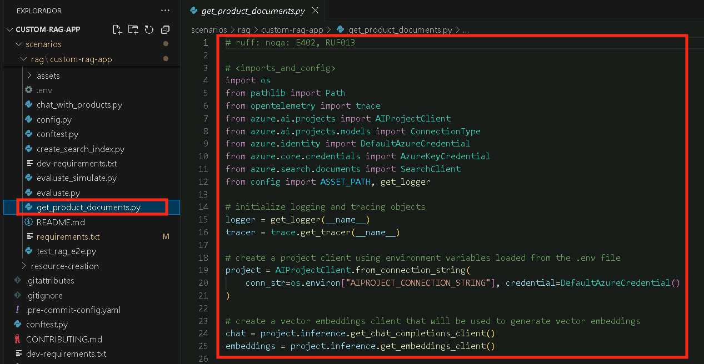
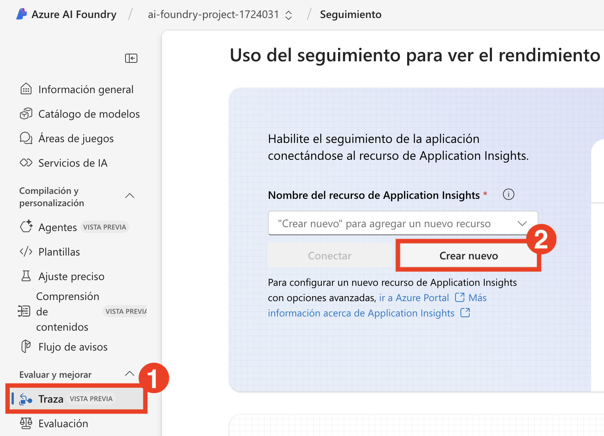
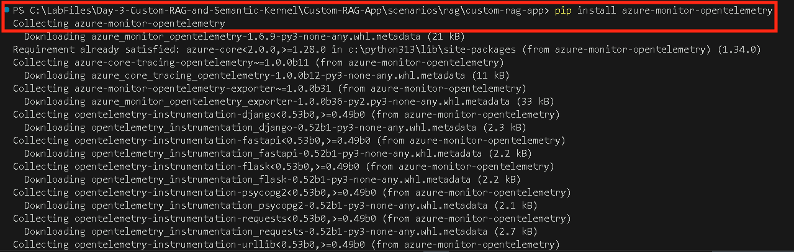
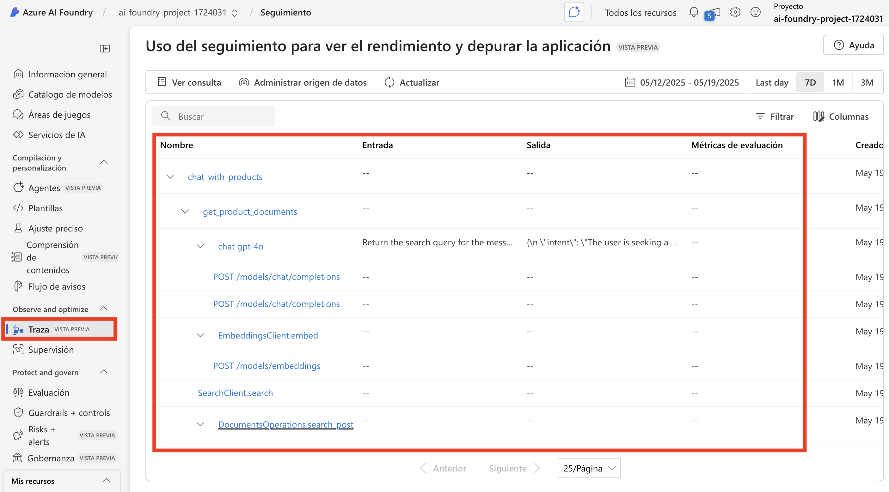
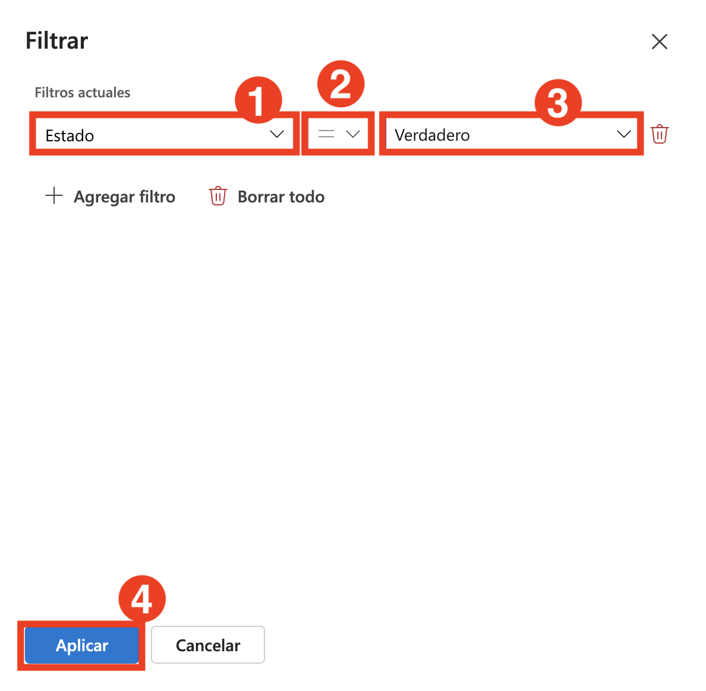

# 演習2：Retrieval-Augmented Generation (RAG)パイプラインの構築

この演習では、Retrieval-Augmented Generation (RAG)パイプラインを統合して基本的なチャットアプリケーションを強化します。これには、知識ソースのインデックス化、取得メカニズムの実装、拡張された知識を使用した応答の生成、およびパフォーマンスと精度を監視するためのテレメトリーロギングの追加が含まれます。

## 目的

この演習では、以下のタスクを完了します：

- タスク1：知識ソースのインデックス化
- タスク2：取得パイプラインの実装
- タスク3：拡張された知識を使用した応答の生成
- タスク4：テレメトリーロギングの追加

### タスク1：知識ソースのインデックス化 

このタスクでは、検索インデックスを使用してCSVファイルからベクトル化されたデータを処理および保存することで知識ソースをインデックス化します。また、Azureアカウントを認証し、インデックス作成スクリプトを実行し、クラウドプロジェクトにインデックスを登録します。

1. ブラウザで新しいタブを開き、以下のリンクを使用してAzure AI Foundryポータルに移動します。

   ```
    https://ai.azure.com/
   ```

2. 左上の**Azure AI Foundry**アイコンをクリックします。
3. ラボで以前に作成したAI Foundryプロジェクト **ai-foundry-project-{suffix} (1)** を選択します。
4. 左ペインの**アセット**の下の**モデル + エンドポイント (1)** をクリックし、**+ モデルのデプロイ**をクリックしてから**ベースモデルのデプロイ (2)** をクリックします。

5. **text-embedding-ada-002**を検索し、モデルを選択して**確認**をクリックします。
6. **デプロイ**をクリックします。
7. **assets (1)** フォルダーを展開し、**products.csvファイル(2)** を選択します。このファイルには、チャットアプリで使用されるすべてのデータセットの例が含まれています。

    

8. **create_search_index.py**を選択します。このファイルは、埋め込みモデルからベクトル化されたデータを保存します。.  

    

9. 以下のコードリストを確認します：

    - 必要なライブラリをインポートし、プロジェクトクライアントを作成し、いくつかの設定を構成するコード：

      ```bash
      <imports_and_config>

      </imports_and_config>
      ```

    - 検索インデックスを定義する関数を追加するコード：  

      ```bash
      <create_search_index>

      </create_search_index>
       ```

    - CSVファイルをインデックスに追加する関数を作成するコード：    

      ```bash
      </add_csv_to_index>

      </add_csv_to_index>
      ```

    - 関数を実行し、インデックスを構築し、クラウドプロジェクトに登録するコード：  

      ```bash
      <test_create_index>

      </test_create_index>
      ```    

10. コンソールからAzureアカウントにログインし、アカウント認証の指示に従います：

    ```bash
    az login
    ```

    

11. Visual Studio Codeウィンドウを最小化します。

    - **職場または学校のアカウント (1)** を選択し、**続行 (2)** をクリックします。

          

    - **ユーザー名AzureAdUserEmail(1)** を入力し、**次へ (2)** をクリックします。

        

    - **パスワード AzureAdUserPassword(1)** を入力し、**サインイン (2)** をクリックします。

          

    - **いいえ、このアプリにのみサインインします。** をクリックします。

            

12. Visual Studio Codeターミナルに戻り、デフォルトのサブスクリプションを受け入れるために**Enter**を押します。

    

13. 以下のコマンドを実行して、Azure AI Project & Infernce の特定のバージョンをインストールします。

     ```bash
    pip install azure-ai-projects==1.0.0b5
    pip install azure-ai-inference==1.0.0b8
    ```   
    

14. コードを実行してインデックスをローカルに構築し、クラウドプロジェクトに登録します：

    ```bash
    python create_search_index.py
    ```    

     

    > **Note:** エラーが発生した場合は、以下のコマンドを実行して手順14を再度実行してください。:

    ```bash
    pip install --upgrade azure-search-documents
    ```      
  
### タスク2：取得パイプラインの実装 

このタスクでは、検索インデックスから関連する製品ドキュメントを抽出することで取得パイプラインを実装します。ユーザーのクエリを検索リクエストに変換し、インデックス化された知識ソースから最も関連性の高い結果を取得するスクリプトを構成および実行します。

1. 検索インデックスから製品ドキュメントを取得するスクリプトを含む**get_product_documents.py**ファイルを選択します。

    

    - このファイルには、必要なライブラリをインポートし、プロジェクトクライアントを作成し、設定を構成するコードが含まれています。
    - 製品ドキュメントを取得する関数を追加するコード。
    - 最後に、スクリプトを直接実行するときに関数をテストするコードを追加します。

2. **assets (1)** を展開し、**intent_mapping.prompty (2)** を選択します。このテンプレートは、会話からユーザーの意図を抽出する方法を指示します。      

    

    - **get_product_documents.py**スクリプトは、このプロンプトテンプレートを使用して会話を検索クエリに変換します。

3. 次に、ターミナルで以下のコマンドを実行して、検索インデックスがクエリから返すドキュメントをテストします。

    ```bash
    python get_product_documents.py --query "I need a new tent for 4 people, what would you recommend?"
    ```

          

### タスク3：拡張された知識を使用した応答の生成     

このタスクでは、取得された製品ドキュメントを活用して拡張された知識を使用して応答を生成します。ユーザーのクエリに基づいて関連性のある根拠のある応答を提供するために、Retrieval-Augmented Generation (RAG)機能を統合するスクリプトを実行します。

1. **chat_with_products.py**ファイルを選択します。このスクリプトは製品ドキュメントを取得し、ユーザーの質問に対する応答を生成します。

    

    - このスクリプトには、必要なライブラリをインポートし、プロジェクトクライアントを作成し、設定を構成するコードが含まれています。
    - RAG機能を使用するチャット関数を生成するコード。
    - 最後に、チャット関数を実行するコードを追加します。 

2. **assets (1)** フォルダーを展開し、**grounded_chat.prompty (2)** を選択します。このテンプレートは、ユーザーの質問と取得されたドキュメントに基づいて応答を生成する方法を指示します。

    

    - **chat_with_products.py**スクリプトは、このプロンプトテンプレートを呼び出してユーザーの質問に対する応答を作成します。

3. 以下のコマンドをターミナルで実行して、スクリプトを使用し、RAG機能を備えたチャットアプリをテストします。

    ```bash
    python chat_with_products.py --query "I need a new tent for 4 people, what would you recommend?"
    ```

       

### タスク4：テレメトリーロギングの追加

このタスクでは、Application Insightsをプロジェクトに統合してテレメトリーロギングを有効にします。これにより、RAGアプリケーションのパフォーマンスを監視および分析し、クエリを追跡し、応答の詳細をログに記録して観測性とデバッグを向上させることができます。

1. ブラウザで新しいタブを開き、以下のリンクを使用してAzure AI Foundryポータルに移動します

   ```
    https://ai.azure.com/
   ```

2. 左上の**Azure AI Foundry**アイコンをクリックします。
3. ラボで以前に作成したAI Foundryプロジェクト **ai-foundry-project-{suffix} (1)** を選択します。
4. **トレース (1)** タブを選択してプロジェクトに**Application Insights**リソースを追加し、**新規作成 (2)** オプションをクリックして新しいリソースを作成します。

    

5. 名前を**Applicationinsight (1)** と入力し、**作成 (2)** をクリックします。

    

6. VS Codeターミナルに戻り、以下のコマンドを実行して `azure-monitor-opentelemetry` をインストールします。

   ```bash
   pip install azure-monitor-opentelemetry
   ```

       

     >**注：** インストールが完了するまで待ちます。時間がかかる場合があります。

7. `chat_with_products.py` スクリプトを使用する際に `--enable-telemetry` フラグを追加します：

   ```bash
   python chat_with_products.py --query "I need a new tent for 4 people, what would you recommend?" --enable-telemetry 
   ```      

       

8. コンソール出力のリンクを**Ctrl+クリック**してApplication Insightsリソースのテレメトリーデータを確認し **(1)**、**開く (2)** をクリックします。    

    

9. これにより、**Azure AI Foundry**ポータルの**トレース**タブに移動し、Application Insightsリソースのテレメトリーデータを確認できます。 

    

     >**注：** すぐに表示されない場合は、ツールバーの**更新**を選択します。表示されるまで約5分かかることがあります。

10. プロジェクト内でトレースを適宜**フィルタリング**できます。**フィルター**をクリックします。

    

11. **+ フィルターを追加**をクリックし、フィルターを**ステータス (1)**、**等しい (2)** -> **True (3)** に設定し、**適用 (4)** をクリックします。

    

12. これで、成功が**True**のデータのみが表示されます。

    

### レビュー

この演習では、知識ソースをインデックス化し、効率的な取得システムを実装することでRetrieval-Augmented Generation (RAG)パイプラインを構築することに焦点を当てました。参加者は関連データで豊富なAI応答を生成し、システムのパフォーマンスを監視および最適化するためにテレメトリーロギングを統合しました。

この演習では、以下のタスクを達成しました：
- タスク1：知識ソースのインデックス化
- タスク2：取得パイプラインの実装
- タスク3：拡張された知識を使用した応答の生成
- タスク4：テレメトリーロギングの追加

### 演習を正常に終了しました。次の演習に進むには **次へ** をクリックしてください。    


