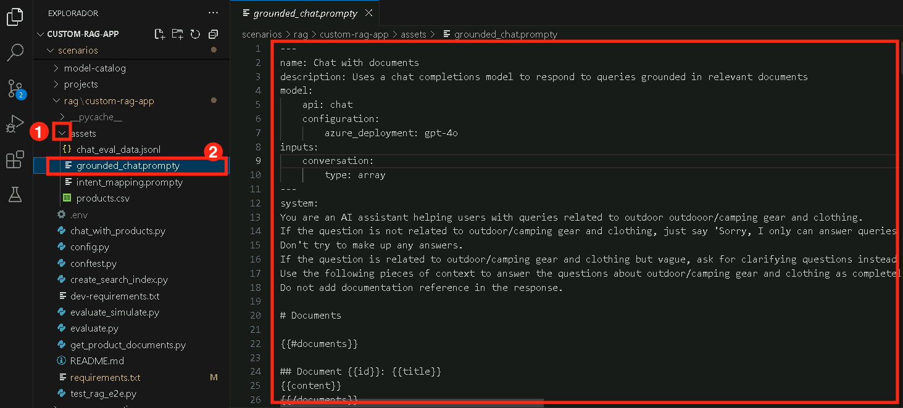
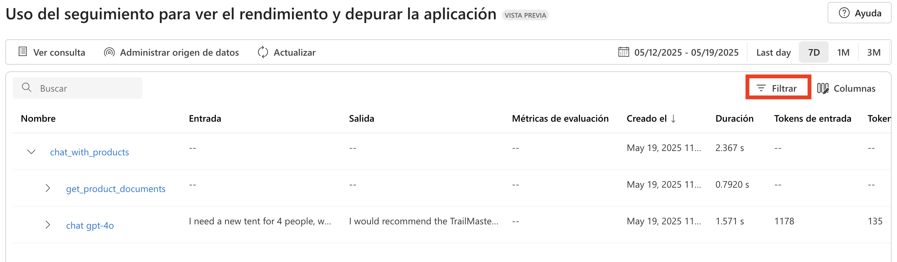
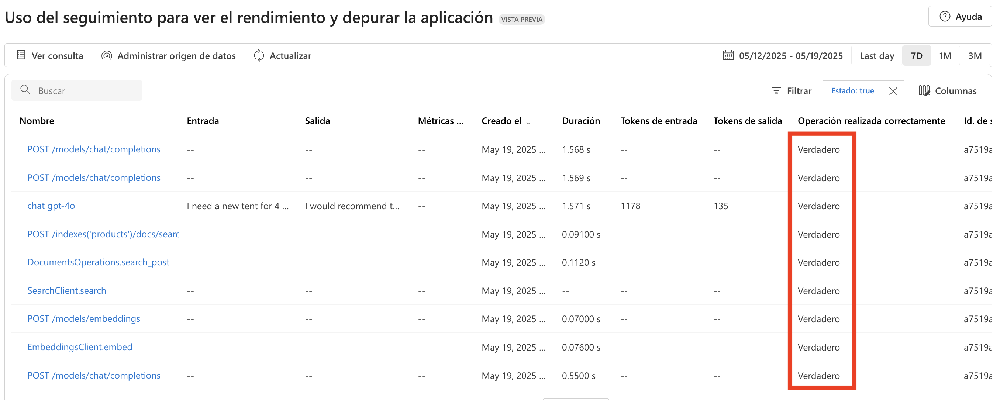

# Ejercicio 2: Construye un pipeline de Recuperación Aumentada de Generación (RAG)

En este ejercicio, mejorarás una aplicación de chat básica integrando un pipeline de Recuperación Aumentada de Generación (RAG). Esto incluye indexar fuentes de conocimiento, implementar un mecanismo de recuperación, generar respuestas con conocimiento aumentado y agregar registro de telemetría para monitorear el rendimiento y la precisión.

## Objetivos

En este ejercicio, completarás las siguientes tareas:

- Tarea 1: Indexar fuentes de conocimiento
- Tarea 2: Implementar el pipeline de recuperación
- Tarea 3: Generar respuestas con conocimiento aumentado
- Tarea 4: Agregar registro de telemetría

### Tarea 1: Indexar fuentes de conocimiento

En esta tarea, indexarás fuentes de conocimiento procesando y almacenando datos vectorizados de un archivo CSV usando un índice de búsqueda. También autenticarás tu cuenta de Azure, ejecutarás el script de indexado y registrarás el índice en tu proyecto en la nube.

1. Abre una nueva pestaña en el navegador y navega al portal de Azure AI Foundry usando el siguiente enlace:

   ```
    https://ai.azure.com/
   ```

1. Haz clic en el ícono de **Azure AI Foundry** en la parte superior izquierda.
1. Selecciona el proyecto de AI Foundry que creaste anteriormente en el laboratorio, es decir, **ai-foundry-project-{suffix} (1)**
1. Haz clic en **Models + endpoints (1)** bajo **My assets** en el panel izquierdo y luego haz clic en **+ Deploy model**, seguido de **Deploy Base model (2)**.

1. Busca **text-embedding-ada-002**, selecciona el modelo y haz clic en **Confirm**.
1. Haz clic en **Deploy**.
1. Navega a la carpeta `rag/custom-rag-app/assets` **(1)** y selecciona el archivo **products.csv** **(2)**. Este archivo contiene ejemplos de todos los conjuntos de datos que se usarán en tu aplicación de chat.


    

1. Selecciona **create_search_index.py**, que almacena datos vectorizados del modelo de embeddings.  

    

1. Revisa el siguiente listado de código, ya que contiene:

    - Código para importar las librerías necesarias, crear un cliente de proyecto y configurar algunos ajustes:

      ```bash
      <imports_and_config>

      </imports_and_config>
      ```

    - Código para agregar la función que define un índice de búsqueda:

      ```bash
      <create_search_index>

      </create_search_index>
       ```

    - Código para crear la función que agrega un archivo CSV al índice:

      ```bash
      <add_csv_to_index>

      </add_csv_to_index>
      ```

    - Código para ejecutar las funciones, construir el índice y registrarlo en el proyecto en la nube:

      ```bash
      <test_create_index>

      </test_create_index>
      ```    

1. Desde tu consola, inicia sesión en tu cuenta de Azure y sigue las instrucciones para autenticar tu cuenta:

    ```bash
    az login
    ```

    

1. Minimiza la ventana de Visual Studio Code.

    - Selecciona **Work or School account (1)** y haz clic en **Continue (2).**

          

    - Ingresa el **Username AzureAdUserEmail (1)**,  luego haz clic en **Next (2).**

        

    - Ingresa el **Password AzureAdUserPassword (1)**, luego haz clic en **Sign in (2).**

          

    - Haz clic en **No, sign in to this app only.**

            

1. Regresa a la terminal de Visual Studio Code y, si se te solicita, presiona **Enter** para aceptar la suscripción predeterminada.

    

1. Ejecuta los siguientes comandos para instalar la versión específica de Azure AI Project e Inference:

    ```bash
    pip install azure-ai-projects==1.0.0b5
    pip install azure-ai-inference==1.0.0b8
    ```  

1. Ejecuta el código para construir tu índice localmente y registrarlo en el proyecto en la nube:

    ```bash
    python create_search_index.py
    ```    

         

     > **Nota:** En caso de error, por favor ejecuta el siguiente comando y vuelve a ejecutar el paso 14:

     ```bash
      pip install --upgrade azure-search-documents
     ```

### Tarea 2: Implementar el pipeline de recuperación

En esta tarea, implementarás el pipeline de recuperación extrayendo documentos de productos relevantes del índice de búsqueda. Configurarás y ejecutarás un script que transforma las consultas del usuario en solicitudes de búsqueda, recuperando los resultados más relevantes de la fuente de conocimiento indexada.

1. Selecciona el archivo **get_product_documents.py** que contiene el script para obtener documentos de productos del índice de búsqueda.

    

    - Este archivo contiene el código para importar las librerías necesarias, crear un cliente de proyecto y configurar ajustes.
    - Código para agregar la función para obtener documentos de productos.
    - Finalmente, agrega el código para probar la función cuando ejecutes el script directamente.

1. Expande **assets (1)** y selecciona **intent_mapping.prompty (2)**. Esta plantilla indica cómo extraer la intención del usuario de la conversación.      

    

    - El script **get_product_documents.py** utiliza esta plantilla de prompt para convertir la conversación en una consulta de búsqueda.

1. Ahora, ejecuta el siguiente comando en la terminal para probar qué documentos devuelve el índice de búsqueda a partir de una consulta.

    ```bash
    python get_product_documents.py --query "I need a new tent for 4 people, what would you recommend?"
    ```

          

### Tarea 3: Generar respuestas con conocimiento aumentado

En esta tarea, generarás respuestas usando conocimiento aumentado aprovechando los documentos de productos recuperados. Ejecutarás un script que integra capacidades RAG para proporcionar respuestas relevantes y fundamentadas basadas en las consultas del usuario.

1. Selecciona el archivo **chat_with_products.py**. Este script recupera documentos de productos y genera una respuesta a la pregunta del usuario.

    

    - Este script contiene código para importar las librerías necesarias, crear un cliente de proyecto y configurar ajustes.   
    - Código para generar la función de chat que usa las capacidades RAG.
    - Finalmente, agrega el código para ejecutar la función de chat. 

1. Expande la carpeta **assets (1)** y selecciona **grounded_chat.prompty (2)**. Esta plantilla indica cómo generar una respuesta basada en la pregunta del usuario y los documentos recuperados.

    

    - El script **chat_with_products.py** llama a esta plantilla de prompt para crear una respuesta a la pregunta del usuario.

1. Ejecuta el siguiente comando en la terminal para usar el script y probar tu aplicación de chat con capacidades RAG.

    ```bash
    python chat_with_products.py --query "I need a new tent for 4 people, what would you recommend?"
    ```

       

### Tarea 4: Agregar registro de telemetría

En esta tarea, habilitarás el registro de telemetría integrando Application Insights en tu proyecto. Esto te permitirá monitorear y analizar el rendimiento de tu aplicación RAG, rastrear consultas y registrar detalles de las respuestas para una mejor observabilidad y depuración.

1. Navega de nuevo al portal de Azure AI Foundry y selecciona el proyecto AI Foundry que creaste anteriormente en el laboratorio, es decir, **ai-foundry-project-{suffix} (1)**

1. Selecciona la pestaña **Tracing (1)** para agregar un recurso de **Application Insights** a tu proyecto y luego haz clic en la opción **Create new (2)** para crear un nuevo recurso.

    

1. Ingresa el nombre **Applicationinsight (1)** y luego haz clic en **Create (2)**.

    

1. Regresa a la terminal de VS Code y ejecuta el siguiente comando para instalar `azure-monitor-opentelemetry`

    ```bash
     pip install azure-monitor-opentelemetry
    ```

        

     >**Nota:** Espera a que la instalación finalice. Puede tomar algo de tiempo.

1. Agrega el flag `--enable-telemetry` cuando uses el script `chat_with_products.py`:

   ```bash
   python chat_with_products.py --query "I need a new tent for 4 people, what would you recommend?" --enable-telemetry 
   ```      

       

1. **Ctrl+click** en el enlace de la salida de la consola para ver los datos de telemetría en tu recurso de Application Insights **(1)** y haz clic en **Open (2)**.    

    

1. Esto te llevará al portal de **Azure AI Foundry**, pestaña **Tracing**, donde podrás ver los datos de telemetría en tu recurso de Application Insights. 

    

     >**Nota:** Si no aparece de inmediato, selecciona **Refresh** en la barra de herramientas. Puede tardar unos 5 minutos en aparecer.

1. En tu proyecto, puedes **filtrar** tus trazas como desees. Haz clic en **Filter**.

    

1. Haz clic en **+ Add filter**, configura el filtro en **Success (1)**, **Equal to (2)** -> **True (3)**, y luego haz clic en **Apply (4)**.

    

1. Ahora, solo verás los datos con Success como **True**.

    

### Revisión

Este ejercicio se centró en construir un pipeline de Recuperación Aumentada de Generación (RAG) indexando fuentes de conocimiento e implementando un sistema de recuperación eficiente. Los participantes generaron respuestas de IA enriquecidas con datos relevantes e integraron registro de telemetría para monitorear y optimizar el rendimiento del sistema.

En este ejercicio lograste lo siguiente:
- Tarea 1: Indexar fuentes de conocimiento
- Tarea 2: Implementar el pipeline de recuperación
- Tarea 3: Generar respuestas con conocimiento aumentado
- Tarea 4: Agregar registro de telemetría

### Has completado exitosamente el ejercicio. Haz clic en **Next** para continuar con el siguiente ejercicio.


