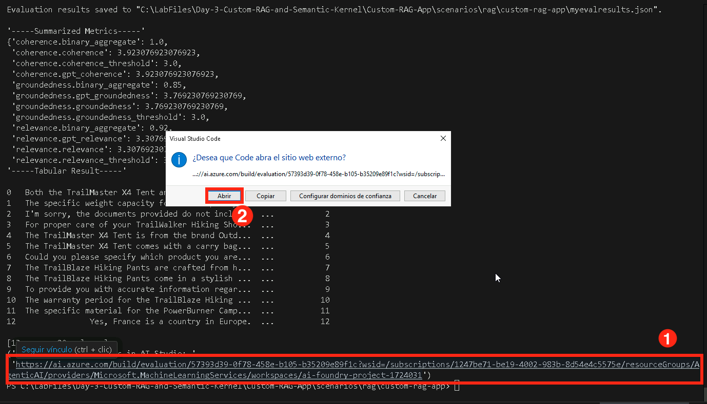

# Ejercicio 3: Evalúa y Optimiza el Rendimiento de RAG

En este ejercicio, evaluarás el rendimiento de tu pipeline RAG utilizando los evaluadores de Azure AI, implementarás varios métodos de evaluación e interpretarás los resultados para ajustar tu modelo. Esto asegura una mejor precisión en la recuperación, calidad en las respuestas y eficiencia general del sistema.

## Objetivos

En este ejercicio, completarás las siguientes tareas:

- Tarea 1: Evaluar con los evaluadores de Azure AI
- Tarea 2: Implementar métodos de evaluación
- Tarea 3: Interpretar resultados y ajustar el sistema

### Tarea 1: Evaluar con los evaluadores de Azure AI

En esta tarea, evaluarás el pipeline RAG usando los evaluadores de Azure AI analizando métricas clave como coherencia, relevancia y fundamentación (groundedness). Modificarás el script de evaluación para incorporar estas métricas y registrar los resultados para su análisis posterior.

1. Regresa a **Visual Studio Code**.

1. Expande la carpeta **assets (1)** y selecciona **chat_eval_data.jsonl (2)**. Este es un conjunto de datos de evaluación, que contiene preguntas de ejemplo y respuestas esperadas (truth).

    

1. Selecciona el archivo **evaluate.py**.

    

    - Este script te permite revisar los resultados localmente mostrándolos en la línea de comandos y guardándolos en un archivo JSON.
    - Este script también registra los resultados de la evaluación en el proyecto en la nube para que puedas comparar ejecuciones de evaluación en la interfaz.

1. Para obtener las métricas de `Coherence` y `Relevance` junto con `Groundedness`, agrega el siguiente código al archivo **evaluate.py**.

1. Añade la siguiente línea de importación en la sección `<imports_and_config>`, alrededor de la línea 10 u 11, antes de `# load environment variables from the .env file at the root of this repo`.

    ```bash
    from azure.ai.evaluation import CoherenceEvaluator, RelevanceEvaluator
    ```

     

1. 1. Desplázate hacia abajo y agrega el siguiente código antes de `# </imports_and_config>` y después de `groundedness = GroundednessEvaluator(evaluator_model)`

    ```bash
    coherence = CoherenceEvaluator(evaluator_model)
    relevance = RelevanceEvaluator(evaluator_model)
    ```

     

1. Desplázate a la sección `<run_evaluation>`, y alrededor de la línea 69 o 70, agrega el siguiente código debajo de `"groundedness": groundedness`.

    ```bash
    "coherence": coherence, 
    "relevance": relevance,
    ```

     

1. Presiona **Ctrl+S** para guardar el archivo.

### Tarea 2: Implementar métodos de evaluación

En esta tarea, implementarás métodos de evaluación para medir el rendimiento de tu pipeline RAG. Instalarás las dependencias necesarias, ejecutarás el script de evaluación y analizarás métricas como Groundedness, Coherence y Relevance para asegurar la calidad de las respuestas.

1. Desde tu consola, ejecuta el siguiente comando para instalar el paquete requerido para la evaluación:

    ```bash
    pip install azure-ai-evaluation[remote]
    ```

     

      >**Nota:** Espera a que la instalación finalice. Puede tomar algo de tiempo.
      
      >**Nota:** Si encuentras algún error usando este comando, utiliza el siguiente:

    ```bash
    pip install azure-ai-evaluation[remote] --use-deprecated=legacy-resolver
    ```

1. Ejecuta el siguiente comando para instalar marshmallow:

    ```bash
    pip install --upgrade marshmallow==3.20.2
    ```

1. Ahora ejecuta el script de evaluación:

    ```bash
    python evaluate.py
    ```

     
  
1. Una vez completada la actualización, vuelve a ejecutar el siguiente comando:

    ```bash
    python evaluate.py
    ```

     

      >**Nota**: La evaluación puede tardar entre 5 y 10 minutos en completarse.  

      >**Nota**: Es posible que veas algunos errores de tiempo de espera, lo cual es esperado. El script de evaluación está diseñado para manejar estos errores y continuar ejecutándose.  

1. En la salida de la consola, verás una respuesta para cada pregunta, seguida de una tabla con las métricas resumidas. (Es posible que veas diferentes columnas en tu salida.)

    ```Text
    ====================================================
    '-----Summarized Metrics-----'
    {'groundedness.gpt_groundedness': 1.6666666666666667,
    'groundedness.groundedness': 1.6666666666666667}
    '-----Tabular Result-----'
                                        outputs.response  ... line_number
    0   Could you specify which tent you are referring...  ...           0
    1   Could you please specify which camping table y...  ...           1
    2   Sorry, I only can answer queries related to ou...  ...           2
    3   Could you please clarify which aspects of care...  ...           3
    4   Sorry, I only can answer queries related to ou...  ...           4
    5   The TrailMaster X4 Tent comes with an included...  ...           5
    6                                            (Failed)  ...           6
    7   The TrailBlaze Hiking Pants are crafted from h...  ...           7
    8   Sorry, I only can answer queries related to ou...  ...           8
    9   Sorry, I only can answer queries related to ou...  ...           9
    10  Sorry, I only can answer queries related to ou...  ...          10
    11  The PowerBurner Camping Stove is designed with...  ...          11
    12  Sorry, I only can answer queries related to ou...  ...          12

    [13 rows x 8 columns]
    ('View evaluation results in Azure AI Foundry portal: '
    'https://xxxxxxxxxxxxxxxxxxxxxxx')
    ```

     

      >**Nota**: Es posible que veas algunos errores de tiempo de espera, lo cual es esperado. El script de evaluación está diseñado para manejar estos errores y continuar ejecutándose.   

### Tarea 3: Interpretar resultados y ajustar el sistema

En esta tarea, interpretarás los resultados de la evaluación y ajustarás el pipeline RAG modificando la plantilla de prompt. Analizarás los puntajes de **Relevance, Groundedness y Coherence**, modificarás las instrucciones del prompt y volverás a ejecutar la evaluación para mejorar la precisión de las respuestas.

1. Una vez que la evaluación haya finalizado, haz **Ctrl+click** en el enlace para ver los resultados en la página de Evaluación del portal de Azure AI Foundry **(1)** y luego haz clic en **Open (2)**.

    

1. En la pestaña **Report**, puedes ver la calidad de la app RAG a través del panel de métricas.

1. Puedes ver el puntaje promedio de `Relevance, Groundedness` y `Coherence`.

    

1. Navega a la pestaña **Data (1)** para más detalles sobre la métrica de evaluación **(2)**.

    

1. Observa que las respuestas no están bien fundamentadas. El modelo suele responder con una pregunta en lugar de una respuesta. Esto es resultado de las instrucciones de la plantilla de prompt.

1. En tu archivo **assets/grounded_chat.prompty (1)**, localiza la frase: `"If the question is not related to outdoor/camping gear and clothing, just say 'Sorry, I only can answer queries related to outdoor/camping gear and clothing. So, how can I help?"`. **(2)**

    

1. Cambia la frase por: `If the question is related to outdoor/camping gear and clothing but vague, try to answer based on the reference documents, then ask for clarifying questions.`

    

1. Presiona **Ctrl+S** para guardar el archivo.

1. Vuelve a ejecutar el script de evaluación:

    ```bash
    python evaluate.py
    ```

     >**Nota**: La evaluación puede tardar entre 5 y 10 minutos en completarse.  

     >**Nota**: Si no puedes aumentar el límite de tokens por minuto de tu modelo, es posible que veas algunos errores de tiempo de espera, lo cual es esperado. El script de evaluación está diseñado para manejar estos errores y continuar ejecutándose.

1. Una vez que la evaluación haya finalizado, haz **Ctrl+click** en el enlace para ver los resultados en la página de Evaluación del portal de Azure AI Foundry **(1)** y luego haz clic en **Open (2)**.

        

1. En la pestaña **Report**, puedes ver los puntajes promedio de `Relevance, Groundedness` y `Coherence`, que han aumentado respecto a la evaluación anterior.
        

1. Navega a la pestaña **Data (1)** para más detalles sobre la métrica de evaluación **(2)**.

        

1. Prueba otras modificaciones en la plantilla de prompt para ver cómo los cambios afectan los resultados de la evaluación.    

### Revisión

Este ejercicio se centró en evaluar y optimizar el rendimiento de un sistema de Recuperación Aumentada de Generación (RAG). Los participantes utilizaron los evaluadores de Azure AI para medir la precisión de la recuperación, implementaron métodos de evaluación para medir la calidad de las respuestas e interpretaron los resultados para ajustar el sistema y mejorar su eficiencia y relevancia.

En este ejercicio lograste lo siguiente:
- Tarea 1: Evaluar con los evaluadores de Azure AI
- Tarea 2: Implementar métodos de evaluación
- Tarea 3: Interpretar resultados y ajustar el sistema


### Has completado exitosamente el laboratorio.
