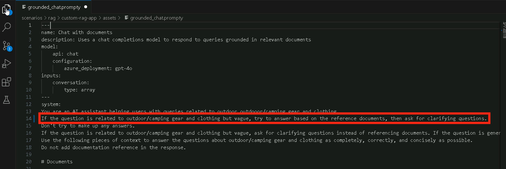

# 練習 3：評估與優化 RAG 效能

在本次練習中，您將使用 Azure AI Evaluators 評估 RAG 管線的效能，實驗各種評估方法，並解讀結果以微調模型。這將有助於提升檢索準確性、回應品質與整體系統效率。

## 實驗目標

在本次練習中，您將完成以下任務：

- 任務 1：使用 Azure AI Evaluators 進行評估
- 任務 2：實驗評估方法
- 任務 3：解讀結果並進行微調

### 任務 1：使用 Azure AI Evaluators 進行評估

在此任務中，您將使用 Azure AI Evaluators 透過分析關鍵指標（如 coherence、relevance 和 groundedness）來評估 RAG 管線。您將修改評估腳本以納入這些指標，並記錄結果以供進一步分析。

1. 回到 **Visual Studio Code**。

2. 展開 **assets (1)** 資料夾並選取 **chat_eval_data.jsonl (2)**。這是一個評估資料集，包含範例問題與預期答案 (事實、真相)。

    

3. 選取 **evaluate.py** 檔案。

    

    - 此腳本可讓您在本地端檢視結果，並將其輸出至命令列與 JSON 檔案中。
    - 此腳本也會將評估結果記錄至雲端專案中，方便您在 UI 中比較不同的評估執行結果。

4. 若要取得 `Coherence` 與 `Relevance` 以及 `Groundedness` 指標，請將以下程式碼加入 **evaluate.py** 檔案中。   

5. 在 `<imports_and_config>`區段（大約第 10 或第 11 行），於 `# load environment variables from the .env file at the root of this repo` 之前加入以下 import 語句：

    ```bash
    from azure.ai.evaluation import CoherenceEvaluator, RelevanceEvaluator
    ```

         

6. 向下捲動，並在 `# </imports_and_config>` 之前加入以下程式碼：

    ```bash
    coherence = CoherenceEvaluator(evaluator_model)
    relevance = RelevanceEvaluator(evaluator_model)
    ```

         

7. 繼續向下捲動至  `<run_evaluation>` 區段，在 `第 69 行` 或 `第 70 行` 左右，於 `"groundedness": groundedness` 之後加入以下程式碼：

    ```bash
    "coherence": coherence, 
    "relevance": relevance,
    ```

          

8. 按下 **Ctrl+S** 儲存檔案。

### 任務 2：實驗評估方法

在此任務中，您將實驗評估方法來評估 RAG 管線的效能。您將安裝必要的相依套件、執行評估腳本，並分析如 Groundedness、Coherence 和 Relevance 等指標，以確保回應品質。

1. 在您的終端機中執行以下指令，以安裝執行評估腳本所需的套件：

    ```bash
    pip install azure-ai-evaluation[remote]
    ```

     

      >**注意**： 請等待安裝完成，這可能需要一些時間。
      
      >**注意**： 如果使用此指令時遇到錯誤，請改用下方的指令：

    ```bash
    pip install azure-ai-evaluation[remote] --use-deprecated=legacy-resolver
    ```

2. 請執行以下指令以安裝 marshmallow：

    ```bash
    pip install --upgrade marshmallow==3.20.2
    ```

3. 現在請執行評估腳本：

    ```bash
    python evaluate.py
    ```

       
    
4. 升級完成後，請重新執行以下指令：

    ```bash
    python evaluate.py
    ```

      

      >**注意**： 評估過程預計需要約 5 到 10 分鐘完成。  

      >**注意**： 您可能會看到一些逾時錯誤，這是預期中的情況。評估腳本已設計為可處理這些錯誤並持續執行。  

5. 在終端機輸出中，您將看到每個問題的回答，接著是一個摘要指標的表格。（您看到的欄位可能會有所不同）

    ```Text
    ====================================================
    '-----Summarized Metrics-----'
    {'groundedness.gpt_groundedness': 1.6666666666666667,
    'groundedness.groundedness': 1.6666666666666667}
    '-----Tabular Result-----'
                                        outputs.response  ... line_number
    0   Could you specify which tent you are referring...  ...           0
    1   Could you please specify which camping table y...  ...           1
    2   Sorry, I only can answer queries related to ou...  ...           2
    3   Could you please clarify which aspects of care...  ...           3
    4   Sorry, I only can answer queries related to ou...  ...           4
    5   The TrailMaster X4 Tent comes with an included...  ...           5
    6                                            (Failed)  ...           6
    7   The TrailBlaze Hiking Pants are crafted from h...  ...           7
    8   Sorry, I only can answer queries related to ou...  ...           8
    9   Sorry, I only can answer queries related to ou...  ...           9
    10  Sorry, I only can answer queries related to ou...  ...          10
    11  The PowerBurner Camping Stove is designed with...  ...          11
    12  Sorry, I only can answer queries related to ou...  ...          12

    [13 rows x 8 columns]
    ('View evaluation results in Azure AI Foundry portal: '
    'https://xxxxxxxxxxxxxxxxxxxxxxx')
    ```

        

      >**注意**： 您可能會看到一些逾時錯誤，這是預期中的情況。評估腳本已設計為可處理這些錯誤並持續執行。   

### 任務 3：解讀結果並進行微調      

在此任務中，您將解讀評估結果，並透過調整 Prompt 模板（template）來微調 RAG 管線。您將分析 **Relevance、 Groundedness 和 Coherence** 分數，修改 Prompt 指令，並重新執行評估以提升回應的準確性。

1. 評估執行完成後， **Ctrl+點擊** 連結以在 Azure AI Foundry 入口網站的 Evaluation 頁面查看評估結果 **(1)**，然後點擊 **Open** **(2)**。

    

2. 在 **報告資料** 分頁中，您可以透過 **指標儀表板** 查看 RAG 應用的品質。

3. 您可以查看 `Relevance`、 `Groundedness` 和 `Coherence` 的平均分數。

    

4. 前往 **資料** **(1)** 分頁以查看更多關於評估指標的細節 **(2)**。

    

5. 注意到回應內容缺乏良好的根據性（Groundedness）。模型經常以反問句作為回應，而非直接回答問題。這是由於 Prompt 模板中的指令所導致。

6. 在您的 **assets/grounded_chat.prompty (1)** 檔案中，找到以下句子： `"If the question is not related to outdoor/camping gear and clothing, just say 'Sorry, I only can answer queries related to outdoor/camping gear and clothing. So, how can I help?"` **(2)**。

    

7. 將該句修改為： `If the question is related to outdoor/camping gear and clothing but vague, try to answer based on the reference documents, then ask for clarifying questions.`

    

8. 按下 **Ctrl+S** 儲存檔案。

9. 重新執行評估腳本：  

    ```bash
    python evaluate.py
    ```

     >**注意**： 評估過程預計需要約 5 到 10 分鐘完成。  

     >**注意**： 如果您無法提高模型的每分鐘 token 限制，可能會看到一些逾時錯誤，這是預期中的情況。評估腳本已設計為可處理這些錯誤並持續執行。

10. 評估執行完成後，**Ctrl+點擊** 連結以在 Azure AI Foundry 入口網站的 Evaluation 頁面查看評估結果 **(1)**，然後點擊 **Open** **(2)**。

        

11. 在 **報告資料** 分頁中，您可以查看 `Relevance`、 `Groundedness` 和 `Coherence` 的平均分數，這些分數應該比之前更高。

        

12. 前往 **資料** **(1)** 分頁以查看更多關於評估指標的細節 **(2)**。

        

13. 嘗試其他 Prompt 模板的修改方式，觀察這些變更如何影響評估結果。   

### 回顧

本次練習著重於評估與優化檢索增強生成 (RAG) 系統的效能。參與者使用 Azure AI Evaluators 來評估檢索準確性，實驗評估方法以衡量回應品質，並解讀結果以微調系統，提升效率與相關性。

在本次練習中，您已完成以下事項：
- 任務 1：使用 Azure AI Evaluators 進行評估
- 任務 2：實驗評估方法
- 任務 3：解讀結果並進行微調


### 恭喜！您已成功完成本次實驗課程！ 
