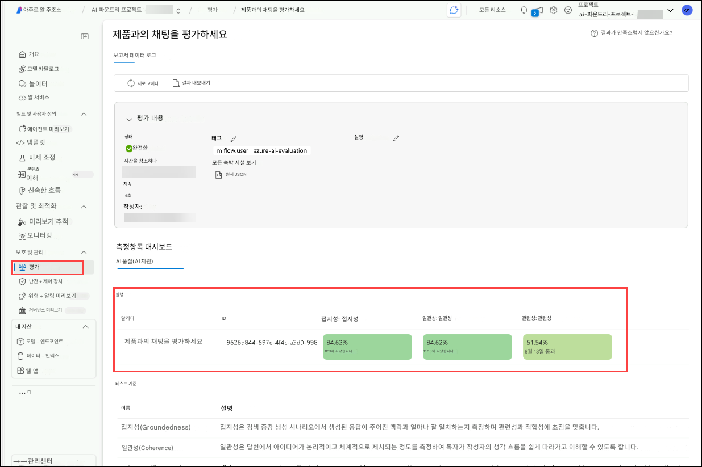
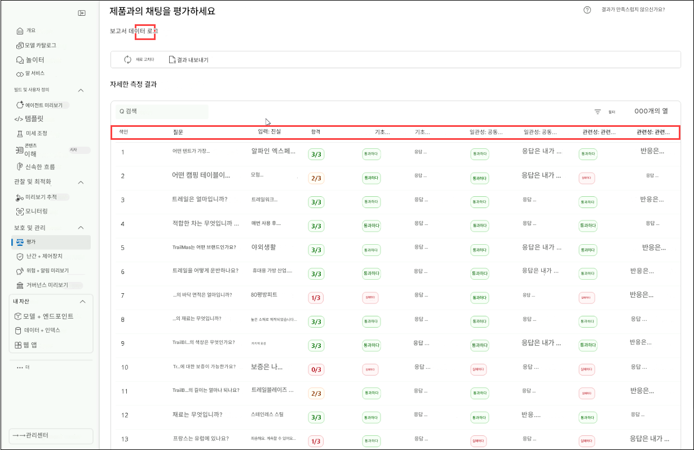
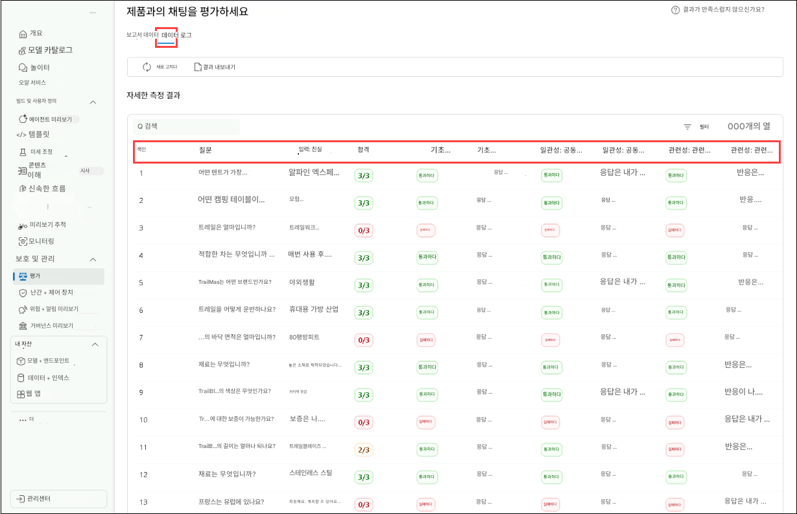

# Exercise 3: RAG 성능 평가 및 최적화

이번 실습에서는 Azure AI 평가 도구(AI evaluators)를 활용하여 RAG 파이프라인의 성능을 평가하고, 다양한 평가 방법을 구현하며, 평가 결과를 해석하여 모델을 미세 조정하는 과정을 수행합니다. 이를 통해 검색 정확도, 응답 품질, 전체 시스템 효율성을 향상시킬 수 있습니다.

## 목표

이 실습에서는 다음 과제를 완료하게 됩니다:

- 과제 1: Azure AI 평가 도구로 성능 평가하기
- 과제 2: 다양한 평가 방법 구현하기
- 과제 3: 평가 결과 해석 및 모델 미세 조정하기

## 과제 1: Azure AI 평가 도구로 성능 평가하기

이 과제에서는 Azure AI 평가 도구(Azure AI Evaluators)를 사용하여 RAG 파이프라인을 평가합니다. 이때 일관성(coherence), 관련성(relevance), 근거 기반성(groundedness) 등의 주요 평가 지표를 분석하며, 평가 스크립트를 수정하여 해당 지표들을 반영하고 결과를 기록해 추가 분석에 활용합니다.

1. **Visual Studio Code**로 다시 이동합니다.

1. **assets (1)** 폴더를 확장한 후, **chat\_eval\_data.jsonl (2)** 파일을 선택합니다.
   이 파일은 평가용 데이터셋으로, 예시 질문과 기대되는 정답(truth)이 포함되어 있습니다.

   

1. **evaluate.py** 파일을 선택합니다.

   

   - 이 스크립트는 평가 결과를 명령줄에 출력하고 JSON 파일로 저장함으로써 로컬에서 결과를 검토할 수 있도록 합니다.
   - 또한 평가 결과를 클라우드 프로젝트에 기록하여 UI 상에서 여러 평가 실행 결과를 비교할 수 있게 합니다.

1. `Coherence`, `Relevance`, `Groundedness` 지표를 함께 계산할 수 있도록 **evaluate.py** 파일에 다음 코드를 추가합니다.

1. `<imports_and_config>` 섹션 (약 10\~11번째 줄)에 있는 `# load environment variables from the .env file at the root of this repo` 앞에 아래 import 문을 추가하세요

   ```python
   from azure.ai.evaluation import CoherenceEvaluator, RelevanceEvaluator
   ```

   

1. 아래로 스크롤 하여 `# </imports_and_config>` 주석 앞에 아래 코드를 추가하세요.

   ```python
   coherence = CoherenceEvaluator(evaluator_model)
   relevance = RelevanceEvaluator(evaluator_model)
   ```

   

1. `<run_evaluation>` 섹션까지 아래로 스크롤하여, 약 69\~70번째 줄에서 `"groundedness": groundedness` 아래에 다음 코드를 추가하세요.

   ```python
   "coherence": coherence, 
   "relevance": relevance,
   ```

   

1. **Ctrl+S**를 눌러 파일을 저장합니다.

## 과제 2: 평가 방법 구현하기

이 과제에서는 RAG 파이프라인의 성능을 평가하기 위한 평가 방법을 구현합니다. 필요한 패키지 파일들을 설치하고, 평가 스크립트를 실행하며, Groundedness(근거 기반성), Coherence(일관성), Relevance(관련성) 등의 지표를 분석하여 응답 품질을 검증합니다.

1. 콘솔에서 아래 명령어를 실행하여 평가 스크립트 실행에 필요한 패키지를 설치하세요:

    ```bash
    pip install azure-ai-evaluation[remote]
    ```

     

      >**참고:** 설치가 완료될 때까지 기다리세요. 다소 시간이 걸릴 수 있습니다.      
      >**참고:** 위 명령어 실행 시 오류가 발생하면, 아래 대체 명령어를 사용하세요.

    ```bash
    pip install azure-ai-evaluation[remote] --use-deprecated=legacy-resolver
    ```

1. 다음 명령어를 실행하여 marshmallow 패키지를 설치하거나 업그레이드하세요:

    ```bash
    pip install --upgrade marshmallow==3.20.2
    ```

1. 이제 평가 스크립트를 실행합니다:

    ```bash
    python evaluate.py
    ```

       
    
1. 업그레이드가 완료되면, 아래 명령어를 다시 실행하세요:

    ```bash
    python evaluate.py
    ```

      

      >**참고**: 평가가 완료되기까지 약 5~10분 정도 소요될 수 있습니다.  
      >**참고**: 타임아웃 오류가 발생할 수 있으며 이는 예상된 동작입니다. 스크립트는 이러한 오류를 자동으로 처리하며 계속 실행됩니다.

1. 콘솔 출력에서는 각 질문에 대한 응답과 함께, 요약된 평가 지표가 테이블 형태로 표시됩니다. (출력 결과의 열 구성은 다소 다를 수 있습니다.)

    ```Text
    ====================================================
    '-----Summarized Metrics-----'
    {'groundedness.gpt_groundedness': 1.6666666666666667,
    'groundedness.groundedness': 1.6666666666666667}
    '-----Tabular Result-----'
                                        outputs.response  ... line_number
    0   Could you specify which tent you are referring...  ...           0
    1   Could you please specify which camping table y...  ...           1
    2   Sorry, I only can answer queries related to ou...  ...           2
    3   Could you please clarify which aspects of care...  ...           3
    4   Sorry, I only can answer queries related to ou...  ...           4
    5   The TrailMaster X4 Tent comes with an included...  ...           5
    6                                            (Failed)  ...           6
    7   The TrailBlaze Hiking Pants are crafted from h...  ...           7
    8   Sorry, I only can answer queries related to ou...  ...           8
    9   Sorry, I only can answer queries related to ou...  ...           9
    10  Sorry, I only can answer queries related to ou...  ...          10
    11  The PowerBurner Camping Stove is designed with...  ...          11
    12  Sorry, I only can answer queries related to ou...  ...          12

    [13 rows x 8 columns]
    ('View evaluation results in Azure AI Foundry portal: '
    'https://xxxxxxxxxxxxxxxxxxxxxxx')
    ```

        

      >**참고**: 일부 타임아웃 오류가 발생할 수 있으나, 이는 정상적인 현상입니다. 평가 스크립트는 이러한 오류를 처리하도록 설계되어 있으며, 실행을 계속 진행합니다.

## 과제 3: 평가 결과 해석 및 미세 조정

이 과제에서는 평가 결과를 바탕으로, 프롬프트 템플릿(prompt template)을 조정하여 RAG 파이프라인을 미세 조정합니다. **Relevance(관련성), Groundedness(근거 기반성), Coherence(일관성)** 점수를 분석한 후, 프롬프트 지침을 수정하고 평가를 다시 실행하여 응답의 정확도를 향상시킵니다.

1. 평가 실행이 완료되면, Azure AI Foundry 포털의 Evaluation 페이지에서 결과를 확인할 수 있는 링크를 **Ctrl+클릭 (1)** 한 후, **Open(2)** 을 클릭합니다.

    

1. **Report** 탭에서는 메트릭 대시보드를 통해 RAG 앱의 품질을 확인할 수 있습니다.

1. `Relevance`, `Groundedness`, `Coherence`에 대한 평균 점수를 확인할 수 있습니다.

   

1. 보다 자세한 평가 지표를 확인하려면 **Data (1)** 탭으로 이동하여 **Metric (2)** 정보를 확인하세요.

   

1. 응답이 충분한 근거를 기반(Grounded)으로 하지 않았다는 점에 주목하세요.
   모델이 정답 대신 질문으로 응답하는 경우가 많으며, 이는 프롬프트 템플릿 지침의 영향입니다.

1. **assets/grounded\_chat.prompty (1)** 파일을 열고, 다음 문장을 찾습니다:
   `"If the question is not related to outdoor/camping gear and clothing, just say 'Sorry, I only can answer queries related to outdoor/camping gear and clothing. So, how can I help?"`. **(2)** 
   (`"질문이 아웃도어/캠핑 장비나 의류와 관련이 없다면, 단순히 다음과 같이 응답하세요 '죄송합니다. 저는 아웃도어/캠핑 장비와 의류 관련 질문에만 답변할 수 있어요. 무엇을 도와드릴까요?'`)

   

1. 이 문장을 아래와 같이 수정하세요:
   `If the question is related to outdoor/camping gear and clothing but vague, try to answer based on the reference documents, then ask for clarifying questions.`
   (`질문이 아웃도어/캠핑 장비나 의류와 관련되어 있지만 모호한 경우, 참고 문서를 기반으로 먼저 답변을 시도한 다음, 추가 설명을 요청하는 질문을 하세요.`)

   

1. **Ctrl+S**를 눌러 파일을 저장합니다.

1. 평가 스크립트를 다시 실행합니다:

   ```bash
   python evaluate.py
   ```
   > **참고:** 평가에는 약 5\~10분이 소요될 수 있습니다.
   > **참고:** 모델의 분당 토큰 제한이 낮은 경우, 타임아웃 오류가 발생할 수 있습니다. 이는 정상이며, 스크립트는 오류를 처리하며 계속 실행됩니다.

1. 평가가 완료되면, Azure AI Foundry 포털의 Evaluation 페이지로 이동할 수 있는 링크를 **Ctrl+클릭(1)** 하여 열고, **Open(2)** 을 클릭합니다.

   

1. **Report** 탭에서 `Relevance`, `Groundedness`, `Coherence` 평균 점수가 이전보다 향상된 것을 확인할 수 있습니다.

    

1. 다시 **Data (1)** 탭으로 이동하여 평가 지표의 상세 데이터를 확인합니다 **(2)**.

    

1. 프롬프트 템플릿을 다양한 방식으로 수정하여, 변경 사항이 평가 결과에 어떤 영향을 미치는지 실험해 보세요.

## 복습

이번 실습에서는 RAG(Retrieval-Augmented Generation) 시스템의 성능을 평가하고 최적화하는 데 중점을 두었습니다. 참가자는 Azure AI 평가 도구를 활용하여 검색 정확도를 측정하고, 다양한 평가 방법을 구현하여 응답 품질을 정량화했으며, 평가 결과를 바탕으로 시스템을 미세 조정하여 효율성과 관련성을 개선했습니다.

이 실습을 통해 다음 과제를 완료하였습니다:

- 과제 1: Azure AI 평가 도구로 성능 평가하기
- 과제 2: 평가 방법 구현하기
- 과제 3: 평가 결과 해석 및 미세 조정하기

### 실습을 성공적으로 완료하셨습니다.
