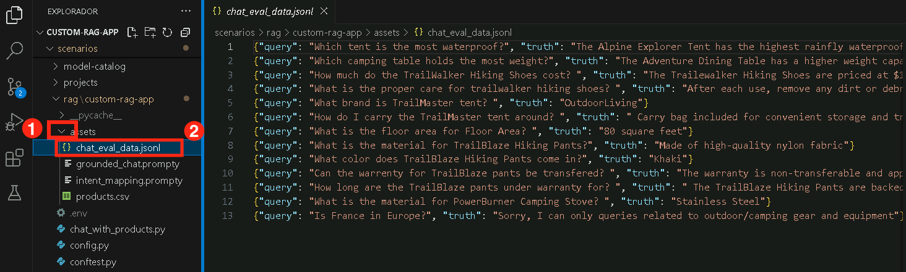
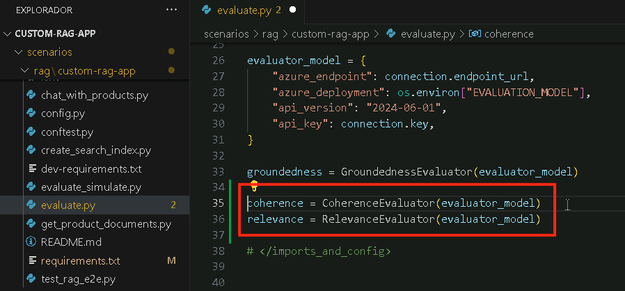

# 练习 3：评估和优化 RAG 性能

在本练习中，您将使用 Azure AI 评估器评估 RAG 管道的性能，实现各种评估方法，并解释结果以微调您的模型。这确保了改进的检索准确性、响应质量和整体系统效率。

## 目标

在本练习中，您将完成以下任务：

- 任务 1：使用 Azure AI 评估器进行评估
- 任务 2：实现评估方法
- 任务 3：解释结果和微调

### 任务 1：使用 Azure AI 评估器进行评估

在本任务中，您将通过分析关键指标（如连贯性、相关性和基础性）使用 Azure AI 评估器评估 RAG 管道。您将修改评估脚本以包含这些指标，并记录结果以供进一步分析。

1. 返回到 **Visual Studio Code**。

1. 展开 **assets (1)** 文件夹并选择 **chat_eval_data.jsonl (2)**。这是一个评估数据集，其中包含示例问题和预期答案（真值）。

    

1. 选择 **evaluate.py** 文件。

    

    - 该脚本允许您通过在命令行中输出结果并将其放入 JSON 文件来在本地查看结果。
    - 该脚本还将评估结果记录到云项目中，以便您可以在 UI 中比较评估运行。

1. 要获得 `连贯性` 和 `相关性` 指标以及 `基础性`，请将以下代码添加到 **evaluate.py** 文件中。

1. 在 `<imports_and_config>` 部分，大约在第 10 或 11 行，在 `# load environment variables from the .env file at the root of this repo` 之前添加以下导入语句。

    ```bash
    from azure.ai.evaluation import CoherenceEvaluator, RelevanceEvaluator
    ```

         

1. 向下滚动并在 `# </imports_and_config>` 之前添加以下代码。

    ```bash
    coherence = CoherenceEvaluator(evaluator_model)
    relevance = RelevanceEvaluator(evaluator_model)
    ```

         

1. 滚动到 `<run_evaluation>` 部分，在大约第 69 或 70 行，在 `"groundedness": groundedness` 下方添加以下代码。

    ```bash
    "coherence": coherence, 
    "relevance": relevance,
    ```

          

1. 按 **Ctrl+S** 保存文件。

### 任务 2：实现评估方法

在本任务中，您将实现评估方法来评估 RAG 管道的性能。您将安装必要的依赖项，运行评估脚本，并分析诸如基础性、连贯性和相关性等指标以确保响应质量。

1. 从您的控制台运行以下命令来安装运行评估脚本所需的包：

    ```bash
    pip install azure-ai-evaluation[remote]
    ```

     

      >**注意：** 等待安装完成。这可能需要一些时间。
      
      >**注意：** 如果使用此命令遇到任何错误，请使用以下命令。

    ```bash
    pip install azure-ai-evaluation[remote] --use-deprecated=legacy-resolver
    ```

1. 请运行以下命令来安装 marshmallow。

    ```bash
    pip install --upgrade marshmallow==3.20.2
    ```

1. 现在运行评估脚本：

    ```bash
    python evaluate.py
    ```

       
    
1. 一旦升级完成，重新运行以下命令。

    ```bash
    python evaluate.py
    ```

      

      >**注意**：预计评估需要大约 5-10 分钟才能完成。

      >**注意**：您可能会看到一些超时错误，这是预期的。评估脚本设计为可以处理这些错误并继续运行。

1. 在控制台输出中，您将看到每个问题的答案，后面跟着一个带有汇总指标的表格。（您的输出中可能会看到不同的列。）

    ```Text
    ====================================================
    '-----Summarized Metrics-----'
    {'groundedness.gpt_groundedness': 1.6666666666666667,
    'groundedness.groundedness': 1.6666666666666667}
    '-----Tabular Result-----'
                                        outputs.response  ... line_number
    0   Could you specify which tent you are referring...  ...           0
    1   Could you please specify which camping table y...  ...           1
    2   Sorry, I only can answer queries related to ou...  ...           2
    3   Could you please clarify which aspects of care...  ...           3
    4   Sorry, I only can answer queries related to ou...  ...           4
    5   The TrailMaster X4 Tent comes with an included...  ...           5
    6                                            (Failed)  ...           6
    7   The TrailBlaze Hiking Pants are crafted from h...  ...           7
    8   Sorry, I only can answer queries related to ou...  ...           8
    9   Sorry, I only can answer queries related to ou...  ...           9
    10  Sorry, I only can answer queries related to ou...  ...          10
    11  The PowerBurner Camping Stove is designed with...  ...          11
    12  Sorry, I only can answer queries related to ou...  ...          12

    [13 rows x 8 columns]
    ('View evaluation results in Azure AI Foundry portal: '
    'https://xxxxxxxxxxxxxxxxxxxxxxx')
    ```

        

      >**注意**：您可能会看到一些超时错误，这是预期的。评估脚本设计为可以处理这些错误并继续运行。

### 任务 3：解释结果和微调

在本任务中，您将通过调整提示模板来解释评估结果并微调 RAG 管道。您将分析 **相关性、基础性和连贯性** 分数，修改提示指令，并重新运行评估以提高响应准确性。

1. 评估运行完成后，**Ctrl+点击** 链接以在 Azure AI Foundry 门户的评估页面上查看评估结果 **(1)**，然后点击 **打开 (2)**。

    

1. 在 **报告** 标签页上，您可以通过指标仪表板查看 RAG 应用程序质量。

1. 您可以查看 `相关性、基础性` 和 `连贯性` 的平均分数。

    

1. 导航到 **数据 (1)** 标签页以获取有关评估指标的更多详细信息 **(2)**。

    

1. 注意到响应没有很好的基础性。模型经常用问题而不是答案来回复。这是提示模板指令的结果。

1. 在您的 **assets/grounded_chat.prompty (1)** 文件中，找到句子 `"If the question is not related to outdoor/camping gear and clothing, just say 'Sorry, I only can answer queries related to outdoor/camping gear and clothing. So, how can I help?'"` **(2)**。

    

1. 将该句子更改为 `If the question is related to outdoor/camping gear and clothing but vague, try to answer based on the reference documents, then ask for clarifying questions.`

    

1. 按 **Ctrl+S** 保存文件。

1. 重新运行评估脚本。

    ```bash
    python evaluate.py
    ```

     >**注意**：预计评估需要大约 5-10 分钟才能完成。

     >**注意**：如果您无法增加模型的每分钟令牌限制，您可能会看到一些超时错误，这是预期的。评估脚本设计为可以处理这些错误并继续运行。

1. 评估运行完成后，**Ctrl+点击** 链接以在 Azure AI Foundry 门户的评估页面上查看评估结果 **(1)**，然后点击 **打开 (2)**。

        

1. 在 **报告** 标签页上，您可以查看 `相关性、基础性` 和 `连贯性` 的平均分数，这些分数比之前有所提高。
        

1. 导航到 **数据 (1)** 标签页以获取有关评估指标的更多详细信息 **(2)**。

        

1. 尝试其他提示模板修改，看看这些更改如何影响评估结果。

### 回顾

本练习重点关注评估和优化检索增强生成 (RAG) 系统的性能。参与者使用 Azure AI 评估器评估检索准确性，实现评估方法来衡量响应质量，并解释结果以微调系统，提高效率和相关性。

在本练习中，您已完成以下内容：
- 任务 1：使用 Azure AI 评估器进行评估
- 任务 2：实现评估方法
- 任务 3：解释结果和微调

### 您已成功完成实验。 
