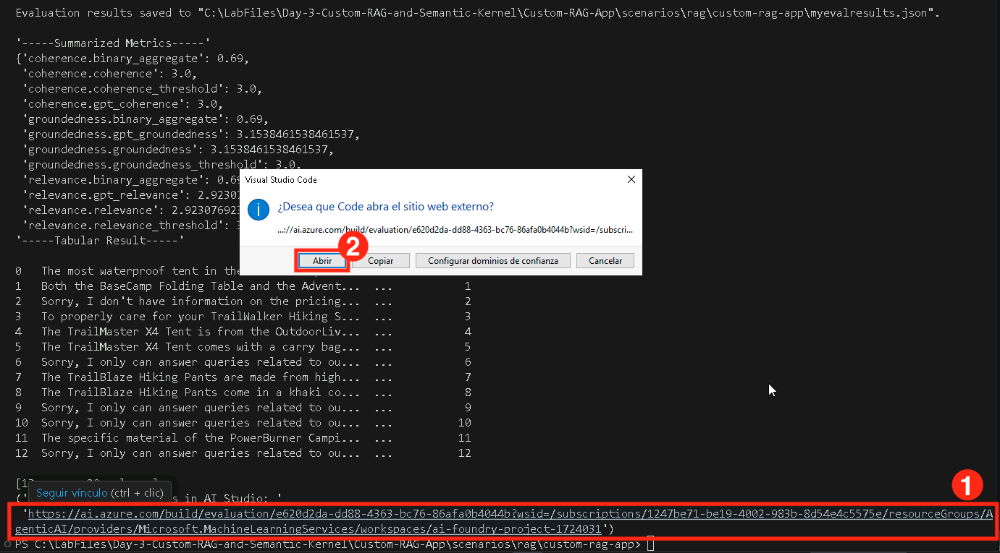
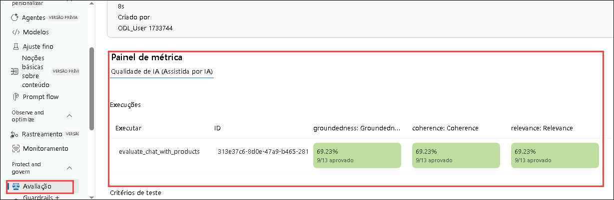

# Exercício 3: Avaliar e Otimizar o Desempenho do RAG

Neste exercício, você irá avaliar o desempenho do seu pipeline RAG usando os avaliadores do Azure AI, implementar diversos métodos de avaliação e interpretar os resultados para ajustar seu modelo. Isso garante uma melhor precisão na recuperação, qualidade nas respostas e eficiência geral do sistema.

## Objetivos

Neste exercício, você irá concluir as seguintes tarefas:

- Tarefa 1: Avaliar com os avaliadores do Azure AI
- Tarefa 2: Implementar Métodos de Avaliação
- Tarefa 3: Interpretar Resultados e Fazer Ajustes

### Tarefa 1: Avaliar com os Avaliadores do Azure AI

Nesta tarefa, você irá avaliar o pipeline RAG utilizando os avaliadores do Azure AI, analisando métricas-chave como coerência, relevância e fundamentação (groundedness). Você irá modificar o script de avaliação para incluir essas métricas e registrar os resultados para análises futuras.

1. Volte para o **Visual Studio Code**.

2. Expanda a pasta **assets (1)** e selecione o arquivo **chat_eval_data.jsonl (2)**. Este é um conjunto de dados de avaliação, contendo perguntas de exemplo e as respostas esperadas (gabarito).

    

3. Selecione o arquivo **evaluate.py**.

    

   - Esse script permite revisar os resultados localmente, exibindo-os no terminal e salvando-os em um arquivo JSON.
   - Ele também registra os resultados da avaliação no projeto na nuvem para que você possa comparar execuções na interface gráfica.

4. Para obter as métricas `Coerência` e `Relevância`, além de `fundamentação (groundedness)`, adicione o código abaixo ao arquivo **evaluate.py**.

5. Adicione a seguinte linha de importação na seção `<imports_and_config>`, por volta da linha 10 ou 11, antes do comentário `# load environment variables from the .env file at the root of this repo`.

   ```python
   from azure.ai.evaluation import CoherenceEvaluator, RelevanceEvaluator
   ```
   
      

6. Role para baixo e adicione o código abaixo antes do comentário `# </imports_and_config>`:

   ```python
   coherence = CoherenceEvaluator(evaluator_model)
   relevance = RelevanceEvaluator(evaluator_model)
   ```

         
     
7. Role até a seção `<run_evaluation>` e, por volta da `linha 69` ou `70`, adicione o seguinte código logo após `"groundedness": groundedness`:

   ```python
   "coherence": coherence, 
   "relevance": relevance,
   ```

        

8. Pressione **Ctrl+S** para salvar o arquivo.

### Tarefa 2: Implementar Métodos de Avaliação

Nesta tarefa, você irá implementar métodos de avaliação para medir o desempenho do pipeline RAG. Você instalará as dependências necessárias, executará o script de avaliação e analisará métricas como Fundamentação, Coerência e Relevância para garantir a qualidade das respostas.

1. No terminal, execute o comando abaixo para instalar o pacote necessário:

   ```bash
   pip install azure-ai-evaluation[remote]
   ```

     

   > **Nota:** Aguarde a instalação ser concluída. Pode levar alguns minutos.

   > **Nota:** Se ocorrerem erros, use o comando abaixo:

   ```bash
   pip install azure-ai-evaluation[remote] --use-deprecated=legacy-resolver
   ```

2. Execute o comando abaixo para instalar o pacote `marshmallow` na versão correta:

   ```bash
   pip install --upgrade marshmallow==3.20.2
   ```

3. Agora execute o script de avaliação:

   ```bash
   python evaluate.py
   ```

       

4. Uma vez que a atualização foi completa, reexecute o comando abaixo:

   ```bash
   python evaluate.py
   ```

            

   > **Nota:** A avaliação pode levar entre 5 a 10 minutos para ser concluída.

   > **Nota:** É normal ocorrerem erros de timeout. O script é preparado para lidar com eles e continuará executando.

4. No terminal, você verá uma resposta para cada pergunta, seguida de uma tabela com as métricas resumidas.

    ```Text
    ====================================================
    '-----Summarized Metrics-----'
    {'groundedness.gpt_groundedness': 1.6666666666666667,
    'groundedness.groundedness': 1.6666666666666667}
    '-----Tabular Result-----'
                                        outputs.response  ... line_number
    0   Could you specify which tent you are referring...  ...           0
    1   Could you please specify which camping table y...  ...           1
    2   Sorry, I only can answer queries related to ou...  ...           2
    3   Could you please clarify which aspects of care...  ...           3
    4   Sorry, I only can answer queries related to ou...  ...           4
    5   The TrailMaster X4 Tent comes with an included...  ...           5
    6                                            (Failed)  ...           6
    7   The TrailBlaze Hiking Pants are crafted from h...  ...           7
    8   Sorry, I only can answer queries related to ou...  ...           8
    9   Sorry, I only can answer queries related to ou...  ...           9
    10  Sorry, I only can answer queries related to ou...  ...          10
    11  The PowerBurner Camping Stove is designed with...  ...          11
    12  Sorry, I only can answer queries related to ou...  ...          12

    [13 rows x 8 columns]
    ('View evaluation results in Azure AI Foundry portal: '
    'https://xxxxxxxxxxxxxxxxxxxxxxx')
    ```

        

       > **Nota:** É normal ocorrerem erros de timeout. O script é preparado para lidar com eles e continuará executando.

### Tarefa 3: Interpretar Resultados e Fazer Ajustes

Nesta tarefa, você irá interpretar os resultados da avaliação e ajustar o pipeline RAG modificando o modelo de prompt. Você analisará os scores de **Relevância, Fundamentação e Coerência**, ajustará as instruções do prompt e executará novamente a avaliação para melhorar a precisão das respostas.

1. Após a execução, **Ctrl+clique** no link para abrir os resultados na página de Avaliação do portal Azure AI Foundry **(1)**, depois clique em **Open (2)**.

    

2. Na aba **Report**, você verá um painel com as médias das métricas: **Relevance**, **Groundedness** e **Coherence**.

    

3. Vá até a aba **Data (1)** para ver detalhes por métrica **(2)**.

    

4. Perceba que muitas respostas não estão bem fundamentadas. O modelo frequentemente responde com uma pergunta em vez de uma resposta direta. Isso é reflexo das instruções do prompt.

5. No arquivo **assets/grounded_chat.prompty (1)**, localize a frase:
   `"If the question is not related to outdoor/camping gear and clothing, just say 'Sorry, I only can answer queries related to outdoor/camping gear and clothing. So, how can I help?"`. **(2)**

    

6. Altere para:
   `If the question is related to outdoor/camping gear and clothing but vague, try to answer based on the reference documents, then ask for clarifying questions.`

    

7. Pressione **Ctrl+S** para salvar o arquivo.

8. Execute novamente o script de avaliação:

   ```bash
   python evaluate.py
   ```

   > **Nota:** A avaliação pode levar de 5 a 10 minutos.

   > **Nota:** Se você não puder aumentar o limite de tokens por minuto do seu modelo, erros de timeout podem ocorrer — isso é esperado.

9. Após a execução, **Ctrl+clique** no link e clique em **Open (2)** para revisar os resultados no portal Azure AI Foundry.

        

10. Na aba **Report**, verifique as médias de `Relevance`, `Groundedness` e `Coherence`, que devem estar maiores que anteriormente.

     

11. Vá para a aba **Data (1)** para mais detalhes das métricas **(2)**.

         

12. Tente outras modificações no template do prompt e observe como os resultados de avaliação são impactados.

### Revisão

Este exercício focou em avaliar e otimizar o desempenho de um sistema de Geração com Recuperação (RAG). Os participantes utilizaram avaliadores do Azure AI para mensurar a precisão da recuperação, implementaram métodos de avaliação para garantir a qualidade das respostas e interpretaram os resultados para ajustar o sistema com mais eficiência e relevância.

Você concluiu:

- Tarefa 1: Avaliação com os avaliadores do Azure AI
- Tarefa 2: Implementação dos Métodos de Avaliação
- Tarefa 3: Interpretação dos Resultados e Ajustes

### Você concluiu o laboratório com sucesso.
