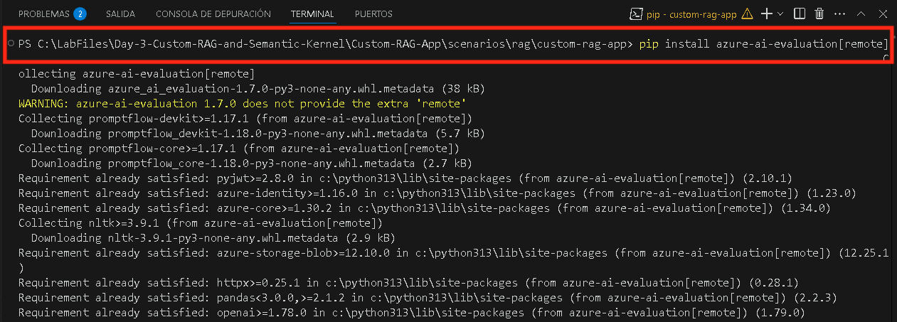
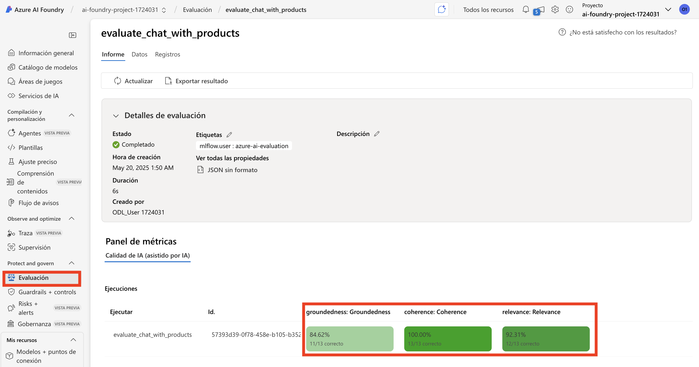

# 演習 3: RAG パフォーマンスの評価と最適化

この演習では、Azure AI 評価ツールを使用して RAG パイプラインのパフォーマンスを評価し、さまざまな評価方法を実装し、結果を解釈してモデルを微調整します。これにより、検索精度、応答品質、システム全体の効率が向上します。

## 目的

この演習では、次のタスクを完了します:

- タスク 1: Azure AI 評価ツールで評価する
- タスク 2: 評価方法の実装
- タスク 3: 結果の解釈と微調整 

### タスク 1: Azure AI 評価ツールで評価する

このタスクでは、Azure AI 評価ツールを使用して RAG パイプラインを評価し、整合性、関連性、根拠性などの主要な指標を分析します。評価スクリプトを変更してこれらの指標を組み込み、結果をログに記録してさらに分析します。

1. **Visual Studio Code** に戻ります。 

2. **assets (1)** フォルダーを展開し、**chat_eval_data.jsonl (2)** を選択します。これは評価データセットで、例の質問と期待される回答 (真実) が含まれています。

    

3. **evaluate.py** ファイルを選択します。

    

    - このスクリプトは、コマンドラインで結果を出力し、JSON ファイルに保存することでローカルで結果を確認できます。
    - このスクリプトは、評価結果をクラウドプロジェクトにログに記録し、UI で評価実行を比較できるようにします。

4. `Coherence` (整合性) と `Relevance` (関連性) の指標を `Groundedness` (根拠性) と共に取得するには、次のコードを **evaluate.py** ファイルに追加します。    

5. `<imports_and_config>` セクションの 10 行目または 11 行目付近で、 `# load environment variables from the .env file at the root of this repo` の前に次のインポート文を追加します。

    ```bash
    from azure.ai.evaluation import CoherenceEvaluator, RelevanceEvaluator
    ```

         

6. 下にスクロールして、 `# </imports_and_config>` の前に次のコードを追加します。

    ```bash
    coherence = CoherenceEvaluator(evaluator_model)
    relevance = RelevanceEvaluator(evaluator_model)
    ```

         

7. `<run_evaluation>` セクションまでスクロールし、 `69th` (69行目) または  `70th` (70行目) 付近で、 `"groundedness": groundedness` の下に次のコードを追加します。

    ```bash
    "coherence": coherence, 
    "relevance": relevance,
    ```

          

8. ファイルを保存するには **Ctrl+S** を押します。

### タスク 2: 評価方法の実装      

このタスクでは、RAG パイプラインのパフォーマンスを評価するための評価方法を実装します。必要な依存関係をインストールし、評価スクリプトを実行し、Groundedness (根拠性)、Coherence (整合性)、Relevance  (関連性) などの指標を分析して応答品質を確保します。

1. コンソールから、評価スクリプトを実行するために必要なパッケージをインストールするには、次のコマンドを実行します。

    ```bash
    pip install azure-ai-evaluation[remote]
    ```

     

      >**注意:** インストールが完了するまで待ちます。これには時間がかかる場合があります。
      
      >**注意:** このコマンドを使用してエラーが発生した場合は、次のコマンドを使用します。

    ```bash
    pip install azure-ai-evaluation[remote] --use-deprecated=legacy-resolver
    ```

2. marshmallow をインストールするには、次のコマンドを実行します。

    ```bash
    pip install --upgrade marshmallow==3.20.2
    ```

3. 評価スクリプトを実行します。

    ```bash
    python evaluate.py
    ```

       
    
4. アップグレードが完了したら、次のコマンドを再実行します。

    ```bash
    python evaluate.py
    ```

      

      >**注意:** 評価が完了するまでに約 5 ～ 10 分かかることを期待してください。  

      >**注意:** タイムアウトエラーが発生する場合がありますが、これは予期されるものです。評価スクリプトはこれらのエラーを処理し、実行を続行するように設計されています。  

5. コンソール出力では、各質問に対する回答の後に、要約された指標を含む表が表示されます。(出力に異なる列が表示される場合があります。)

    ```Text
    ====================================================
    '-----Summarized Metrics-----'
    {'groundedness.gpt_groundedness': 1.6666666666666667,
    'groundedness.groundedness': 1.6666666666666667}
    '-----Tabular Result-----'
                                        outputs.response  ... line_number
    0   Could you specify which tent you are referring...  ...           0
    1   Could you please specify which camping table y...  ...           1
    2   Sorry, I only can answer queries related to ou...  ...           2
    3   Could you please clarify which aspects of care...  ...           3
    4   Sorry, I only can answer queries related to ou...  ...           4
    5   The TrailMaster X4 Tent comes with an included...  ...           5
    6                                            (Failed)  ...           6
    7   The TrailBlaze Hiking Pants are crafted from h...  ...           7
    8   Sorry, I only can answer queries related to ou...  ...           8
    9   Sorry, I only can answer queries related to ou...  ...           9
    10  Sorry, I only can answer queries related to ou...  ...          10
    11  The PowerBurner Camping Stove is designed with...  ...          11
    12  Sorry, I only can answer queries related to ou...  ...          12

    [13 rows x 8 columns]
    ('View evaluation results in Azure AI Foundry portal: '
    'https://xxxxxxxxxxxxxxxxxxxxxxx')
    ```

        

      >**注意:** タイムアウトエラーが発生する場合がありますが、これは予期されるものです。評価スクリプトはこれらのエラーを処理し、実行を続行するように設計されています。  

### タスク 3: 結果の解釈と微調整         

このタスクでは、評価結果を解釈し、プロンプトテンプレートを調整して RAG パイプラインを微調整します。**Relevance (関連性)、 Groundedness (根拠性)、 Coherence (整合性)** のスコアを分析し、プロンプトの指示を変更して、評価を再実行し、応答の精度を向上させます。

1. 評価の実行が完了したら、リンクを **Ctrl+クリック** して Azure AI Foundry ポータルの評価ページで評価結果を表示し **(1)**、次に **Open (2)** をクリックします。

    

2. **Report** タブで、メトリックダッシュボードを通じて RAG アプリの品質を確認できます。

3. `Relevance, Groundedness`, and `Coherence` の平均スコアを確認できます。

    

4. 評価メトリックの詳細については、**Data (1)** タブに移動します **(2)**。

    

5. 応答が十分に根拠を持っていないことに注意してください。モデルはしばしば質問ではなく回答で応答します。これはプロンプトテンプレートの指示の結果です。

6. **assets/grounded_chat.prompty (1)** ファイルで、次の文を見つけます: `"If the question is not related to outdoor/camping gear and clothing, just say 'Sorry, I only can answer queries related to outdoor/camping gear and clothing. So, how can I help?"` **(2)**

    >**注：** 日本語訳は：「質問がアウトドア/キャンプ用品や衣類に関連していない場合は、「申し訳ありませんが、アウトドア/キャンプ用品や衣類に関連する質問のみお答えできます。どうお手伝いしましょうか？」と言ってください。」

   

7. 文を次のように変更します: `If the question is related to outdoor/camping gear and clothing but vague, try to answer based on the reference documents, then ask for clarifying questions.`

    >**注：** 日本語訳は：「質問がアウトドア/キャンプ用品や衣類に関連しているが曖昧な場合は、参考文書に基づいて回答し、その後、明確化する質問をしてください。」
    


8. ファイルを保存するには **Ctrl+S** を押します。

9. 評価スクリプトを再実行します。    

    ```bash
    python evaluate.py
    ```

     >**注意:** 評価が完了するまでに約 5 ～ 10 分かかることを期待してください。  

     >**注意:** モデルのトークン数制限を増やすことができない場合、タイムアウトエラーが発生することがありますが、これは予期されるものです。評価スクリプトはこれらのエラーを処理し、実行を続行するように設計されています。

10. 評価の実行が完了したら、リンクを **Ctrl+クリック** して Azure AI Foundry ポータルの評価ページで評価結果を表示し **(1)**、次に **Open (2)** をクリックします。

        

11. **レポート** タブで、`Relevance`, `Groundedness`, `Coherence` の平均スコアが以前よりも増加していることを確認できます。
 
        

12. 評価メトリックの詳細については、**データ (1)** タブに移動します **(2)**。

        

13. プロンプトテンプレートの変更が評価結果にどのように影響するかを確認するために、他のプロンプトテンプレートの変更を試してみてください。    

### レビュー

この演習では、検索強化生成 (RAG) システムのパフォーマンスの評価と最適化に焦点を当てました。参加者は Azure AI 評価ツールを使用して検索精度を評価し、評価方法を実装して応答品質を測定し、システムの効率と関連性を向上させるために結果を解釈して微調整しました。

この演習では、次のことを達成しました:
- タスク 1: Azure AI 評価ツールで評価する
- タスク 2: 評価方法の実装
- タスク 3: 結果の解釈と微調整 


### ラボを無事に終了しました。 
