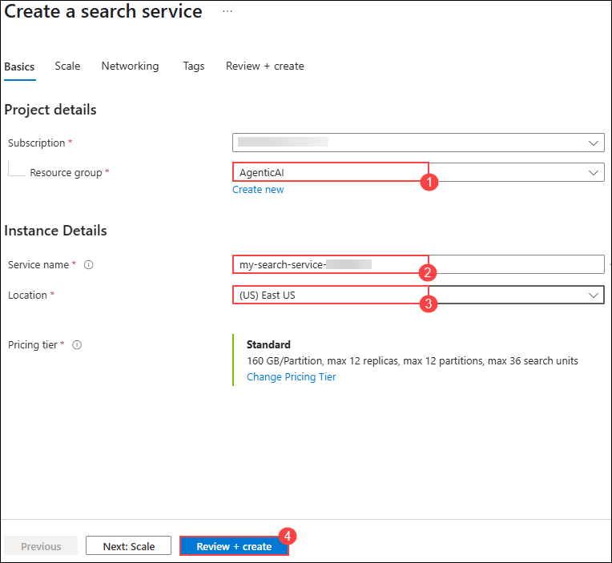
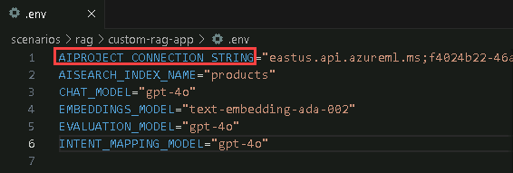

# Ejercicio 1: Configura el SDK de Azure AI Foundry y aprovisiona recursos

En este ejercicio, configurarás el SDK de Azure AI Foundry. Esto incluye la configuración del entorno, el despliegue de modelos base y asegurar la integración fluida con los servicios de Azure AI para la recuperación de conocimiento e inferencia.

### Tarea 1: Configuración de los recursos necesarios

1.  En la página del portal de Azure +++ , en el cuadro **Search
    resources** en la parte superior del portal, ingrese +++Azure AI
    Foundry+++ y, luego, seleccione Azure AI Foundry en **Services.**

    

2.  En el panel de navegación izquierdo de AI Foundry, seleccione **AI
    Hubs**. En la página AI Hubs, haga clic en **Create** y seleccione
    **Hub** en el menú desplegable.

    

3.  En el panel **Create an Azure AI hub,** ingrese los siguientes
    detalles:

    - Suscripción: **Mantenga la suscripción predeterminada.**

    - Grupo de recursos: **AgenticAI**

    - Región: **EastUS**

    - Nombre: <+++ai-foundry-hub@lab.LabInstance.Id> +++

    - Conectar servicios de IA, incluido OpenAI: Haga clic en **Create
      New.**

    - Conectar servicios de IA, incluido OpenAI: Proporcione un nombre
      [+++
      my-ai-service@lab.LabInstance.Id](mailto:+++my-ai-service@lab.LabInstance.Id)
      +++

    - Haga clic en **Save**, seguido de **Next:Storage**

    

    

4.  Haga clic en la pestaña **Review + Create** y luego en **Create.**

    

    

5.  Espere a que se complete la implementación y luego haga clic en **Go
    to resource**.

    

6.  En el panel Overview, haga clic en **Launch Azure AI Foundry**. Esto
    lo dirigirá al portal de Azure AI Foundry.

    

7.  Seleccione **+ New project** en Hub Overview.

    

8.  Ingrese el nombre del proyecto como [+++
    ai-foundry-project@lab.LabInstance.Id](mailto:+++ai-foundry-project@lab.LabInstance.Id)
    +++ y, a continuación, seleccione **Create**.

    

9.  En su **proyecto de AI Foundry**, vaya a la sección **My assets** y
    seleccione **Models + endpoints**. Haga clic en **Deploy model** y
    luego elija **Deploy base** **model** para continuar.

    

10. En la ventana **Select a model**, busque **+++gpt-4o+++**,
    seleccione **gpt-4o** y haga clic en **Confirm.**

    

11. En la ventana **Deploy model gpt-4o**, seleccione **Customize**.

    

    - Nombre de la implementación: **gpt-4o**

    - Tipo de implementación: **Global Standard**

    - Cambie la **Model version** a **2024-08-06 (Default)**

    - Cambie el límite de tokens por minuto a **200K**

    - Haga clic en **Deploy (5)**

    

12. Regrese al **Azure Portal** y busque **+++AI Search+++** y
    seleccione el recurso **AI Search.**

    

13. En la página **AI Foundry | AI Search**, seleccione **+ Create**
    para crear un recurso de Azure OpenAI.

    

14. En la página **Create a Search service**, proporcione las siguientes
    configuraciones y seleccione **Next (6):**

    | **Configuración**  | **Valor**  |
    |:----|:----|
    | Suscripción  | Mantenga la suscripción predeterminada  |
    |  Grupo de recursos | **AgenticAI**  |
    | Región  |  **East US 2** |
    | Nombre  | +++aisearch@lab.LabInstance.Id +++  |
    | Nivel de precios  | **Standard S0**  |

    

15. Seleccione **Review + create** y luego **Create.**

    

16. Regrese a la pestaña Azure AI Foundry, seleccione **Management
    Center**.

    

17. En su proyecto, seleccione **Connected resources**. Luego,
    seleccione **+New connection**. Haga clic en **Azure AI Search**,
    luego, elija **Add connection** y, finalmente, **Close**.

    

    

18. A continuación, seleccione **Connected resources** debajo de su
    Foundry hub. Luego haga clic en **+New connection**, seleccione
    **Azure AI Search**, elija **Add connection** y, finalmente,
    **Close**.

    

    

    

### Tarea 2: Instalar los requisitos del proyecto

En esta tarea, clonarás el repositorio de GitHub del proyecto para acceder a los archivos necesarios para construir la aplicación de chat.

1. En tu **Lab VM**, abre **Visual Studio Code**.

1. Haz clic en **File (1)** y luego en **Open Folder**.

1. Navega a `C:\LabFiles\Day-3-Custom-RAG-and-Semantic-Kernel` **(1)**, selecciona la carpeta **Custom-RAG-App (2)** y luego haz clic en **Select folder (3)**.

1. Haz clic en **Yes, I trust the author**.

    

1. Expande **scenarios (1)**, luego **rag/custom-rag-app (2)**. Selecciona **requirements.txt (3)**. Este archivo contiene los paquetes necesarios para configurar el SDK de Azure AI Foundry. **(4)**

    

     >**Nota**: Este archivo contiene los paquetes necesarios para construir y gestionar una aplicación impulsada por IA usando el SDK de Azure AI Foundry, incluyendo autenticación, inferencia de IA, búsqueda, procesamiento de datos y registro de telemetría.

1. Haz clic derecho en la carpeta **rag/custom-rag-app (1)** y selecciona **Open in Integrated Terminal (2)**.

    

1. Instala los paquetes requeridos ejecutando el siguiente comando.

    ```bash
    pip install -r requirements.txt
    ```

         

      >**Nota:** Espera a que la instalación finalice. Puede tomar algo de tiempo.


### Tarea 3: Configurar variables de entorno

En esta tarea, configurarás las variables de entorno necesarias para asegurar la integración fluida entre tu aplicación RAG y los servicios de Azure AI Foundry.

1. Abre una nueva pestaña en el navegador y navega al portal de Azure AI Foundry usando el siguiente enlace:

   ```
    https://ai.azure.com/
   ```

1. Haz clic en el ícono de **Azure AI Foundry** en la parte superior izquierda.

1. Selecciona el proyecto de AI Foundry que creaste anteriormente en el laboratorio, es decir, **ai-foundry-project-{suffix} (1)**
1. Navega a la página **Overview (1)** de **ai-foundry-project-{suffix}** y luego copia y pega el **Project connection string (2)** en un bloc de notas. Lo usarás en el siguiente paso.

1. Regresa a **Visual Studio Code**.

1. Haz clic derecho en **.env.sample (1)** y selecciona **Rename (2)**.

    

1. Renombra el archivo a `.env`.

1. Haz clic en el archivo `.env` **(1)** y actualiza los siguientes valores en el archivo:

    - Reemplaza **your_connection_string (2)** con el **Project connection string** que copiaste en el Paso 2.
    - CHAT_MODEL="gpt-4o"
    - EVALUATION_MODEL="gpt-4o"
    - INTENT_MAPPING_MODEL="gpt-4o"

    

2. Pulsa **Ctrl+S** para guardar el archivo.


### Revisión

Este ejercicio guió a los participantes en la configuración de un proyecto en Azure AI Foundry, el despliegue y gestión de modelos de IA, y la creación de un servicio Azure AI Search para la recuperación eficiente de datos. Integraron el servicio de búsqueda con su proyecto, clonaron un repositorio de GitHub con los recursos necesarios y configuraron variables de entorno para asegurar la ejecución fluida.

En este ejercicio lograste lo siguiente:
- Tarea 1: Instalar los requisitos del proyecto
- Tarea 2: Configurar variables de entorno

### Has completado exitosamente el ejercicio. Haz clic en **Next** para continuar con el siguiente ejercicio.
