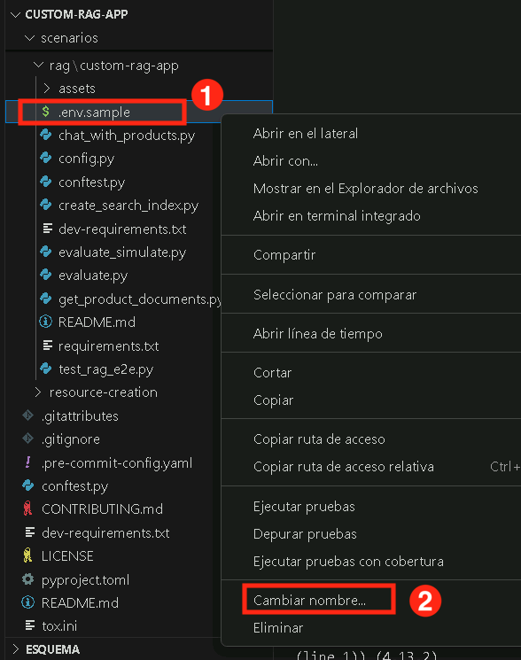

# Ejercicio 1: Configura el SDK de Azure AI Foundry y aprovisiona recursos

En este ejercicio, configurarás el SDK de Azure AI Foundry. Esto incluye la configuración del entorno, el despliegue de modelos base y asegurar la integración fluida con los servicios de Azure AI para la recuperación de conocimiento e inferencia.

### Tarea 1: Instalar los requisitos del proyecto

En esta tarea, clonarás el repositorio de GitHub del proyecto para acceder a los archivos necesarios para construir la aplicación de chat.

1. En tu **Lab VM**, abre **Visual Studio Code**.

1. Haz clic en **File (1)** y luego en **Open Folder**.

1. Navega a `C:\LabFiles\Day-3-Custom-RAG-and-Semantic-Kernel` **(1)**, selecciona la carpeta **Custom-RAG-App (2)** y luego haz clic en **Select folder (3)**.

1. Haz clic en **Yes, I trust the author**.

    

1. Expande **scenarios (1)**, luego **rag/custom-rag-app (2)**. Selecciona **requirements.txt (3)**. Este archivo contiene los paquetes necesarios para configurar el SDK de Azure AI Foundry. **(4)**

    

     >**Nota**: Este archivo contiene los paquetes necesarios para construir y gestionar una aplicación impulsada por IA usando el SDK de Azure AI Foundry, incluyendo autenticación, inferencia de IA, búsqueda, procesamiento de datos y registro de telemetría.

1. Haz clic derecho en la carpeta **rag/custom-rag-app (1)** y selecciona **Open in Integrated Terminal (2)**.

    

1. Instala los paquetes requeridos ejecutando el siguiente comando.

    ```bash
    pip install -r requirements.txt
    ```

         

      >**Nota:** Espera a que la instalación finalice. Puede tomar algo de tiempo.


### Tarea 2: Configurar variables de entorno

En esta tarea, configurarás las variables de entorno necesarias para asegurar la integración fluida entre tu aplicación RAG y los servicios de Azure AI Foundry.

1. Abre una nueva pestaña en el navegador y navega al portal de Azure AI Foundry usando el siguiente enlace:

   ```
    https://ai.azure.com/
   ```

1. Haz clic en el ícono de **Azure AI Foundry** en la parte superior izquierda.

1. Selecciona el proyecto de AI Foundry que creaste anteriormente en el laboratorio, es decir, **ai-foundry-project-{suffix} (1)**
1. Navega a la página **Overview (1)** de **ai-foundry-project-{suffix}** y luego copia y pega el **Project connection string (2)** en un bloc de notas. Lo usarás en el siguiente paso.

1. Regresa a **Visual Studio Code**.

1. Haz clic derecho en **.env.sample (1)** y selecciona **Rename (2)**.

    

1. Renombra el archivo a `.env`.

1. Haz clic en el archivo `.env` **(1)** y actualiza los siguientes valores en el archivo:

    - Reemplaza **your_connection_string (2)** con el **Project connection string** que copiaste en el Paso 2.
    - CHAT_MODEL="gpt-4o"
    - EVALUATION_MODEL="gpt-4o"
    - INTENT_MAPPING_MODEL="gpt-4o"

    

2. Pulsa **Ctrl+S** para guardar el archivo.


### Revisión

Este ejercicio guió a los participantes en la configuración de un proyecto en Azure AI Foundry, el despliegue y gestión de modelos de IA, y la creación de un servicio Azure AI Search para la recuperación eficiente de datos. Integraron el servicio de búsqueda con su proyecto, clonaron un repositorio de GitHub con los recursos necesarios y configuraron variables de entorno para asegurar la ejecución fluida.

En este ejercicio lograste lo siguiente:
- Tarea 1: Instalar los requisitos del proyecto
- Tarea 2: Configurar variables de entorno

### Has completado exitosamente el ejercicio. Haz clic en **Next** para continuar con el siguiente ejercicio.
