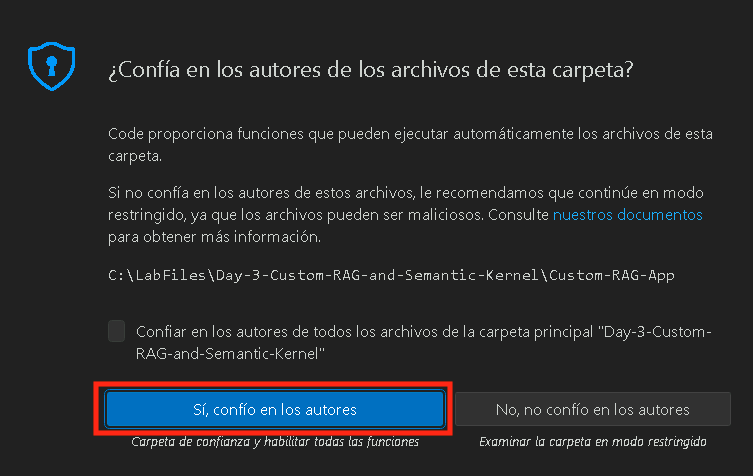
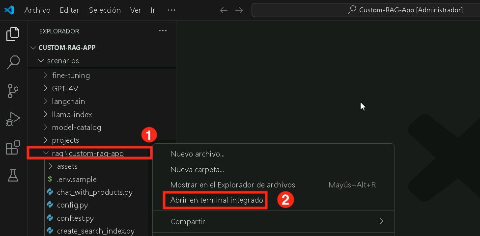

# 练习 1：设置 Azure AI Foundry SDK 和配置资源

在本练习中，您将设置 Azure AI Foundry SDK。这包括配置环境、部署基础模型，以及确保与 Azure AI 服务的无缝集成，以实现知识检索和推理。

## 练习 1: 设置 Azure AI Foundry SDK 并预配资源

### 任务 1: 设置先决条件资源

1.  在“Azure 门户”页上
    +++[https://portal.azure.com+++](https://portal.azure.com+++/),
    在门户顶部的“搜索资源”框中, enter +++Azure AI Foundry+++,
    ，然后在“服务”下选择“Azure AI Foundry”。

    

2.  在 AI Foundry 的左侧导航窗格中，选择 **AI 中心**. 在“AI
    中心”页面上，单击“**创建**”，然后 **从下拉列表中选择**“中心”。

    

3.  在“**创建 Azure AI 中心**”窗格中，输入以下详细信息：

    - 订阅 : **Leave default subscription**

    - 资源组 : **AgenticAI**

    - 地区 : **EastUS**

    - 名字: <+++ai-foundry-hub@lab.LabInstance.Id>+++

    - 连接 AI 服务，包括. OpenAI : 点击 **Create New**

    - 连接 AI 服务，包括. OpenAI : 提供名称
      <+++my-ai-service@lab.LabInstance.Id>+++

    - 点击 **Save**, 其次**Next:Storage**

    

    

4.  点击 **Review + Create** 然后选择 **Create.**

    

    

5.  等待部署完成，然后单击转到**资源**.

    

6.  在“概述”窗格中，单击“**启动 Azure AI Foundry**”。这会导航到 Azure AI
    Foundry 门户。

    

7.  在中心概述上选择 **+ New project** 

    

8.  将项目名称提供为<+++ai-foundry-project@lab.LabInstance.Id>+++
    然后选择**创建。**

    

9.  在 **AI Foundry project**，导航到“**我的资产**”部分,
    然后选择 **模型 + endpoints**. 点击 **Deploy model**,
    然后选择 **Deploy base model** 以继续.

    

10. 在 **Select a model** 窗口, 搜索 **+++gpt-4o+++**,
    选择**gpt-4o** 并选择 **Confirm**

    

11. 在 **Deploy model gpt-4o** 窗口, 选择 **Customize**.

    

    Deployment 名称: **gpt-4o**

    Deployment 类型: **Global Standard**

    将**Model version to 2024-08-06 (Default)**

    将每分钟令牌数速率限制更改为 **200K**

    点击**Deploy (5)**

    

12. 导航回**Azure Portal** 并搜索**+++AI Search+++** ，然后选择 **AI
    搜索**资源.

    

13． 在 **AI Foundry | AI Search** 页面, 选择 **+ Create** 以创建 Azure OpenAI 资源。

    

13. 在 **Create a Search service** 页面 提供以下设置和选择 **Next (6)**:

    |  设置 | 价值  |
    |:----|:----|
    |  订阅 |  保留默认订阅 |
    | 资源组  | **AgenticAI**  |
    | 区域  | **East US 2**  |
    | 名字  | +++aisearch@lab.LabInstance.Id+++  |
    |  定价层 | **Standard S0**  |

    

14. 选择 **Review + create**, 然后 **Create**

    

15. 返回到“Azure AI Foundry”选项卡，选择**Management Center**.

    

16. 在项目下，选择**Connected resources**. 然后选择 **+New connection**.
    选择 **Azure AI Search**, 然后选择**Add connection** 然后 **Close**.

    

    

17. 然后,在 Foundry 中心下选择 **Connected resources**  。然后选择**+New
    connection**. 选择 **Azure AI Search**, 然后选择 **Add
    connection** 然后 **Close**.

    

    

    

### 任务 2：安装项目所需依赖

在本任务中，您将克隆项目的 GitHub 仓库以访问构建聊天应用所需的文件。

1. 在您的 **实验虚拟机** 上，启动 **Visual Studio Code**。

1. 点击 **文件 (1)**，然后 **打开文件夹**。

1. 导航到 `C:\LabFiles\Day-3-Custom-RAG-and-Semantic-Kernel` **(1)**，选择 **Custom-RAG-App (2)** 文件夹，然后点击 **选择文件夹 (3)**。

1. 点击 **是，我信任作者**。

    

1. 展开 **scenarios (1)**，然后 **rag/custom-rag-app (2)**。选择 **requirements.txt (3)**。该文件包含设置 Azure AI Foundry SDK 所需的包。**(4)**

    

     >**注意**：该文件包含使用 Azure AI Foundry SDK 构建和管理 AI 驱动应用程序所需的包，包括身份验证、AI 推理、搜索、数据处理和遥测日志记录。

1. 右键点击 **rag/custom-rag-app (1)** 文件夹，然后选择 **在集成终端中打开 (2)**。

    

1. 运行以下命令安装所需的包。

    ```bash
    pip install -r requirements.txt
    ```

         

      >**注意：** 等待安装完成。这可能需要一些时间。


### 任务 2：配置环境变量

在本任务中，您将设置和配置必要的环境变量，以确保 RAG 应用程序与 Azure AI Foundry 服务之间的无缝集成。

1. 在浏览器中打开新标签页，使用以下链接导航到 Azure AI Foundry 门户

   ```
    https://ai.azure.com/
   ```

1. 点击左上角的 **Azure AI Foundry** 图标。
1. 选择您之前在实验中创建的 AI foundry 项目，即 **ai-foundry-project-{suffix} (1)**
1. 导航到 **ai-foundry-project-{suffix}** 的 **概述 (1)** 页面，然后复制 **项目连接字符串 (2)** 并粘贴到记事本中。您将在下一步中使用它。

1. 返回 **Visual Studio Code**。

1. 右键点击 **.env.sample (1)** 并选择 **重命名 (2)**。

    

1. 将文件重命名为 `.env`。

1. 点击 `.env` **(1)** 文件，用您在步骤 2 中复制的 **项目连接字符串** 替换 **your_connection_string (2)**。

    

    

1. 在文件中更新以下值：
    - CHAT_MODEL="gpt-4o"
    - EVALUATION_MODEL="gpt-4o"
    - INTENT_MAPPING_MODEL="gpt-4o"
1. 按 **Ctrl+S** 保存文件。

## 回顾

本练习指导参与者在 Azure AI Foundry 中设置项目、部署和管理 AI 模型，以及创建 Azure AI Search 服务以实现高效的数据检索。他们将搜索服务与项目集成，克隆包含必要资源的 GitHub 仓库，并配置环境变量以确保无缝执行。

在本练习中，您已完成以下内容：
- 任务 1：安装项目所需依赖
- 任务 2：配置环境变量

### 您已成功完成实验。点击 **下一步** 继续下一个实验。 