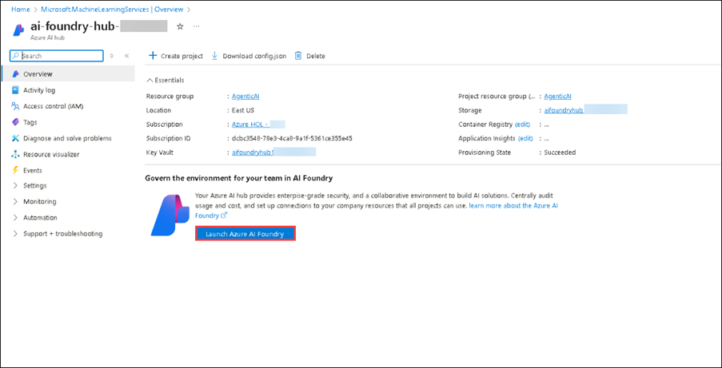
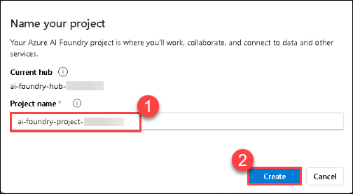
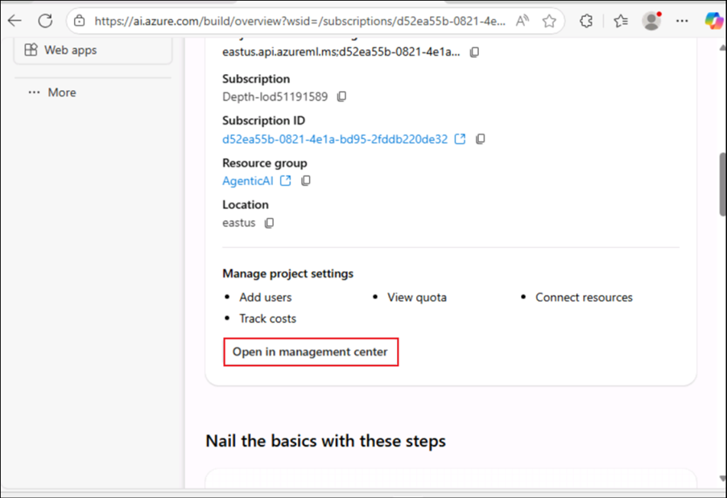

# Exercício 1: Configurar o Azure AI Foundry SDK e Provisionar Recursos

Neste exercício, você irá configurar o Azure AI Foundry SDK. Isso inclui configurar o ambiente, implantar modelos base e garantir a integração perfeita com os serviços Azure AI para recuperação de conhecimento e inferência.

### Tarefa 1: Configurando os recursos de pré-requisito

1.  Na página do Portal do Azure +++, na caixa Pesquisar recursos na
    parte superior do portal, insira +++Azure AI Foundry+++, e, em
    seguida, selecione Azure AI Foundry em Services.

   

2.  No painel de navegação esquerdo do AI Foundry, selecione **AI
    Hubs**. Na página AI Hubs, clique em **Create** e selecione **Hub**
    no menu suspenso.

   

3.  No painel **Create an Azure AI hub** insira os seguintes detalhes:

    1.  Subscription : **Leave default subscription**

    2.  Resource Group : **AgenticAI**

    3.  Region : **EastUS**

    4.  Name :
        [*+++ai-foundry-hub@lab.LabInstance.Id*](mailto:+++ai-foundry-hub@lab.LabInstance.Id)+++

    5.  Connect AI Services incl. OpenAI : Clique em **Create New**

    6.  Connect AI Services incl. OpenAI : Forneça um nome
        [*+++my-ai-service@lab.LabInstance.Id*](mailto:+++my-ai-service@lab.LabInstance.Id)+++

    7.  Clique em **Save**, e em **Next:Storage**

   

   

4.  Clique na guia **Review + Create** e em **Create.**

   

   

5.  Aguarde a conclusão da implementação e clique em **Go to resource**.

   

6.  No painel **Overview**, clique em **Launch Azure AI Foundry**. Isso
    o levará ao portal do Azure AI Foundry.

   

7.  Selecione **+ New project** em Hub Overview.

   

8.  Forneça o nome do projeto como
    [*+++ai-foundry-project@lab.LabInstance.Id*](mailto:+++ai-foundry-project@lab.LabInstance.Id)+++
    e em seguida, selecione **Create**.

   

9.  Em seu **AI Foundry project**, navegue até a seção **My assets**, e
    selecione **Models + endpoints**. Clique em **Deploy model** e
    escolha **Deploy base model** para prosseguir.

   

10. Na janela **Select a model**, busque por **+++gpt-4o+++**, selecione
    **gpt-4o** e selecione **Confirm.**

   

11. Na janela **Deploy model gpt-4o**, selecione **Customize**.

   

   - Deployment Name: **gpt-4o**

   - Deployment type: **Global Standard**

   - Altere o **Model version** para **2024-08-06 (Default)**

   - Altere o **Tokens per Minute Rate Limit** para **200K**

   - Clique em **Deploy (5)**

   

12. Navegue de volta para o **Azure Portal** e busque por **+++AI
    Search+++** e selecione o recurso **AI Search**

   

13. Na página **AI Foundry | AI Search**, selecione **+ Create** para
    criar um recurso Azure OpenAI.

   

14. Na página **Create a Search service**, forneça as seguintes
    configurações e selecione **Next (6)**:

   | **Campo** | **Valor** |
   |:----|:-----|
   | Subscription | Manter a assinatura padrão |
   | Resource group | **AgenticAI** |
   | Region | **East US 2** |
   | Name | +++aisearch@lab.LabInstance.Id+++ |
   | Pricing tier | **Standard S0** |

   

15. Selecione **Review + create** e **Create**

   

16. De volta à guia Azure AI Foundry, selecione **Management Center**.

   

17. Em **Project** selecione **Connected resources**. Em seguida,
    selecione **+New connection**. Selecione **Azure AI Search**, e
    escolha **Add connection** e **Close**.

   

   

18. Em seguida, selecione **Connected resources** abaixo do seu hub do
    Foundry. Em seguida, selecione **+New connection**. Selecione
    **Azure AI Search**, e escolha **Add connection** e **Close**.

   

   

   

### Tarefa 2: Instalar os requisitos do Projeto

Nesta tarefa, você irá clonar o repositório do GitHub do projeto para acessar os arquivos necessários para construir o aplicativo de chat.

1. Na sua **VM do Laboratório**, abra o **Visual Studio Code**.

2. Clique em **Arquivo (1)**, depois em **Abrir Pasta**.

3. Navegue até `C:\LabFiles\Day-3-Custom-RAG-and-Semantic-Kernel` **(1)**, selecione a pasta **Custom-RAG-App (2)** e então clique em **Selecionar pasta (3)**.

4. Clique em **Sim, eu confio no autor**.

   

5. Expanda **scenarios (1)**, depois **rag/custom-rag-app (2)**. Selecione **requirements.txt (3)**. Este arquivo contém os pacotes necessários para configurar o Azure AI Foundry SDK. **(4)**

   

   > **Nota:** Este arquivo contém os pacotes necessários para construir e gerenciar uma aplicação com IA utilizando o Azure AI Foundry SDK, incluindo autenticação, inferência de IA, busca, processamento de dados e registro de telemetria.

6. Clique com o botão direito na pasta **rag/custom-rag-app (1)**, depois selecione **Abrir no Terminal Integrado (2)**.

   

7. Instale os pacotes necessários executando o seguinte comando:

   ```bash
   pip install -r requirements.txt
   ```

   

   > **Nota:** Aguarde a instalação terminar. Pode demorar um pouco.

### Tarefa 3: Configurar Variáveis de Ambiente

Nesta tarefa, você irá configurar as variáveis de ambiente necessárias para garantir a integração perfeita entre seu aplicativo RAG e os serviços do Azure AI Foundry.

1. Abra uma nova aba no navegador e acesse o portal Azure AI Foundry pelo link abaixo:

   ```
   https://ai.azure.com/
   ```

2. Clique no ícone **Azure AI Foundry** no canto superior esquerdo.

3. Selecione o projeto AI Foundry que você criou anteriormente no laboratório, ou seja, **ai-foundry-project-{suffix}(1)**.

4. Vá para a página **Visão Geral (1)** do projeto **ai-foundry-project-{suffix}** e copie a **String de conexão do projeto (2)** para um bloco de notas. Você usará essa string na próxima etapa.

5. Volte para o **Visual Studio Code**.

6. Clique com o botão direito no arquivo **.env.sample (1)** e selecione **Renomear (2)**.

   

7. Renomeie o arquivo para `.env`.

8. Clique no arquivo **.env** e atualize os seguintes valores no arquivo

   - Substitua **your_connection_string** pela string de conexão do projeto que você copiou na Etapa 2.
   - CHAT_MODEL="gpt-4o"
   * EVALUATION_MODEL="gpt-4o"
   * INTENT_MAPPING_MODEL="gpt-4o"

      

9. Pressione **Ctrl+S** para salvar o arquivo.

### Revisão

Este exercício guiou os participantes na configuração de um projeto no Azure AI Foundry, implantação e gerenciamento de modelos de IA, e criação de um serviço Azure AI Search para recuperação eficiente de dados. Eles integraram o serviço de busca ao projeto, clonaram um repositório GitHub contendo os recursos necessários, e configuraram as variáveis de ambiente para garantir uma execução fluida.

Neste exercício, você realizou o seguinte:
- Tarefa 1: Instalar os requisitos do Projeto
- Tarefa 2: Configurar Variáveis de Ambiente

### Você concluiu com sucesso o exercício. Clique em **Próximo** para continuar para o próximo exercício.
