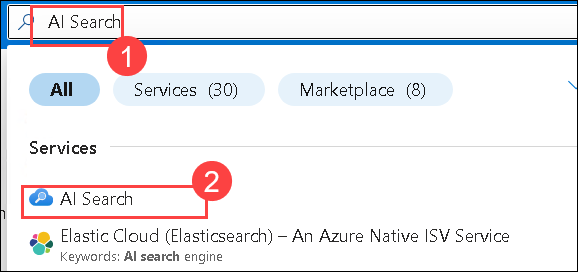
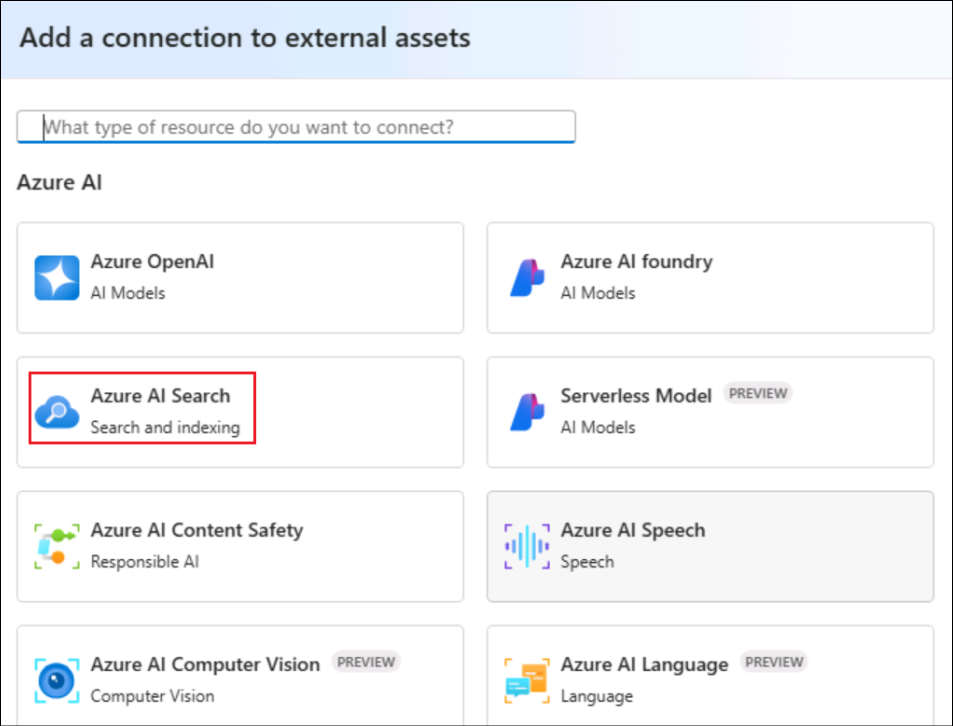

# 演習1：Azure AI Foundry SDKのセットアップとリソースのプロビジョニング 

この演習では、Azure AI Foundry SDKをセットアップします。これには、環境の構成、基盤モデルのデプロイ、および知識の取得と推論のためのAzure AIサービスとのシームレスな統合が含まれます。

## タスク 1: Azure AI Foundry で AI プロジェクトをセットアップする

このタスクでは、Azure AI Foundry 内で AI プロジェクトを作成および構成します。これには、必要なリソースのセットアップ、プロジェクトパラメータの定義、および AI モデルをデプロイするための環境の準備が含まれます。このタスクの終わりまでに、さらなる開発と実験の基盤となる完全に初期化された AI プロジェクトを持つことができます。

1. Azure Portal ページで、ポータルの上部にある [リソースの検索] ボックスに「Azure AI Foundry (1)」と入力し、[サービス] の下にある [Azure AI Foundry (2)] を選択します。

   


2. AI Foundryの左側のナビゲーションペインで、**AI Hubs (1)**を選択します。AI Hubsページで、**Create (2)**をクリックし、ドロップダウンから**Hub (3)**を選択します。

   

3. **Azure AI ハブの作成** ペインで、次の詳細を入力します。
   - サブスクリプション : **デフォルトのサブスクリプションのままにする**
   - リソースグループ :  **AgenticAI** (1)
   - 地域 : **Region** (2)
   - 名前 : **+++ai-foundry-hub@lab.LabInstance.Id+++** (3) 
      
      

   - OpenAIを含むAIサービスに接続 : **新規作成 (1)** をクリックします。
   - OpenAIを含むAIサービスに接続 : 名前を入力してください **+++my-ai-service@lab.LabInstance.Id+++ (2)**.  
   - **保存 (3)** をクリックします。, **次へ:ストレージ (4)**

   
   
4. **[確認 + 作成]** タブをクリックし、続いて **[作成]** をクリックします。

    

    
  
5. デプロイが完了するまで待ってから、[**リソースに移動**] をクリックします。

   

6. 「概要」ペインで、「**Azure AI Foundry を起動**」をクリックします。Azure AI Foundry ポータルに移動します。

   

7. 下にスクロールして、ハブの概要で **+ 新しいプロジェクト** をクリックします。

   

8. プロジェクト名を次のように入力します **+++ai-foundry-project@lab.LabInstance.Id+++** 次に**作成 (2)**をクリックします。

   

10. プロジェクトが作成されたら、下にスクロールして **プロジェクト接続文字列** をコピーします。次に、メモ帳または安全な場所に貼り付けます。今後のタスクで必要になります。


12. **AI Foundry プロジェクト**で、**アセット (1)** セクションに移動し、**モデルとエンドポイント (2)** を選択します。**モデルのデプロイ (3)** をクリックし、**ベースモデルのデプロイ (4)** を選択して続行します。

   

12. **モデルの選択** ウィンドウで、**gpt-4o (1)** を検索し、**gpt-4o (2)** を選択して **確認 (3)** を選択します。

   

13. **モデル gpt-4o のデプロイ** ウィンドウで、**カスタマイズ** を選択します。

   

   - **モデルバージョンを 2024-08-06 (1)** に変更します。
   - トークン毎分レート制限を **200K (2)** に変更します。
   - **デプロイ (3)** をクリックします。

   

14. **Model + Endpoints (1)** をクリックすると、デプロイされた **gpt-4o (2)** モデルが表示されます。

   

15. **Azure portal** に移動します。**AI Search (1)** を検索し、サービスから **AI Search (2)** リソースを選択します。

   

16. するとAIファウンドリーに移動します。**AI Search** (1)内で**Create** (2)をクリックします。
    
    

18. **検索サービスの作成** ペインで次の詳細を入力し、**確認と作成** をクリックします (4)

   - サブスクリプション : **デフォルトのサブスクリプションのままにする**
   - リソースグループ : **AgenticAI (1)** を選択
   - サービス名 : **+++my-search-service@lab.LabInstance.Id+++ (2)**
   - 位置 : **Region** **(3)**

     

18. **確認 + 作成** で、**作成** をクリックします。

    

19. デプロイが完了するまで待ってから、[**リソースに移動**] をクリックします。

20. Azure AI Foundry タブに戻り、[Management Center] を選択します。

    
    
22. プロジェクトで「接続されたリソース」を選択します。次に「+新しい接続」を選択します。Azure AI Searchを選択し、「接続の追加」を選択してから「閉じる」を選択します。

    

    
    
24. 次に、Foundry ハブの下にある「接続済みリソース」を選択します。次に「+新しい接続」を選択します。「Azure AI Search」を選択し、「接続を追加」を選択してから「閉じる」を選択します。

    

    

    
    
### タスク2：プロジェクトの要件をインストールする

このタスクでは、チャットアプリを構築するために必要なファイルにアクセスするためにGitHubリポジトリをクローンします。

1. **Lab VM**で**Visual Studio Code**を起動します。

2. **ファイル (1)** をクリックし、次に**フォルダーを開く**をクリックします。

3. `C:\LabFiles\Day-3-Custom-RAG-and-Semantic-Kernel` **(1)**に移動し、**Custom-RAG-App (2)** フォルダーを選択して**フォルダーを選択 (3)** をクリックします。

4. **はい、著者を信頼します**をクリックします。

    

5. **scenarios (1)** を展開し、次に**rag/custom-rag-app (2)** を展開します。**requirements.txt (3)** を選択します。このファイルには、Azure AI Foundry SDKのセットアップに必要なパッケージが含まれています。**(4)**

    

     >**注：** このファイルには、Azure AI Foundry SDKを使用してAI駆動のアプリケーションを構築および管理するために必要なパッケージが含まれており、認証、AI推論、検索、データ処理、およびテレメトリーロギングが含まれています。

6. **rag/custom-rag-app (1)** フォルダーを右クリックし、**統合ターミナルで開く (2)** を選択します。

    

7. 次のコマンドを実行して必要なパッケージをインストールします。

    ```bash
    pip install -r requirements.txt
    ```

         

      >**注：** インストールが完了するまで待ちます。時間がかかる場合があります。


### タスク3：環境変数の構成

このタスクでは、RAGアプリケーションとAzure AI Foundryサービスとのシームレスな統合を確保するために必要な環境変数を設定および構成します。

1. ブラウザで新しいタブを開き、以下のリンクを使用してAzure AI Foundryポータルに移動します。

   ```
    https://ai.azure.com/
   ```

2. 左上の**Azure AI Foundry**アイコンをクリックします。

3. ラボで以前に作成したAI Foundryプロジェクト **ai-foundry-project-{suffix} (1)** を選択します。

4. **ai-foundry-project-{suffix}** の**概要 (1)** ページに移動し、**プロジェクト接続文字列 (2)** をコピーしてメモ帳に貼り付けます。次のステップで使用します。

5. **Visual Studio Code**に戻ります。

6. **.env.sample (1)** を右クリックし、**名前の変更 (2)** を選択します。

    

7. ファイル名を `.env` に変更します

8. `.env` **(1)** ファイルをクリックし、**your_connection_string (2)** をステップ2でコピーした **プロジェクト接続文字列**に置き換えます。

    

    

9. ファイル内の以下の値を更新します:
    - CHAT_MODEL="gpt-4o"
    - EVALUATION_MODEL="gpt-4o"
    - INTENT_MAPPING_MODEL="gpt-4o"

10. **Ctrl+S** を押してファイルを保存します。

### レビュー

この演習では、参加者がAzure AI Foundryでプロジェクトを設定し、AIモデルをデプロイおよび管理し、効率的なデータ取得のためにAzure AI Searchサービスを作成する方法をガイドしました。参加者は検索サービスをプロジェクトに統合し、必要なリソースを含むGitHubリポジトリをクローンし、シームレスな実行を確保するために環境変数を構成しました。

この演習では、以下のことを達成しました：
- タスク1：プロジェクトの要件をインストールする
- タスク2：環境変数の構成

### 演習を正常に終了しました。次の演習に進むには **次へ** をクリックしてください。


