# Ejercicio 4: Fundamentos de Semantic Kernel

### Duración estimada: 25 minutos

Este laboratorio práctico te brinda experiencia con Semantic Kernel y el modelo GPT-4o de Azure AI Foundry. Diseñado para quienes inician en el desarrollo de IA, el laboratorio te guía paso a paso para construir una función de chat inteligente dentro de una aplicación base. Utilizarás el framework Semantic Kernel para conectarte con el modelo GPT-4o, implementar una API de chat que envía prompts del usuario y devuelve respuestas dinámicas generadas por IA.

**Nota:** Este laboratorio está implementado tanto en **C#** como en **Python**. Puedes realizar los ejercicios en **el lenguaje que prefieras**—los conceptos principales son los mismos. Para ver las instrucciones de un lenguaje específico:
- Haz clic en el pequeño **icono de flecha** (▶) junto al nombre del lenguaje.
- Esto mostrará las instrucciones paso a paso para ese lenguaje.

¡Elige tu lenguaje preferido y comienza!

## Objetivos
En este ejercicio, realizarás las siguientes tareas:
- Tarea 1: Configurar variables de entorno
- Tarea 2: Actualizar los archivos de código y ejecutar la app

## Tarea 1: Configurar variables de entorno

En esta tarea, explorarás diferentes tipos de flujo en Azure AI Foundry configurando Visual Studio Code, obteniendo credenciales de Azure OpenAI y configurándolas en los entornos de Python y C#.

1. Abre **Visual Studio Code** desde el acceso directo en el escritorio de la labvm.
1. Haz clic en **File (1)** y selecciona **Open Folder (2)**.

    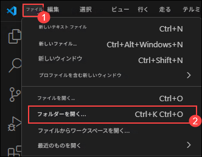
1. Navega a `C:\LabFiles\Day-3-Custom-RAG-and-Semantic-Kernel` (1), selecciona la carpeta **Semantic-Kernel (2)** y haz clic en **Select Folder**.

1. Si recibes la advertencia `Do you trust the authors of the files in folder`, selecciona la casilla (1) y haz clic en **Yes, I trust the authors (2)**.

    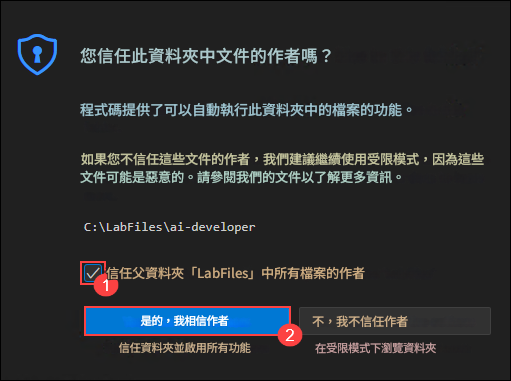

1. Navega al ícono de **Azure AI Foundry** en la esquina superior izquierda.

1. Selecciona el proyecto de AI Foundry que creaste anteriormente en el laboratorio, es decir, **ai-foundry-project-{suffix} (1)**

1. En la página **Overview (1)** selecciona **Azure OpenAI Service (2)** y haz **Copy (3)** del endpoint y pégalo en **Notepad**, ya que lo usarás en los siguientes ejercicios.

    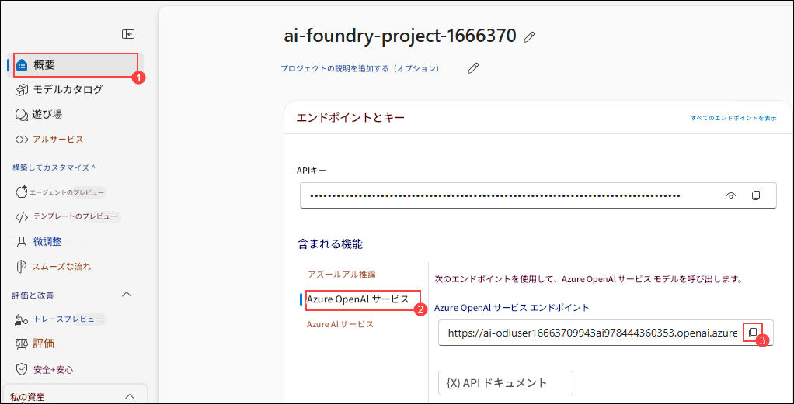   

1. Copia la clave API desde el portal de AI Foundry y pégala en **Notepad**, ya que la usarás en los siguientes ejercicios.

    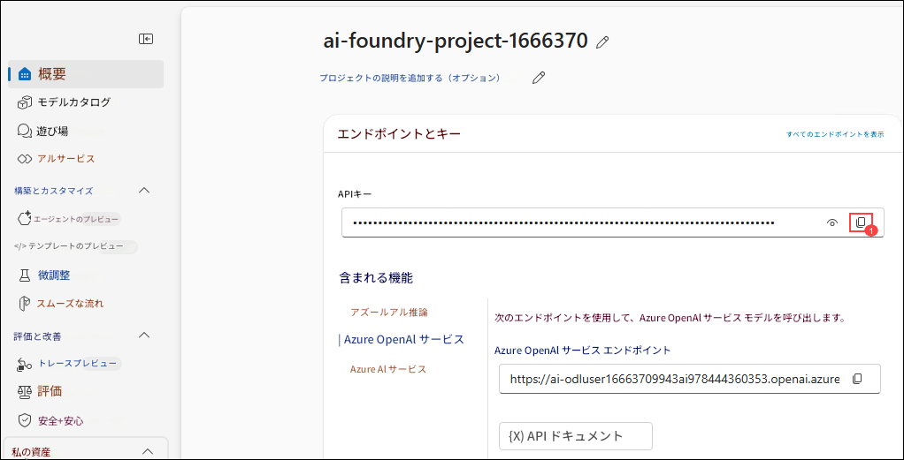

<details>
<summary><strong>Python</strong></summary>

1. Navega al directorio `Python>src` y abre el archivo **.env** (1).

    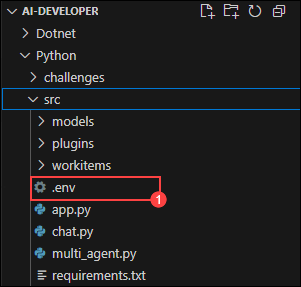

1. Pega el **Azure OpenAI Endpoint** copiado antes junto a `AZURE_OPENAI_ENDPOINT`.
    >Nota: Asegúrate de que cada valor en el archivo **.env** esté entre **comillas dobles (")**.

1. Pega la **API key** copiada antes junto a `AZURE_OPENAI_API_KEY`.

    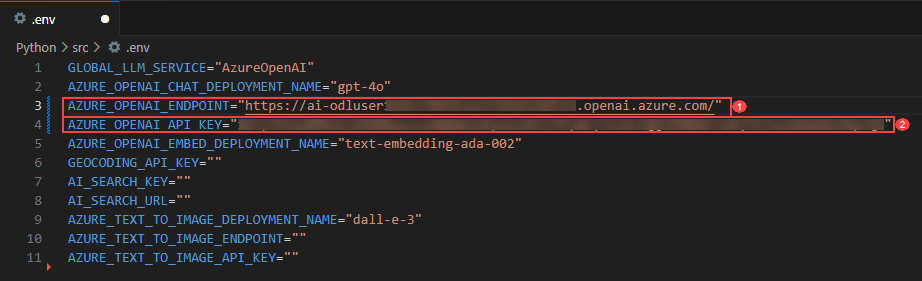

1. Guarda el archivo.

</details>

<details>
<summary><strong>C Sharp(C#)</strong></summary>

1. Navega al directorio `Dotnet>src>BlazorAI` y abre el archivo **appsettings.json (1)**.

    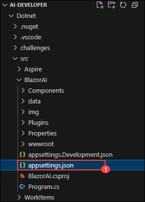

1. Pega el **Azure OpenAI Endpoint** copiado antes junto a `AOI_ENDPOINT`.
    >**Nota**: Asegúrate de que cada valor en el archivo **appsettings.json** esté entre **comillas dobles (")**.

    >**Nota**: Asegúrate de eliminar la "/" del endpoint.
1. Pega la **API key** copiada antes junto a `AOI_API_KEY`.

    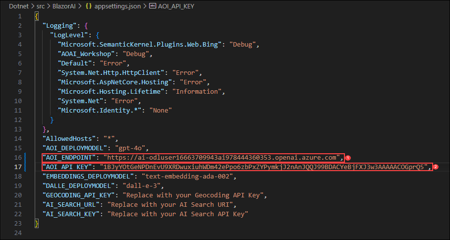
1. Guarda el archivo.

</details>

## Tarea 2: Actualizar los archivos de código y ejecutar la app

En esta tarea, explorarás diferentes tipos de flujo en Azure AI Foundry actualizando archivos de código, ejecutando la app con IA en Python y C#, y probando respuestas a los prompts del usuario.

<details>
<summary><strong>Python</strong></summary>

1. Navega al directorio `Python>src` y abre el archivo **chat.py**.

    
1. Agrega el siguiente código en la sección `#Import Modules` (1) del archivo.
    ```
    from semantic_kernel.connectors.ai.chat_completion_client_base import ChatCompletionClientBase
    from semantic_kernel.connectors.ai.open_ai import OpenAIChatPromptExecutionSettings
    import os
    ```

    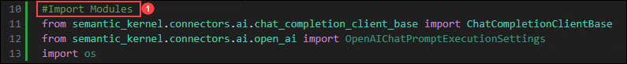
1. Agrega el siguiente código en la sección `# Challenge 02 - Chat Completion Service` (1) del archivo.
    ```
    chat_completion_service = AzureChatCompletion(
        deployment_name=os.getenv("AZURE_OPENAI_CHAT_DEPLOYMENT_NAME"),
        api_key=os.getenv("AZURE_OPENAI_API_KEY"),
        endpoint=os.getenv("AZURE_OPENAI_ENDPOINT"),
        service_id="chat-service",
    )
    kernel.add_service(chat_completion_service)
    execution_settings = kernel.get_prompt_execution_settings_from_service_id("chat-service")
    ```

    
1. Agrega el siguiente código en la sección `# Start Challenge 02 - Sending a message to the chat completion service by invoking kernel` del archivo.
    ```
    global chat_history
    chat_history.add_user_message(user_input)
    chat_completion = kernel.get_service(type=ChatCompletionClientBase)
    execution_settings = kernel.get_prompt_execution_settings_from_service_id("chat-service")
    response = await chat_completion.get_chat_message_content(
        chat_history=chat_history,
        settings=execution_settings,
        kernel=kernel
    )
    chat_history.add_assistant_message(str(response))
    ```

    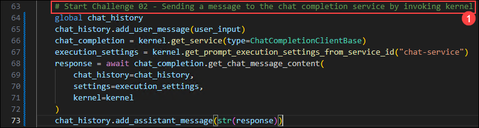
1. Agrega el siguiente código en la sección `#return result` del archivo.
    ```
    logger.info(f"Response: {response}")
    return response
    ```

    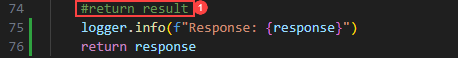
1. Si encuentras algún error de indentación, utiliza el código del siguiente enlace:
    ```
    https://raw.githubusercontent.com/CloudLabsAI-Azure/ai-developer/refs/heads/prod/CodeBase/python/lab-02.py
    ```
1. Guarda el archivo.
   
1. Haz clic derecho en `Python>src` en el panel izquierdo y selecciona **Open in Integrated Terminal**.

    

1. Ejecuta el siguiente comando para instalar los paquetes desde el archivo requirements.txt:

    ```
    pip install -r requirements.txt
    ```

1. Ejecuta el siguiente comando para actualizar semantic kernel:

    ```
    pip install --upgrade semantic-kernel --pre
    ```

1. Usa el siguiente comando para ejecutar la app:
    ```
    streamlit run app.py
    ```
1. Si se te solicita un correo para registrarte, puedes usar el siguiente y presionar **Enter**:
    ```
    test@gmail.com
    ```

    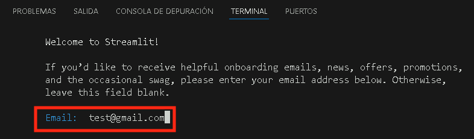

1. Si la app no se abre automáticamente en el navegador, puedes acceder usando la siguiente **URL**:
    ```
    http://localhost:8501
    ```
1. Envía el siguiente prompt y observa cómo responde la IA:
    ```
    Why is the sky blue?
    ```
    ```
    Why is it red?
    ```
1. Recibirás una respuesta similar a la mostrada a continuación:

    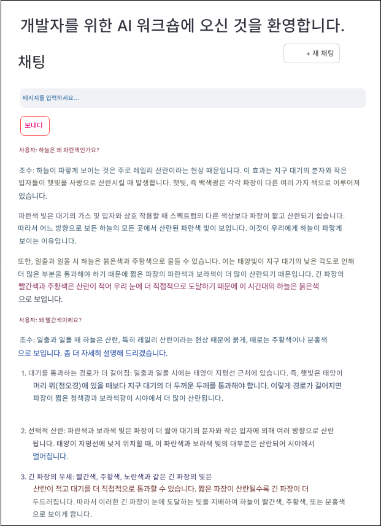
</details>

<details>
<summary><strong>C Sharp(C#)</strong></summary>

1. Navega al directorio `Dotnet>src>BlazorAI>Components>Pages` y abre el archivo **Chat.razor.cs (1)**.

    

1. Agrega el siguiente código en la sección `// Your code goes here` (Line no. 92) (1) del archivo.
    ```
    chatHistory.AddUserMessage(userMessage);
    var chatCompletionService = kernel.GetRequiredService<IChatCompletionService>();
    var assistantResponse = await chatCompletionService.GetChatMessageContentAsync(
        chatHistory: chatHistory,
        kernel: kernel);
    chatHistory.AddAssistantMessage(assistantResponse.Content);
    ```

    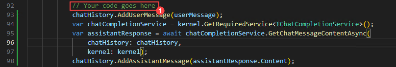
1. Si encuentras algún error de indentación, utiliza el código del siguiente enlace:
    ```
    https://raw.githubusercontent.com/CloudLabsAI-Azure/ai-developer/refs/heads/prod/CodeBase/c%23/lab-02.cs
    ```
1. Guarda el archivo.
1. Haz clic derecho en `Dotnet>src>Aspire>Aspire.AppHost` en el panel izquierdo y selecciona **Open in Integrated Terminal**.

    
1. Ejecuta la siguiente línea de código para confiar en los certificados de desarrollo necesarios para ejecutar la app localmente, y luego selecciona **Yes**:
    ```
    dotnet dev-certs https --trust
    ```

    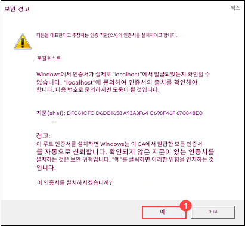
1. Usa el siguiente comando para ejecutar la app:
    ```
    dotnet run
    ```
1. Abre una nueva pestaña en el navegador y navega al enlace de **blazor-aichat**: **https://localhost:7118/**.

    >**Nota**: Si recibes advertencias de seguridad en el navegador, cierra el navegador y sigue el enlace nuevamente.
1. Envía el siguiente prompt y observa cómo responde la IA:
    ```
    Why is the sky blue?
    ```
    ```
    Why is it red?
    ```
1. Recibirás una respuesta similar a la mostrada a continuación:

    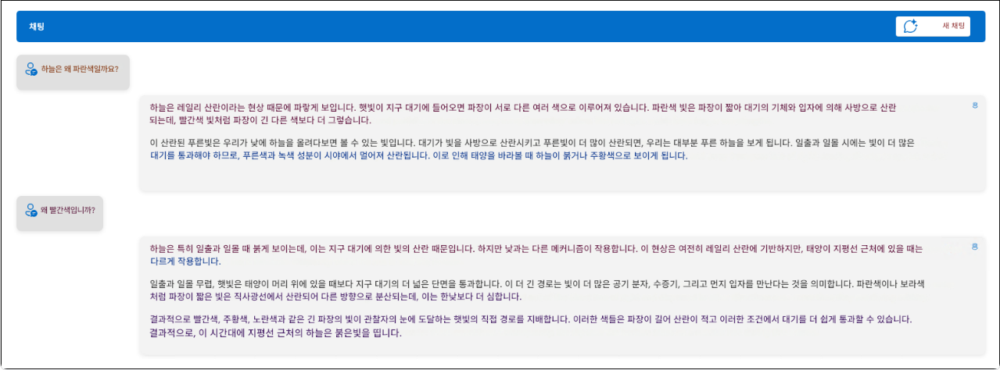
</details>

## Revisión

En este ejercicio, utilizamos **Semantic Kernel** en combinación con el **modelo GPT-4o de Azure AI Foundry** para construir una función de chat inteligente dentro de una aplicación base. Integramos el framework Semantic Kernel con GPT-4o, implementamos una API de chat para manejar prompts del usuario y devolvimos respuestas dinámicas generadas por IA. Esto mejoró nuestra habilidad para conectar aplicaciones con potentes modelos de lenguaje usando frameworks modernos de desarrollo de IA.

Tareas completadas exitosamente para la implementación de chat impulsado por IA usando **Semantic Kernel** y **Azure AI Foundry GPT-4o**:  

- Integración de **Semantic Kernel** con **GPT-4o** para interacciones inteligentes de IA.  
- Configuración de una **API de chat** para procesar prompts de usuario y generar respuestas impulsadas por IA.     
- Extensión de la funcionalidad del chatbot integrando **Azure AI Search** para recuperación contextual de datos.  

## Ve al siguiente laboratorio haciendo clic en la navegación.
