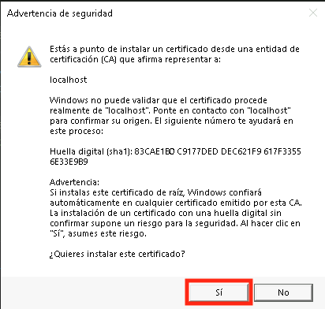
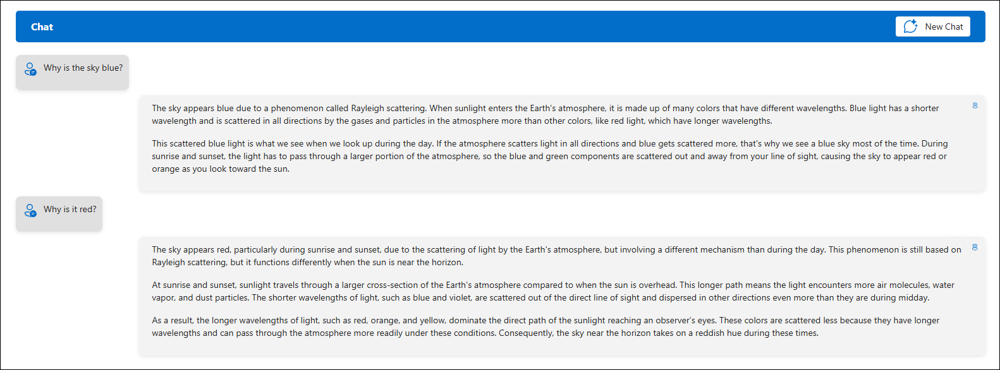

# 演習 4: セマンティック カーネルの基礎

### 推定所要時間: 25 分

このハンズオン ラボでは、セマンティック カーネルと Azure AI Foundry GPT-4o モデルを使用した実践的な経験を提供します。AI 開発に不慣れな方を対象に設計されており、スターター アプリケーション内でインテリジェント チャット機能を構築するためのステップバイステップのガイドを提供します。セマンティック カーネル フレームワークを使用して GPT-4o モデルに接続し、ユーザー プロンプトを送信するチャット API を実装し、動的な AI 生成応答を返します。

**注意:** - このラボは **C#** と **Python** の両方で実装されています。**どちらの言語に慣れているかに関係なく**、演習を実行できます。コア コンセプトは同じです。特定の言語の手順を表示するには:
- 言語名の横にある小さな **矢印アイコン** (▶) をクリックします。
- これにより、その言語のステップバイステップの手順が表示されます。

お好みの言語を選択して始めましょう！

## 目的
この演習では、次のタスクを実行します:
- タスク 1: 環境変数の設定
- タスク 2: コード ファイルの更新とアプリの実行

## タスク 1: 環境変数の設定

このタスクでは、Visual Studio Code を設定し、Azure OpenAI の資格情報を取得し、Python と C# の環境で構成することで、Azure AI Foundry のさまざまなフロー タイプを探索します。

1. ラボ VM のデスクトップ ショートカットから **Visual Studio Code** を開きます。
2. **ファイル (1)** をクリックし、**フォルダーを開く (2)** を選択します。

    

3. `C:\LabFiles\Day-3-Custom-RAG-and-Semantic-Kernel` **(1)** に移動し、**Semantic-Kernel (2)** フォルダーを選択して **フォルダーを選択** をクリックします。

4. `Do you trust the authors of the files in folder` (フォルダー内のファイルの著者を信頼しますか？) 警告が表示された場合は、チェックボックス **(1)** を選択し、**はい、著者を信頼します (2)** をクリックします。

    

5. ブラウザーで新しいタブを開き、次のリンクを使用して Azure AI Foundry ポータルに移動します。

   ```
    https://ai.azure.com/
   ```

6. 左上の **Azure AI Foundry** アイコンをクリックします。
7. ラボで以前に作成した AI Foundry プロジェクト **ai-foundry-project-{suffix} (1)** を選択します。
8. **概要 (1)** ページで **Azure OpenAI Service (2)** を選択し、エンドポイントを **コピー (3)** して **メモ帳** に貼り付けます。これは今後の演習で使用されます。

    

9. AI Foundry ポータルから API キーをコピーして **メモ帳** に貼り付けます。これは今後の演習で使用されます。

    

<details>
<summary><strong>Python</strong></summary>

1. `Python>src` ディレクトリに移動し、**.env (1)** ファイルを開きます。

    

2. 演習の前にコピーした **Azure OpenAI Service エンドポイント** を `AZURE_OPENAI_ENDPOINT` の横に貼り付けます。
    >**注意:** **.env** ファイル内のすべての値が **二重引用符 (")** で囲まれていることを確認してください。

3. 演習の前にコピーした **API キー** を `AZURE_OPENAI_API_KEY` の横に貼り付けます。

    

4. ファイルを保存します。

</details>

<details>
<summary><strong>C Sharp(C#)</strong></summary>

1. `Dotnet>src>BlazorAI` ディレクトリに移動し、**appsettings.json (1)** ファイルを開きます。

    

2. 演習の前にコピーした **Azure OpenAI Service エンドポイント** を `AOI_ENDPOINT` の横に貼り付けます。
    >**注意:** **appsettings.json** ファイル内のすべての値が **二重引用符 (")** で囲まれていることを確認してください。

    >**注意:** エンドポイントから "/" を削除することを確認してください。

3. 演習の前にコピーした **API キー** を `AOI_API_KEY` の横に貼り付けます。

    

4. ファイルを保存します。

</details>

## タスク 2: コード ファイルの更新とアプリの実行

このタスクでは、コード ファイルを更新し、Python と C# で AI 搭載アプリを実行し、ユーザー プロンプトに対する応答をテストすることで、Azure AI Foundry のさまざまなフロー タイプを探索します。

<details>
<summary><strong>Python</strong></summary>

1. `Python>src` ディレクトリに移動し、**chat.py** ファイルを開きます。

    

2. ファイルの `#Import Modules` **(1)** セクションに次のコードを追加します。
    ```
    from semantic_kernel.connectors.ai.chat_completion_client_base import ChatCompletionClientBase
    from semantic_kernel.connectors.ai.open_ai import OpenAIChatPromptExecutionSettings
    import os
    ```

    

3. ファイルの `# Challenge 02 - Chat Completion Service` **(1)** セクションに次のコードを追加します。
    ```
    chat_completion_service = AzureChatCompletion(
        deployment_name=os.getenv("AZURE_OPENAI_CHAT_DEPLOYMENT_NAME"),
        api_key=os.getenv("AZURE_OPENAI_API_KEY"),
        endpoint=os.getenv("AZURE_OPENAI_ENDPOINT"),
        service_id="chat-service",
    )
    kernel.add_service(chat_completion_service)
    execution_settings = kernel.get_prompt_execution_settings_from_service_id("chat-service")
    ```

    

4. ファイルの `# Start Challenge 02 - Sending a message to the chat completion service by invoking kernel` **(1)** セクションに次のコードを追加します。
    ```
    global chat_history
    chat_history.add_user_message(user_input)
    chat_completion = kernel.get_service(type=ChatCompletionClientBase)
    execution_settings = kernel.get_prompt_execution_settings_from_service_id("chat-service")
    response = await chat_completion.get_chat_message_content(
        chat_history=chat_history,
        settings=execution_settings,
        kernel=kernel
    )
    chat_history.add_assistant_message(str(response))
    ```

    

5. ファイルの `#return result` **(1)** セクションに次のコードを追加します。
    ```
    logger.info(f"Response: {response}")
    return response
    ```

    

6. インデント エラーが発生した場合は、次の URL からコードを使用してください:
    ```
    https://raw.githubusercontent.com/CloudLabsAI-Azure/ai-developer/refs/heads/prod/CodeBase/python/lab-02.py
    ```
7. ファイルを保存します。
8. 左ペインで `Python>src` **(1)** を右クリックし、**統合ターミナルで開く (2)** を選択します。

    

9. 次のコマンドを使用してアプリを実行します。
    ```
    streamlit run app.py
    ```
10. 登録するためのメールが求められた場合は、以下のメールを使用し、**Enter** を押してください。
    ```
    test@gmail.com
    ```

    

11. アプリがブラウザーで自動的に開かない場合は、次の **URL** を使用してアクセスできます。

    ```
    http://localhost:8501
    ```
12. 次のプロンプトを送信し、AI の応答を確認します。
    プロンプト 1:
    ```
    Why is the sky blue?
    ```
    >**任意:** 日本語訳のプロンプトは
    ```
    なぜ空は青いのですか？
    ```

    プロンプト 2:
    ```
    Why is it red?
    ```
    >**任意:** 日本語訳のプロンプトは
    ```
    なぜ赤いのですか？
    ```

13. 以下のような応答が表示されます。


</details>

<details>
<summary><strong>C Sharp(C#)</strong></summary>

1. `Dotnet>src>BlazorAI>Components>Pages` ディレクトリに移動し、**Chat.razor.cs (1)** ファイルを開きます。

    

2. ファイルの `// Your code goes here(Line no. 92)` **(1)** セクションに次のコードを追加します。
    ```
    chatHistory.AddUserMessage(userMessage);
    var chatCompletionService = kernel.GetRequiredService<IChatCompletionService>();
    var assistantResponse = await chatCompletionService.GetChatMessageContentAsync(
        chatHistory: chatHistory,
        kernel: kernel);
    chatHistory.AddAssistantMessage(assistantResponse.Content);
    ```

    

3. インデント エラーが発生した場合は、次の URL からコードを使用してください。 
    ```
    https://raw.githubusercontent.com/CloudLabsAI-Azure/ai-developer/refs/heads/prod/CodeBase/c%23/lab-02.cs
    ```
4. ファイルを保存します。
5. 左ペインで `Dotnet>src>Aspire>Aspire.AppHost` を右クリックし、**統合ターミナルで開く** を選択します。

    

6. アプリをローカルで実行するために必要な dev-certificates を信頼するために次のコード行を実行し、**はい** を選択します。
    ```
    dotnet dev-certs https --trust
    ```

    

7. 次のコマンドを使用してアプリを実行します。
    ```
    dotnet run
    ```
8. ブラウザーで新しいタブを開き、**blazor-aichat** のリンク **https://localhost:7118/** に移動します。

    >**注意:** ブラウザーでセキュリティ警告が表示された場合は、ブラウザーを閉じて再度リンクに従ってください。

9. 次のプロンプトを送信し、AI の応答を確認します。
    プロンプト 1:
    ```
    Why is the sky blue?
    ```
    >**任意:** 日本語訳のプロンプトは
    ```
    なぜ空は青いのですか？
    ```

    プロンプト 2:
    ```
    Why is it red?
    ```
    >**任意:** 日本語訳のプロンプトは
    ```
    なぜ赤いのですか？
    ```
10. 以下のような応答が表示されます。

    

</details>

## レビュー

この演習では、スターター アプリケーション内でインテリジェント チャット機能を構築するために **セマンティック カーネル** と **Azure AI Foundry GPT-4o** モデル を組み合わせて使用しました。セマンティック カーネル フレームワークを GPT-4o と統合し、ユーザー プロンプトを処理するチャット API を実装し、動的な AI 生成応答を返しました。これにより、最新の AI 開発フレームワークを使用してアプリケーションを強力な言語モデルに接続する能力が向上しました。

**セマンティック カーネル** と **Azure AI Foundry GPT-4o** を使用した AI 駆動チャットの実装のために以下のタスクを正常に完了しました:  

- インテリジェントな AI インタラクションのために **セマンティック カーネル** を **GPT-4o** と統合しました。
- ユーザー プロンプトを処理し、AI 駆動の応答を生成する **チャット API** を構成しました。
- コンテキスト データの検索のために **Azure AI Search** を統合してチャットボットの機能を拡張しました。  

## ナビゲーションをクリックして次のラボに進みます。
