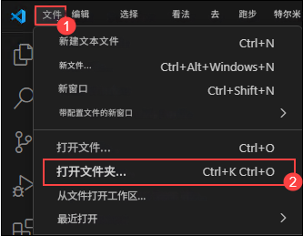
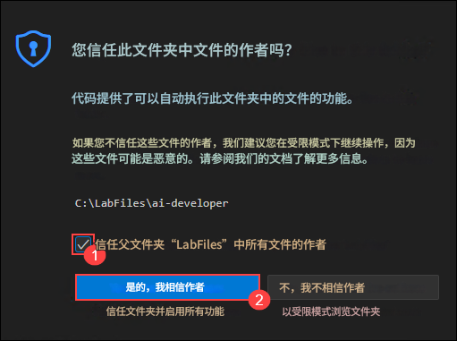

# 练习 4：Semantic Kernel 基础

### 预计时长：25 分钟

本动手实验为您提供使用 Semantic Kernel 和 Azure AI Foundry GPT-4o 模型的实践经验。本实验专为 AI 开发新手设计，将逐步指导您在入门应用程序中构建智能聊天功能。您将使用 Semantic Kernel 框架连接 GPT-4o 模型，实现一个聊天 API 来发送用户提示并返回动态的 AI 生成响应。

**注意：**- 本实验同时提供 **C#** 和 **Python** 两种实现。您可以使用**任何您熟悉的语言**进行练习—核心概念保持不变。要查看特定语言的说明：
- 点击语言名称旁边的小**箭头图标** (▶)。
- 这将显示该语言的逐步说明。

选择您喜欢的语言并开始吧！

## 目标
在本练习中，您将完成以下任务：
- 任务 1：设置环境变量
- 任务 2：更新代码文件并运行应用程序

## 任务 1：设置环境变量

在本任务中，您将通过设置 Visual Studio Code、检索 Azure OpenAI 凭据并在 Python 和 C# 环境中配置它们来探索 Azure AI Foundry 中的不同流类型。

1. 从 labvm 桌面快捷方式打开 **Visual Studio code**。
1. 点击 **文件 (1)** 并选择 **打开文件夹 (2)**。

    
1. 导航到 `C:\LabFiles\Day-3-Custom-RAG-and-Semantic-Kernel` (1) 并选择 **Semantic-Kernel (2)** 文件夹，然后点击 **选择文件夹**。

1. 如果收到 `您是否信任此文件夹中的文件作者` 警告，选中复选框 (1) 并点击 **是，我信任作者 (2)**。

    
1. 在浏览器中打开新标签页，使用以下链接导航到 Azure AI Foundry 门户

   ```
    https://ai.azure.com/
   ```

1. 点击左上角的 **Azure AI Foundry** 图标。
1. 选择您之前在实验中创建的 AI foundry 项目，即 **ai-foundry-project-{suffix} (1)**
1. 在 **概览 (1)** 页面上选择 **Azure OpenAI Service (2)** 并 **复制 (3)** 端点并粘贴到记事本中，因为它将在接下来的练习中使用。

    
1. 从 AI Foundry 门户复制 API 密钥并粘贴到记事本中，因为它将在接下来的练习中使用。

    

<details>
<summary><strong>Python</strong></summary>

1. 导航到 `Python>src` 目录并打开 **.env** (1) 文件。

    
1. 将之前在练习中复制的 **Azure OpenAI Service 端点**粘贴到 `AZURE_OPENAI_ENDPOINT` 旁边。
    >注意：- 确保 **.env** 文件中的每个值都用**双引号 (")** 括起来。
1. 将之前在练习中复制的 **API 密钥**粘贴到 `AZURE_OPENAI_API_KEY` 旁边。

    
1. 保存文件。

</details>

<details>
<summary><strong>C Sharp(C#)</strong></summary>

1. 导航到 `Dotnet>src>BlazorAI` 目录并打开 **appsettings.json (1)** 文件。

    
1. 将之前在练习中复制的 **Azure OpenAI Service 端点**粘贴到 `AOI_ENDPOINT` 旁边。
    >**注意**：- 确保 **appsettings.json** 文件中的每个值都用**双引号 (")** 括起来。

    >**注意**：- 确保从端点中删除 "/"。
1. 将之前在练习中复制的 **API 密钥**粘贴到 `AOI_API_KEY` 旁边。

    
1. 保存文件。

</details>

## 任务 2：更新代码文件并运行应用程序

在本任务中，您将通过更新代码文件、在 Python 和 C# 中运行 AI 驱动的应用程序以及测试对用户提示的响应来探索 Azure AI Foundry 中的不同流类型。

<details>
<summary><strong>Python</strong></summary>

1. 导航到 `Python>src` 目录并打开 **chat.py** 文件。

    
1. 在文件的 `#Import Modules` (1) 部分添加以下代码。
    ```
    from semantic_kernel.connectors.ai.chat_completion_client_base import ChatCompletionClientBase
    from semantic_kernel.connectors.ai.open_ai import OpenAIChatPromptExecutionSettings
    import os
    ```

    
1. 在文件的 `# Challenge 02 - Chat Completion Service` (1) 部分添加以下代码。
    ```
    chat_completion_service = AzureChatCompletion(
        deployment_name=os.getenv("AZURE_OPENAI_CHAT_DEPLOYMENT_NAME"),
        api_key=os.getenv("AZURE_OPENAI_API_KEY"),
        endpoint=os.getenv("AZURE_OPENAI_ENDPOINT"),
        service_id="chat-service",
    )
    kernel.add_service(chat_completion_service)
    execution_settings = kernel.get_prompt_execution_settings_from_service_id("chat-service")
    ```

    
1. 在文件的 `# Start Challenge 02 - Sending a message to the chat completion service by invoking kernel` 部分添加以下代码。
    ```
    global chat_history
    chat_history.add_user_message(user_input)
    chat_completion = kernel.get_service(type=ChatCompletionClientBase)
    execution_settings = kernel.get_prompt_execution_settings_from_service_id("chat-service")
    response = await chat_completion.get_chat_message_content(
        chat_history=chat_history,
        settings=execution_settings,
        kernel=kernel
    )
    chat_history.add_assistant_message(str(response))
    ```

    
1. 在文件的 `#return result` 部分添加以下代码。
    ```
    logger.info(f"Response: {response}")
    return response
    ```

    
1. 如果遇到任何缩进错误，请使用以下 URL 中的代码：
    ```
    https://raw.githubusercontent.com/CloudLabsAI-Azure/ai-developer/refs/heads/prod/CodeBase/python/lab-02.py
    ```
1. 保存文件。
1. 右键点击左侧窗格中的 `Python>src` 并选择 **在集成终端中打开**。

    
1. 使用以下命令运行应用程序：
    ```
    streamlit run app.py
    ```
1. 如果要求注册电子邮件，可以使用以下提供的电子邮件，然后按 **Enter**：
    ```
    test@gmail.com
    ```

    
1. 如果应用程序没有在浏览器中自动打开，您可以使用以下 **URL** 访问：

    ```
    http://localhost:8501
    ```
1. 提交以下提示并查看 AI 如何响应：

    **英文**
    ```
    Why is the sky blue?
    ```
    ```
    Why is it red?
    ```

    **中文**
    ```
    为什么天空是蓝色的？
    ```
    ```
    为什么它是红色的？
    ```


1. 您将收到类似下面的响应：

    
</details>

<details>
<summary><strong>C Sharp(C#)</strong></summary>

1. 导航到 `Dotnet>src>BlazorAI>Components>Pages` 目录并打开 **Chat.razor.cs (1)** 文件。

    
1. 在文件的 `// Your code goes here(Line no. 92)` (1) 部分添加以下代码。
    ```
    chatHistory.AddUserMessage(userMessage);
    var chatCompletionService = kernel.GetRequiredService<IChatCompletionService>();
    var assistantResponse = await chatCompletionService.GetChatMessageContentAsync(
        chatHistory: chatHistory,
        kernel: kernel);
    chatHistory.AddAssistantMessage(assistantResponse.Content);
    ```

    
1. 如果遇到任何缩进错误，请使用以下 URL 中的代码：
    ```
    https://raw.githubusercontent.com/CloudLabsAI-Azure/ai-developer/refs/heads/prod/CodeBase/c%23/lab-02.cs
    ```
1. 保存文件。
1. 右键点击左侧窗格中的 `Dotnet>src>Aspire>Aspire.AppHost` 并选择 **在集成终端中打开**。

    
1. 运行以下代码行以信任在本地运行应用程序所需的开发证书，然后选择 **是**：
    ```
    dotnet dev-certs https --trust
    ```

    
1. 使用以下命令运行应用程序：
    ```
    dotnet run
    ```
1. 在浏览器中打开新标签页并导航到 **blazor-aichat** 的链接，即 **https://localhost:7118/**。

    >**注意**：如果在浏览器中收到安全警告，请关闭浏览器并再次访问链接。
1. 提交以下提示并查看 AI 如何响应：
    **英文**
    ```
    Why is the sky blue?
    ```
    ```
    Why is it red?
    ```

    **中文**
    ```
    为什么天空是蓝色的？
    ```
    ```
    为什么它是红色的？
    ```
1. 您将收到类似下面的响应：

    
</details>

## 回顾

在本练习中，我们使用 **Semantic Kernel** 结合 **Azure AI Foundry GPT-4o** 模型在入门应用程序中构建了智能聊天功能。我们将 Semantic Kernel 框架与 GPT-4o 集成，实现了一个处理用户提示的聊天 API，并返回动态的 AI 生成响应。这提高了我们使用现代 AI 开发框架将应用程序连接到强大语言模型的能力。

成功完成了使用 **Semantic Kernel** 和 **Azure AI Foundry GPT-4o** 实现 AI 驱动聊天的以下任务：  

- 将 **Semantic Kernel** 与 **GPT-4o** 集成以实现智能 AI 交互。  
- 配置了 **聊天 API** 来处理用户提示并生成 AI 驱动的响应。     
- 通过集成 **Azure AI Search** 进行上下文数据检索来扩展聊天机器人功能。  

## 点击导航进入下一个实验。 
