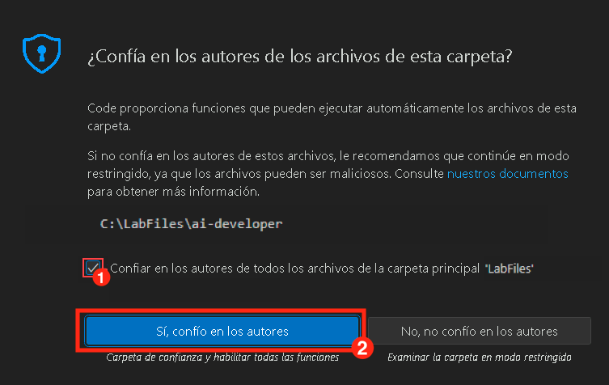
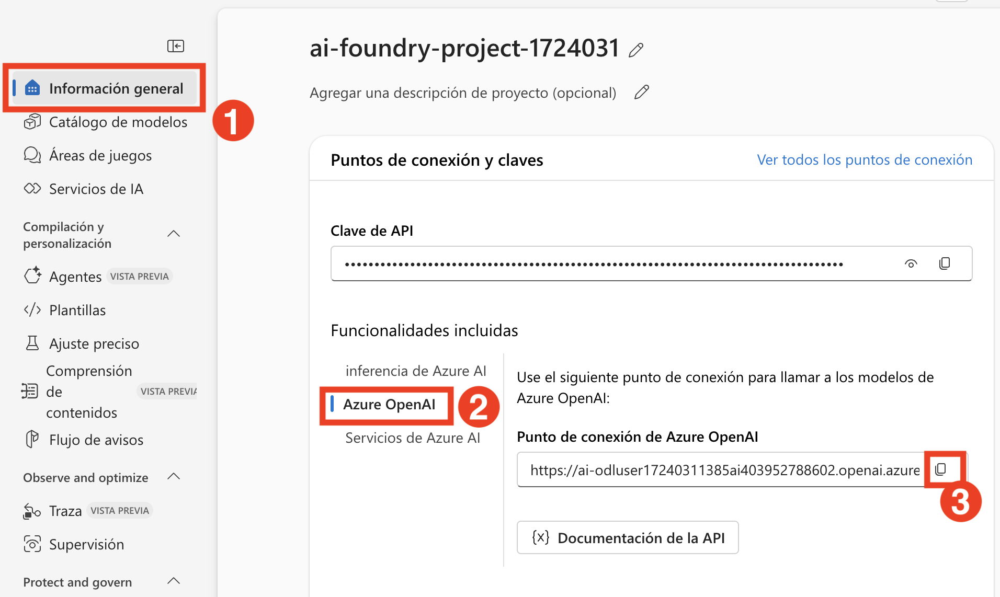
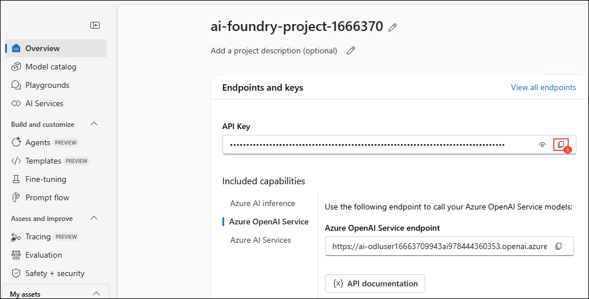
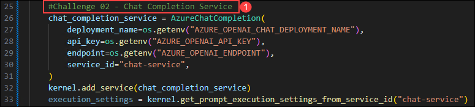

# 실습 4: Semantic Kernel 핵심

### 예상 소요 시간: 25분

이 실습은 Semantic Kernel과 Azure AI Foundry의 GPT-4o 모델을 활용한 실제 사례를 제공합니다. AI 개발이 처음인 사용자를 위해 설계된 이 실습은 스타터 애플리케이션 내에 지능형 채팅 기능을 구축하는 과정을 단계별로 안내합니다. Semantic Kernel 프레임워크를 사용하여 GPT-4o 모델과 연결하고, 사용자 프롬프트를 전송하는 채팅 API를 구현하며, 동적으로 생성된 AI 응답을 반환하는 기능을 만들어 보게 됩니다.

**참고:**
이 실습은 **C#** 및 **Python** 두 가지 언어로 구현되어 있습니다. **편한 언어를 선택하여 실습을 진행**하시면 되며, 핵심 개념은 동일합니다. 특정 언어에 대한 지침을 보려면 아래 방법을 따르세요:

- 언어 이름 옆의 **작은 화살표 아이콘**(▶)을 클릭하세요.
- 그러면 해당 언어의 단계별 지침이 표시됩니다.

원하는 언어를 선택하고 실습을 시작하세요!

## 목표

이 실습에서는 다음 과제를 수행하게 됩니다:

- 과제 1: 환경 변수 설정
- 과제 2: 코드 파일 업데이트 및 애플리케이션 실행

## 과제 1: 환경 변수 설정

이 과제에서는 Visual Studio Code를 설정하고, Azure OpenAI 자격 증명을 확인한 후, Python 및 C# 환경에 해당 값을 구성하면서 Azure AI Foundry의 다양한 플로우 유형을 살펴봅니다.

1. **Lab VM** 바탕화면에 있는 바로 가기를 통해 **Visual Studio Code**를 실행합니다.

1. 상단 메뉴에서 **File (1)** 을 클릭한 후 **Open Folder (2)** 를 선택합니다.

   

1. `C:\LabFiles\Day-3-Custom-RAG-and-Semantic-Kernel` (1) 경로로 이동하여 **Semantic-Kernel (2)** 폴더를 선택한 후 **Select Folder** 를 클릭합니다.

1. 만약 `Do you trust the authors of the files in folder`라는 경고 메시지가 표시된다면, 체크박스 (1)를 선택한 후 **Yes, I trust the authors (2)** 를 클릭합니다.

   

1. 브라우저의 새 탭을 열고 아래 링크를 통해 Azure AI Foundry 포털에 접속합니다.

   ```
   https://ai.azure.com/
   ```

1. 좌측 상단의 **Azure AI Foundry** 아이콘을 클릭합니다.

1. 실습 초반에 생성한 프로젝트 **ai-foundry-project-{suffix} (1)** 를 선택합니다.

1. **개요 (1)** 페이지에서 **Azure OpenAI (2)** 를 선택한 후, **Copy (3)** 를 클릭하여 **Endpoint** 값을 복사한 뒤 **메모장**에 붙여넣습니다. 이 값은 다음 실습에서 사용됩니다.

   

1. 동일한 포털에서 **API 키**를 복사하여 **메모장**에 붙여넣습니다. 이 값 또한 이후 실습에서 사용됩니다.

   

<details>
<summary><strong>Python</strong></summary>

1. `Python>src` 디렉터리로 이동한 후 **.env** (1) 파일을 엽니다.

   

1. 앞에서 복사한 **Azure OpenAI Service endpoint** 값을 `AZURE_OPENAI_ENDPOINT` 항목 옆에 붙여넣습니다.

   > 참고: `.env` 파일 내 모든 값은 반드시 **쌍따옴표(")** 로 감싸야 합니다.

1. 복사해둔 **API 키**를 `AZURE_OPENAI_API_KEY` 항목 옆에 붙여넣습니다.

   

1. 파일을 저장합니다.

</details>

<details>
<summary><strong>C Sharp(C#)</strong></summary>

1. `Dotnet>src>BlazorAI` 디렉터리로 이동한 다음 **appsettings.json (1)** 파일을 엽니다.

   

2. 앞에서 복사한 **Azure OpenAI Service endpoint** 값을 `AOI_ENDPOINT` 항목 옆에 붙여넣습니다.

   > **참고**: 모든 값은 반드시 **큰따옴표(")** 로 감싸야 합니다.
   > **참고**: endpoint 값의 끝에 있는 **"/" 문자는 제거** 해야 합니다.

3. 앞에서 복사한 **API 키** 값을 `AOI_API_KEY` 항목 옆에 붙여넣습니다.

   

4. 파일을 저장합니다.

</details>

## 과제 2: 코드를 수정하여 앱 실행하기

이 과제에서는 코드를 수정하고, Python 기반의 AI 애플리케이션을 실행한 후, 사용자 프롬프트에 대한 응답을 테스트하면서 Azure AI Foundry의 다양한 플로우 유형을 실습합니다.

<details>
<summary><strong>Python</strong></summary>

1. `Python>src` 디렉터리로 이동하여 **chat.py** 파일을 엽니다.

   

1. 파일 내 `#Import Modules` (1) 섹션에 아래 코드를 추가합니다:

   ```python
   from semantic_kernel.connectors.ai.chat_completion_client_base import ChatCompletionClientBase
   from semantic_kernel.connectors.ai.open_ai import OpenAIChatPromptExecutionSettings
   import os
   ```

   

1. `# Challenge 02 - Chat Completion Service` (1) 섹션에 다음 코드를 추가합니다:

   ```python
   chat_completion_service = AzureChatCompletion(
       deployment_name=os.getenv("AZURE_OPENAI_CHAT_DEPLOYMENT_NAME"),
       api_key=os.getenv("AZURE_OPENAI_API_KEY"),
       endpoint=os.getenv("AZURE_OPENAI_ENDPOINT"),
       service_id="chat-service",
   )
   kernel.add_service(chat_completion_service)
   execution_settings = kernel.get_prompt_execution_settings_from_service_id("chat-service")
   ```

   

1. `# Start Challenge 02 - Sending a message to the chat completion service by invoking kernel` 섹션에 아래 코드를 추가합니다:

   ```python
   global chat_history
   chat_history.add_user_message(user_input)
   chat_completion = kernel.get_service(type=ChatCompletionClientBase)
   execution_settings = kernel.get_prompt_execution_settings_from_service_id("chat-service")
   response = await chat_completion.get_chat_message_content(
       chat_history=chat_history,
       settings=execution_settings,
       kernel=kernel
   )
   chat_history.add_assistant_message(str(response))
   ```

   

1. `#return result` 섹션에 아래 코드를 추가합니다:

   ```python
   logger.info(f"Response: {response}")
   return response
   ```

   

1. 들여쓰기(Indentation) 오류가 발생할 경우, 아래 URL의 코드를 참조해 주세요:

   ```
   https://raw.githubusercontent.com/CloudLabsAI-Azure/ai-developer/refs/heads/prod/CodeBase/python/lab-02.py
   ```

1. 파일을 저장합니다.

1. 왼쪽 탐색기에서 `Python>src` 폴더를 **우클릭**한 후 **Open in Integrated Terminal** 을 선택합니다.

   

1. 아래 명령어를 사용하여 애플리케이션을 실행합니다:

   ```
   streamlit run app.py
   ```

1. 이메일 등록을 요청받을 경우, 아래 이메일을 입력한 후 **Enter** 를 누르세요:

    ```
    test@gmail.com
    ```

    

1. 앱이 자동으로 브라우저에서 열리지 않으면 아래 **URL**로 접속할 수 있습니다:

    ```
    http://localhost:8501
    ```

1. 아래 프롬프트를 입력하고 AI의 응답을 확인합니다:

    ```
    Why is the sky blue?
    ```
    ```
    Why is it red?
    ```

1. 아래와 비슷한 형태의 응답을 받을 수 있습니다:

    

</details>

<details>
<summary><strong>C Sharp(C#)</strong></summary>

1. `Dotnet>src>BlazorAI>Components>Pages` 디렉터리로 이동하여 **Chat.razor.cs (1)** 파일을 엽니다.

   

1. 파일에서 `// Your code goes here(Line no. 92)` (1) 주석이 있는 위치에 아래 코드를 추가합니다.

   ```csharp
   chatHistory.AddUserMessage(userMessage);
   var chatCompletionService = kernel.GetRequiredService<IChatCompletionService>();
   var assistantResponse = await chatCompletionService.GetChatMessageContentAsync(
       chatHistory: chatHistory,
       kernel: kernel);
   chatHistory.AddAssistantMessage(assistantResponse.Content);
   ```

   

1. `Dotnet>src>BlazorAI` 디렉터리로 이동하여 **appsettings.json** 파일을 엽니다.

1. 앞서 복사해둔 Azure OpenAI 서비스 엔드포인트를 "AOI_ENDPOINT" 항목 옆에 붙여넣습니다.

1. 앞서 복사해둔 API 키를 "AOI_API_KEY" 항목 옆에 붙여넣습니다.

1. 들여쓰기 오류가 발생하는 경우, 아래 URL의 코드를 참조하세요:

   ```
   https://raw.githubusercontent.com/CloudLabsAI-Azure/ai-developer/refs/heads/prod/CodeBase/c%23/lab-02.cs
   ```

1. 파일을 저장합니다.

1. 왼쪽 패널에서 `Dotnet>src>Aspire>Aspire.AppHost` 폴더를 마우스 오른쪽 버튼으로 클릭하고 **Open in Integrated Terminal** 을 선택합니다.

   

1. 다음 명령어를 실행하여 로컬에서 앱을 실행하는 데 필요한 개발 인증서를 신뢰합니다. 실행 후 **Yes** 를 선택하세요:

   ```
   dotnet dev-certs https --trust
   ```

   

1. 다음 명령어를 사용하여 앱을 실행합니다:

   ```
   dotnet run
   ```

1. 브라우저의 새 탭을 열고 **blazor-aichat** 애플리케이션 링크인 **[https://localhost:7118/](https://localhost:7118/)** 로 이동합니다.

   > **참고**: 브라우저에서 보안 경고가 표시되는 경우, 브라우저를 닫고 다시 해당 링크로 이동하세요.

1. 다음 프롬프트를 입력하여 AI의 응답을 확인합니다:

    ```
    Why is the sky blue?
    ```
    ```
    Why is it red?
    ```

1. 아래와 유사한 응답을 받게 됩니다:

    

</details>

## 복습

이번 실습에서는 **Semantic Kernel**과 **Azure AI Foundry GPT-4o 모델**을 결합하여 지능형 챗 기능을 스타터 애플리케이션에 구축했습니다. Semantic Kernel 프레임워크를 GPT-4o와 통합하고, 사용자 프롬프트를 처리하는 챗 API를 구현하여 동적인 AI 생성 응답을 반환했습니다. 이를 통해 현대적인 AI 개발 프레임워크를 활용하여 애플리케이션을 강력한 언어 모델에 연결하는 역량을 향상시킬 수 있었습니다.

 **Semantic Kernel**과 **Azure AI Foundry GPT-4o**를 이용한 AI 기반 챗 구현 과제를 성공적으로 완료했습니다:

- **Semantic Kernel**을 **GPT-4o**와 통합하여 지능형 AI 상호작용 구현
- 사용자 프롬프트를 처리하고 AI 기반 응답을 생성하는 **챗 API 구성**
- **Azure AI Search**를 연동하여 챗봇 기능을 확장하고 문맥 기반 데이터 검색 기능 추가

### 탐색 메뉴를 클릭하여 다음 실습으로 이동하세요.