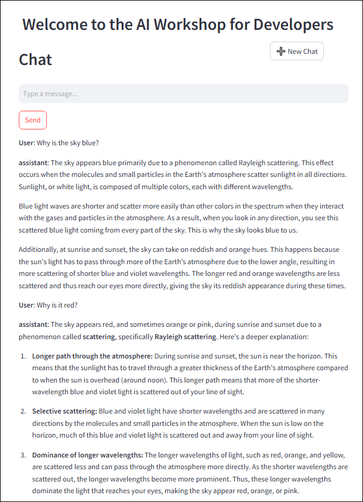

# 練習 4：Semantic Kernel 基礎

### 預估時間：25 分鐘

這個實驗實驗提供您使用 Semantic Kernel 與 Azure AI Foundry GPT-4o 模型的實務經驗。此實驗專為 AI 開發新手設計，將引導您一步步在起始應用程式中建立智慧聊天功能。您將使用 Semantic Kernel 框架連接 GPT-4o 模型，實驗一個聊天 API，傳送使用者 Prompt 並回傳由 AI 動態生成的回應。

**注意**：本實驗提供 **C#** 與 **Python** 兩種語言版本。您可以選擇 **自己熟悉的語言**來進行練習 - 核心概念皆相同。若要查看特定語言的操作說明：
- 點擊語言名稱旁的 **小箭頭圖示** (▶)。
- 即可展開該語言的逐步操作說明。

請選擇您偏好的語言並開始操作！

## 實驗目標
在本次練習中，您將完成以下任務：
- 任務 1：設定環境變數
- 任務 2：更新程式碼檔案並執行應用程式

## 任務 1：設定環境變數

在此任務中，您將透過設定 Visual Studio Code、擷取 Azure OpenAI 認證資訊，並在 Python 與 C# 環境中進行設定，來探索 Azure AI Foundry 中不同的流程類型（flow types）。

1. 從 **labvm** 桌面捷徑開啟 **Visual Studio code**。
2. 點選 **File** **(1)**，然後選擇 **Open Folder** **(2)**。

    

3. 導航至 `C:\LabFiles\Day-3-Custom-RAG-and-Semantic-Kernel` **(1)**，選取 **Semantic-Kernel** **(2)** 資料夾，然後點擊 **Select Folder**。

4. 如果出現 `您信任此資料夾中文件的作者嗎？` 的警告訊息，請勾選 **信任方塊** **(1)**，然後點擊 **是的，我相信作者** **(2)**。

    

5. 在瀏覽器中開啟新分頁，並使用以下連結前往 Azure AI Foundry 入口網站：

   ```
    https://ai.azure.com/
   ```

6. 點擊左上角的 **Azure AI Foundry** 圖示。
7. 選擇您先前在實驗中建立的 AI Foundry 專案，例如 **ai-foundry-project-{suffix}** **(1)**。
8. 在 **概觀** **(1)** 頁面中，選擇  **Azure OpenAI 服務** **(2)**，然後點擊  **複製** **(3)** 圖示以複製 endpoint，並貼到 **Notepad** 中，因為接下來的練習會用到。

    

9. 從 AI Foundry Portal 複製 API 金鑰，並貼到 **Notepad** 中，因為接下來的練習也會用到。    

    

<details>
<summary><strong>Python</strong></summary>

1. 導航至 `Python>src` 目錄並開啟 **.env** (1) 檔案。

    

2. 將您先前在練習中複製的 **Azure OpenAI Service endpoint** 貼到 `AZURE_OPENAI_ENDPOINT` 的等號右側。
    
    >**注意**：請確保 **.env** 檔案中的每個值都用 **雙引號（"）** 包住。

3. 將您先前複製的 **API key** 貼到 `AZURE_OPENAI_API_KEY` 的等號右側。

    

4. 儲存檔案。

</details>

<details>
<summary><strong>C Sharp(C#)</strong></summary>

1. 導航至 `Dotnet>src>BlazorAI` 目錄並開啟 **appsettings.json** **(1)** 檔案。

    

2. 將您先前在練習中複製的 **Azure OpenAI Service endpoint** 貼到 `AOI_ENDPOINT` 的等號右側。

    >**Note**:- 請確保 **appsettings.json** 檔案中的每個值都用 **雙引號 (")**包住。

    >**Note**:- 請確保移除endpoint 結尾的 /，以避免連線錯誤。

3. 將您先前複製的 **API key** 貼到 `AOI_API_KEY` 的等號右側。

    

4. 儲存檔案。

</details>

## 任務 2：更新程式碼檔案並執行應用程式

在此任務中，您將透過更新程式碼檔案，在 Python 與 C# 中執行 AI 驅動的應用程式，並測試使用者 Prompt 的回應，來探索 Azure AI Foundry 中不同的流程類型。

<details>
<summary><strong>Python</strong></summary>

1. 導航至 `Python>src` 目錄並開啟 **chat.py** **(1)** 檔案。

    

2. 在檔案中的 `#Import Modules` **(1)** 區段加入以下程式碼：

    ```
    from semantic_kernel.connectors.ai.chat_completion_client_base import ChatCompletionClientBase
    from semantic_kernel.connectors.ai.open_ai import OpenAIChatPromptExecutionSettings
    import os
    ```

    

3. 在 `# Challenge 02 - Chat Completion Service` **(1)** 區段加入以下程式碼：

    ```
    chat_completion_service = AzureChatCompletion(
        deployment_name=os.getenv("AZURE_OPENAI_CHAT_DEPLOYMENT_NAME"),
        api_key=os.getenv("AZURE_OPENAI_API_KEY"),
        endpoint=os.getenv("AZURE_OPENAI_ENDPOINT"),
        service_id="chat-service",
    )
    kernel.add_service(chat_completion_service)
    execution_settings = kernel.get_prompt_execution_settings_from_service_id("chat-service")
    ```

    

4. 在 `# Start Challenge 02 - Sending a message to the chat completion service by invoking kernel` **(1)** 區段加入以下程式碼：

    ```
    global chat_history
    chat_history.add_user_message(user_input)
    chat_completion = kernel.get_service(type=ChatCompletionClientBase)
    execution_settings = kernel.get_prompt_execution_settings_from_service_id("chat-service")
    response = await chat_completion.get_chat_message_content(
        chat_history=chat_history,
        settings=execution_settings,
        kernel=kernel
    )
    chat_history.add_assistant_message(str(response))
    ```

    

5. 在 `#return result` **(1)** 區段加入以下程式碼：

    ```
    logger.info(f"Response: {response}")
    return response
    ```

    

6. 如果您遇到縮排錯誤，請使用以下網址中的程式碼：

    ```
    https://raw.githubusercontent.com/CloudLabsAI-Azure/ai-developer/refs/heads/prod/CodeBase/python/lab-02.py
    ```

7. 儲存檔案。
8. 在左側面板中，右鍵點選 `Python>src` **(1)**，然後選擇 **Open in Integrated Terminal** **(2)**。

    

9. 使用以下指令來執行應用程式：

    ```
    streamlit run app.py
    ```

10. 如果系統要求您輸入註冊用的電子郵件，您可以使用下方提供的電子郵件，然後按下 **Enter** **(1)**：

    ```
    test@gmail.com
    ```

    

11. 如果應用程式未自動在瀏覽器中開啟，您可以使用以下 **URL** 存取：

    ```
    http://localhost:8501
    ```

12. 輸入以下 Prompt，觀察 AI 的回應：

    ```
    Why is the sky blue?
    ```
    ```
    Why is it red?
    ```

13. 您將會收到類似下方所示的回應：

    

</details>

<details>
<summary><strong>C Sharp(C#)</strong></summary>

1. 導航至 `Dotnet>src>BlazorAI>Components>Pages` 目錄並開啟 **Chat.razor.cs** **(1)** 檔案。

    

2. 在 `// Your code goes here` **(1)**  (在第 92 行) 區段加入以下程式碼。

    ```
    chatHistory.AddUserMessage(userMessage);
    var chatCompletionService = kernel.GetRequiredService<IChatCompletionService>();
    var assistantResponse = await chatCompletionService.GetChatMessageContentAsync(
        chatHistory: chatHistory,
        kernel: kernel);
    chatHistory.AddAssistantMessage(assistantResponse.Content);
    ```

    

3. 如果您遇到縮排錯誤，請使用以下網址中的程式碼：

    ```
    https://raw.githubusercontent.com/CloudLabsAI-Azure/ai-developer/refs/heads/prod/CodeBase/c%23/lab-02.cs
    ```

4. 儲存檔案。
5. 在左側面板中，右鍵點選 `Dotnet>src>Aspire>Aspire.AppHost` **(1)**，然後選擇 **Open in Integrated Terminal** **(2)**。

    

6. 請執行以下程式碼行，以信任本機執行應用程式所需的 dev-certificates，然後點選 **是的** **(1)**：

    ```
    dotnet dev-certs https --trust
    ```

    

7. 使用以下指令來執行應用程式：

    ```
    dotnet run
    ```

8. 在瀏覽器中開啟一個新分頁，並前往 **blazor-aichat** 的連結，即：  **`https://localhost:7118/`**。

    >**注意**：如果您在瀏覽器中看到安全性警告，請關閉瀏覽器後重新開啟並再次點擊該連結。

9. 輸入以下 Prompt，觀察 AI 的回應：

    ```
    Why is the sky blue?
    ```
    ```
    Why is it red?
    ```

10. 您將會收到類似下方所示的回應：

    

</details>

## 回顧

在本次練習中，我們結合使用 **Semantic Kernel** 與 **Azure AI Foundry GPT-4o model**，在起始應用程式中建構了一個智慧聊天功能。我們將 **Semantic Kernel** 框架整合至 GPT-4o，實驗了一個處理使用者 Prompt 的 chat API，並回傳由 AI 動態生成的回應。這項實驗強化了我們使用現代 AI 開發框架，將應用程式連接至強大語言模型的能力。

成功完成以下任務，以實現基於 **Semantic Kernel** 與 **Azure AI Foundry GPT-4o** 的 AI 聊天功能：

- 將 **Semantic Kernel** 與 **GPT-4o** 整合，實現智慧 AI 互動。
- 設定 **chat API**，用於處理使用者 Prompt 並產生 AI 回應。
- 透過整合 **Azure AI Search** 擴充聊天機器人的功能，以進行情境式資料檢索。


### 恭喜！您已成功完成本次實驗課程！
### 請點選導覽連結，以繼續進行下一個實驗課程。