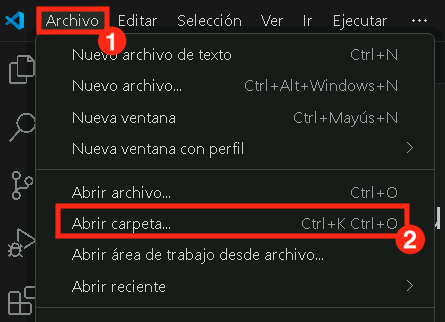

# Exercício 4: Fundamentos do Semantic Kernel

### Duração Estimada: 25 minutos

Este laboratório prático oferece uma experiência com o Semantic Kernel e o modelo GPT-4o do Azure AI Foundry. Projetado para iniciantes no desenvolvimento com IA, o laboratório orienta você passo a passo para construir um recurso de chat inteligente dentro de um aplicativo inicial. Você usará o framework Semantic Kernel para se conectar ao modelo GPT-4o, implementar uma API de chat que envia perguntas do usuário e retorna respostas dinâmicas geradas por IA.

**Nota:** Este laboratório está disponível tanto em **C#** quanto em **Python**. Você pode realizar os exercícios **na linguagem com a qual se sentir mais confortável** — os conceitos principais são os mesmos. Para visualizar as instruções de uma linguagem específica:

- Clique no pequeno **ícone de seta** (▶) ao lado do nome da linguagem.
- Isso revelará as instruções passo a passo para aquela linguagem.

Escolha sua linguagem preferida e comece!

## Objetivos

Neste exercício, você irá realizar as seguintes tarefas:

- Tarefa 1: Configurar variáveis de ambiente
- Tarefa 2: Atualizar os arquivos de código e executar o aplicativo

## Tarefa 1: Configurar variáveis de ambiente

Nesta tarefa, você irá explorar diferentes tipos de fluxo no Azure AI Foundry, configurando o Visual Studio Code, recuperando as credenciais do Azure OpenAI e configurando-as nos ambientes Python e C#.

1. Abra o **Visual Studio Code** pelo atalho na área de trabalho da máquina virtual do laboratório.

2. Clique em **Arquivo (File) (1)** e selecione **Abrir Pasta (Open Folder) (2)**.

   

3. Navegue até `C:\LabFiles\Day-3-Custom-RAG-and-Semantic-Kernel` (1) e selecione a pasta **Semantic-Kernel ()2** e clique em **Selecionar Pasta (Select Folder)**.

4. Se aparecer o aviso `Você confia nos autores dos arquivos nesta pasta?`, marque a caixa (1) e clique em **Sim, confio nos autores (2)** .

   

5. Abra uma nova aba no navegador e acesse o portal do Azure AI Foundry pelo link abaixo:

   ```
   https://ai.azure.com/
   ```

6. Clique no ícone do **Azure AI Foundry** no canto superior esquerdo.

7. Selecione o projeto criado anteriormente **ai-foundry-project-{suffix} (1)**.

8. Na página **Overview (1)**, selecione **Azure OpenAI Service (2)** e clique em **Copiar (3)** para copiar o *endpoint*. Cole no **Bloco de Notas**, pois será usado nas próximas etapas.

   

9. Copie também a API key do portal AI Foundry e cole no **Bloco de Notas**, pois ela será utilizada posteriormente em outras etapas.

   

<details>
<summary><strong>Python</strong></summary>

1. Navegue até o diretório `Python>src` e abra o arquivo **.env** (1).

   

2. Cole o **endpoint do Azure OpenAI** ao lado de `AZURE_OPENAI_ENDPOINT`.

   > Nota: Certifique-se de que todos os valores estejam entre **aspas duplas ("")**.

3. Cole a **API key** ao lado de `AZURE_OPENAI_API_KEY`.

   

4. Salve o arquivo.

</details>


<details>
<summary><strong>C Sharp (C#)</strong></summary>

1. Navegue até `Dotnet>src>BlazorAI` e abra o arquivo **appsettings.json (1)**.

   

2. Cole o **endpoint do Azure OpenAI** ao lado de `AOI_ENDPOINT`.

   > **Nota:** Remova a **barra final ("/")** do endpoint e coloque tudo entre aspas duplas.

3. Cole a **API key** ao lado de `AOI_API_KEY`.

   

4. Salve o arquivo.

</details>


## Tarefa 2: Atualizar os arquivos de código e executar o aplicativo

Nesta tarefa, você irá explorar diferentes fluxos no Azure AI Foundry atualizando os arquivos de código, executando o app com IA em Python e C#, e testando as respostas da IA a perguntas do usuário.

<details>
<summary><strong>Python</strong></summary>

1. Navegue até `Python>src` e abra o arquivo **chat.py**.

   

2. Adicione os seguintes imports na seção `#Import Modules` (1):

   ```python
   from semantic_kernel.connectors.ai.chat_completion_client_base import ChatCompletionClientBase
   from semantic_kernel.connectors.ai.open_ai import OpenAIChatPromptExecutionSettings
   import os
   ```

    

3. Adicione o seguinte na seção `# Challenge 02 - Chat Completion Service` (1):

   ```python
   chat_completion_service = AzureChatCompletion(
       deployment_name=os.getenv("AZURE_OPENAI_CHAT_DEPLOYMENT_NAME"),
       api_key=os.getenv("AZURE_OPENAI_API_KEY"),
       endpoint=os.getenv("AZURE_OPENAI_ENDPOINT"),
       service_id="chat-service",
   )
   kernel.add_service(chat_completion_service)
   execution_settings = kernel.get_prompt_execution_settings_from_service_id("chat-service")
   ```

    

4. Adicione o seguinte na seção `# Start Challenge 02 - Sending a message to the chat completion service by invoking kernel` do arquivo:

   ```python
   global chat_history
   chat_history.add_user_message(user_input)
   chat_completion = kernel.get_service(type=ChatCompletionClientBase)
   execution_settings = kernel.get_prompt_execution_settings_from_service_id("chat-service")
   response = await chat_completion.get_chat_message_content(
       chat_history=chat_history,
       settings=execution_settings,
       kernel=kernel
   )
   chat_history.add_assistant_message(str(response))
   ```

    

5. Adicione o seguinte na seção `#return result`:

   ```python
   logger.info(f"Response: {response}")
   return response
   ```

    

6. Se encontrar erros de indentação, use o código de referência:

   ```
   https://raw.githubusercontent.com/CloudLabsAI-Azure/ai-developer/refs/heads/prod/CodeBase/python/lab-02.py
   ```

7. Salve o arquivo.

8. Clique com o botão direito em `Python>src` e selecione **Abrir no Terminal Integrado**.

   

9. Rode o app com:

   ```bash
   streamlit run app.py
   ```

10. Se for solicitado um e-mail, use:

    ```
    test@gmail.com
    ```

    

11. Se o app não abrir automaticamente, acesse:

    ```
    http://localhost:8501
    ```

12. Envie os prompts e veja as respostas da IA:

    ```
    Why is the sky blue?
    ```
    ```
    Why is it red?
    ```

    

</details>

<details>
<summary><strong>C Sharp (C#)</strong></summary>

1. Navegue até `Dotnet>src>BlazorAI>Components>Pages` e abra o arquivo **Chat.razor.cs (1)**.

   

2. Adicione o seguinte no local indicado (`// Your code goes here(Line no. 92)`):

   ```csharp
   chatHistory.AddUserMessage(userMessage);
   var chatCompletionService = kernel.GetRequiredService<IChatCompletionService>();
   var assistantResponse = await chatCompletionService.GetChatMessageContentAsync(
       chatHistory: chatHistory,
       kernel: kernel);
   chatHistory.AddAssistantMessage(assistantResponse.Content);
   ```

3. Se houver erro de indentação, use o código de referência:

   ```
   https://raw.githubusercontent.com/CloudLabsAI-Azure/ai-developer/refs/heads/prod/CodeBase/c%23/lab-02.cs
   ```

4. Salve o arquivo.

5. Clique com o botão direito em `Dotnet>src>Aspire>Aspire.AppHost` e selecione **Abrir no Terminal Integrado**.

   

6. Execute o comando abaixo para confiar nos certificados:

   ```bash
   dotnet dev-certs https --trust
   ```

    

7. Execute o aplicativo:

   ```bash
   dotnet run
   ```

8. Acesse no navegador e navegue para o link do **blazor-aichat**, ou seja **https://localhost:7118/**

   >**Nota**: Caso veja alertas de segurança, feche e tente novamente.

9. Teste com os prompts:

   ```
   Why is the sky blue?
   ```
   ```
   Why is it red?
   ```

10. Você irá receber uma resposta similar à essa mostrada abaixo:   

   

</details>

---

## Revisão

Neste exercício, utilizamos o **Semantic Kernel** em combinação com o **modelo GPT-4o do Azure AI Foundry** para construir um recurso de chat inteligente dentro de uma aplicação inicial. Integramos o framework Semantic Kernel com o GPT-4o, implementamos uma API de chat para lidar com as solicitações dos usuários e retornamos respostas dinâmicas geradas por IA. Isso aprimorou nossa proficiência em conectar aplicações a modelos de linguagem avançados usando frameworks modernos de desenvolvimento em IA.

Tarefas concluídas com sucesso para a implementação de chat com IA utilizando o **Semantic Kernel** e o **Azure AI Foundry GPT-4o**:

- Integração do **Semantic Kernel** com o **GPT-4o** para interações inteligentes com IA.
- Configuração de uma **API de chat** para processar solicitações dos usuários e gerar respostas com IA.
- Expansão da funcionalidade do chatbot com a integração do **Azure AI Search** para recuperação contextual de dados.


## Clique na navegação para ir ao próximo laboratório.
