# 练习 5：Semantic Kernel 插件

### 预计时长：50 分钟

本动手实验探索了插件在使用 Semantic Kernel 增强 LLM 开发中的作用。本实验专为 AI 扩展性新手设计，将指导您构建和集成插件以扩展聊天机器人的功能。您将实现一个时间插件和一个天气检索插件，使您的 AI 能够访问其训练范围之外的实时和上下文数据。此外，您还将学习如何用 Python 开发 Semantic Kernel 插件并利用自动函数调用将它们无缝链接在一起。

**注意：**- 本实验同时提供 **C#** 和 **Python** 两种实现。您可以使用**任何您熟悉的语言**进行练习—核心概念保持不变。要查看特定语言的说明：
- 点击语言名称旁边的小**箭头图标** (▶)。
- 这将显示该语言的逐步说明。

选择您喜欢的语言并开始吧！

## 目标
在本练习中，您将完成以下任务：
- 任务 1：尝试不带时间插件的应用程序
- 任务 2：创建和导入时间插件
- 任务 3：创建和导入地理编码插件
- 任务 4：创建和导入天气插件

## 任务 1：尝试不带时间插件的应用程序

在本任务中，您将通过运行不带时间插件的应用程序来观察其默认行为，从而探索 Azure AI Foundry 中的不同流类型。

1. 在任何语言中启动您的 AI 聊天应用程序，并提交以下提示：
1. Start your AI chat application in any language and submit the following prompt:

    **英文：**
    ```
    What time is it?
    ```
    **中文：**
    ```
    现在几点了？
    ```

2. 由于 AI 没有提供实时信息的能力，您将收到类似以下的响应：
2. Since the AI doesn't have the capability to provide real-time information, you'll receive a response similar to:

    **英文：**
    ```
    I can't provide real-time information, including the current time. You can check the time on your device or through various online sources.
    ```
    **中文：**
    ```
    我无法提供实时信息，包括当前时间。您可以在您的设备上或通过各种在线源查看时间。
    ```

    

## 任务 2：创建和导入时间插件

在本任务中，您将通过创建和导入时间插件来增强应用程序的功能，从而探索 Azure AI Foundry 中的不同流类型。

<details>
<summary><strong>Python</strong></summary>

1. 导航到 `Python>src>plugins` 目录并创建一个名为 **time_plugin.py (1)** 的新文件。

    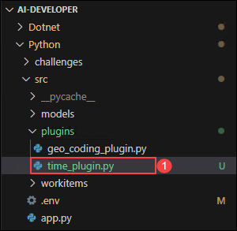
1. 在文件中添加以下代码：

    ```
    from datetime import datetime
    from typing import Annotated
    from semantic_kernel.functions import kernel_function

    class TimePlugin:
        @kernel_function()
        def current_time(self) -> str:
            return datetime.now().strftime("%Y-%m-%d %H:%M:%S")

        @kernel_function()
        def get_year(self, date_str: Annotated[str, "The date string in format YYYY-MM-DD"] = None) -> str:
            if date_str is None:
                return str(datetime.now().year)
            
            try:
                date_obj = datetime.strptime(date_str, "%Y-%m-%d")
                return str(date_obj.year)
            except ValueError:
                return "Invalid date format. Please use YYYY-MM-DD."

        @kernel_function()
        def get_month(self, date_str: Annotated[str, "The date string in format YYYY-MM-DD"] = None) -> str:
            if date_str is None:
                return datetime.now().strftime("%B")
            
            try:
                date_obj = datetime.strptime(date_str, "%Y-%m-%d")
                return date_obj.strftime("%B")  # Full month name
            except ValueError:
                return "Invalid date format. Please use YYYY-MM-DD."

        @kernel_function()
        def get_day_of_week(self, date_str: Annotated[str, "The date string in format YYYY-MM-DD"] = None) -> str:
            if date_str is None:
                return datetime.now().strftime("%A")
            
            try:
                date_obj = datetime.strptime(date_str, "%Y-%m-%d")
                return date_obj.strftime("%A")  # Full weekday name
            except ValueError:
                return "Invalid date format. Please use YYYY-MM-DD."
    ```
1. 保存文件。
1. 导航到 `Python>src` 目录并打开 **chat.py** 文件。

    
1. 在文件的 `#Import Modules` 部分添加以下代码。
    ```
    from semantic_kernel.connectors.ai.open_ai.prompt_execution_settings.azure_chat_prompt_execution_settings import (
        AzureChatPromptExecutionSettings,
    )
    from plugins.time_plugin import TimePlugin
    ```
    
    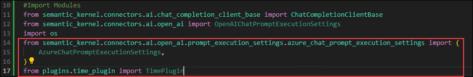
1. 在文件的 `#Challenge 03 - Create Prompt Execution Settings` 部分添加以下代码。
    ```
    execution_settings = AzureChatPromptExecutionSettings()
    execution_settings.function_choice_behavior = FunctionChoiceBehavior.Auto()
    logger.info("Automatic function calling enabled")
    ```

    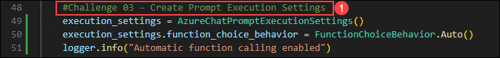
1. 在文件的 `# Placeholder for Time plugin` 部分添加以下代码。
    ```
    time_plugin = TimePlugin()
    kernel.add_plugin(time_plugin, plugin_name="TimePlugin")
    logger.info("Time plugin loaded")
    ```

    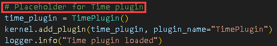

1. 搜索（使用 Ctrl+F）并删除以下代码块，因为我们将启用自动函数调用，不再需要它：
    ```
    execution_settings = kernel.get_prompt_execution_settings_from_service_id("chat-service")
    ```
    >**注意**：您需要从两个代码块中删除它，一个在 **def initialize_kernel():** 函数内，另一个在 **global chat_history** 代码块中。
1. 如果遇到任何缩进错误，请使用以下 URL 中的代码：
    ```
    https://raw.githubusercontent.com/CloudLabsAI-Azure/ai-developer/refs/heads/prod/CodeBase/python/lab-03_time_plugin.py
    ```
1. 保存文件。
1. 右键点击左侧窗格中的 `Python>src` 并选择 **在集成终端中打开**。

    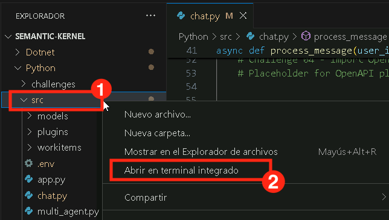
1. 使用以下命令运行应用程序：
    ```
    streamlit run app.py
    ```
1. 如果应用程序没有在浏览器中自动打开，您可以使用以下 **URL** 访问：
    ```
    http://localhost:8501
    ```
1. 提交以下提示：

    **英文**
    ```
    What time is it?
    ```

    **中文**
    ```
    现在几点了？
    ```

1. 由于 AI 现在有了 **时间插件**，它将能够提供实时信息，您将收到类似以下的响应：

    **英文**
    ```
    The current time is 3:43 PM on January 23, 2025.
    ```

    **中文**
    ```
    现在是2025年1月23日下午3:43。
    ```

    
</details>

<details>
<summary><strong>C Sharp(C#)</strong></summary>

1. 导航到 `Dotnet>src>BlazorAI>Plugins` 目录并创建一个名为 **TimePlugin.cs** 的新文件。

    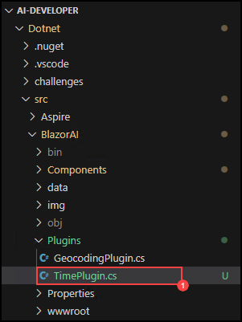
1. 在文件中添加以下代码：
    ```
    using System;
    using System.ComponentModel;
    using System.Globalization;
    using Microsoft.SemanticKernel;

    namespace BlazorAI.Plugins
    {
        public class TimePlugin
        {        
            [KernelFunction("current_time")]
            [Description("Gets the current date and time from the server. Use this directly when the user asks what time it is or wants to know the current date.")]
            public string CurrentTime()
            {
                return DateTime.Now.ToString("yyyy-MM-dd HH:mm:ss");
            }

            [KernelFunction("get_current_time")]
            [Description("Gets the current date and time from the server's system clock. Use this directly without asking the user for their location.")]
            public string GetCurrentTime()
            {
                return DateTime.Now.ToString("yyyy-MM-dd HH:mm:ss");
            }
            
            [KernelFunction("get_year")]
            [Description("Extract the year from a date string or get the current year from the system clock. Examples: 'What year is it now?' or 'What year is 2023-05-15?'")]
            public string GetYear(
                [Description("The date string. Accepts formats like YYYY-MM-DD, MM/DD/YYYY, etc. If not provided, uses the server's current date.")] 
                string? dateStr = null)
            {
                if (string.IsNullOrEmpty(dateStr))
                {
                    return DateTime.Now.Year.ToString();
                }

                DateTime date;
                if (TryParseDate(dateStr, out date))
                {
                    return date.Year.ToString();
                }
                
                return $"Could not parse '{dateStr}' as a valid date. Please provide a date in a standard format like YYYY-MM-DD or MM/DD/YYYY.";
            }
            
            [KernelFunction("get_month")]
            [Description("Extract the month name from a date string or get the current month from the system clock. Examples: 'What month is it now?' or 'What month is 2023-05-15?'")]
            public string GetMonth(
                [Description("The date string. Accepts formats like YYYY-MM-DD, MM/DD/YYYY, etc. If not provided, uses the server's current date.")] 
                string? dateStr = null)
            {
                if (string.IsNullOrEmpty(dateStr))
                {
                    return DateTime.Now.ToString("MMMM");
                }
                
                DateTime date;
                if (TryParseDate(dateStr, out date))
                {
                    return date.ToString("MMMM"); // Full month name
                }
                
                return $"Could not parse '{dateStr}' as a valid date. Please provide a date in a standard format like YYYY-MM-DD or MM/DD/YYYY.";
            }
            
            [KernelFunction("get_day_of_week")]
            [Description("Get the day of week from the server's system clock or for a specific date. Examples: 'What day is it today?' or 'What day of the week is 2023-05-15?'")]
            public string GetDayOfWeek(
                [Description("The date string. Accepts formats like YYYY-MM-DD, MM/DD/YYYY, etc. If not provided, uses the server's current date.")] 
                string? dateStr = null)
            {
                if (string.IsNullOrEmpty(dateStr))
                {
                    return DateTime.Now.ToString("dddd");
                }
                
                DateTime date;
                if (TryParseDate(dateStr, out date))
                {
                    return date.ToString("dddd"); // Full day name
                }
                
                return $"Could not parse '{dateStr}' as a valid date. Please provide a date in a standard format like YYYY-MM-DD or MM/DD/YYYY.";
            }

            private bool TryParseDate(string dateStr, out DateTime result)
            {
                string[] formats = { 
                    "yyyy-MM-dd", "MM/dd/yyyy", "dd/MM/yyyy", 
                    "M/d/yyyy", "d/M/yyyy", "MMM d, yyyy", 
                    "MMMM d, yyyy", "yyyy/MM/dd", "dd-MMM-yyyy"
                };
                
                return DateTime.TryParseExact(
                    dateStr, 
                    formats, 
                    CultureInfo.InvariantCulture,
                    DateTimeStyles.None, 
                    out result) || DateTime.TryParse(dateStr, out result);
            }
        }
    }
    ```
1. 保存文件。
1. 导航到 `Dotnet>src>BlazorAI>Components>Pages` 目录并打开 **Chat.razor.cs** 文件。

    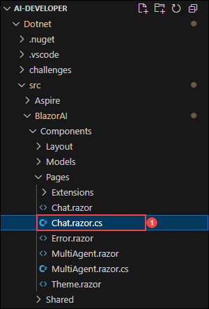
1. 在文件的 `// Import Models` 部分添加以下代码。
    ```
    using Microsoft.SemanticKernel.Connectors.OpenAI;
    using BlazorAI.Plugins;
    using System;
    ```

    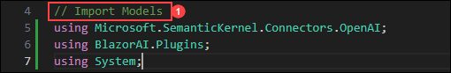
1. 搜索 **private Kernel? kernel;**（使用 Ctrl+F）并在其下方添加以下代码：
    ```
    private OpenAIPromptExecutionSettings? promptSettings;
    ```

    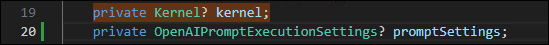
1. 搜索 **chatHistory = [];**（使用 Ctrl+F）并用以下代码更新该行：
    ```
    chatHistory = new ChatHistory();
    ```

    
1. 在文件的 `// Challenge 03 - Create OpenAIPromptExecutionSettings` (1) 部分添加以下代码。
    ```
    promptSettings = new OpenAIPromptExecutionSettings
    {
        ToolCallBehavior = ToolCallBehavior.AutoInvokeKernelFunctions,
        Temperature = 0.7,
        TopP = 0.95,
        MaxTokens = 800
    };
    ```

    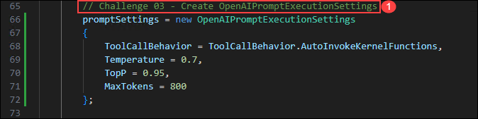
1. 在文件的 `// Challenge 03 - Add Time Plugin` 部分添加以下代码。
    ```
    var timePlugin = new Plugins.TimePlugin();
    kernel.ImportPluginFromObject(timePlugin, "TimePlugin");
    ```

    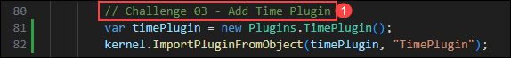
1. 搜索 **var assistantResponse = await chatCompletionService.GetChatMessageContentAsync**（使用 Ctrl+F）并在 chatHistory 和 kernel 之间添加以下代码行：
    ```
    executionSettings: promptSettings,
    ```
    >**注意**：最终的代码片段将类似于以下代码：
    ```
    var assistantResponse = await chatCompletionService.GetChatMessageContentAsync(
        chatHistory: chatHistory,
        executionSettings: promptSettings,
        kernel: kernel);
    ```
    
    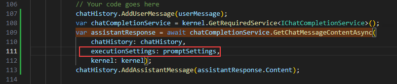
1. 如果遇到任何缩进错误，请使用以下 URL 中的代码：
    ```
    https://raw.githubusercontent.com/CloudLabsAI-Azure/ai-developer/refs/heads/prod/CodeBase/c%23/lab-03_time_plugin.cs
    ```
1. 保存文件。
1. 右键点击左侧窗格中的 `Dotnet>src>Aspire>Aspire.AppHost` 并选择 **在集成终端中打开**。

    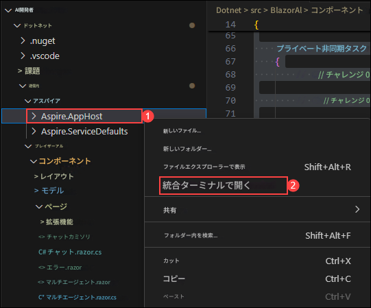
1. 使用以下命令运行应用程序：
    ```
    dotnet run
    ```
1. 在浏览器中打开新标签页并导航到 **blazor-aichat** 的链接，即 **https://localhost:7118/**。
1. 提交以下提示：

    **英文**
    ```
    What time is it?
    ```

    **中文**
    ```
    现在几点了？
    ```
1. 由于 AI 现在有了 **时间插件**，它将能够提供实时信息，您将收到类似以下的响应：

    **英文**
    ```
    The current time is 3:43 PM on January 23, 2025.
    ```

    **中文**
    ```
    现在是2025年1月23日下午3:43。
    ```

    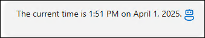
</details> 

## 任务 3：创建和导入地理编码插件

在本任务中，您将通过创建和导入地理编码插件来启用基于位置的功能，从而探索 Azure AI Foundry 中的不同流类型。

1. 在浏览器中打开新标签页，导航到 [Geocoding API](https://geocode.maps.co/) 门户并点击顶部的 **Get API key** 按钮。

    
1. 输入您的详细信息并点击 **创建账户 (1)**。

    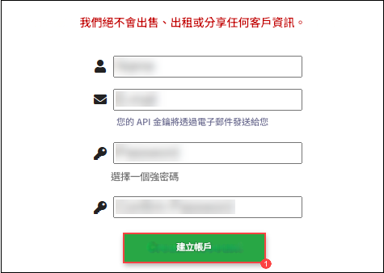
    >**注意**：使用您的个人或工作电子邮件 ID 注册。
1. 您将收到一封电子邮件，点击电子邮件中的链接以验证您的电子邮件。
1. 您将收到您的免费 **geocoding API 密钥**，将其保存到记事本中以供进一步使用。

## 任务 4：创建和导入天气插件

在本任务中，您将通过创建和导入天气插件来集成天气相关功能，从而探索 Azure AI Foundry 中的不同流类型。

1. 提交以下提示：

    **英文：**
    ```
    What is today's weather in San Francisco?
    ```
    **中文：**
    ```
    旧金山今天的天气如何？
    ```

2. 您将收到类似下面的响应：

    

    AI 将执行以下计划来回答问题，但可能以不同的顺序或不同的函数集执行：

    1️⃣ AI 应该要求 Semantic Kernel 调用时间插件上的 GetDate 函数来获取今天的日期，以便计算到下周四的天数

    2️⃣ 由于天气预报需要纬度和经度，AI 应该指示 Semantic Kernel 调用地理编码插件上的 GetLocation 函数来获取旧金山的坐标

    3️⃣ 最后，AI 应该要求 Semantic Kernel 调用天气插件上的 GetWeatherForecast 函数，传入当前日期/时间和经纬度，以获取旧金山坐标处下周四（表示为未来的天数）的天气预报

    Semantic Kernel 和 AI 之间的简化序列图如下所示：

    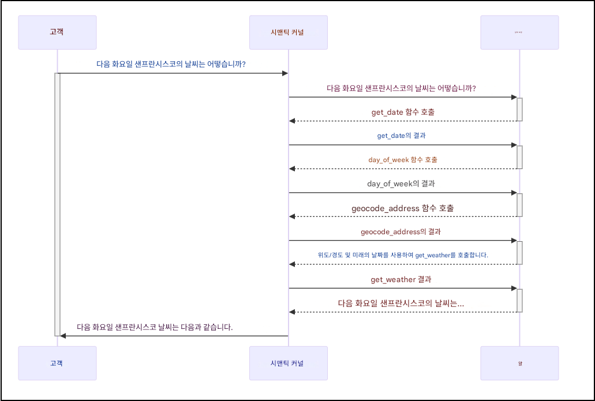

2. 您将收到类似下面的响应：
2. You will receive a response similar to the following:

    **英文：**
    ```
    I apologize, but I don't have direct access to real-time weather information. To get accurate weather data for San Francisco, you should check a weather service or website.
    ```
    **中文：**
    ```
    抱歉，我无法直接访问实时天气信息。要获取旧金山的准确天气数据，您应该查看天气服务或网站。
    ```

## 回顾

在本练习中，我们使用 **Semantic Kernel 插件**通过扩展聊天机器人的功能来增强 LLM 功能。我们开发并集成了一个**时间插件**和一个**天气检索插件**，以实现超出模型训练数据的实时、上下文响应。此外，我们还构建了 Python 插件并使用**自动函数调用**来无缝链接它们。这提高了我们使用 Semantic Kernel 构建可扩展、智能 AI 解决方案的能力。

成功完成了使用 **Semantic Kernel 插件**扩展 **LLM 功能**的以下任务：  

- 开发并集成了**时间插件**和**天气检索插件**以实现实时上下文响应。  
- 利用 **Semantic Kernel** 增强聊天机器人功能，超越模型的训练数据。  
- 实现了**自动函数调用**以无缝链接多个插件。  
- 构建并部署了 **Python 插件**以扩展 AI 功能。  

## 点击导航进入下一个实验。 
