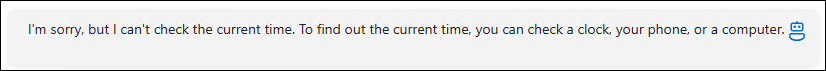
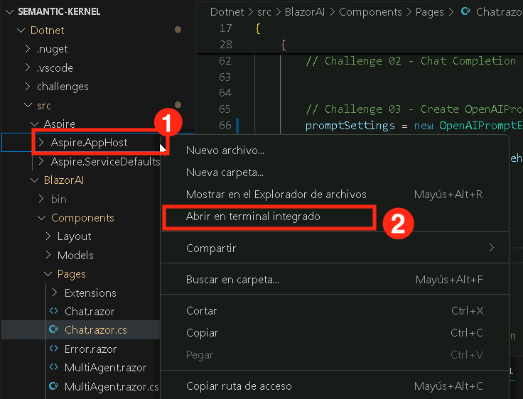
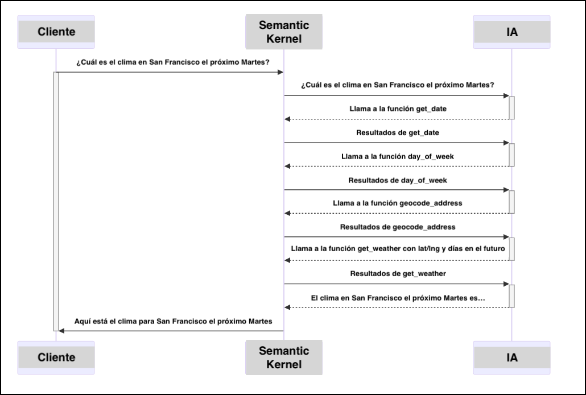

# Ejercicio 5: Plugins de Semantic Kernel

### Duración estimada: 50 minutos

Este laboratorio práctico explora el poder de los plugins para mejorar el desarrollo con LLM usando Semantic Kernel. Diseñado para quienes inician en la extensibilidad de IA, el laboratorio te guía en la creación e integración de plugins para ampliar las capacidades de tu chatbot. Implementarás un plugin de tiempo y un plugin de consulta de clima, permitiendo que tu IA acceda a datos en tiempo real y contextuales más allá de su entrenamiento. Además, aprenderás a desarrollar plugins de Semantic Kernel en Python y aprovechar Auto Function Calling para encadenarlos de forma automática.

**Nota:** Este laboratorio está implementado tanto en **C#** como en **Python**. Puedes realizar los ejercicios en **el lenguaje que prefieras**—los conceptos principales son los mismos. Para ver las instrucciones de un lenguaje específico:
- Haz clic en el pequeño **icono de flecha** (▶) junto al nombre del lenguaje.
- Esto mostrará las instrucciones paso a paso para ese lenguaje.

¡Elige tu lenguaje preferido y comienza!

## Objetivos
En este ejercicio, realizarás las siguientes tareas:
- Tarea 1: Probar la app sin el Time Plugin
- Tarea 2: Crear e importar el Time Plugin
- Tarea 3: Crear e importar el Geocoding Plugin
- Tarea 4: Crear e importar el Weather Plugin

## Tarea 1: Probar la app sin el Time Plugin

En esta tarea, explorarás diferentes tipos de flujo en Azure AI Foundry ejecutando la app sin el Time Plugin para observar su comportamiento por defecto.

1. Inicia tu aplicación de chat de IA en cualquiera de los lenguajes de programación y envía el siguiente prompt:

    ```
    What time is it?
    ```
2. Como la IA no tiene la capacidad de proporcionar información en tiempo real, recibirás una respuesta similar a:

    

## Tarea 2: Crear e importar el Time Plugin

En esta tarea, explorarás diferentes tipos de flujo en Azure AI Foundry creando e importando el Time Plugin para mejorar la funcionalidad de la app.

<details>
<summary><strong>Python</strong></summary>

1. Navega al directorio `Python>src>plugins` y crea un archivo nuevo llamado **time_plugin.py (1)**.

    
1. Agrega el siguiente código en el archivo:

    ```python
    from datetime import datetime
    from typing import Annotated
    from semantic_kernel.functions import kernel_function
    class TimePlugin:
        @kernel_function()
        def current_time(self) -> str:
            return datetime.now().strftime("%Y-%m-%d %H:%M:%S")

        @kernel_function()
        def get_year(self, date_str: Annotated[str, "The date string in format YYYY-MM-DD"] = None) -> str:
            if date_str is None:
                return str(datetime.now().year)
            try:
                date_obj = datetime.strptime(date_str, "%Y-%m-%d")
                return str(date_obj.year)
            except ValueError:
                return "Invalid date format. Please use YYYY-MM-DD."

        @kernel_function()
        def get_month(self, date_str: Annotated[str, "The date string in format YYYY-MM-DD"] = None) -> str:
            if date_str is None:
                return datetime.now().strftime("%B")
            try:
                date_obj = datetime.strptime(date_str, "%Y-%m-%d")
                return date_obj.strftime("%B")  # Full month name
            except ValueError:
                return "Invalid date format. Please use YYYY-MM-DD."

        @kernel_function()
        def get_day_of_week(self, date_str: Annotated[str, "The date string in format YYYY-MM-DD"] = None) -> str:
            if date_str is None:
                return datetime.now().strftime("%A")
            try:
                date_obj = datetime.strptime(date_str, "%Y-%m-%d")
                return date_obj.strftime("%A")  # Full weekday name
            except ValueError:
                return "Invalid date format. Please use YYYY-MM-DD."
    ```
1. Guarda el archivo.
1. Navega al directorio `Python>src` y abre el archivo **chat.py**.

    
1. Agrega el siguiente código en la sección `#Import Modules` del archivo.
    ```python
    from semantic_kernel.connectors.ai.open_ai.prompt_execution_settings.azure_chat_prompt_execution_settings import (
        AzureChatPromptExecutionSettings,
    )
    from plugins.time_plugin import TimePlugin
    ```
    
    
1. Agrega el siguiente código en la sección `#Challenge 03 - Create Prompt Execution Settings` del archivo.
    ```python
    execution_settings = AzureChatPromptExecutionSettings()
    execution_settings.function_choice_behavior = FunctionChoiceBehavior.Auto()
    logger.info("Automatic function calling enabled")
    ```

    
1. Agrega el siguiente código en la sección `# Placeholder for Time plugin` del archivo.
    ```python
    time_plugin = TimePlugin()
    kernel.add_plugin(time_plugin, plugin_name="TimePlugin")
    logger.info("Time plugin loaded")
    ```

    

1. Busca (Ctrl+F) y elimina el siguiente fragmento de código del archivo, ya que habilitaremos la llamada automática de funciones y esto ya no es necesario:
    ```python
    execution_settings = kernel.get_prompt_execution_settings_from_service_id("chat-service")
    ```
    >**Nota**: Debes eliminarlo de dos bloques de código, uno dentro de la función **def initialize_kernel():** y otro en el bloque **global chat_history**.
1. Si encuentras algún error de indentación, utiliza el código del siguiente enlace:
    ```
    https://raw.githubusercontent.com/CloudLabsAI-Azure/ai-developer/refs/heads/prod/CodeBase/python/lab-03_time_plugin.py
    ```
1. Guarda el archivo.
1. Haz clic derecho en `Python>src` en el panel izquierdo y selecciona **Open in Integrated Terminal**.

    
1. Usa el siguiente comando para ejecutar la app:
    ```
    streamlit run app.py
    ```
1. Si la app no se abre automáticamente en el navegador, puedes acceder usando la siguiente **URL**:
    ```
    http://localhost:8501
    ```
1. Envía el siguiente prompt:
    ```
    What time is it?
    ```
1. Como la IA tiene el **Time Plugin**, podrá proporcionar información en tiempo real y recibirás una respuesta similar a:
   
    

</details>

<details>
<summary><strong>C Sharp(C#)</strong></summary>

1. Navega al directorio `Dotnet>src>BlazorAI>Plugins` y crea un archivo nuevo llamado **TimePlugin.cs**.

    
1. Agrega el siguiente código en el archivo:
    ```csharp
    using System;
    using System.ComponentModel;
    using System.Globalization;
    using Microsoft.SemanticKernel;

    namespace BlazorAI.Plugins
    {
        public class TimePlugin
        {        
            [KernelFunction("current_time")]
            [Description("Gets the current date and time from the server. Use this directly when the user asks what time it is or wants to know the current date.")]
            public string CurrentTime()
            {
                return DateTime.Now.ToString("yyyy-MM-dd HH:mm:ss");
            }

            [KernelFunction("get_current_time")]
            [Description("Gets the current date and time from the server's system clock. Use this directly without asking the user for their location.")]
            public string GetCurrentTime()
            {
                return DateTime.Now.ToString("yyyy-MM-dd HH:mm:ss");
            }
            
            [KernelFunction("get_year")]
            [Description("Extract the year from a date string or get the current year from the system clock. Examples: 'What year is it now?' or 'What year is 2023-05-15?'")]
            public string GetYear(
                [Description("The date string. Accepts formats like YYYY-MM-DD, MM/DD/YYYY, etc. If not provided, uses the server's current date.")] 
                string? dateStr = null)
            {
                if (string.IsNullOrEmpty(dateStr))
                {
                    return DateTime.Now.Year.ToString();
                }

                DateTime date;
                if (TryParseDate(dateStr, out date))
                {
                    return date.Year.ToString();
                }
                
                return $"Could not parse '{dateStr}' as a valid date. Please provide a date in a standard format like YYYY-MM-DD or MM/DD/YYYY.";
            }
            
            [KernelFunction("get_month")]
            [Description("Extract the month name from a date string or get the current month from the system clock. Examples: 'What month is it now?' or 'What month is 2023-05-15?'")]
            public string GetMonth(
                [Description("The date string. Accepts formats like YYYY-MM-DD, MM/DD/YYYY, etc. If not provided, uses the server's current date.")] 
                string? dateStr = null)
            {
                if (string.IsNullOrEmpty(dateStr))
                {
                    return DateTime.Now.ToString("MMMM");
                }
                
                DateTime date;
                if (TryParseDate(dateStr, out date))
                {
                    return date.ToString("MMMM"); // Full month name
                }
                
                return $"Could not parse '{dateStr}' as a valid date. Please provide a date in a standard format like YYYY-MM-DD or MM/DD/YYYY.";
            }
            
            [KernelFunction("get_day_of_week")]
            [Description("Get the day of week from the server's system clock or for a specific date. Examples: 'What day is it today?' or 'What day of the week is 2023-05-15?'")]
            public string GetDayOfWeek(
                [Description("The date string. Accepts formats like YYYY-MM-DD, MM/DD/YYYY, etc. If not provided, uses the server's current date.")] 
                string? dateStr = null)
            {
                if (string.IsNullOrEmpty(dateStr))
                {
                    return DateTime.Now.ToString("dddd");
                }
                
                DateTime date;
                if (TryParseDate(dateStr, out date))
                {
                    return date.ToString("dddd"); // Full day name
                }
                
                return $"Could not parse '{dateStr}' as a valid date. Please provide a date in a standard format like YYYY-MM-DD or MM/DD/YYYY.";
            }

            private bool TryParseDate(string dateStr, out DateTime result)
            {
                string[] formats = { 
                    "yyyy-MM-dd", "MM/dd/yyyy", "dd/MM/yyyy", 
                    "M/d/yyyy", "d/M/yyyy", "MMM d, yyyy", 
                    "MMMM d, yyyy", "yyyy/MM/dd", "dd-MMM-yyyy"
                };
                
                return DateTime.TryParseExact(
                    dateStr, 
                    formats, 
                    CultureInfo.InvariantCulture,
                    DateTimeStyles.None, 
                    out result) || DateTime.TryParse(dateStr, out result);
            }
        }
    }
    ```
1. Guarda el archivo.
1. Navega al directorio `Dotnet>src>BlazorAI>Components>Pages` y abre el archivo **Chat.razor.cs**.

    
1. Agrega el siguiente código en la sección `// Import Models` del archivo.
    ```csharp
    using Microsoft.SemanticKernel.Connectors.OpenAI;
    using BlazorAI.Plugins;
    using System;
    ```

    
1. Busca **private Kernel? kernel;** (usando Ctrl+F) y agrega el siguiente código debajo de él:
    ```csharp
    private OpenAIPromptExecutionSettings? promptSettings;
    ```

    

1. Busca **chatHistory = [];** (usando Ctrl+F) y reemplaza la línea con el siguiente fragmento de código:

    ```csharp
    chatHistory = new ChatHistory();
    ```

    

1. Agrega el siguiente código en la sección `// Challenge 03 - Create OpenAIPromptExecutionSettings` (1) del archivo.
    ```csharp
    promptSettings = new OpenAIPromptExecutionSettings
    {
        ToolCallBehavior = ToolCallBehavior.AutoInvokeKernelFunctions,
        Temperature = 0.7,
        TopP = 0.95,
        MaxTokens = 800
    };
    ```

    
1. Agrega el siguiente código en la sección `// Challenge 03 - Add Time Plugin` del archivo.
    ```csharp
    var timePlugin = new Plugins.TimePlugin();
    kernel.ImportPluginFromObject(timePlugin, "TimePlugin");
    ```

    
1. Busca **var assistantResponse = await chatCompletionService.GetChatMessageContentAsync** (usando Ctrl+F) y agrega la siguiente línea de código entre chatHistory y kernel:
    ```csharp
    executionSettings: promptSettings,
    ```
    >**Nota**: El código final será similar al siguiente:
    ```csharp
    var assistantResponse = await chatCompletionService.GetChatMessageContentAsync(
        chatHistory: chatHistory,
        executionSettings: promptSettings,
        kernel: kernel);
    ```
    
    
1. Si encuentras algún error de indentación, utiliza el código del siguiente enlace:
    ```
    https://raw.githubusercontent.com/CloudLabsAI-Azure/ai-developer/refs/heads/prod/CodeBase/c%23/lab-03_time_plugin.cs
    ```
1. Guarda el archivo.
1. Haz clic derecho en `Dotnet>src>Aspire>Aspire.AppHost` en el panel izquierdo y selecciona **Open in Integrated Terminal**.

    

    > **Nota:** Cierra todas las sesiones de PowerShell en ejecución en la terminal de Visual Studio Code y todas las pestañas en el navegador antes de ejecutar `dotnet run`.


1. Usa el siguiente comando para ejecutar la app:
    ```
    dotnet run
    ```
1. Abre una nueva pestaña en el navegador y navega al enlace de **blazor-aichat** i.e **https://localhost:7118/**.
1. Envía el siguiente prompt:
    ```
    What time is it?
    ```
1. Como la IA tiene el **Time Plugin**, podrá proporcionar información en tiempo real y recibirás una respuesta similar a:

    

</details>

## Tarea 3: Crear e importar el Geocoding Plugin

En esta tarea, explorarás diferentes tipos de flujo en Azure AI Foundry creando e importando el Geocoding Plugin para habilitar funcionalidad basada en ubicación.

1. Abre una nueva pestaña en el navegador y navega al portal de [Geocoding API](https://geocode.maps.co/) y haz clic en el botón **Get API key** en la parte superior.

    

1. Ingresa tus datos y haz clic en **Create Account (1)**.

    

    > **Nota:** Usa tu correo electrónico personal/laboral o puedes optar por usar el Email ID desde la pestaña **Environments Tab** para registrarte.

1. Recibirás un correo electrónico, haz clic en el enlace del correo para verificar tu correo electrónico.
1. Recibirás tu **clave API de geocoding** gratuita, guárdala en un bloc de notas para su uso posterior.

<details>
<summary><strong>Python</strong></summary>

1. Navega al directorio `Python>src` y abre el archivo **.env**.

    
1. Pega la clave API de geocoding que recibiste hace un momento por correo electrónico junto a `GEOCODING_API_KEY`.

    
    >Nota:- Asegúrate de que cada valor en el archivo **.env** esté entre comillas dobles (**"**).
1. Guarda el archivo.
1. Navega al directorio `Python>src` y abre el archivo **chat.py**.

    
1. Agrega el siguiente código en la sección `#Import Modules` del archivo.
    ```
    from plugins.geo_coding_plugin import GeoPlugin
    ```

    
1. Agrega el siguiente código en la sección `# Placeholder for Time plugin` del archivo, después del **time plugin**.
    ```
    kernel.add_plugin(
        GeoPlugin(),
        plugin_name="GeoLocation",
    )
    logger.info("GeoLocation plugin loaded")
    ```

    
1. Si encuentras algún error de indentación, utiliza el código del siguiente enlace:
    ```
    https://raw.githubusercontent.com/CloudLabsAI-Azure/ai-developer/refs/heads/prod/CodeBase/python/lab-03_geo_coding.py
    ```
1. Guarda el archivo.
1. Haz clic derecho en `Python>src` en el panel izquierdo y selecciona **Open in Integrated Terminal**.

    
1. Usa el siguiente comando para ejecutar la app:
    ```
    streamlit run app.py
    ```
1. Si la app no se abre automáticamente en el navegador, puedes acceder usando la siguiente **URL**:
    ```
    http://localhost:8501
    ```
1. Envía el siguiente prompt:
    ```
    What are the geo-coordinates for Tampa, FL
    ```
1. Como la IA tiene el **Geocoding Plugin**, podrá proporcionar información en tiempo real y recibirás una respuesta similar a:

    

</details>

<details>
<summary><strong>C Sharp(C#)</strong></summary>

1. Navega al directorio `Dotnet>src>BlazorAI` y abre el archivo **appsettings.json**.

    
1. Pega la clave API de geocoding que recibiste hace un momento por correo electrónico junto a `GEOCODING_API_KEY`.

    
    >Nota:- Asegúrate de que cada valor en el archivo **appsettings.json** esté entre comillas dobles (**"**).
1. Guarda el archivo.
1. Navega al directorio `Dotnet>src>BlazorAI>Components>Pages` y abre el archivo **Chat.razor.cs**.

    
1. Agrega el siguiente código en la sección `// Challenge 03 - Add Time Plugin` del archivo, después del **time plugin**.
    ```
    var geocodingPlugin = new GeocodingPlugin(
        kernel.Services.GetRequiredService<IHttpClientFactory>(), 
        Configuration);
    kernel.ImportPluginFromObject(geocodingPlugin, "GeocodingPlugin");
    ```

    
1. Si encuentras algún error de indentación, utiliza el código del siguiente enlace:
    ```
    https://raw.githubusercontent.com/CloudLabsAI-Azure/ai-developer/refs/heads/prod/CodeBase/c%23/lab-03_geo_coding.cs
    ```
1. Guarda el archivo.
1. Haz clic derecho en `Dotnet>src>Aspire>Aspire.AppHost` en el panel izquierdo y selecciona **Open in Integrated Terminal**.

    

    > **Nota:** Cierra todas las sesiones de PowerShell en ejecución en la terminal de Visual Studio Code y todas las pestañas en el navegador antes de ejecutar `dotnet run`.

1. Usa el siguiente comando para ejecutar la app:
    ```
    dotnet run
    ```
1. Abre una nueva pestaña en el navegador y navega al enlace de **blazor-aichat** i.e **https://localhost:7118/**
1. Envía el siguiente prompt:
    ```
    What are the geo-coordinates for Tampa, FL
    ```
1. Como la IA tiene el **Geocoding Plugin**, podrá proporcionar información en tiempo real y recibirás una respuesta similar a:
    ```
    The geo-coordinates for Tampa, FL are:

    Latitude: 27.9477595
    Longitude: -82.458444 
    ```

    

</details>

## Tarea 4: Crear e importar el Weather Plugin

En esta tarea, explorarás diferentes tipos de flujo en Azure AI Foundry creando e importando el Weather Plugin para integrar funcionalidad relacionada con el clima.

<details>
<summary><strong>Python</strong></summary>

1. Navega al directorio `Python>src>plugins` y crea un archivo nuevo llamado **weather_plugin.py**.

    
1. Agrega el siguiente código en el archivo:
    ```python
    from typing import Annotated
    import requests
    from semantic_kernel.functions import kernel_function
    import json
    from datetime import datetime, timedelta

    class WeatherPlugin:
        @kernel_function(description="Get weather forecast for a location up to 16 days in the future")
        def get_forecast_weather(self, 
                                latitude: Annotated[float, "Latitude of the location"],
                                longitude: Annotated[float, "Longitude of the location"],
                                days: Annotated[int, "Number of days to forecast (up to 16)"] = 16):
            
            # Ensure days is within valid range (API supports up to 16 days)
            if days > 16:
                days = 16
            
            url = (f"https://api.open-meteo.com/v1/forecast"
                f"?latitude={latitude}&longitude={longitude}"
                f"&daily=temperature_2m_max,temperature_2m_min,precipitation_sum,precipitation_probability_max,weather_code"
                f"&amp;current=temperature_2m,relative_humidity_2m,apparent_temperature,precipitation,weather_code,wind_speed_10m"
                f"&temperature_unit=fahrenheit&wind_speed_unit=mph&precipitation_unit=inch"
                f"&forecast_days={days}&timezone=auto")
            
            try:
                response = requests.get(url)
                response.raise_for_status()
                data = response.json()
                
                daily = data.get('daily', {})
                times = daily.get('time', [])
                max_temps = daily.get('temperature_2m_max', [])
                min_temps = daily.get('temperature_2m_min', [])
                precip_sums = daily.get('precipitation_sum', [])
                precip_probs = daily.get('precipitation_probability_max', [])
                weather_codes = daily.get('weather_code', [])
                
                forecasts = []
                for i in range(len(times)):
                    # Convert date string to datetime object for day name
                    date_obj = datetime.strptime(times[i], "%Y-%m-%d")
                    day_name = date_obj.strftime("%A, %B %d")
                    
                    weather_desc = self._get_weather_description(weather_codes[i])
                    
                    forecast = {
                        "date": times[i],
                        "day": day_name,
                        "high_temp": f"{max_temps[i]}°F",
                        "low_temp": f"{min_temps[i]}°F",
                        "precipitation": f"{precip_sums[i]} inches",
                        "precipitation_probability": f"{precip_probs[i]}%",
                        "conditions": weather_desc
                    }
                    forecasts.append(forecast)
                
                result = {
                    "location_coords": f"{latitude}, {longitude}",
                    "forecast_days": len(forecasts),
                    "forecasts": forecasts
                }
                
                # For more concise output in chat
                return json.dumps(result, indent=2)
            except Exception as e:
                return f"Error fetching forecast weather: {str(e)}"
        
        def _get_weather_description(self, code):
            weather_codes = {
                0: "Clear sky",
                1: "Mainly clear", 2: "Partly cloudy", 3: "Overcast",
                45: "Fog", 48: "Depositing rime fog",
                51: "Light drizzle", 53: "Moderate drizzle", 55: "Dense drizzle",
                56: "Light freezing drizzle", 57: "Dense freezing drizzle",
                61: "Slight rain", 63: "Moderate rain", 65: "Heavy rain",
                66: "Light freezing rain", 67: "Heavy freezing rain",
                71: "Slight snow fall", 73: "Moderate snow fall", 75: "Heavy snow fall",
                77: "Snow grains",
                80: "Slight rain showers", 81: "Moderate rain showers", 82: "Violent rain showers",
                85: "Slight snow showers", 86: "Heavy snow showers",
                95: "Thunderstorm", 96: "Thunderstorm with slight hail", 99: "Thunderstorm with heavy hail"
            }
            return weather_codes.get(code, "Unknown")
    ```
1. Guarda el archivo.
1. Navega al directorio `Python>src` y abre el archivo **chat.py**.

    
1. Agrega el siguiente código en la sección `#Import Modules` del archivo.
    ```
    from plugins.weather_plugin import WeatherPlugin
    ```

    
1. Agrega el siguiente código en la sección `# Placeholder for Time plugin` del archivo, después del **Geocoding plugin**.
    ```
    kernel.add_plugin(
        WeatherPlugin(),
        plugin_name="Weather",
    )
    logger.info("Weather plugin loaded")
    ```

    
1. Si encuentras algún error de indentación, utiliza el código del siguiente enlace:
    ```
    https://raw.githubusercontent.com/CloudLabsAI-Azure/ai-developer/refs/heads/prod/CodeBase/python/lab-03_weather.py
    ```
1. Guarda el archivo.
1. Haz clic derecho en `Python>src` en el panel izquierdo y selecciona **Open in Integrated Terminal**.

    
1. Usa el siguiente comando para ejecutar la app:
    ```
    streamlit run app.py
    ```
1. Si la app no se abre automáticamente en el navegador, puedes acceder usando la siguiente **URL**:
    ```
    http://localhost:8501
    ```
1. Envía el siguiente prompt:
    ```
    What is today's weather in San Francisco?
    ```
1. Recibirás una respuesta similar a la siguiente:

    

    La IA realizará el siguiente plan para responder a la pregunta, pero puede hacerlo en un orden diferente o con un conjunto diferente de funciones:

    1️⃣ La IA debería pedir a Semantic Kernel que llame a la función GetDate en el Time Plugin para obtener la fecha de hoy y así calcular el número de días hasta el próximo jueves.

    2️⃣ Dado que la previsión del tiempo requiere una latitud y una longitud, la IA debería instruir a Semantic Kernel para que llame a la función GetLocation en el Geocoding Plugin y obtenga las coordenadas de San Francisco.

    3️⃣ Por último, la IA debería pedir a Semantic Kernel que llame a la función GetWeatherForecast en el Weather Plugin, pasando la fecha y hora actuales y las coordenadas lat/long, para obtener la previsión del tiempo para el próximo jueves (expresada como el número de días en el futuro) en las coordenadas de San Francisco.

    Un diagrama de secuencia simplificado entre Semantic Kernel y IA se muestra a continuación:

    

</details>
<details>
<summary><strong>C Sharp(C#)</strong></summary>

1. Navega al directorio `Dotnet>src>BlazorAI>Plugins` y crea un archivo nuevo llamado **WeatherPlugin.cs**.

    
1. Agrega el siguiente código en el archivo:
    ```csharp
    using System;
    using System.Collections.Generic;
    using System.ComponentModel;
    using System.Globalization;
    using System.Net.Http;
    using System.Text.Json;
    using System.Threading.Tasks;
    using Microsoft.SemanticKernel;

    namespace BlazorAI.Plugins
    {
        public class WeatherPlugin
        {
            private readonly IHttpClientFactory _httpClientFactory;

            public WeatherPlugin(IHttpClientFactory httpClientFactory)
            {
                _httpClientFactory = httpClientFactory;
            }

            [KernelFunction("GetWeatherForecast")]
            [Description("Get weather forecast for a location up to 16 days in the future")]
            public async Task<string> GetWeatherForecastAsync(
                [Description("Latitude of the location")] double latitude,
                [Description("Longitude of the location")] double longitude,
                [Description("Number of days to forecast (up to 16)")] int days = 16)
            {
                // Ensure days is within valid range (API supports up to 16 days)
                if (days > 16)
                    days = 16;

                var url = $"https://api.open-meteo.com/v1/forecast" +
                        $"?latitude={latitude}&longitude={longitude}" +
                        $"&daily=temperature_2m_max,temperature_2m_min,precipitation_sum,precipitation_probability_max,weather_code" +
                        $"&current=temperature_2m,relative_humidity_2m,apparent_temperature,precipitation,weather_code,wind_speed_10m" +
                        $"&temperature_unit=fahrenheit&wind_speed_unit=mph&precipitation_unit=inch" +
                        $"&forecast_days={days}&timezone=auto";

                try
                {
                    var httpClient = _httpClientFactory.CreateClient();
                    var response = await httpClient.GetAsync(url);
                    response.EnsureSuccessStatusCode();
                    
                    var content = await response.Content.ReadAsStringAsync();
                    var data = JsonDocument.Parse(content);
                    
                    // Extract daily forecast data
                    var dailyElement = data.RootElement.GetProperty("daily");
                    var times = dailyElement.GetProperty("time").EnumerateArray().ToArray();
                    var maxTemps = dailyElement.GetProperty("temperature_2m_max").EnumerateArray().ToArray();
                    var minTemps = dailyElement.GetProperty("temperature_2m_min").EnumerateArray().ToArray();
                    var precipSums = dailyElement.GetProperty("precipitation_sum").EnumerateArray().ToArray();
                    var precipProbs = dailyElement.GetProperty("precipitation_probability_max").EnumerateArray().ToArray();
                    var weatherCodes = dailyElement.GetProperty("weather_code").EnumerateArray().ToArray();
                    
                    // Build a readable forecast for each day
                    var forecasts = new List<object>();
                    for (int i = 0; i < times.Length; i++)
                    {
                        // Convert date string to DateTime object for day name
                        var dateStr = times[i].GetString();
                        var dateObj = DateTime.Parse(dateStr!);
                        var dayName = dateObj.ToString("dddd, MMMM dd", CultureInfo.InvariantCulture);
                        
                        var weatherDesc = GetWeatherDescription(weatherCodes[i].GetInt32());
                        
                        var forecast = new
                        {
                            date = dateStr,
                            day = dayName,
                            high_temp = $"{maxTemps[i]}°F",
                            low_temp = $"{minTemps[i]}°F", 
                            precipitation = $"{precipSums[i]} inches",
                            precipitation_probability = $"{precipProbs[i]}%",
                            conditions = weatherDesc
                        };
                        
                        forecasts.Add(forecast);
                    }
                    
                    var result = new
                    {
                        location_coords = $"{latitude}, {longitude}",
                        forecast_days = forecasts.Count,
                        forecasts
                    };
                    
                    // For more concise output in chat
                    return JsonSerializer.Serialize(result, new JsonSerializerOptions { WriteIndented = true });
                }
                catch (Exception ex)
                {
                    return $"Error fetching forecast weather: {ex.Message}";
                }
            }
            
            [KernelFunction("GetForecastWithPlugins")]
            [Description("Gets weather forecast for any location by coordinating with Time and Geocoding plugins.")]
            public async Task<string> GetForecastWithPluginsAsync(
                [Description("The kernel instance to use for calling other plugins")] Kernel kernel,
                [Description("The location name (city, address, etc.)")] string location,
                [Description("The day of the week to get forecast for, or number of days in future")] string daySpec = "0")
            {
                try
                {
                    // Step 1: Get current date from Time Plugin
                    var dateResult = await kernel.InvokeAsync("Time", "GetDate");
                    string? todayStr = dateResult.GetValue<string>();
                    if (todayStr == null)
                    {
                        return "Could not determine the current date.";
                    }
                    DateTime today = DateTime.Parse(todayStr);
                    
                    // Step 2: Calculate target day based on specification
                    int daysInFuture;
                    if (int.TryParse(daySpec, out daysInFuture))
                    {
                        // If daySpec is a number, use it directly
                    }
                    else if (Enum.TryParse<DayOfWeek>(daySpec, true, out var targetDay))
                    {
                        // Calculate days until the next occurrence of the target day
                        daysInFuture = ((int)targetDay - (int)today.DayOfWeek + 7) % 7;
                        if (daysInFuture == 0) daysInFuture = 7; // If today is the target day, get next week
                    }
                    else
                    {
                        return $"Invalid day specification: {daySpec}. Please provide a day name or number of days.";
                    }
                    
                    // Step 3: Get location coordinates from Geocoding Plugin
                    var locationResult = await kernel.InvokeAsync("Geocoding", "GetLocation", new() { ["location"] = location });
                    string? locationJson = locationResult.GetValue<string>();
                    
                    if (locationJson == null)
                    {
                        return $"Could not get location data for: {location}";
                    }
                    
                    var locationData = JsonDocument.Parse(locationJson);
                    double latitude, longitude;
                    
                    try {
                        latitude = locationData.RootElement.GetProperty("latitude").GetDouble();
                        longitude = locationData.RootElement.GetProperty("longitude").GetDouble();
                    }
                    catch (Exception)
                    {
                        return $"Could not extract coordinates for location: {location}";
                    }
                    
                    // Step 4: Get weather forecast
                    return await GetWeatherForecastAsync(latitude, longitude, daysInFuture + 1);
                }
                catch (Exception ex)
                {
                    return $"Error coordinating weather forecast: {ex.Message}";
                }
            }

            private string GetWeatherDescription(int code)
            {
                var weatherCodes = new Dictionary<int, string>
                {
                    { 0, "Clear sky" },
                    { 1, "Mainly clear" }, { 2, "Partly cloudy" }, { 3, "Overcast" },
                    { 45, "Fog" }, { 48, "Depositing rime fog" },
                    { 51, "Light drizzle" }, { 53, "Moderate drizzle" }, { 55, "Dense drizzle" },
                    { 56, "Light freezing drizzle" }, { 57, "Dense freezing drizzle" },
                    { 61, "Slight rain" }, { 63, "Moderate rain" }, { 65, "Heavy rain" },
                    { 66, "Light freezing rain" }, { 67, "Heavy freezing rain" },
                    { 71, "Slight snow fall" }, { 73, "Moderate snow fall" }, { 75, "Heavy snow fall" },
                    { 77, "Snow grains" },
                    { 80, "Slight rain showers" }, { 81, "Moderate rain showers" }, { 82, "Violent rain showers" },
                    { 85, "Slight snow showers" }, { 86, "Heavy snow showers" },
                    { 95, "Thunderstorm" }, { 96, "Thunderstorm with slight hail" }, { 99, "Thunderstorm with heavy hail" }
                };
                
                return weatherCodes.TryGetValue(code, out var description) ? description : "Unknown";
            }
        }
    }
    ```
1. Guarda el archivo.
1. Navega al directorio `Dotnet>src>BlazorAI>Components>Pages` y abre el archivo **Chat.razor.cs**.

    

1. Agrega el siguiente código en la sección `// Challenge 03 - Add Time Plugin` del archivo, después del **geocoding plugin**.
    ```
    var weatherPlugin = new WeatherPlugin(
        kernel.Services.GetRequiredService<IHttpClientFactory>());
        kernel.ImportPluginFromObject(weatherPlugin, "WeatherPlugin");
    ```

    
1. Si encuentras algún error de indentación, utiliza el código del siguiente enlace:
    ```
    https://raw.githubusercontent.com/CloudLabsAI-Azure/ai-developer/refs/heads/prod/CodeBase/c%23/lab-03_weather.cs
    ```
1. Guarda el archivo.
1. Haz clic derecho en `Dotnet>src>Aspire>Aspire.AppHost` en el panel izquierdo y selecciona **Open in Integrated Terminal**.

    
1. Usa el siguiente comando para ejecutar la app:
    ```
    dotnet run
    ```
1. Abre una nueva pestaña en el navegador y navega al enlace de **blazor-aichat** i.e **https://localhost:7118/**.
1. Envía el siguiente prompt:
    ```
    What is today's weather in San Francisco?
    ```

    La IA realizará el siguiente plan para responder a la pregunta, pero puede hacerlo en un orden diferente o con un conjunto diferente de funciones:

    1️⃣ La IA debería pedir a Semantic Kernel que llame a la función GetDate en el Time Plugin para obtener la fecha de hoy y así calcular el número de días hasta el próximo jueves.

    2️⃣ Dado que la previsión del tiempo requiere una latitud y una longitud, la IA debería instruir a Semantic Kernel para que llame a la función GetLocation en el Geocoding Plugin y obtenga las coordenadas de San Francisco.

    3️⃣ Por último, la IA debería pedir a Semantic Kernel que llame a la función GetWeatherForecast en el Weather Plugin, pasando la fecha y hora actuales y las coordenadas lat/long, para obtener la previsión del tiempo para el próximo jueves (expresada como el número de días en el futuro) en las coordenadas de San Francisco.

    Un diagrama de secuencia simplificado entre Semantic Kernel y IA se muestra a continuación:

    

</details>

## Revisión

En este ejercicio, utilizamos **plugins de Semantic Kernel** para mejorar las capacidades de LLM extendiendo la funcionalidad de un chatbot. Desarrollamos e integramos un **plugin de tiempo** y un **plugin de consulta de clima** para permitir respuestas contextuales y en tiempo real más allá de los datos de entrenamiento del modelo. Además, construimos plugins en Python y usamos **Auto Function Calling** para encadenarlos automáticamente. Esto mejoró nuestra habilidad para construir soluciones de IA extensibles e inteligentes usando Semantic Kernel.

Tareas completadas exitosamente para extender las **capacidades de LLM** usando **plugins de Semantic Kernel**:  

- Desarrollo e integración de un **plugin de tiempo** y un **plugin de consulta de clima** para respuestas contextuales en tiempo real.  
- Uso de **Semantic Kernel** para mejorar la funcionalidad del chatbot más allá de los datos de entrenamiento del modelo.  
- Implementación de **Auto Function Calling** para encadenar múltiples plugins automáticamente.  
- Construcción y despliegue de **plugins en Python** para extender las capacidades de IA.  

## Ve al siguiente laboratorio haciendo clic en la navegación.
