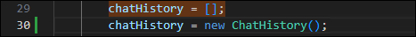
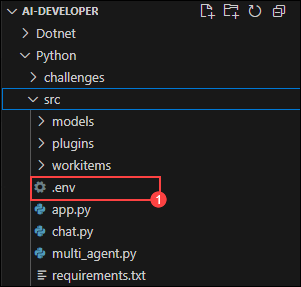

# 練習 5：Semantic Kernel 插件

### 預估時間：50 分鐘


這個實驗實驗將帶您探索如何透過插件來強化 Semantic Kernel 中的大型語言模型（LLM）開發能力。此實驗專為 AI 擴充性新手設計，將引導您建立並整合插件，以擴展聊天機器人的功能。您將實驗一個時間插件與一個天氣查詢插件，使 AI 能夠存取超出訓練範圍的即時與情境資料。此外，您也將學習如何使用 Python 開發 Semantic Kernel 插件，並運用 Auto Function Calling 將多個插件無縫串接。

**注意** ：本實驗提供 **C#** 與 **Python** 兩種語言版本。您可以選擇**自己熟悉的語言**來進行練習——核心概念皆相同。若要查看特定語言的操作說明：
- 點擊語言名稱旁的 **小箭頭圖示** (▶) 。
- 即可展開該語言的逐步操作說明。

請選擇您偏好的語言並開始操作！

## 實驗目標
在本次練習中，您將完成以下任務：
- 任務 1：在未啟用時間插件的情況下試用應用程式
- 任務 2：建立並匯入時間插件
- 任務 3：建立並匯入地理編碼插件
- 任務 4：建立並匯入天氣插件

## 任務 1：在未啟用時間插件的情況下試用應用程式

在此任務中，您將透過在未啟用時間插件的情況下執行應用程式，來探索 Azure AI Foundry 中不同的流程類型，並觀察其預設行為。

1. 使用您選擇的語言啟動 AI 聊天應用程式，並輸入以下 Prompt：
    ```
    What time is it?
    ```
2. 由於 AI 尚未具備提供即時資訊的能力，您將會收到類似以下的回應：
    ```
    I can't provide real-time information, including the current time. You can check the time on your device or through various online sources.
    ```

    

## 任務 2：建立並匯入時間插件

在此任務中，您將透過建立並匯入時間插件來增強應用程式的功能，進一步探索 Azure AI Foundry 中不同的流程類型。

<details>
<summary><strong>Python</strong></summary>

1. 導航至 `Python>src>plugins` 目錄，並建立一個新檔案，命名為 **time_plugin.py** **(1)**。

    

2. 在該檔案中加入以下程式碼：

    ```
    from datetime import datetime
    from typing import Annotated
    from semantic_kernel.functions import kernel_function

    class TimePlugin:
        @kernel_function()
        def current_time(self) -> str:
            return datetime.now().strftime("%Y-%m-%d %H:%M:%S")

        @kernel_function()
        def get_year(self, date_str: Annotated[str, "The date string in format YYYY-MM-DD"] = None) -> str:
            if date_str is None:
                return str(datetime.now().year)
            
            try:
                date_obj = datetime.strptime(date_str, "%Y-%m-%d")
                return str(date_obj.year)
            except ValueError:
                return "Invalid date format. Please use YYYY-MM-DD."

        @kernel_function()
        def get_month(self, date_str: Annotated[str, "The date string in format YYYY-MM-DD"] = None) -> str:
            if date_str is None:
                return datetime.now().strftime("%B")
            
            try:
                date_obj = datetime.strptime(date_str, "%Y-%m-%d")
                return date_obj.strftime("%B")  # Full month name
            except ValueError:
                return "Invalid date format. Please use YYYY-MM-DD."

        @kernel_function()
        def get_day_of_week(self, date_str: Annotated[str, "The date string in format YYYY-MM-DD"] = None) -> str:
            if date_str is None:
                return datetime.now().strftime("%A")
            
            try:
                date_obj = datetime.strptime(date_str, "%Y-%m-%d")
                return date_obj.strftime("%A")  # Full weekday name
            except ValueError:
                return "Invalid date format. Please use YYYY-MM-DD."
    ```
3. 儲存檔案。
4. 導航至  `Python>src` 目錄並開啟 **chat.py** 檔案。

    

5. 在檔案的 `#Import Modules` 區段中加入以下程式碼：

    ```
    from semantic_kernel.connectors.ai.open_ai.prompt_execution_settings.azure_chat_prompt_execution_settings import (
        AzureChatPromptExecutionSettings,
    )
    from plugins.time_plugin import TimePlugin
    ```
    
    

6. 在 `#Challenge 03 - Create Prompt Execution Settings` 區段中加入以下程式碼：

    ```
    execution_settings = AzureChatPromptExecutionSettings()
    execution_settings.function_choice_behavior = FunctionChoiceBehavior.Auto()
    logger.info("Automatic function calling enabled")
    ```

    
7. 在 `# Placeholder for Time plugin` 區段中加入以下程式碼：

    ```
    time_plugin = TimePlugin()
    kernel.add_plugin(time_plugin, plugin_name="TimePlugin")
    logger.info("Time plugin loaded")
    ```

    

8. 使用 Ctrl+F 搜尋並移除以下程式碼，因為我們將啟用自動函式呼叫，這段程式碼將不再需要：

    ```
    execution_settings = kernel.get_prompt_execution_settings_from_service_id("chat-service")
    ```

    >**注意**：您需要從兩個程式碼區塊中移除這段程式碼，一個是在 **def initialize_kernel():** 函式中，另一個是在 **global chat_history** 程式碼區塊中。

9. 如果您遇到縮排錯誤，請使用以下網址中的程式碼：

    ```
    https://raw.githubusercontent.com/CloudLabsAI-Azure/ai-developer/refs/heads/prod/CodeBase/python/lab-03_time_plugin.py
    ```

10. 儲存檔案。
11. 在左側面板中，右鍵點選  `Python>src` ，然後選擇 **Open in Integrated Terminal**。

    

12. 使用以下指令來執行應用程式：

    ```
    streamlit run app.py
    ```

13. 如果應用程式未自動在瀏覽器中開啟，您可以使用以下 **URL** 存取：

    ```
    http://localhost:8501
    ```

14. 輸入以下 Prompt：

    ```
    What time is it?
    ```

15. 由於 AI 現在已具備 **時間插件**，它將能夠提供即時資訊，您將會收到類似以下的回應：

    ```
    The current time is 3:43 PM on January 23, 2025.
    ```

    

</details>

<details>
<summary><strong>C Sharp(C#)</strong></summary>

1. 導航至 `Dotnet>src>BlazorAI>Plugins` 目錄，並建立一個新檔案，命名為 **TimePlugin.cs**。

    

2. 在該檔案中加入以下程式碼：

    ```
    using System;
    using System.ComponentModel;
    using System.Globalization;
    using Microsoft.SemanticKernel;

    namespace BlazorAI.Plugins
    {
        public class TimePlugin
        {        
            [KernelFunction("current_time")]
            [Description("Gets the current date and time from the server. Use this directly when the user asks what time it is or wants to know the current date.")]
            public string CurrentTime()
            {
                return DateTime.Now.ToString("yyyy-MM-dd HH:mm:ss");
            }

            [KernelFunction("get_current_time")]
            [Description("Gets the current date and time from the server's system clock. Use this directly without asking the user for their location.")]
            public string GetCurrentTime()
            {
                return DateTime.Now.ToString("yyyy-MM-dd HH:mm:ss");
            }
            
            [KernelFunction("get_year")]
            [Description("Extract the year from a date string or get the current year from the system clock. Examples: 'What year is it now?' or 'What year is 2023-05-15?'")]
            public string GetYear(
                [Description("The date string. Accepts formats like YYYY-MM-DD, MM/DD/YYYY, etc. If not provided, uses the server's current date.")] 
                string? dateStr = null)
            {
                if (string.IsNullOrEmpty(dateStr))
                {
                    return DateTime.Now.Year.ToString();
                }

                DateTime date;
                if (TryParseDate(dateStr, out date))
                {
                    return date.Year.ToString();
                }
                
                return $"Could not parse '{dateStr}' as a valid date. Please provide a date in a standard format like YYYY-MM-DD or MM/DD/YYYY.";
            }
            
            [KernelFunction("get_month")]
            [Description("Extract the month name from a date string or get the current month from the system clock. Examples: 'What month is it now?' or 'What month is 2023-05-15?'")]
            public string GetMonth(
                [Description("The date string. Accepts formats like YYYY-MM-DD, MM/DD/YYYY, etc. If not provided, uses the server's current date.")] 
                string? dateStr = null)
            {
                if (string.IsNullOrEmpty(dateStr))
                {
                    return DateTime.Now.ToString("MMMM");
                }
                
                DateTime date;
                if (TryParseDate(dateStr, out date))
                {
                    return date.ToString("MMMM"); // Full month name
                }
                
                return $"Could not parse '{dateStr}' as a valid date. Please provide a date in a standard format like YYYY-MM-DD or MM/DD/YYYY.";
            }
            
            [KernelFunction("get_day_of_week")]
            [Description("Get the day of week from the server's system clock or for a specific date. Examples: 'What day is it today?' or 'What day of the week is 2023-05-15?'")]
            public string GetDayOfWeek(
                [Description("The date string. Accepts formats like YYYY-MM-DD, MM/DD/YYYY, etc. If not provided, uses the server's current date.")] 
                string? dateStr = null)
            {
                if (string.IsNullOrEmpty(dateStr))
                {
                    return DateTime.Now.ToString("dddd");
                }
                
                DateTime date;
                if (TryParseDate(dateStr, out date))
                {
                    return date.ToString("dddd"); // Full day name
                }
                
                return $"Could not parse '{dateStr}' as a valid date. Please provide a date in a standard format like YYYY-MM-DD or MM/DD/YYYY.";
            }

            private bool TryParseDate(string dateStr, out DateTime result)
            {
                string[] formats = { 
                    "yyyy-MM-dd", "MM/dd/yyyy", "dd/MM/yyyy", 
                    "M/d/yyyy", "d/M/yyyy", "MMM d, yyyy", 
                    "MMMM d, yyyy", "yyyy/MM/dd", "dd-MMM-yyyy"
                };
                
                return DateTime.TryParseExact(
                    dateStr, 
                    formats, 
                    CultureInfo.InvariantCulture,
                    DateTimeStyles.None, 
                    out result) || DateTime.TryParse(dateStr, out result);
            }
        }
    }
    ```

3. 儲存檔案。
4. 導航至  `Dotnet>src>BlazorAI>Components>Pages` 目錄並開啟 **Chat.razor.cs** 檔案。

    

5. 在檔案的 `// Import Models` 區段中加入以下程式碼。

    ```
    using Microsoft.SemanticKernel.Connectors.OpenAI;
    using BlazorAI.Plugins;
    using System;
    ```

    

6. 使用 Ctrl+F 搜尋 **private Kernel? kernel;** ，並在其下方加入以下程式碼：

    ```
    private OpenAIPromptExecutionSettings? promptSettings;
    ```

    

7. 使用 Ctrl+F 搜尋 **chatHistory = [];** ，並將該行更新為以下程式碼：

    ```
    chatHistory = new ChatHistory();
    ```

    

8. 在 `// Challenge 03 - Create OpenAIPromptExecutionSettings` (1) 區段中加入以下程式碼。

    ```
    promptSettings = new OpenAIPromptExecutionSettings
    {
        ToolCallBehavior = ToolCallBehavior.AutoInvokeKernelFunctions,
        Temperature = 0.7,
        TopP = 0.95,
        MaxTokens = 800
    };
    ```

    

9. 在 `// Challenge 03 - Add Time Plugin` 區段中加入以下程式碼。

    ```
    var timePlugin = new Plugins.TimePlugin();
    kernel.ImportPluginFromObject(timePlugin, "TimePlugin");
    ```

    

10. 使用 Ctrl+F 搜尋 **var assistantResponse = await chatCompletionService.GetChatMessageContentAsync** (using Ctrl+F)  並在 chatHistory 與 kernel 之間加入以下程式碼：

    ```
    executionSettings: promptSettings,
    ```

    >**注意**：最終的程式碼將會與下方所示的程式碼類似：

    ```
    var assistantResponse = await chatCompletionService.GetChatMessageContentAsync(
        chatHistory: chatHistory,
        executionSettings: promptSettings,
        kernel: kernel);
    ```
    
    

11. 如果您遇到縮排錯誤，請使用以下網址中的程式碼：

    ```
    https://raw.githubusercontent.com/CloudLabsAI-Azure/ai-developer/refs/heads/prod/CodeBase/c%23/lab-03_time_plugin.cs
    ```

12. 儲存檔案。
13. 在左側面板中，右鍵點選 `Dotnet>src>Aspire>Aspire.AppHost` ，然後選擇 **Open in Integrated Terminal**。

    

14. 使用以下指令來執行應用程式：

    ```
    dotnet run
    ```

15. 在瀏覽器中開啟新分頁，並前往 **blazor-aichat** 的連結，即： **https://localhost:7118/**。
16. 輸入以下 Prompt：

    ```
    What time is it?
    ```

17. 由於 AI 現在已具備 **時間插件**，它將能夠提供即時資訊，您將會收到類似以下的回應：
    ```
    The current time is 3:43 PM on January 23, 2025.
    ```

    
</details>

## 任務 3：建立並匯入地理編碼插件

在此任務中，您將透過建立並匯入 地理編碼插件 (Geocoding Plugin)，啟用基於位置的功能，進一步探索 Azure AI Foundry 中不同的流程類型。 

1. 在瀏覽器中開啟新分頁，前往 [Geocoding API](https://geocode.maps.co/) 入口網站，然後點擊上方的 **Free API key** 按鈕。

    

2. 輸入您的詳細資料，然後點擊 **Create Account** **(1)**。

    

    >**注意**： 請使用您的個人或工作電子郵件地址進行註冊。

3. 您將收到一封電子郵件，請點擊信中的連結以驗證您的電子郵件。
4. 您將收到免費的 **geocoding API key**，請將其儲存到記事本中以供後續使用。

<details>
<summary><strong>Python</strong></summary>

1. 導航至 `Python>src` 目錄並開啟 **.env** 檔案。

    

2. 將您剛剛透過電子郵件收到的 geocoding API key 貼到 `GEOCODING_API_KEY`的等號右側。

    

    >注意：請確保 **.env** 檔案中的每個值都用 **雙引號 (")** 包住。

3. 儲存檔案。
4. 導航至  `Python>src` 目錄並開啟 **chat.py** 檔案。

    

5. 在檔案的 `#Import Modules` 區段中加入以下程式碼。

    ```
    from plugins.geo_coding_plugin import GeoPlugin
    ```

    

6. 在 `# Placeholder for Time plugin` 區段中， **time plugin** 之後加入以下程式碼。

    ```
    kernel.add_plugin(
        GeoPlugin(),
        plugin_name="GeoLocation",
    )
    logger.info("GeoLocation plugin loaded")
    ```

    

7. 如果您遇到縮排錯誤，請使用以下網址中的程式碼：

    ```
    https://raw.githubusercontent.com/CloudLabsAI-Azure/ai-developer/refs/heads/prod/CodeBase/python/lab-03_geo_coding.py
    ```

8. 儲存檔案。
9. 在左側面板中，右鍵點選  `Python>src` ，然後選擇 **Open in Integrated Terminal**。

    

10. 使用以下指令來執行應用程式：

    ```
    streamlit run app.py
    ```

11. 如果應用程式未自動在瀏覽器中開啟，您可以使用以下 **URL** 存取：

    ```
    http://localhost:8501
    ```

12. 輸入以下 Prompt：

    ```
    What are the geo-coordinates for Tampa, FL
    ```

13. 由於 AI 現在已具備 **地理編碼插件**，它將能夠提供即時的地理位置資訊，您將會收到類似以下的回應：

    ```
    The geo-coordinates for Tampa, FL are:

    Latitude: 27.9477595
    Longitude: -82.458444 
    ```

    

</details>

<details>
<summary><strong>C Sharp(C#)</strong></summary>

1. 導航至 `Dotnet>src>BlazorAI` 目錄並開啟  **appsettings.json** 檔案。

    

2. 將您剛剛透過電子郵件收到的 geocoding API key 貼到 `GEOCODING_API_KEY` 的欄位中。

    

    >**注意**：**請確保 **appsettings.json** 檔案中的每個值都用 **雙引號（"）** 包住。

3. 儲存檔案。
4. 導航至 `Dotnet>src>BlazorAI>Components>Pages` 目錄並開啟 **Chat.razor.cs** 檔案。

    

5. 在 `// Challenge 03 - Add Time Plugin` 區段中， **time plugin** 之後加入以下程式碼。

    ```
    var geocodingPlugin = new GeocodingPlugin(
        kernel.Services.GetRequiredService<IHttpClientFactory>(), 
        Configuration);
    kernel.ImportPluginFromObject(geocodingPlugin, "GeocodingPlugin");
    ```

    

6. 如果您遇到縮排錯誤，請使用以下網址中的程式碼：

    ```
    https://raw.githubusercontent.com/CloudLabsAI-Azure/ai-developer/refs/heads/prod/CodeBase/c%23/lab-03_geo_coding.cs
    ```

7. 儲存檔案。
8. 在左側面板中，右鍵點選 `Dotnet>src>Aspire>Aspire.AppHost` ，然後選擇 **Open in Integrated Terminal**。

    

9. 使用以下指令來執行應用程式：

    ```
    dotnet run
    ```

10. 在瀏覽器中開啟新分頁，並前往 **blazor-aichat** 的連結，即： **https://localhost:7118/**。
11. 輸入以下 Prompt：

    ```
    What are the geo-coordinates for Tampa, FL
    ```

12. 由於 AI 現在已具備 **地理編碼插件**，它將能夠提供即時的地理位置資訊，您將會收到類似以下的回應：
    ```
    The geo-coordinates for Tampa, FL are:

    Latitude: 27.9477595
    Longitude: -82.458444 
    ```

    

</details>

## 任務 4：建立並匯入天氣插件

在此任務中，您將透過建立並匯入天氣插件，整合天氣相關功能，進一步探索 Azure AI Foundry 中不同的流程類型。

<details>
<summary><strong>Python</strong></summary>

1. 導航至  `Python>src>plugins` 目錄，並建立一個新檔案，命名為 **weather_plugin.py**。

    

2. 在該檔案中加入以下程式碼：

    ```
    from typing import Annotated
    import requests
    from semantic_kernel.functions import kernel_function
    import json
    from datetime import datetime, timedelta

    class WeatherPlugin:
        @kernel_function(description="Get weather forecast for a location up to 16 days in the future")
        def get_forecast_weather(self, 
                                latitude: Annotated[float, "Latitude of the location"],
                                longitude: Annotated[float, "Longitude of the location"],
                                days: Annotated[int, "Number of days to forecast (up to 16)"] = 16):
            
            # Ensure days is within valid range (API supports up to 16 days)
            if days > 16:
                days = 16
            
            url = (f"https://api.open-meteo.com/v1/forecast"
                f"?latitude={latitude}&longitude={longitude}"
                f"&daily=temperature_2m_max,temperature_2m_min,precipitation_sum,precipitation_probability_max,weather_code"
                f"&amp;current=temperature_2m,relative_humidity_2m,apparent_temperature,precipitation,weather_code,wind_speed_10m"
                f"&temperature_unit=fahrenheit&wind_speed_unit=mph&precipitation_unit=inch"
                f"&forecast_days={days}&timezone=auto")
            
            try:
                response = requests.get(url)
                response.raise_for_status()
                data = response.json()
                
                daily = data.get('daily', {})
                times = daily.get('time', [])
                max_temps = daily.get('temperature_2m_max', [])
                min_temps = daily.get('temperature_2m_min', [])
                precip_sums = daily.get('precipitation_sum', [])
                precip_probs = daily.get('precipitation_probability_max', [])
                weather_codes = daily.get('weather_code', [])
                
                forecasts = []
                for i in range(len(times)):
                    # Convert date string to datetime object for day name
                    date_obj = datetime.strptime(times[i], "%Y-%m-%d")
                    day_name = date_obj.strftime("%A, %B %d")
                    
                    weather_desc = self._get_weather_description(weather_codes[i])
                    
                    forecast = {
                        "date": times[i],
                        "day": day_name,
                        "high_temp": f"{max_temps[i]}°F",
                        "low_temp": f"{min_temps[i]}°F",
                        "precipitation": f"{precip_sums[i]} inches",
                        "precipitation_probability": f"{precip_probs[i]}%",
                        "conditions": weather_desc
                    }
                    forecasts.append(forecast)
                
                result = {
                    "location_coords": f"{latitude}, {longitude}",
                    "forecast_days": len(forecasts),
                    "forecasts": forecasts
                }
                
                # For more concise output in chat
                return json.dumps(result, indent=2)
            except Exception as e:
                return f"Error fetching forecast weather: {str(e)}"
        
        def _get_weather_description(self, code):
            weather_codes = {
                0: "Clear sky",
                1: "Mainly clear", 2: "Partly cloudy", 3: "Overcast",
                45: "Fog", 48: "Depositing rime fog",
                51: "Light drizzle", 53: "Moderate drizzle", 55: "Dense drizzle",
                56: "Light freezing drizzle", 57: "Dense freezing drizzle",
                61: "Slight rain", 63: "Moderate rain", 65: "Heavy rain",
                66: "Light freezing rain", 67: "Heavy freezing rain",
                71: "Slight snow fall", 73: "Moderate snow fall", 75: "Heavy snow fall",
                77: "Snow grains",
                80: "Slight rain showers", 81: "Moderate rain showers", 82: "Violent rain showers",
                85: "Slight snow showers", 86: "Heavy snow showers",
                95: "Thunderstorm", 96: "Thunderstorm with slight hail", 99: "Thunderstorm with heavy hail"
            }
            return weather_codes.get(code, "Unknown")
    ```

3. 儲存檔案。
4. 導航至 `Python>src` 目錄並開啟 **chat.py** 檔案。

    

5. 在檔案的 `#Import Modules` 區段中加入以下程式碼。

    ```
    from plugins.weather_plugin import WeatherPlugin
    ```

    

6. 在 `# Placeholder for Time plugin` 區段中， **地理編碼插件** 之後加入以下程式碼。

    ```
    kernel.add_plugin(
        WeatherPlugin(),
        plugin_name="Weather",
    )
    logger.info("Weather plugin loaded")
    ```

    

7. 如果您遇到縮排錯誤，請使用以下網址中的程式碼：

    ```
    https://raw.githubusercontent.com/CloudLabsAI-Azure/ai-developer/refs/heads/prod/CodeBase/python/lab-03_weather.py
    ```

8. 儲存檔案。
9. 在左側面板中，右鍵點選 `Python>src` ，然後選擇  **Open in Integrated Terminal**。

    

10. 使用以下指令來執行應用程式：

    ```
    streamlit run app.py
    ```

11. 如果應用程式未自動在瀏覽器中開啟，您可以使用以下 **URL** 存取：

    ```
    http://localhost:8501
    ```

12. 輸入以下 Prompt：

    ```
    What is today's weather in San Francisco?
    ```

13. 您將會收到類似以下的回應：

    

    AI 將會執行以下計畫來回答問題（但可能會以不同順序或使用不同函式）：

    1️⃣ AI 會請 Semantic Kernel 呼叫時間插件中的 GetDate 函式，以取得今天的日期，進而計算距離下週四的天數。

    2️⃣ 由於天氣預報需要經緯度資訊，AI 會請 Semantic Kernel 呼叫地理編碼插件中的 GetLocation 函式，以取得 San Francisco 的座標。

    3️⃣ 最後，AI 會請 Semantic Kernel 呼叫天氣擷取插件中的 GetWeatherForecast 函式，傳入目前的日期與經緯度，以取得下週四（以未來天數表示）在 San Francisco 的天氣預報。

    這是一張簡化的互動流程圖，清楚地顯示了 AI 與 Semantic Kernel 之間的請求與回應流程

    

</details>
<details>
<summary><strong>C Sharp(C#)</strong></summary>

1. 導航至 `Dotnet>src>BlazorAI>Plugins` 目錄，並建立一個新檔案，命名為 **WeatherPlugin.cs**。

    

2. 在該檔案中加入以下程式碼：

    ```
    using System;
    using System.Collections.Generic;
    using System.ComponentModel;
    using System.Globalization;
    using System.Net.Http;
    using System.Text.Json;
    using System.Threading.Tasks;
    using Microsoft.SemanticKernel;

    namespace BlazorAI.Plugins
    {
        public class WeatherPlugin
        {
            private readonly IHttpClientFactory _httpClientFactory;

            public WeatherPlugin(IHttpClientFactory httpClientFactory)
            {
                _httpClientFactory = httpClientFactory;
            }

            [KernelFunction("GetWeatherForecast")]
            [Description("Get weather forecast for a location up to 16 days in the future")]
            public async Task<string> GetWeatherForecastAsync(
                [Description("Latitude of the location")] double latitude,
                [Description("Longitude of the location")] double longitude,
                [Description("Number of days to forecast (up to 16)")] int days = 16)
            {
                // Ensure days is within valid range (API supports up to 16 days)
                if (days > 16)
                    days = 16;

                var url = $"https://api.open-meteo.com/v1/forecast" +
                        $"?latitude={latitude}&longitude={longitude}" +
                        $"&daily=temperature_2m_max,temperature_2m_min,precipitation_sum,precipitation_probability_max,weather_code" +
                        $"&current=temperature_2m,relative_humidity_2m,apparent_temperature,precipitation,weather_code,wind_speed_10m" +
                        $"&temperature_unit=fahrenheit&wind_speed_unit=mph&precipitation_unit=inch" +
                        $"&forecast_days={days}&timezone=auto";

                try
                {
                    var httpClient = _httpClientFactory.CreateClient();
                    var response = await httpClient.GetAsync(url);
                    response.EnsureSuccessStatusCode();
                    
                    var content = await response.Content.ReadAsStringAsync();
                    var data = JsonDocument.Parse(content);
                    
                    // Extract daily forecast data
                    var dailyElement = data.RootElement.GetProperty("daily");
                    var times = dailyElement.GetProperty("time").EnumerateArray().ToArray();
                    var maxTemps = dailyElement.GetProperty("temperature_2m_max").EnumerateArray().ToArray();
                    var minTemps = dailyElement.GetProperty("temperature_2m_min").EnumerateArray().ToArray();
                    var precipSums = dailyElement.GetProperty("precipitation_sum").EnumerateArray().ToArray();
                    var precipProbs = dailyElement.GetProperty("precipitation_probability_max").EnumerateArray().ToArray();
                    var weatherCodes = dailyElement.GetProperty("weather_code").EnumerateArray().ToArray();
                    
                    // Build a readable forecast for each day
                    var forecasts = new List<object>();
                    for (int i = 0; i < times.Length; i++)
                    {
                        // Convert date string to DateTime object for day name
                        var dateStr = times[i].GetString();
                        var dateObj = DateTime.Parse(dateStr!);
                        var dayName = dateObj.ToString("dddd, MMMM dd", CultureInfo.InvariantCulture);
                        
                        var weatherDesc = GetWeatherDescription(weatherCodes[i].GetInt32());
                        
                        var forecast = new
                        {
                            date = dateStr,
                            day = dayName,
                            high_temp = $"{maxTemps[i]}°F",
                            low_temp = $"{minTemps[i]}°F", 
                            precipitation = $"{precipSums[i]} inches",
                            precipitation_probability = $"{precipProbs[i]}%",
                            conditions = weatherDesc
                        };
                        
                        forecasts.Add(forecast);
                    }
                    
                    var result = new
                    {
                        location_coords = $"{latitude}, {longitude}",
                        forecast_days = forecasts.Count,
                        forecasts
                    };
                    
                    // For more concise output in chat
                    return JsonSerializer.Serialize(result, new JsonSerializerOptions { WriteIndented = true });
                }
                catch (Exception ex)
                {
                    return $"Error fetching forecast weather: {ex.Message}";
                }
            }
            
            [KernelFunction("GetForecastWithPlugins")]
            [Description("Gets weather forecast for any location by coordinating with Time and Geocoding plugins.")]
            public async Task<string> GetForecastWithPluginsAsync(
                [Description("The kernel instance to use for calling other plugins")] Kernel kernel,
                [Description("The location name (city, address, etc.)")] string location,
                [Description("The day of the week to get forecast for, or number of days in future")] string daySpec = "0")
            {
                try
                {
                    // Step 1: Get current date from Time Plugin
                    var dateResult = await kernel.InvokeAsync("Time", "GetDate");
                    string? todayStr = dateResult.GetValue<string>();
                    if (todayStr == null)
                    {
                        return "Could not determine the current date.";
                    }
                    DateTime today = DateTime.Parse(todayStr);
                    
                    // Step 2: Calculate target day based on specification
                    int daysInFuture;
                    if (int.TryParse(daySpec, out daysInFuture))
                    {
                        // If daySpec is a number, use it directly
                    }
                    else if (Enum.TryParse<DayOfWeek>(daySpec, true, out var targetDay))
                    {
                        // Calculate days until the next occurrence of the target day
                        daysInFuture = ((int)targetDay - (int)today.DayOfWeek + 7) % 7;
                        if (daysInFuture == 0) daysInFuture = 7; // If today is the target day, get next week
                    }
                    else
                    {
                        return $"Invalid day specification: {daySpec}. Please provide a day name or number of days.";
                    }
                    
                    // Step 3: Get location coordinates from Geocoding Plugin
                    var locationResult = await kernel.InvokeAsync("Geocoding", "GetLocation", new() { ["location"] = location });
                    string? locationJson = locationResult.GetValue<string>();
                    
                    if (locationJson == null)
                    {
                        return $"Could not get location data for: {location}";
                    }
                    
                    var locationData = JsonDocument.Parse(locationJson);
                    double latitude, longitude;
                    
                    try {
                        latitude = locationData.RootElement.GetProperty("latitude").GetDouble();
                        longitude = locationData.RootElement.GetProperty("longitude").GetDouble();
                    }
                    catch (Exception)
                    {
                        return $"Could not extract coordinates for location: {location}";
                    }
                    
                    // Step 4: Get weather forecast
                    return await GetWeatherForecastAsync(latitude, longitude, daysInFuture + 1);
                }
                catch (Exception ex)
                {
                    return $"Error coordinating weather forecast: {ex.Message}";
                }
            }

            private string GetWeatherDescription(int code)
            {
                var weatherCodes = new Dictionary<int, string>
                {
                    { 0, "Clear sky" },
                    { 1, "Mainly clear" }, { 2, "Partly cloudy" }, { 3, "Overcast" },
                    { 45, "Fog" }, { 48, "Depositing rime fog" },
                    { 51, "Light drizzle" }, { 53, "Moderate drizzle" }, { 55, "Dense drizzle" },
                    { 56, "Light freezing drizzle" }, { 57, "Dense freezing drizzle" },
                    { 61, "Slight rain" }, { 63, "Moderate rain" }, { 65, "Heavy rain" },
                    { 66, "Light freezing rain" }, { 67, "Heavy freezing rain" },
                    { 71, "Slight snow fall" }, { 73, "Moderate snow fall" }, { 75, "Heavy snow fall" },
                    { 77, "Snow grains" },
                    { 80, "Slight rain showers" }, { 81, "Moderate rain showers" }, { 82, "Violent rain showers" },
                    { 85, "Slight snow showers" }, { 86, "Heavy snow showers" },
                    { 95, "Thunderstorm" }, { 96, "Thunderstorm with slight hail" }, { 99, "Thunderstorm with heavy hail" }
                };
                
                return weatherCodes.TryGetValue(code, out var description) ? description : "Unknown";
            }
        }
    }
    ```

3. 儲存檔案。
4. 導航至 `Dotnet>src>BlazorAI>Components>Pages` 目錄並開啟 **Chat.razor.cs** 檔案。

    

5. 在 `// Challenge 03 - Add Time Plugin` 區段中， **地理編碼插件** 之後加入以下程式碼。

    ```
    var weatherPlugin = new WeatherPlugin(
        kernel.Services.GetRequiredService<IHttpClientFactory>());
        kernel.ImportPluginFromObject(weatherPlugin, "WeatherPlugin");
    ```

    

6. 如果您遇到縮排錯誤，請使用以下網址中的程式碼：

    ```
    https://raw.githubusercontent.com/CloudLabsAI-Azure/ai-developer/refs/heads/prod/CodeBase/c%23/lab-03_weather.cs
    ```

7. 儲存檔案。
8. 在左側面板中，右鍵點選 `Dotnet>src>Aspire>Aspire.AppHost` ，然後選擇 **Open in Integrated Terminal**.

    

9. 使用以下指令來執行應用程式：

    ```
    dotnet run
    ```

10. 請在瀏覽器中開啟一個新分頁，並前往 **blazor-aichat** 的連結，即： **https://localhost:7118/**.
11. 輸入以下 Prompt：

    ```
    What is today's weather in San Francisco?
    ```

12. 您將會收到類似以下的回應：

    

    AI 將會執行以下計畫來回答問題（但可能會以不同順序或使用不同函式）：
    
    1️⃣ AI 會請 Semantic Kernel 呼叫時間插件中的 GetDate 函式，以取得今天的日期，進而計算距離下週四的天數。

    2️⃣ 由於天氣預報需要經緯度資訊，AI 會請 Semantic Kernel 呼叫地理編碼插件中的 GetLocation 函式，以取得 San Francisco 的座標。

    3️⃣ 最後，AI 會請 Semantic Kernel 呼叫天氣擷取插件中的 GetWeatherForecast 函式，傳入目前的日期與經緯度，以取得下週四（以未來天數表示）在 San Francisco 的天氣預報。

    這是一張簡化的互動流程圖，清楚地顯示了 AI 與 Semantic Kernel 之間的請求與回應流程

    

</details>

## 回顧

在此練習中，我們利用 **Semantic Kernel 插件** 來增強大型語言模型 （LLM）的能力，擴展聊天機器人的功能。我們開發並整合了 **時間插件** 和 **天氣擷取插件**，以提供超越模型訓練數據的即時、情境式回應。此外，我們在 Python 中建構了插件，並使用 **Auto Function Calling** 來無縫鏈接它們。這提升了我們使用 Semantic Kernel 構建可擴展、智慧型 AI 解決方案的能力。

成功完成以下任務，以使用 **Semantic Kernel 插件** 擴展 **LLM 功能**：

- 開發並整合 **時間插件** 和 **天氣擷取插件**，以提供即時的情境式回應。
- 利用 **Semantic Kernel** 來增強聊天機器人功能，使其能夠超越模型的訓練數據。
- 實施 **Auto Function Calling** 以無縫鏈接多個插件。
- 構建並部署 基於 **Python 的插件**，以擴展 AI 的能力。

### 恭喜！您已成功完成本次實驗課程！
### 請點選導覽連結，以繼續進行下一個實驗課程。
