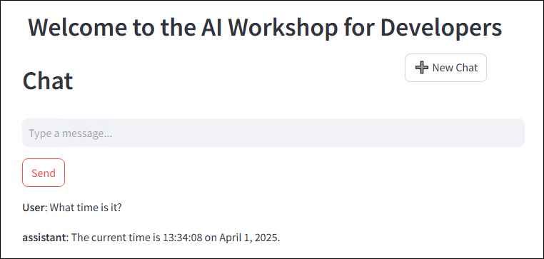
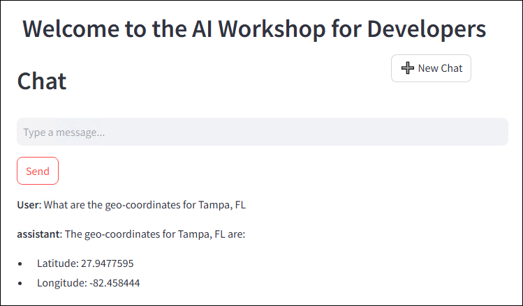
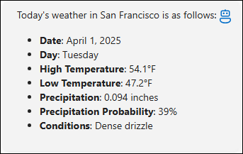

# 演習 5: セマンティック カーネル プラグイン

### 推定所要時間: 50 分

このハンズオン ラボでは、セマンティック カーネルを使用して LLM 開発を強化するプラグインの力を探ります。AI の拡張性に不慣れな方を対象に設計されており、チャットボットの機能を拡張するためのプラグインの構築と統合をステップバイステップでガイドします。時間プラグインと天気取得プラグインを実装し、AI がトレーニング範囲を超えたリアルタイムおよびコンテキスト データにアクセスできるようにします。さらに、Python でセマンティック カーネル プラグインを開発し、Auto Function Calling を活用してそれらをシームレスに連携させる方法を学びます。

**注意:** - このラボは **C#** と **Python** の両方で実装されています。**どちらの言語に慣れているかに関係なく**、演習を実行できます。コア コンセプトは同じです。特定の言語の手順を表示するには:
- 言語名の横にある小さな **矢印アイコン** (▶) をクリックします。
- これにより、その言語のステップバイステップの手順が表示されます。

お好みの言語を選択して始めましょう！

## 目的
この演習では、次のタスクを実行します:
- タスク 1: 時間プラグインなしでアプリを試す
- タスク 2: 時間プラグインを作成してインポートする
- タスク 3: ジオコーディング プラグインを作成してインポートする
- タスク 4: 天気プラグインを作成してインポートする

## タスク 1: 時間プラグインなしでアプリを試す

このタスクでは、時間プラグインなしでアプリを実行して、そのデフォルトの動作を観察することで、Azure AI Foundry のさまざまなフロー タイプを探索します。

1. 任意の言語で AI チャット アプリを起動し、次のプロンプトを送信します:
   プロンプト:
    ```
    What time is it?
    ```
    >**任意:** 日本語訳のプロンプトは
    ```
    何時ですか？
    ```

2. AI はリアルタイム情報を提供する機能を持っていないため、次のような応答が返されます:
    ```
    I can't provide real-time information, including the current time. You can check the time on your device or through various online sources.
    ```
    >**任意:** 日本語訳は
    ```
    リアルタイムの情報、現在の時刻を含む情報を提供することはできません。お使いのデバイスやさまざまなオンラインソースで時刻を確認してください。
    ```

    

## タスク 2: 時間プラグインを作成してインポートする

このタスクでは、時間プラグインを作成してインポートすることで、アプリの機能を強化し、Azure AI Foundry のさまざまなフロー タイプを探索します。

<details>
<summary><strong>Python</strong></summary>

1. `Python>src>plugins` ディレクトリに移動し、**time_plugin.py (1)** という名前の新しいファイルを作成します。

    

2. ファイルに次のコードを追加します: 

    ```
    from datetime import datetime
    from typing import Annotated
    from semantic_kernel.functions import kernel_function

    class TimePlugin:
        @kernel_function()
        def current_time(self) -> str:
            return datetime.now().strftime("%Y-%m-%d %H:%M:%S")

        @kernel_function()
        def get_year(self, date_str: Annotated[str, "The date string in format YYYY-MM-DD"] = None) -> str:
            if date_str is None:
                return str(datetime.now().year)
            
            try:
                date_obj = datetime.strptime(date_str, "%Y-%m-%d")
                return str(date_obj.year)
            except ValueError:
                return "Invalid date format. Please use YYYY-MM-DD."

        @kernel_function()
        def get_month(self, date_str: Annotated[str, "The date string in format YYYY-MM-DD"] = None) -> str:
            if date_str is None:
                return datetime.now().strftime("%B")
            
            try:
                date_obj = datetime.strptime(date_str, "%Y-%m-%d")
                return date_obj.strftime("%B")  # Full month name
            except ValueError:
                return "Invalid date format. Please use YYYY-MM-DD."

        @kernel_function()
        def get_day_of_week(self, date_str: Annotated[str, "The date string in format YYYY-MM-DD"] = None) -> str:
            if date_str is None:
                return datetime.now().strftime("%A")
            
            try:
                date_obj = datetime.strptime(date_str, "%Y-%m-%d")
                return date_obj.strftime("%A")  # Full weekday name
            except ValueError:
                return "Invalid date format. Please use YYYY-MM-DD."
    ```
3. ファイルを保存します。
4. `Python>src` ディレクトリに移動し、**chat.py (1)** ファイルを開きます。

    

5. ファイルの `#Import Modules` セクションに次のコードを追加します：
    ```
    from semantic_kernel.connectors.ai.open_ai.prompt_execution_settings.azure_chat_prompt_execution_settings import (
        AzureChatPromptExecutionSettings,
    )
    from plugins.time_plugin import TimePlugin
    ```
    
    

6. ファイルの `#Challenge 03 - Create Prompt Execution Settings` **(1)** セクションに次のコードを追加します：
    ```
    execution_settings = AzureChatPromptExecutionSettings()
    execution_settings.function_choice_behavior = FunctionChoiceBehavior.Auto()
    logger.info("Automatic function calling enabled")
    ```

    

7. ファイルの `# Placeholder for Time plugin` セクションに次のコードを追加します：
    ```
    time_plugin = TimePlugin()
    kernel.add_plugin(time_plugin, plugin_name="TimePlugin")
    logger.info("Time plugin loaded")
    ```

    

8. Ctrl+F を使用して次のコードを検索し、ファイルから削除します。自動関数呼び出しを有効にするため、これは不要です:
    ```
    execution_settings = kernel.get_prompt_execution_settings_from_service_id("chat-service")
    ```
    >**注意:** これを削除する必要があるコード ブロックは 2つあります。1つは **def initialize_kernel():** 関数内にあり、もう 1つは **global chat_history** コード ブロック内にあります。

9. インデント エラーが発生した場合は、次の URL からコードを使用してください:
    ```
    https://raw.githubusercontent.com/CloudLabsAI-Azure/ai-developer/refs/heads/prod/CodeBase/python/lab-03_time_plugin.py
    ```
10. ファイルを保存します。
11. 左ペインで `Python>src` を右クリックし、**統合ターミナルで開く** を選択します。

    

12. 次のコマンドを使用してアプリを実行します:
    ```
    streamlit run app.py
    ```
13. アプリがブラウザーで自動的に開かない場合は、次の **URL** を使用してアクセスできます:
    ```
    http://localhost:8501
    ```
14. 次のプロンプトを送信します:
    プロンプト:
    ```
    What time is it?
    ```
    >**任意:** 日本語訳のプロンプトは
    ```
    何時ですか？
    ```
15. AI が **時間プラグイン** を持っているため、リアルタイム情報を提供できるようになり、次のような応答が返されます:
    ```
    The current time is 3:43 PM on January 23, 2025.
    ```
    >**任意:** 日本語訳は
    ```
    現在の時刻は2025年1月23日午後3時43分です。
    ```

    

</details>

<details>
<summary><strong>C Sharp(C#)</strong></summary>

1. `Dotnet>src>BlazorAI>Plugins` ディレクトリに移動し、**TimePlugin.cs (1)** という名前の新しいファイルを作成します。

    

2. ファイルに次のコードを追加します：
    ```
    using System;
    using System.ComponentModel;
    using System.Globalization;
    using Microsoft.SemanticKernel;

    namespace BlazorAI.Plugins
    {
        public class TimePlugin
        {        
            [KernelFunction("current_time")]
            [Description("Gets the current date and time from the server. Use this directly when the user asks what time it is or wants to know the current date.")]
            public string CurrentTime()
            {
                return DateTime.Now.ToString("yyyy-MM-dd HH:mm:ss");
            }

            [KernelFunction("get_current_time")]
            [Description("Gets the current date and time from the server's system clock. Use this directly without asking the user for their location.")]
            public string GetCurrentTime()
            {
                return DateTime.Now.ToString("yyyy-MM-dd HH:mm:ss");
            }
            
            [KernelFunction("get_year")]
            [Description("Extract the year from a date string or get the current year from the system clock. Examples: 'What year is it now?' or 'What year is 2023-05-15?'")]
            public string GetYear(
                [Description("The date string. Accepts formats like YYYY-MM-DD, MM/DD/YYYY, etc. If not provided, uses the server's current date.")] 
                string? dateStr = null)
            {
                if (string.IsNullOrEmpty(dateStr))
                {
                    return DateTime.Now.Year.ToString();
                }

                DateTime date;
                if (TryParseDate(dateStr, out date))
                {
                    return date.Year.ToString();
                }
                
                return $"Could not parse '{dateStr}' as a valid date. Please provide a date in a standard format like YYYY-MM-DD or MM/DD/YYYY.";
            }
            
            [KernelFunction("get_month")]
            [Description("Extract the month name from a date string or get the current month from the system clock. Examples: 'What month is it now?' or 'What month is 2023-05-15?'")]
            public string GetMonth(
                [Description("The date string. Accepts formats like YYYY-MM-DD, MM/DD/YYYY, etc. If not provided, uses the server's current date.")] 
                string? dateStr = null)
            {
                if (string.IsNullOrEmpty(dateStr))
                {
                    return DateTime.Now.ToString("MMMM");
                }
                
                DateTime date;
                if (TryParseDate(dateStr, out date))
                {
                    return date.ToString("MMMM"); // Full month name
                }
                
                return $"Could not parse '{dateStr}' as a valid date. Please provide a date in a standard format like YYYY-MM-DD or MM/DD/YYYY.";
            }
            
            [KernelFunction("get_day_of_week")]
            [Description("Get the day of week from the server's system clock or for a specific date. Examples: 'What day is it today?' or 'What day of the week is 2023-05-15?'")]
            public string GetDayOfWeek(
                [Description("The date string. Accepts formats like YYYY-MM-DD, MM/DD/YYYY, etc. If not provided, uses the server's current date.")] 
                string? dateStr = null)
            {
                if (string.IsNullOrEmpty(dateStr))
                {
                    return DateTime.Now.ToString("dddd");
                }
                
                DateTime date;
                if (TryParseDate(dateStr, out date))
                {
                    return date.ToString("dddd"); // Full day name
                }
                
                return $"Could not parse '{dateStr}' as a valid date. Please provide a date in a standard format like YYYY-MM-DD or MM/DD/YYYY.";
            }

            private bool TryParseDate(string dateStr, out DateTime result)
            {
                string[] formats = { 
                    "yyyy-MM-dd", "MM/dd/yyyy", "dd/MM/yyyy", 
                    "M/d/yyyy", "d/M/yyyy", "MMM d, yyyy", 
                    "MMMM d, yyyy", "yyyy/MM/dd", "dd-MMM-yyyy"
                };
                
                return DateTime.TryParseExact(
                    dateStr, 
                    formats, 
                    CultureInfo.InvariantCulture,
                    DateTimeStyles.None, 
                    out result) || DateTime.TryParse(dateStr, out result);
            }
        }
    }
    ```
3. ファイルを保存します。
4. `Dotnet>src>BlazorAI>Components>Pages` ディレクトリに移動し、**Chat.razor.cs (1)** ファイルを開きます。

    

5. ファイルの `// Import Models` **(1)** セクションに次のコードを追加します。
    ```
    using Microsoft.SemanticKernel.Connectors.OpenAI;
    using BlazorAI.Plugins;
    using System;
    ```

    

6. **private Kernel? kernel;** を検索し (Ctrl+F を使用)、その下に次のコードを追加します:
    ```
    private OpenAIPromptExecutionSettings? promptSettings;
    ```

    

7. **chatHistory = [];** を検索し (Ctrl+F を使用)、次のコードに行を更新します:
    ```
    chatHistory = new ChatHistory();
    ```

    

8. ファイルの `// Challenge 03 - Create OpenAIPromptExecutionSettings` **(1)** セクションに次のコードを追加します。
    ```
    promptSettings = new OpenAIPromptExecutionSettings
    {
        ToolCallBehavior = ToolCallBehavior.AutoInvokeKernelFunctions,
        Temperature = 0.7,
        TopP = 0.95,
        MaxTokens = 800
    };
    ```

    

9. ファイルの `// Challenge 03 - Add Time Plugin` **(1)** セクションに次のコードを追加します。
    ```
    var timePlugin = new Plugins.TimePlugin();
    kernel.ImportPluginFromObject(timePlugin, "TimePlugin");
    ```

    

10. **var assistantResponse = await chatCompletionService.GetChatMessageContentAsync** を検索し (Ctrl+F を使用)、chatHistory と kernel の間に次のコード行を追加します:
    ```
    executionSettings: promptSettings,
    ```
    >**注意:** 最終的なコードは次のコードに似ています:
    ```
    var assistantResponse = await chatCompletionService.GetChatMessageContentAsync(
        chatHistory: chatHistory,
        executionSettings: promptSettings,
        kernel: kernel);
    ```
    
    

11. インデント エラーが発生した場合は、次の URL からコードを使用してください:
    ```
    https://raw.githubusercontent.com/CloudLabsAI-Azure/ai-developer/refs/heads/prod/CodeBase/c%23/lab-03_time_plugin.cs
    ```
12. ファイルを保存します。
13. 左ペインで `Dotnet>src>Aspire>Aspire.AppHost` を右クリックし、**統合ターミナルで開く** を選択します。

    

14. 次のコマンドを使用してアプリを実行します:
    ```
    dotnet run
    ```
15. ブラウザーで新しいタブを開き、**blazor-aichat** のリンク **https://localhost:7118/** に移動します。
16. 次のプロンプトを送信します:
    プロンプト:
    ```
    What time is it?
    ```
    >**任意:** 日本語訳のプロンプトは
    ```
    何時ですか？
    ```
17. AI が **時間プラグイン** を持っているため、リアルタイム情報を提供できるようになり、次のような応答が返されます:
    ```
    The current time is 3:43 PM on January 23, 2025.
    ```
    >**任意:** 日本語訳は
    ```
    現在の時刻は2025年1月23日午後3時43分です。
    ```

    

</details>

## タスク 3: ジオコーディング プラグインを作成してインポートする

このタスクでは、ジオコーディング プラグインを作成してインポートすることで、位置情報ベースの機能を有効にし、Azure AI Foundry のさまざまなフロー タイプを探索します。

1. ブラウザーで新しいタブを開き、[Geocoding API](https://geocode.maps.co/) ポータルに移動し、上部の **Free API key** ボタンをクリックします。

    

2. 詳細を入力し、**Create Account (1)** をクリックします。

    
    >**注意:** 登録には個人または仕事用のメール ID を使用してください。

3. メールを受信したら、メール内のリンクをクリックしてメールを確認します。
4. 無料の **ジオコーディング API キー** を受け取り、メモ帳に保存して後で使用します。

<details>
<summary><strong>Python</strong></summary>

1. `Python>src` ディレクトリに移動し、**.env** ファイルを開きます。

    

2. 受け取ったジオコーディング API キーを `GEOCODING_API_KEY` の横に貼り付けます。

    
    >**注意:** **.env** ファイル内のすべての値が **二重引用符 (")** で囲まれていることを確認してください。

3. ファイルを保存します。
4. `Python>src` ディレクトリに移動し、**chat.py** ファイルを開きます。

    

5. ファイルの `#Import Modules` セクションに次のコードを追加します。
    ```
    from plugins.geo_coding_plugin import GeoPlugin
    ```

    

6. ファイルの **時間プラグイン** の後に  `# Placeholder for Time plugin` セクションに次のコードを追加します。
    ```
    kernel.add_plugin(
        GeoPlugin(),
        plugin_name="GeoLocation",
    )
    logger.info("GeoLocation plugin loaded")
    ```

    

7. インデント エラーが発生した場合は、次の URL からコードを使用してください:
    ```
    https://raw.githubusercontent.com/CloudLabsAI-Azure/ai-developer/refs/heads/prod/CodeBase/python/lab-03_geo_coding.py
    ```
8. ファイルを保存します。
9. 左ペインで `Python>src` を右クリックし、**統合ターミナルで開く** を選択します。

    

10. 次のコマンドを使用してアプリを実行します:
    ```
    streamlit run app.py
    ```
11. アプリがブラウザーで自動的に開かない場合は、次の **URL** を使用してアクセスできます:
    ```
    http://localhost:8501
    ```
12. 次のプロンプトを送信します:
    プロンプト:
    ```
    What are the geo-coordinates for Tampa, FL?
    ```
    >**任意:** 日本語訳のプロンプトは
    ```
    タンパ、フロリダの地理座標は何ですか？
    ```
13. AI が **ジオコーディング プラグイン** を持っているため、リアルタイム情報を提供できるようになり、次のような応答が返されます:
    ```
    The geo-coordinates for Tampa, FL are:

    Latitude: 27.9477595
    Longitude: -82.458444 
    ```
    >**任意:** 日本語訳は
    ```
    タンパ、フロリダの地理座標は次のとおりです:

    緯度: 27.9477595
    経度: -82.458444 
    ```

    

</details>

<details>
<summary><strong>C Sharp(C#)</strong></summary>

1. `Dotnet>src>BlazorAI` ディレクトリに移動し、**appsettings.json** ファイルを開きます。

    

2. 受け取ったジオコーディング API キーを `GEOCODING_API_KEY` の横に貼り付けます。

    
    >**注意:** **appsettings.json** ファイル内のすべての値が **二重引用符 (")** で囲まれていることを確認してください。

3. ファイルを保存します。
4. `Dotnet>src>BlazorAI>Components>Pages` ディレクトリに移動し、**Chat.razor.cs** ファイルを開きます。

    

5. ファイルの **時間プラグイン** の後に `// Challenge 03 - Add Time Plugin` セクションに次のコードを追加します。
    ```
    var geocodingPlugin = new GeocodingPlugin(
        kernel.Services.GetRequiredService<IHttpClientFactory>(), 
        Configuration);
    kernel.ImportPluginFromObject(geocodingPlugin, "GeocodingPlugin");
    ```

    

6. インデント エラーが発生した場合は、次の URL からコードを使用してください:
    ```
    https://raw.githubusercontent.com/CloudLabsAI-Azure/ai-developer/refs/heads/prod/CodeBase/c%23/lab-03_geo_coding.cs
    ```
7. ファイルを保存します。
8. 左ペインで `Dotnet>src>Aspire>Aspire.AppHost` を右クリックし、**統合ターミナルで開く** を選択します。

    

9. 次のコマンドを使用してアプリを実行します:
    ```
    dotnet run
    ```
10. ブラウザーで新しいタブを開き、**blazor-aichat** のリンク **https://localhost:7118/** 動します。
11. 次のプロンプトを送信します:
    プロンプト:
    ```
    What are the geo-coordinates for Tampa, FL?
    ```
    >**任意:** 日本語訳のプロンプトは
    ```
    タンパ、フロリダの地理座標は何ですか？
    ```
12. AI が **ジオコーディング プラグイン** を持っているため、リアルタイム情報を提供できるようになり、次のような応答が返されます:
    ```
    The geo-coordinates for Tampa, FL are:

    Latitude: 27.9477595
    Longitude: -82.458444 
    ```
    >**任意:** 日本語訳は
    ```
    タンパ、フロリダの地理座標は次のとおりです:

    緯度: 27.9477595
    経度: -82.458444 
    ```

    

</details>

## タスク 4: 天気プラグインを作成してインポートする

このタスクでは、天気プラグインを作成してインポートすることで、天気関連の機能を統合し、Azure AI Foundry のさまざまなフロー タイプを探索します。

<details>
<summary><strong>Python</strong></summary>

1. `Python>src>plugins` ディレクトリに移動し、**weather_plugin.py** という名前の新しいファイルを作成します。

    

2. ファイルに次のコードを追加します：
    ```
    from typing import Annotated
    import requests
    from semantic_kernel.functions import kernel_function
    import json
    from datetime import datetime, timedelta

    class WeatherPlugin:
        @kernel_function(description="Get weather forecast for a location up to 16 days in the future")
        def get_forecast_weather(self, 
                                latitude: Annotated[float, "Latitude of the location"],
                                longitude: Annotated[float, "Longitude of the location"],
                                days: Annotated[int, "Number of days to forecast (up to 16)"] = 16):
            
            # Ensure days is within valid range (API supports up to 16 days)
            if days > 16:
                days = 16
            
            url = (f"https://api.open-meteo.com/v1/forecast"
                f"?latitude={latitude}&longitude={longitude}"
                f"&daily=temperature_2m_max,temperature_2m_min,precipitation_sum,precipitation_probability_max,weather_code"
                f"&amp;current=temperature_2m,relative_humidity_2m,apparent_temperature,precipitation,weather_code,wind_speed_10m"
                f"&temperature_unit=fahrenheit&wind_speed_unit=mph&precipitation_unit=inch"
                f"&forecast_days={days}&timezone=auto")
            
            try:
                response = requests.get(url)
                response.raise_for_status()
                data = response.json()
                
                daily = data.get('daily', {})
                times = daily.get('time', [])
                max_temps = daily.get('temperature_2m_max', [])
                min_temps = daily.get('temperature_2m_min', [])
                precip_sums = daily.get('precipitation_sum', [])
                precip_probs = daily.get('precipitation_probability_max', [])
                weather_codes = daily.get('weather_code', [])
                
                forecasts = []
                for i in range(len(times)):
                    # Convert date string to datetime object for day name
                    date_obj = datetime.strptime(times[i], "%Y-%m-%d")
                    day_name = date_obj.strftime("%A, %B %d")
                    
                    weather_desc = self._get_weather_description(weather_codes[i])
                    
                    forecast = {
                        "date": times[i],
                        "day": day_name,
                        "high_temp": f"{max_temps[i]}°F",
                        "low_temp": f"{min_temps[i]}°F",
                        "precipitation": f"{precip_sums[i]} inches",
                        "precipitation_probability": f"{precip_probs[i]}%",
                        "conditions": weather_desc
                    }
                    forecasts.append(forecast)
                
                result = {
                    "location_coords": f"{latitude}, {longitude}",
                    "forecast_days": len(forecasts),
                    "forecasts": forecasts
                }
                
                # For more concise output in chat
                return json.dumps(result, indent=2)
            except Exception as e:
                return f"Error fetching forecast weather: {str(e)}"
        
        def _get_weather_description(self, code):
            weather_codes = {
                0: "Clear sky",
                1: "Mainly clear", 2: "Partly cloudy", 3: "Overcast",
                45: "Fog", 48: "Depositing rime fog",
                51: "Light drizzle", 53: "Moderate drizzle", 55: "Dense drizzle",
                56: "Light freezing drizzle", 57: "Dense freezing drizzle",
                61: "Slight rain", 63: "Moderate rain", 65: "Heavy rain",
                66: "Light freezing rain", 67: "Heavy freezing rain",
                71: "Slight snow fall", 73: "Moderate snow fall", 75: "Heavy snow fall",
                77: "Snow grains",
                80: "Slight rain showers", 81: "Moderate rain showers", 82: "Violent rain showers",
                85: "Slight snow showers", 86: "Heavy snow showers",
                95: "Thunderstorm", 96: "Thunderstorm with slight hail", 99: "Thunderstorm with heavy hail"
            }
            return weather_codes.get(code, "Unknown")
    ```
3. ファイルを保存します。
4. `Python>src` ディレクトリに移動し、**chat.py** ファイルを開きます。
    

5. ファイルの `#Import Modules` セクションに次のコードを追加します。
    ```
    from plugins.weather_plugin import WeatherPlugin
    ```

    

6. ファイルの **ジオコーディング プラグイン** の後に  `# Placeholder for Time plugin` セクションに次のコードを追加します。
    ```
    kernel.add_plugin(
        WeatherPlugin(),
        plugin_name="Weather",
    )
    logger.info("Weather plugin loaded")
    ```

    

7. インデント エラーが発生した場合は、次の URL からコードを使用してください:
    ```
    https://raw.githubusercontent.com/CloudLabsAI-Azure/ai-developer/refs/heads/prod/CodeBase/python/lab-03_weather.py
    ```
8. ファイルを保存します。
9. 左ペインで `Python>src` を右クリックし、**統合ターミナルで開く** を選択します。

    

10. 次のコマンドを使用してアプリを実行します:
    ```
    streamlit run app.py
    ```
11. アプリがブラウザーで自動的に開かない場合は、次の **URL** を使用してアクセスできます:
    ```
    http://localhost:8501
    ```
12. 次のプロンプトを送信します:
    プロンプト:
    ```
    What is today's weather in San Francisco?
    ```
    >**任意:** 日本語訳のプロンプトは
    ```
    今日のサンフランシスコの天気はどうですか？
    ```
13. 以下のような応答が表示されます:

    

    AI は次の計画を実行して質問に答えますが、異なる順序や異なる関数セットで実行する場合があります:

    1️⃣ AI はセマンティック カーネルに、今日の日付を取得するために時間プラグインの GetDate 関数を呼び出すように依頼し、次の木曜日までの日数を計算します。

    2️⃣ 天気予報には緯度と経度が必要なため、AI はセマンティック カーネルに、サンフランシスコの座標を取得するためにジオコーディング プラグインの GetLocation 関数を呼び出すように指示します。

    3️⃣ 最後に、AI はセマンティック カーネルに、現在の日付/時刻と緯度/経度を渡して、サンフランシスコの座標で次の木曜日の天気予報を取得するために天気プラグインの GetWeatherForecast 関数を呼び出すように依頼します。

    セマンティック カーネルと AI の間の簡略化されたシーケンス図を以下に示します:

    

</details>
<details>
<summary><strong>C Sharp(C#)</strong></summary>

1. `Dotnet>src>BlazorAI>Plugins` ディレクトリに移動し、**WeatherPlugin.cs** という名前の新しいファイルを作成します。

    

2. ファイルに次のコードを追加します：
    ```
    using System;
    using System.Collections.Generic;
    using System.ComponentModel;
    using System.Globalization;
    using System.Net.Http;
    using System.Text.Json;
    using System.Threading.Tasks;
    using Microsoft.SemanticKernel;

    namespace BlazorAI.Plugins
    {
        public class WeatherPlugin
        {
            private readonly IHttpClientFactory _httpClientFactory;

            public WeatherPlugin(IHttpClientFactory httpClientFactory)
            {
                _httpClientFactory = httpClientFactory;
            }

            [KernelFunction("GetWeatherForecast")]
            [Description("Get weather forecast for a location up to 16 days in the future")]
            public async Task<string> GetWeatherForecastAsync(
                [Description("Latitude of the location")] double latitude,
                [Description("Longitude of the location")] double longitude,
                [Description("Number of days to forecast (up to 16)")] int days = 16)
            {
                // Ensure days is within valid range (API supports up to 16 days)
                if (days > 16)
                    days = 16;

                var url = $"https://api.open-meteo.com/v1/forecast" +
                        $"?latitude={latitude}&longitude={longitude}" +
                        $"&daily=temperature_2m_max,temperature_2m_min,precipitation_sum,precipitation_probability_max,weather_code" +
                        $"&current=temperature_2m,relative_humidity_2m,apparent_temperature,precipitation,weather_code,wind_speed_10m" +
                        $"&temperature_unit=fahrenheit&wind_speed_unit=mph&precipitation_unit=inch" +
                        $"&forecast_days={days}&timezone=auto";

                try
                {
                    var httpClient = _httpClientFactory.CreateClient();
                    var response = await httpClient.GetAsync(url);
                    response.EnsureSuccessStatusCode();
                    
                    var content = await response.Content.ReadAsStringAsync();
                    var data = JsonDocument.Parse(content);
                    
                    // Extract daily forecast data
                    var dailyElement = data.RootElement.GetProperty("daily");
                    var times = dailyElement.GetProperty("time").EnumerateArray().ToArray();
                    var maxTemps = dailyElement.GetProperty("temperature_2m_max").EnumerateArray().ToArray();
                    var minTemps = dailyElement.GetProperty("temperature_2m_min").EnumerateArray().ToArray();
                    var precipSums = dailyElement.GetProperty("precipitation_sum").EnumerateArray().ToArray();
                    var precipProbs = dailyElement.GetProperty("precipitation_probability_max").EnumerateArray().ToArray();
                    var weatherCodes = dailyElement.GetProperty("weather_code").EnumerateArray().ToArray();
                    
                    // Build a readable forecast for each day
                    var forecasts = new List<object>();
                    for (int i = 0; i < times.Length; i++)
                    {
                        // Convert date string to DateTime object for day name
                        var dateStr = times[i].GetString();
                        var dateObj = DateTime.Parse(dateStr!);
                        var dayName = dateObj.ToString("dddd, MMMM dd", CultureInfo.InvariantCulture);
                        
                        var weatherDesc = GetWeatherDescription(weatherCodes[i].GetInt32());
                        
                        var forecast = new
                        {
                            date = dateStr,
                            day = dayName,
                            high_temp = $"{maxTemps[i]}°F",
                            low_temp = $"{minTemps[i]}°F", 
                            precipitation = $"{precipSums[i]} inches",
                            precipitation_probability = $"{precipProbs[i]}%",
                            conditions = weatherDesc
                        };
                        
                        forecasts.Add(forecast);
                    }
                    
                    var result = new
                    {
                        location_coords = $"{latitude}, {longitude}",
                        forecast_days = forecasts.Count,
                        forecasts
                    };
                    
                    // For more concise output in chat
                    return JsonSerializer.Serialize(result, new JsonSerializerOptions { WriteIndented = true });
                }
                catch (Exception ex)
                {
                    return $"Error fetching forecast weather: {ex.Message}";
                }
            }
            
            [KernelFunction("GetForecastWithPlugins")]
            [Description("Gets weather forecast for any location by coordinating with Time and Geocoding plugins.")]
            public async Task<string> GetForecastWithPluginsAsync(
                [Description("The kernel instance to use for calling other plugins")] Kernel kernel,
                [Description("The location name (city, address, etc.)")] string location,
                [Description("The day of the week to get forecast for, or number of days in future")] string daySpec = "0")
            {
                try
                {
                    // Step 1: Get current date from Time Plugin
                    var dateResult = await kernel.InvokeAsync("Time", "GetDate");
                    string? todayStr = dateResult.GetValue<string>();
                    if (todayStr == null)
                    {
                        return "Could not determine the current date.";
                    }
                    DateTime today = DateTime.Parse(todayStr);
                    
                    // Step 2: Calculate target day based on specification
                    int daysInFuture;
                    if (int.TryParse(daySpec, out daysInFuture))
                    {
                        // If daySpec is a number, use it directly
                    }
                    else if (Enum.TryParse<DayOfWeek>(daySpec, true, out var targetDay))
                    {
                        // Calculate days until the next occurrence of the target day
                        daysInFuture = ((int)targetDay - (int)today.DayOfWeek + 7) % 7;
                        if (daysInFuture == 0) daysInFuture = 7; // If today is the target day, get next week
                    }
                    else
                    {
                        return $"Invalid day specification: {daySpec}. Please provide a day name or number of days.";
                    }
                    
                    // Step 3: Get location coordinates from Geocoding Plugin
                    var locationResult = await kernel.InvokeAsync("Geocoding", "GetLocation", new() { ["location"] = location });
                    string? locationJson = locationResult.GetValue<string>();
                    
                    if (locationJson == null)
                    {
                        return $"Could not get location data for: {location}";
                    }
                    
                    var locationData = JsonDocument.Parse(locationJson);
                    double latitude, longitude;
                    
                    try {
                        latitude = locationData.RootElement.GetProperty("latitude").GetDouble();
                        longitude = locationData.RootElement.GetProperty("longitude").GetDouble();
                    }
                    catch (Exception)
                    {
                        return $"Could not extract coordinates for location: {location}";
                    }
                    
                    // Step 4: Get weather forecast
                    return await GetWeatherForecastAsync(latitude, longitude, daysInFuture + 1);
                }
                catch (Exception ex)
                {
                    return $"Error coordinating weather forecast: {ex.Message}";
                }
            }

            private string GetWeatherDescription(int code)
            {
                var weatherCodes = new Dictionary<int, string>
                {
                    { 0, "Clear sky" },
                    { 1, "Mainly clear" }, { 2, "Partly cloudy" }, { 3, "Overcast" },
                    { 45, "Fog" }, { 48, "Depositing rime fog" },
                    { 51, "Light drizzle" }, { 53, "Moderate drizzle" }, { 55, "Dense drizzle" },
                    { 56, "Light freezing drizzle" }, { 57, "Dense freezing drizzle" },
                    { 61, "Slight rain" }, { 63, "Moderate rain" }, { 65, "Heavy rain" },
                    { 66, "Light freezing rain" }, { 67, "Heavy freezing rain" },
                    { 71, "Slight snow fall" }, { 73, "Moderate snow fall" }, { 75, "Heavy snow fall" },
                    { 77, "Snow grains" },
                    { 80, "Slight rain showers" }, { 81, "Moderate rain showers" }, { 82, "Violent rain showers" },
                    { 85, "Slight snow showers" }, { 86, "Heavy snow showers" },
                    { 95, "Thunderstorm" }, { 96, "Thunderstorm with slight hail" }, { 99, "Thunderstorm with heavy hail" }
                };
                
                return weatherCodes.TryGetValue(code, out var description) ? description : "Unknown";
            }
        }
    }
    ```
3. ファイルを保存します。
4. `Dotnet>src>BlazorAI>Components>Pages` ディレクトリに移動し、**Chat.razor.cs** ファイルを開きます。

    

5. ファイルの **ジオコーディング プラグイン** の後に `// Challenge 03 - Add Time Plugin` セクションに次のコードを追加します。
    ```
    var weatherPlugin = new WeatherPlugin(
        kernel.Services.GetRequiredService<IHttpClientFactory>());
        kernel.ImportPluginFromObject(weatherPlugin, "WeatherPlugin");
    ```

    

6. インデント エラーが発生した場合は、次の URL からコードを使用してください:
    ```
    https://raw.githubusercontent.com/CloudLabsAI-Azure/ai-developer/refs/heads/prod/CodeBase/c%23/lab-03_weather.cs
    ```
7. ファイルを保存します。
8. 左ペインで `Dotnet>src>Aspire>Aspire.AppHost` を右クリックし、**統合ターミナルで開く** を選択します。

    

9. 次のコマンドを使用してアプリを実行します:
    ```
    dotnet run
    ```
10. ブラウザーで新しいタブを開き、**blazor-aichat** のリンク **https://localhost:7118/** に移動します。
11. 次のプロンプトを送信します:
    プロンプト:
    ```
    What is today's weather in San Francisco?
    ```
    >**任意:** 日本語訳のプロンプトは
    ```
    今日のサンフランシスコの天気はどうですか？
    ```
12. 以下のような応答が表示されます:

    

    AI は次の計画を実行して質問に答えますが、異なる順序や異なる関数セットで実行する場合があります:

    1️⃣ AI はセマンティック カーネルに、今日の日付を取得するために時間プラグインの GetDate 関数を呼び出すように依頼し、次の木曜日までの日数を計算します。

    2️⃣ 天気予報には緯度と経度が必要なため、AI はセマンティック カーネルに、サンフランシスコの座標を取得するためにジオコーディング プラグインの GetLocation 関数を呼び出すように指示します。

    3️⃣ 最後に、AI はセマンティック カーネルに、現在の日付/時刻と緯度/経度を渡して、サンフランシスコの座標で次の木曜日の天気予報を取得するために天気プラグインの GetWeatherForecast 関数を呼び出すように依頼します。

    セマンティック カーネルと AI の間の簡略化されたシーケンス図を以下に示します:

    

</details>

## レビュー

この演習では、**セマンティック カーネル プラグイン**を使用してチャットボットの機能を拡張することで、LLM の機能を強化しました。リアルタイムでコンテキストに基づいた応答を可能にするために、**時間プラグイン**と**天気取得プラグイン**を開発して統合しました。さらに、Python でプラグインを構築し、**Auto Function Calling** を使用してそれらをシームレスに連携させました。これにより、セマンティック カーネルを使用して拡張可能でインテリジェントな AI ソリューションを構築する能力が向上しました。

**セマンティック カーネル プラグイン**を使用して **LLM の機能**を拡張するために以下のタスクを正常に完了しました:  

- リアルタイムでコンテキストに基づいた応答を可能にするために、**時間プラグイン**と**天気取得プラグイン**を開発して統合しました。
- モデルのトレーニング データを超えてチャットボットの機能を強化するために**セマンティック カーネル**を活用しました。
- 複数のプラグインをシームレスに連携させるために **Auto Function Calling** を実装しました。
- AI の機能を拡張するために **Python ベースのプラグイン**を構築して展開しました。 

## ナビゲーションをクリックして次のラボに進みます。
