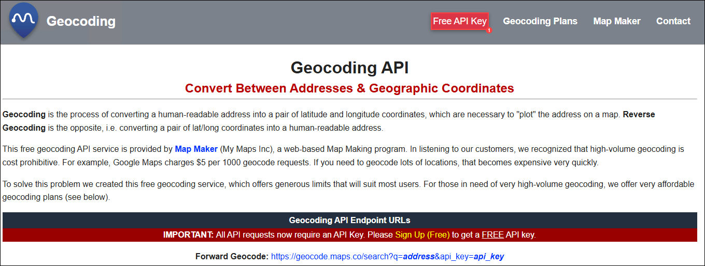
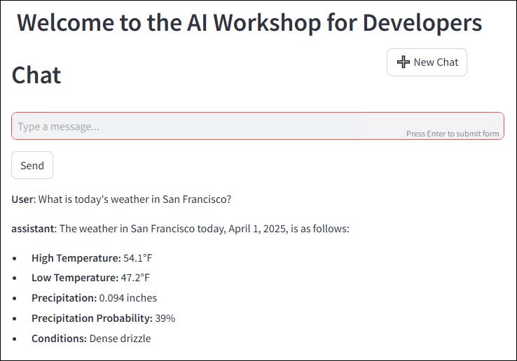
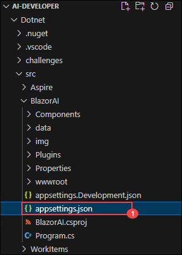

# 실습 5: Semantic Kernel 플러그인

### 예상 소요 시간: 50분

이 실습에서는 Semantic Kernel을 사용하여 LLM(대형 언어 모델) 개발을 개선하는 강력한 플러그인(Plug-in) 기능에 대해서 살펴봅니다. AI 확장성(AI extensibility)에 익숙하지 않은 사용자를 위해, 플러그인을 개발하고 챗봇에 통합하는 과정을 안내하여, 모델의 기능을 개선하는 방법을 배웁니다. AI가 트레이닝된 내용에 국한하여 답변하지 않고, 실시간 정보나 문맥 정보를 사용하도록 시간과 날씨를 가져오는 플러그인을 구현할 볼 것입니다. 또한 Python을 활용한 Semantic Kernel 플러그인 개발 방법과, Auto Function Calling 기능을 이용해 플러그인 간 연결을 자동화하는 방법도 학습합니다.

**참고:** 이 실습은 **C#**과 **Python** 두 언어로 구현되어 있습니다.**편한 언어를 선택하여 실습을 진행하시면 됩니다.** 핵심 개념은 동일합니다. 언어별 지침을 확인하려면 다음을 수행하세요:

- 언어 이름 옆에 있는 **작은 화살표 아이콘(▶)** 을 클릭합니다.
- 단계별 지침이 표시됩니다.

선호하는 언어를 선택하고 실습을 시작해 보세요!

## 목표

이 실습에서는 다음 과제를 수행하게 됩니다:

- 과제 1: Time 플러그인 없이 앱을 실행해 보기
- 과제 2: Time 플러그인을 생성하고 가져오기
- 과제 3: Geocoding 플러그인을 생성하고 가져오기
- 과제 4: Weather 플러그인을 생성하고 가져오기

## 과제 1: Time 플러그인 없이 앱을 실행해 보기

이 과제에서는 Azure AI Foundry에서 제공하는 다양한 플로우 유형 중, Time Plugin 없이 앱을 실행하여 기본 동작 방식을 관찰합니다.

1. 원하는 언어(C# 또는 Python)를 선택하여 AI 챗봇 애플리케이션을 실행한 후, 다음과 같은 프롬프트를 입력하세요.

   ```
   What time is it?
   ```
   (몇시인가요?)

1. 현재 AI 모델은 실시간 정보를 제공할 수 있는 기능이 없기 때문에, 다음과 유사한 응답이 출력됩니다.

   ```
   I can't provide real-time information, including the current time. You can check the time on your device or through various online sources.
   ```
   (현재 시간을 포함한 실시간 정보는 제공할 수 없습니다. 사용 중인 기기나 인터넷을 통해 시간을 확인해 주세요.)

   

## 과제 2: Time 플러그인을 생성하고 가져오기

이 과제에서는 Azure AI Foundry의 다양한 플로우 유형을 탐색하면서, Time 플러그인을 생성하고 앱에 가져오는 작업을 수행합니다. 이를 통해 애플리케이션의 기능을 확장할 수 있습니다.

<details>
<summary><strong>Python</strong></summary>

1. `Python>src>plugins` 디렉터리로 이동하여 **time\_plugin.py (1)** 라는 새 파일을 생성합니다.

   

1. 아래 코드를 파일에 추가합니다:

   ```python
   from datetime import datetime
   from typing import Annotated
   from semantic_kernel.functions import kernel_function

   class TimePlugin:
       @kernel_function()
       def current_time(self) -> str:
           return datetime.now().strftime("%Y-%m-%d %H:%M:%S")

       @kernel_function()
       def get_year(self, date_str: Annotated[str, "The date string in format YYYY-MM-DD"] = None) -> str:
           if date_str is None:
               return str(datetime.now().year)
           
           try:
               date_obj = datetime.strptime(date_str, "%Y-%m-%d")
               return str(date_obj.year)
           except ValueError:
               return "Invalid date format. Please use YYYY-MM-DD."

       @kernel_function()
       def get_month(self, date_str: Annotated[str, "The date string in format YYYY-MM-DD"] = None) -> str:
           if date_str is None:
               return datetime.now().strftime("%B")
           
           try:
               date_obj = datetime.strptime(date_str, "%Y-%m-%d")
               return date_obj.strftime("%B")  # 월 이름 전체 반환
           except ValueError:
               return "Invalid date format. Please use YYYY-MM-DD."

       @kernel_function()
       def get_day_of_week(self, date_str: Annotated[str, "The date string in format YYYY-MM-DD"] = None) -> str:
           if date_str is None:
               return datetime.now().strftime("%A")
           
           try:
               date_obj = datetime.strptime(date_str, "%Y-%m-%d")
               return date_obj.strftime("%A")  # 요일 이름 전체 반환
           except ValueError:
               return "Invalid date format. Please use YYYY-MM-DD."
   ```

1. 파일을 저장합니다.

1. `Python>src` 디렉터리로 이동하여 **chat.py** 파일을 엽니다.

   

1. `#Import Modules` 섹션에 아래 코드를 추가합니다:

   ```python
   from semantic_kernel.connectors.ai.open_ai.prompt_execution_settings.azure_chat_prompt_execution_settings import (
       AzureChatPromptExecutionSettings,
   )
   from plugins.time_plugin import TimePlugin
   ```

   

1. `#Challenge 03 - Create Prompt Execution Settings` 섹션에 아래 코드를 추가합니다:

   ```python
   execution_settings = AzureChatPromptExecutionSettings()
   execution_settings.function_choice_behavior = FunctionChoiceBehavior.Auto()
   logger.info("Automatic function calling enabled")
   ```

   

1. `# Placeholder for Time plugin` 섹션에 아래 코드를 추가합니다:

   ```python
   time_plugin = TimePlugin()
   kernel.add_plugin(time_plugin, plugin_name="TimePlugin")
   logger.info("Time plugin loaded")
   ```

   

1. Ctrl+F를 눌러 다음 코드를 검색한 후 제거합니다. 자동 함수 호출 기능을 사용할 것이므로 더 이상 필요하지 않습니다:

   ```python
   execution_settings = kernel.get_prompt_execution_settings_from_service_id("chat-service")
   ```

   > **주의**: 이 코드는 두 곳에서 제거해야 합니다. 하나는 **initialize\_kernel()** 함수 내부이고, 다른 하나는 **global chat\_history** 코드 블록 안에 있습니다.

1. 들여쓰기 오류가 발생할 경우 다음 URL의 코드를 참조하세요:

   ```
   https://raw.githubusercontent.com/CloudLabsAI-Azure/ai-developer/refs/heads/prod/CodeBase/python/lab-03_time_plugin.py
   ```

1. 파일을 저장합니다.

1. 왼쪽 패널에서 `Python>src` 폴더를 우클릭하고 **Open in Integrated Terminal** 을 선택합니다.

    

1. 다음 명령어를 사용해 앱을 실행합니다:

    ```bash
    streamlit run app.py
    ```

1. 앱이 자동으로 브라우저에서 열리지 않는 경우, 다음 **URL** 을 사용해 수동으로 접근할 수 있습니다:

    ```
    http://localhost:8501
    ```

1. 다음 프롬프트를 입력합니다:

    ```
    What time is it?
    ```
    (몇 시 입니까?)

1. AI가 **Time Plugin** 을 사용하므로 실시간 정보를 제공할 수 있으며, 다음과 유사한 응답을 받을 수 있습니다:

    ```
    The current time is 3:43 PM on January 23, 2025.
    ```
    (현재시간은 2025년 1월 23일 3:43 PM 입니다.)
    

</details>

<details>
<summary><strong>C Sharp(C#)</strong></summary>

1. `Dotnet>src>BlazorAI>Plugins` 디렉터리로 이동하여 **TimePlugin.cs** 라는 새 파일을 생성합니다.

   

1. 아래 코드를 파일에 추가합니다:

   ```csharp
    using System;
    using System.ComponentModel;
    using System.Globalization;
    using Microsoft.SemanticKernel;

    namespace BlazorAI.Plugins
    {
        public class TimePlugin
        {        
            [KernelFunction("current_time")]
            [Description("Gets the current date and time from the server. Use this directly when the user asks what time it is or wants to know the current date.")]
            public string CurrentTime()
            {
                return DateTime.Now.ToString("yyyy-MM-dd HH:mm:ss");
            }

            [KernelFunction("get_current_time")]
            [Description("Gets the current date and time from the server's system clock. Use this directly without asking the user for their location.")]
            public string GetCurrentTime()
            {
                return DateTime.Now.ToString("yyyy-MM-dd HH:mm:ss");
            }
            
            [KernelFunction("get_year")]
            [Description("Extract the year from a date string or get the current year from the system clock. Examples: 'What year is it now?' or 'What year is 2023-05-15?'")]
            public string GetYear(
                [Description("The date string. Accepts formats like YYYY-MM-DD, MM/DD/YYYY, etc. If not provided, uses the server's current date.")] 
                string? dateStr = null)
            {
                if (string.IsNullOrEmpty(dateStr))
                {
                    return DateTime.Now.Year.ToString();
                }

                DateTime date;
                if (TryParseDate(dateStr, out date))
                {
                    return date.Year.ToString();
                }
                
                return $"Could not parse '{dateStr}' as a valid date. Please provide a date in a standard format like YYYY-MM-DD or MM/DD/YYYY.";
            }
            
            [KernelFunction("get_month")]
            [Description("Extract the month name from a date string or get the current month from the system clock. Examples: 'What month is it now?' or 'What month is 2023-05-15?'")]
            public string GetMonth(
                [Description("The date string. Accepts formats like YYYY-MM-DD, MM/DD/YYYY, etc. If not provided, uses the server's current date.")] 
                string? dateStr = null)
            {
                if (string.IsNullOrEmpty(dateStr))
                {
                    return DateTime.Now.ToString("MMMM");
                }
                
                DateTime date;
                if (TryParseDate(dateStr, out date))
                {
                    return date.ToString("MMMM"); // Full month name
                }
                
                return $"Could not parse '{dateStr}' as a valid date. Please provide a date in a standard format like YYYY-MM-DD or MM/DD/YYYY.";
            }
            
            [KernelFunction("get_day_of_week")]
            [Description("Get the day of week from the server's system clock or for a specific date. Examples: 'What day is it today?' or 'What day of the week is 2023-05-15?'")]
            public string GetDayOfWeek(
                [Description("The date string. Accepts formats like YYYY-MM-DD, MM/DD/YYYY, etc. If not provided, uses the server's current date.")] 
                string? dateStr = null)
            {
                if (string.IsNullOrEmpty(dateStr))
                {
                    return DateTime.Now.ToString("dddd");
                }
                
                DateTime date;
                if (TryParseDate(dateStr, out date))
                {
                    return date.ToString("dddd"); // Full day name
                }
                
                return $"Could not parse '{dateStr}' as a valid date. Please provide a date in a standard format like YYYY-MM-DD or MM/DD/YYYY.";
            }

            private bool TryParseDate(string dateStr, out DateTime result)
            {
                string[] formats = { 
                    "yyyy-MM-dd", "MM/dd/yyyy", "dd/MM/yyyy", 
                    "M/d/yyyy", "d/M/yyyy", "MMM d, yyyy", 
                    "MMMM d, yyyy", "yyyy/MM/dd", "dd-MMM-yyyy"
                };
                
                return DateTime.TryParseExact(
                    dateStr, 
                    formats, 
                    CultureInfo.InvariantCulture,
                    DateTimeStyles.None, 
                    out result) || DateTime.TryParse(dateStr, out result);
            }
        }
    }
   ```

1. 파일을 저장합니다.

1. `Dotnet>src>BlazorAI>Components>Pages` 디렉터리로 이동하여 **Chat.razor.cs** 파일을 엽니다.

   

1. `// Import Models` 섹션에 다음 코드를 추가합니다:

   ```csharp
   using Microsoft.SemanticKernel.Connectors.OpenAI;
   using BlazorAI.Plugins;
   using System;
   ```

   

1. **private Kernel? kernel;** 를 검색(Ctrl+F)하고, 그 아래에 다음 코드를 추가합니다:

   ```csharp
   private OpenAIPromptExecutionSettings? promptSettings;
   ```

   

1. **chatHistory = \[];** 를 검색(Ctrl+F)하여 다음 코드로 수정합니다:

   ```csharp
   chatHistory = new ChatHistory();
   ```

   

1. `// Challenge 03 - Create OpenAIPromptExecutionSettings` (1) 섹션에 다음 코드를 추가합니다:

   ```csharp
   promptSettings = new OpenAIPromptExecutionSettings
   {
       ToolCallBehavior = ToolCallBehavior.AutoInvokeKernelFunctions,
       Temperature = 0.7,
       TopP = 0.95,
       MaxTokens = 800
   };
   ```

   

1. `// Challenge 03 - Add Time Plugin` 섹션에 다음 코드를 추가합니다:

   ```csharp
   var timePlugin = new Plugins.TimePlugin();
   kernel.ImportPluginFromObject(timePlugin, "TimePlugin");
   ```

   

1. **var assistantResponse = await chatCompletionService.GetChatMessageContentAsync** 코드를 검색(Ctrl+F)하고, `chatHistory`와 `kernel` 사이에 아래 코드를 추가합니다:

    ```csharp
    executionSettings: promptSettings,
    ```

    > **참고**: 최종 코드는 다음과 유사하게 됩니다:

    ```csharp
    var assistantResponse = await chatCompletionService.GetChatMessageContentAsync(
        chatHistory: chatHistory,
        executionSettings: promptSettings,
        kernel: kernel);
    ```

    

1. 들여쓰기 오류가 발생할 경우 다음 URL의 코드를 참조하세요:

    ```
    https://raw.githubusercontent.com/CloudLabsAI-Azure/ai-developer/refs/heads/prod/CodeBase/c%23/lab-03_time_plugin.cs
    ```

1. 파일을 저장합니다.

1. 왼쪽 패널에서 `Dotnet>src>Aspire>Aspire.AppHost` 폴더를 우클릭하고 **Open in Integrated Terminal**을 선택합니다.

    

1. 다음 명령어로 앱을 실행합니다:

    ```bash
    dotnet run
    ```

1. 브라우저에서 새 탭을 열고 다음 주소로 이동합니다:

    ```
    https://localhost:7118/
    ```

1. 다음 프롬프트를 입력합니다:

    ```
    What time is it?
    ```
    (몇 시 입니까?)
1. AI가 **Time Plugin**을 로드했기 때문에, 실시간 정보를 반환할 수 있으며 다음과 유사한 응답을 확인할 수 있습니다:

    ```
    The current time is 3:43 PM on January 23, 2025.
    ```
    (현재시간은 2025년 1월 23일 3:43 PM 입니다.)
    

</details>

## 과제 3: Geocoding 플러그인을 생성하고 가져오기

이 과제에서는 위치 기반 기능을 구현하기 위해 Geocoding Plugin을 생성하고 가져오는 과정을 통해 Azure AI Foundry의 다양한 플로우 유형을 살펴봅니다. 

1. 브라우저에서 새 탭을 열고 [Geocoding API](https://geocode.maps.co/) 포털로 이동한 다음 상단에 있는 **Free API key** 버튼을 클릭합니다.

   

1. 정보를 입력하고 **Create Account (1)** 버튼을 클릭합니다.

   

   > **참고**: 개인용 또는 회사용 이메일 주소를 사용해 등록하세요.

1. 이메일을 수신하면, 해당 이메일에 포함된 링크를 클릭하여 이메일을 인증합니다.

1. 인증이 완료되면 무료 **Geocoding API 키** 를 받게 됩니다. 해당 키를 메모장 등에 저장해 두세요.

<details>

<summary><strong>Python</strong></summary>

1. `Python>src` 디렉터리로 이동하여 **.env** 파일을 엽니다.

   

1. 이메일로 방금 받은 **geocoding API key**를 `GEOCODING_API_KEY` 항목 옆에 붙여넣습니다.

   

   > **참고**: `.env` 파일 내의 모든 값은 반드시 **큰따옴표(")** 로 감싸야 합니다.

1. 파일을 저장합니다.

1. `Python>src` 디렉터리로 이동하여 **chat.py** 파일을 엽니다.

   

1. 파일 내 `#Import Modules` 섹션에 다음 코드를 추가합니다.

   ```
   from plugins.geo_coding_plugin import GeoPlugin
   ```

   

1. `# Placeholder for Time plugin` 섹션에서 **time plugin** 다음 위치에 다음 코드를 추가합니다.

   ```
   kernel.add_plugin(
       GeoPlugin(),
       plugin_name="GeoLocation",
   )
   logger.info("GeoLocation plugin loaded")
   ```

   

1. 만약 들여쓰기 오류가 발생한다면, 아래 URL의 코드를 참고하여 수정하세요:

   ```
   https://raw.githubusercontent.com/CloudLabsAI-Azure/ai-developer/refs/heads/prod/CodeBase/python/lab-03_geo_coding.py
   ```

1. 파일을 저장합니다.

1. 왼쪽 패널에서 `Python>src` 폴더를 **오른쪽 클릭**하고 **Open in Integrated Terminal**을 선택합니다.

   

1. 아래 명령어를 실행하여 앱을 실행합니다:

    ```
    streamlit run app.py
    ```

1. 앱이 자동으로 브라우저에 열리지 않으면, 아래 **URL**을 통해 수동으로 접속할 수 있습니다:

    ```
    http://localhost:8501
    ```

1. 다음 프롬프트를 입력해 보세요:

    ```
    What are the geo-coordinates for Tampa, FL
    ```
    (미국 플로리다주 탬파(Tampa)의 지리 좌표는 무엇인가요)

1. AI가 **Geocoding Plugin**을 가지고 있기 때문에, 실시간 정보를 기반으로 아래와 같은 응답을 제공할 수 있습니다:

    ```
    The geo-coordinates for Tampa, FL are:

    Latitude: 27.9477595
    Longitude: -82.458444 
    ```

    

</details>

<details>
<summary><strong>C Sharp(C#)</strong></summary>

1. `Dotnet>src>BlazorAI` 디렉터리로 이동하여 **appsettings.json** 파일을 엽니다.

   

1. 방금 이메일로 받은 지오코딩 API 키를 `GEOCODING_API_KEY` 항목 옆에 붙여넣습니다.

   

   > **참고**: **appsettings.json** 파일 내의 모든 값은 **큰따옴표(")** 로 감싸야 합니다.

1. 파일을 저장합니다.

1. `Dotnet>src>BlazorAI>Components>Pages` 디렉터리로 이동하여 **Chat.razor.cs** 파일을 엽니다.

   

1. 해당 파일에서 `// Challenge 03 - Add Time Plugin` 주석 아래, **time plugin** 코드 다음에 다음 코드를 추가합니다:

   ```csharp
   var geocodingPlugin = new GeocodingPlugin(
       kernel.Services.GetRequiredService<IHttpClientFactory>(), 
       Configuration);
   kernel.ImportPluginFromObject(geocodingPlugin, "GeocodingPlugin");
   ```

   

1. 만약 들여쓰기 오류가 발생한다면, 아래 URL에 있는 코드를 참고하여 수정하세요:

   ```
   https://raw.githubusercontent.com/CloudLabsAI-Azure/ai-developer/refs/heads/prod/CodeBase/c%23/lab-03_geo_coding.cs
   ```

1. 파일을 저장합니다.

1. 왼쪽 탐색 창에서 `Dotnet>src>Aspire>Aspire.AppHost` 폴더를 우클릭하고 **Open in Integrated Terminal**을 선택합니다.

   

1. 아래 명령어를 입력하여 앱을 실행합니다:

   ```
   dotnet run
   ```

1. 브라우저에서 새 탭을 열고 **blazor-aichat** 앱 링크인 **[https://localhost:7118/](https://localhost:7118/)** 로 이동합니다.

1. 다음 프롬프트를 입력합니다:

    ```
    What are the geo-coordinates for Tampa, FL
    ```
    (미국 플로리다주 탬파(Tampa)의 지리 좌표는 무엇인가요)

1. AI가 **Geocoding Plugin** 을 갖추고 있기 때문에 실시간 정보를 제공할 수 있으며, 아래와 비슷한 응답을 받을 수 있습니다:

    ```
    The geo-coordinates for Tampa, FL are:

    Latitude: 27.9477595
    Longitude: -82.458444 
    ```


</details>

## 과제 4: Weather 플러그인을 생성하고 가져오기

이 과제에서는 Weather Plugin(날씨 플러그인)을 생성하고 가져오는 과정을 통해, Azure AI Foundry에서 다양한 플로우 유형을 탐색하고 날씨 관련 기능을 통합하는 방법을 실습합니다.

<details>
<summary><strong>Python</strong></summary>

1. `Python > src > plugins` 디렉터리로 이동한 후, **`weather_plugin.py`** 라는 새 파일을 생성합니다.

   

1. 아래 코드를 파일에 추가합니다:

   ```python
   from typing import Annotated
   import requests
   from semantic_kernel.functions import kernel_function
   import json
   from datetime import datetime, timedelta

   class WeatherPlugin:
       @kernel_function(description="Get weather forecast for a location up to 16 days in the future")
       def get_forecast_weather(self, 
                               latitude: Annotated[float, "Latitude of the location"],
                               longitude: Annotated[float, "Longitude of the location"],
                               days: Annotated[int, "Number of days to forecast (up to 16)"] = 16):
           
           # API 지원 범위 내의 일 수만 허용
           if days > 16:
               days = 16
           
           url = (f"https://api.open-meteo.com/v1/forecast"
               f"?latitude={latitude}&longitude={longitude}"
               f"&daily=temperature_2m_max,temperature_2m_min,precipitation_sum,precipitation_probability_max,weather_code"
               f"&amp;current=temperature_2m,relative_humidity_2m,apparent_temperature,precipitation,weather_code,wind_speed_10m"
               f"&temperature_unit=fahrenheit&wind_speed_unit=mph&precipitation_unit=inch"
               f"&forecast_days={days}&timezone=auto")
           
           try:
               response = requests.get(url)
               response.raise_for_status()
               data = response.json()
               
               daily = data.get('daily', {})
               times = daily.get('time', [])
               max_temps = daily.get('temperature_2m_max', [])
               min_temps = daily.get('temperature_2m_min', [])
               precip_sums = daily.get('precipitation_sum', [])
               precip_probs = daily.get('precipitation_probability_max', [])
               weather_codes = daily.get('weather_code', [])
               
               forecasts = []
               for i in range(len(times)):
                   date_obj = datetime.strptime(times[i], "%Y-%m-%d")
                   day_name = date_obj.strftime("%A, %B %d")
                   
                   weather_desc = self._get_weather_description(weather_codes[i])
                   
                   forecast = {
                       "date": times[i],
                       "day": day_name,
                       "high_temp": f"{max_temps[i]}°F",
                       "low_temp": f"{min_temps[i]}°F",
                       "precipitation": f"{precip_sums[i]} inches",
                       "precipitation_probability": f"{precip_probs[i]}%",
                       "conditions": weather_desc
                   }
                   forecasts.append(forecast)
               
               result = {
                   "location_coords": f"{latitude}, {longitude}",
                   "forecast_days": len(forecasts),
                   "forecasts": forecasts
               }
               
               return json.dumps(result, indent=2)
           except Exception as e:
               return f"Error fetching forecast weather: {str(e)}"
       
       def _get_weather_description(self, code):
           weather_codes = {
               0: "Clear sky", 1: "Mainly clear", 2: "Partly cloudy", 3: "Overcast",
               45: "Fog", 48: "Depositing rime fog",
               51: "Light drizzle", 53: "Moderate drizzle", 55: "Dense drizzle",
               56: "Light freezing drizzle", 57: "Dense freezing drizzle",
               61: "Slight rain", 63: "Moderate rain", 65: "Heavy rain",
               66: "Light freezing rain", 67: "Heavy freezing rain",
               71: "Slight snow fall", 73: "Moderate snow fall", 75: "Heavy snow fall",
               77: "Snow grains",
               80: "Slight rain showers", 81: "Moderate rain showers", 82: "Violent rain showers",
               85: "Slight snow showers", 86: "Heavy snow showers",
               95: "Thunderstorm", 96: "Thunderstorm with slight hail", 99: "Thunderstorm with heavy hail"
           }
           return weather_codes.get(code, "Unknown")
   ```

1. 파일을 저장합니다.

1. `Python > src` 디렉터리로 이동해 **`chat.py`** 파일을 엽니다.

   

1. `#Import Modules` 섹션에 아래 코드를 추가합니다:

   ```python
   from plugins.weather_plugin import WeatherPlugin
   ```

   

1. `# Placeholder for Time plugin` 아래에, Geocoding Plugin 다음으로 다음 코드를 추가합니다:

   ```python
   kernel.add_plugin(
       WeatherPlugin(),
       plugin_name="Weather",
   )
   logger.info("Weather plugin loaded")
   ```

   

1. 들여쓰기 오류가 발생하는 경우, 아래 URL의 코드를 참고하여 수정하세요:
   ```
   https://raw.githubusercontent.com/CloudLabsAI-Azure/ai-developer/refs/heads/prod/CodeBase/python/lab-03_weather.py
   ```

1. 파일을 저장합니다.

1. `Python > src` 폴더에서 마우스 오른쪽 버튼을 클릭하고 **Open in Integrated Terminal** 을 선택합니다.

   

1. 다음 명령어를 입력해 앱을 실행합니다:
   ```bash
   streamlit run app.py
   ```

1. 브라우저가 자동으로 열리지 않으면 아래 **URL**을 직접 입력해 접속합니다:
   ```
   http://localhost:8501
   ```

1. 다음 프롬프트를 입력합니다:
   ```
   What is today's weather in San Francisco?
   ```

1. 아래와 유사한 응답을 받게 됩니다:
   

AI는 질문에 답하기 위해 다음과 같이 계획을 수행합니다. 다만, 이 계획은 실행 순서나 사용되는 함수가 일부 다를 수 있습니다:

1️⃣ AI는 Semantic Kernel에 Time Plugin의 `GetDate` 함수를 호출하도록 요청하여, 오늘 날짜를 가져옵니다. 이는 다음 주 목요일까지 며칠 남았는지 계산하기 위해 필요합니다.

2️⃣ 날씨 예보 기능은 위도와 경도가 필요하므로, AI는 Semantic Kernel에 Geocoding Plugin의 `GetLocation` 함수를 호출하여 San Francisco의 좌표를 가져오도록 요청합니다.

3️⃣ 마지막으로, AI는 Semantic Kernel에 Weather Plugin의 `GetWeatherForecast` 함수를 호출하도록 요청하여, 앞서 계산한 오늘로부터 다음 목요일까지의 일 수와 San Francisco의 위도/경도 좌표를 인자로 전달하여 해당 날짜의 날씨 예보를 가져옵니다.

다음은 Semantic Kernel과 AI 간의 상호작용을 단순화한 시퀀스 다이어그램입니다:


</details>

<details>
<summary><strong>C Sharp(C#)</strong></summary>

1. `Dotnet>src>BlazorAI>Plugins` 디렉터리로 이동하여 **WeatherPlugin.cs** 라는 새 파일을 생성합니다.

   

1. 파일에 다음 코드를 추가합니다:

   ```csharp
   using System;
   using System.Collections.Generic;
   using System.ComponentModel;
   using System.Globalization;
   using System.Net.Http;
   using System.Text.Json;
   using System.Threading.Tasks;
   using Microsoft.SemanticKernel;

   namespace BlazorAI.Plugins
   {
       public class WeatherPlugin
       {
           private readonly IHttpClientFactory _httpClientFactory;

           public WeatherPlugin(IHttpClientFactory httpClientFactory)
           {
               _httpClientFactory = httpClientFactory;
           }

           [KernelFunction("GetWeatherForecast")]
           [Description("Get weather forecast for a location up to 16 days in the future")]
           public async Task<string> GetWeatherForecastAsync(
               [Description("Latitude of the location")] double latitude,
               [Description("Longitude of the location")] double longitude,
               [Description("Number of days to forecast (up to 16)")] int days = 16)
           {
               // API에서 지원하는 최대 예보 일수는 16일이므로 범위를 제한합니다.
               if (days > 16)
                   days = 16;

               var url = $"https://api.open-meteo.com/v1/forecast" +
                         $"?latitude={latitude}&longitude={longitude}" +
                         $"&daily=temperature_2m_max,temperature_2m_min,precipitation_sum,precipitation_probability_max,weather_code" +
                         $"&current=temperature_2m,relative_humidity_2m,apparent_temperature,precipitation,weather_code,wind_speed_10m" +
                         $"&temperature_unit=fahrenheit&wind_speed_unit=mph&precipitation_unit=inch" +
                         $"&forecast_days={days}&timezone=auto";

               try
               {
                   var httpClient = _httpClientFactory.CreateClient();
                   var response = await httpClient.GetAsync(url);
                   response.EnsureSuccessStatusCode();

                   var content = await response.Content.ReadAsStringAsync();
                   var data = JsonDocument.Parse(content);

                   // 일별 예보 데이터 추출
                   var dailyElement = data.RootElement.GetProperty("daily");
                   var times = dailyElement.GetProperty("time").EnumerateArray().ToArray();
                   var maxTemps = dailyElement.GetProperty("temperature_2m_max").EnumerateArray().ToArray();
                   var minTemps = dailyElement.GetProperty("temperature_2m_min").EnumerateArray().ToArray();
                   var precipSums = dailyElement.GetProperty("precipitation_sum").EnumerateArray().ToArray();
                   var precipProbs = dailyElement.GetProperty("precipitation_probability_max").EnumerateArray().ToArray();
                   var weatherCodes = dailyElement.GetProperty("weather_code").EnumerateArray().ToArray();

                   // 각 날짜별로 예보 정보를 구성
                   var forecasts = new List<object>();
                   for (int i = 0; i < times.Length; i++)
                   {
                       var dateStr = times[i].GetString();
                       var dateObj = DateTime.Parse(dateStr!);
                       var dayName = dateObj.ToString("dddd, MMMM dd", CultureInfo.InvariantCulture);

                       var weatherDesc = GetWeatherDescription(weatherCodes[i].GetInt32());

                       var forecast = new
                       {
                           date = dateStr,
                           day = dayName,
                           high_temp = $"{maxTemps[i]}°F",
                           low_temp = $"{minTemps[i]}°F",
                           precipitation = $"{precipSums[i]} inches",
                           precipitation_probability = $"{precipProbs[i]}%",
                           conditions = weatherDesc
                       };

                       forecasts.Add(forecast);
                   }

                   var result = new
                   {
                       location_coords = $"{latitude}, {longitude}",
                       forecast_days = forecasts.Count,
                       forecasts
                   };

                   return JsonSerializer.Serialize(result, new JsonSerializerOptions { WriteIndented = true });
               }
               catch (Exception ex)
               {
                   return $"Error fetching forecast weather: {ex.Message}";
               }
           }

           [KernelFunction("GetForecastWithPlugins")]
           [Description("Gets weather forecast for any location by coordinating with Time and Geocoding plugins.")]
           public async Task<string> GetForecastWithPluginsAsync(
               [Description("The kernel instance to use for calling other plugins")] Kernel kernel,
               [Description("The location name (city, address, etc.)")] string location,
               [Description("The day of the week to get forecast for, or number of days in future")] string daySpec = "0")
           {
               try
               {
                   // 1단계: Time Plugin을 이용해 현재 날짜 가져오기
                   var dateResult = await kernel.InvokeAsync("Time", "GetDate");
                   string? todayStr = dateResult.GetValue<string>();
                   if (todayStr == null)
                   {
                       return "Could not determine the current date.";
                   }
                   DateTime today = DateTime.Parse(todayStr);

                   // 2단계: daySpec 값을 기준으로 예보 대상 날짜 계산
                   int daysInFuture;
                   if (int.TryParse(daySpec, out daysInFuture))
                   {
                       // 숫자인 경우 그대로 사용
                   }
                   else if (Enum.TryParse<DayOfWeek>(daySpec, true, out var targetDay))
                   {
                       daysInFuture = ((int)targetDay - (int)today.DayOfWeek + 7) % 7;
                       if (daysInFuture == 0) daysInFuture = 7;
                   }
                   else
                   {
                       return $"Invalid day specification: {daySpec}. Please provide a day name or number of days.";
                   }

                   // 3단계: Geocoding Plugin을 통해 위치 좌표 가져오기
                   var locationResult = await kernel.InvokeAsync("Geocoding", "GetLocation", new() { ["location"] = location });
                   string? locationJson = locationResult.GetValue<string>();

                   if (locationJson == null)
                   {
                       return $"Could not get location data for: {location}";
                   }

                   var locationData = JsonDocument.Parse(locationJson);
                   double latitude, longitude;

                   try {
                       latitude = locationData.RootElement.GetProperty("latitude").GetDouble();
                       longitude = locationData.RootElement.GetProperty("longitude").GetDouble();
                   }
                   catch (Exception)
                   {
                       return $"Could not extract coordinates for location: {location}";
                   }

                   // 4단계: 날씨 예보 호출
                   return await GetWeatherForecastAsync(latitude, longitude, daysInFuture + 1);
               }
               catch (Exception ex)
               {
                   return $"Error coordinating weather forecast: {ex.Message}";
               }
           }

           private string GetWeatherDescription(int code)
           {
               var weatherCodes = new Dictionary<int, string>
               {
                   { 0, "Clear sky" },
                   { 1, "Mainly clear" }, { 2, "Partly cloudy" }, { 3, "Overcast" },
                   { 45, "Fog" }, { 48, "Depositing rime fog" },
                   { 51, "Light drizzle" }, { 53, "Moderate drizzle" }, { 55, "Dense drizzle" },
                   { 56, "Light freezing drizzle" }, { 57, "Dense freezing drizzle" },
                   { 61, "Slight rain" }, { 63, "Moderate rain" }, { 65, "Heavy rain" },
                   { 66, "Light freezing rain" }, { 67, "Heavy freezing rain" },
                   { 71, "Slight snow fall" }, { 73, "Moderate snow fall" }, { 75, "Heavy snow fall" },
                   { 77, "Snow grains" },
                   { 80, "Slight rain showers" }, { 81, "Moderate rain showers" }, { 82, "Violent rain showers" },
                   { 85, "Slight snow showers" }, { 86, "Heavy snow showers" },
                   { 95, "Thunderstorm" }, { 96, "Thunderstorm with slight hail" }, { 99, "Thunderstorm with heavy hail" }
               };

               return weatherCodes.TryGetValue(code, out var description) ? description : "Unknown";
           }
       }
   }
   ```

1. 파일을 저장합니다.

1. `Dotnet>src>BlazorAI>Components>Pages` 디렉터리로 이동하여 **Chat.razor.cs** 파일을 엽니다.

   

1. `// Challenge 03 - Add Time Plugin` 주석 아래, **geocoding plugin** 다음에 다음 코드를 추가합니다.

   ```csharp
   var weatherPlugin = new WeatherPlugin(
       kernel.Services.GetRequiredService<IHttpClientFactory>());
   kernel.ImportPluginFromObject(weatherPlugin, "WeatherPlugin");
   ```

   

1. 들여쓰기 오류가 발생할 경우, 아래 URL의 코드를 참고하세요:

   ```
   https://raw.githubusercontent.com/CloudLabsAI-Azure/ai-developer/refs/heads/prod/CodeBase/c%23/lab-03_weather.cs
   ```

1. 파일을 저장합니다.

1. 왼쪽 탐색창에서 `Dotnet>src>Aspire>Aspire.AppHost`를 우클릭하고 **Open in Integrated Terminal**을 선택합니다.

   

1. 다음 명령어로 앱을 실행합니다:

   ```
   dotnet run
   ```

1. 브라우저에서 새 탭을 열고 **[https://localhost:7118/](https://localhost:7118/)** 주소로 이동합니다.

1. 다음 프롬프트를 입력합니다:

```
What is today's weather in San Francisco?
```

1. 아래와 유사한 응답을 받게 됩니다:


AI는 질문에 답하기 위해 다음과 같이 계획을 수행합니다. 다만, 이 계획은 실행 순서나 사용되는 함수가 일부 다를 수 있습니다:

1️⃣ AI는 Semantic Kernel에 Time Plugin의 `GetDate` 함수를 호출하도록 요청하여, 오늘 날짜를 가져옵니다. 이는 다음 주 목요일까지 며칠 남았는지 계산하기 위해 필요합니다.

2️⃣ 날씨 예보 기능은 위도와 경도가 필요하므로, AI는 Semantic Kernel에 Geocoding Plugin의 `GetLocation` 함수를 호출하여 San Francisco의 좌표를 가져오도록 요청합니다.

3️⃣ 마지막으로, AI는 Semantic Kernel에 Weather Plugin의 `GetWeatherForecast` 함수를 호출하도록 요청하여, 앞서 계산한 오늘로부터 다음 목요일까지의 일 수와 San Francisco의 위도/경도 좌표를 인자로 전달하여 해당 날짜의 날씨 예보를 가져옵니다.

다음은 Semantic Kernel과 AI 간의 상호작용 흐름을 간단히 나타낸 시퀀스 다이어그램입니다:


</details>

## 복습

이 실습에서는 **Semantic Kernel 플러그인**을 활용하여 LLM(대규모 언어 모델)의 기능을 확장하고 챗봇의 기능을 향상시켰습니다. 실시간으로 문맥에 맞는 응답을 제공할 수 있도록 **time 플러그인**과 **weather 플러그인**을 개발하고 통합하였습니다. 또한 Python으로 플러그인을 구현하고, **자동 함수 호출(Auto Function Calling)** 기능을 활용하여 여러 플러그인을 원활하게 연결하는 방법을 익혔습니다. 이를 통해 Semantic Kernel을 기반으로 확장 가능하고 지능적인 AI 솔루션을 구축하는 역량을 강화할 수 있었습니다.

다음과 같은 과제를 성공적으로 완료하여 **Semantic Kernel 플러그인**을 활용한 **LLM 기능 확장**을 수행하였습니다:

- 실시간 문맥 응답을 위한 **time 플러그인** 및 **weather 플러그인**을 개발 및 통합
- **Semantic Kernel**을 사용하여 챗봇 기능을 모델 학습 데이터 범위를 넘어 확장
- **Auto Function Calling** 기능을 통해 다중 플러그인을 원활하게 연동
- AI 기능 확장을 위한 **Python 기반 플러그인**을 구축 및 배포

### 탐색 메뉴를 클릭하여 다음 실습으로 이동하세요.
