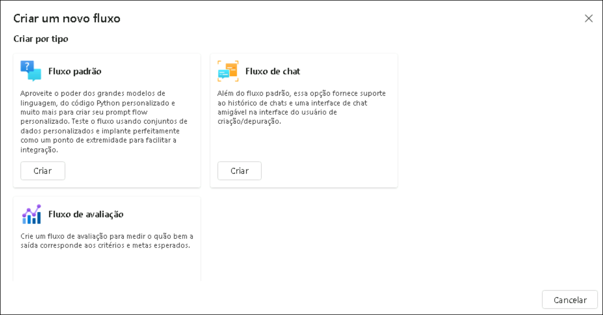
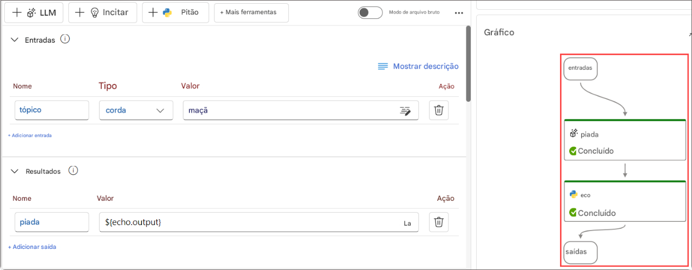
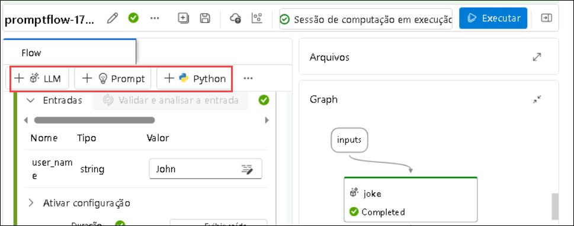

Claro! Aqui está a tradução para português brasileiro do texto que você enviou:
# Exercício 1: Entendendo o Ciclo de Vida do Desenvolvimento de Flows

## Visão Geral do Laboratório

Neste laboratório, você irá explorar o ciclo de vida do desenvolvimento de aplicações de IA usando o Prompt Flow do Azure AI Foundry. Você começará entendendo o processo estruturado, que inclui as fases de inicialização, experimentação, avaliação, refinamento e produção. Aprenderá sobre os diferentes tipos de flows, como Standard, Chat e Evaluation flows, e como eles atendem a diversas necessidades de aplicação. Também vai se aprofundar no conceito de flows e nodes dentro do Prompt Flow, que permitem o processamento contínuo de dados e a execução de tarefas.

### Tarefa 1: Configurando os recursos de pré-requisito

1.  Faça login na página do Portal do Azure +++ Usando o **Username** e
    **TAP** na guia **Resource**.

   

2.  Selecione **Azure AI Foundry**.

   

3.  No painel de navegação esquerdo do AI Foundry, selecione **AI
    Hubs**. Na página AI Hubs, clique em **Create** e selecione **Hub**
    no menu suspenso.

   

4.  No painel **Create an Azure AI hub** insira os seguintes detalhes:

    1.  Subscription : **Deixar assinatura padrão**

    2.  Resource Group : **AgenticAI**

    3.  Region : **EastUS**

    4.  Name :
        [*+++ai-foundry-hub@lab.LabInstance.Id*](mailto:+++ai-foundry-hub@lab.LabInstance.Id)+++

    5.  Connect AI Services incl. OpenAI : Clique em **Create New**

    6.  Connect AI Services incl. OpenAI : Forneça um nome
        [*+++my-ai-service@lab.LabInstance.Id*](mailto:+++my-ai-service@lab.LabInstance.Id)+++

    7.  Clique em **Save**, e **Next:Storage**

   

   

5.  Clique na guia **Review + Create** e em **Create.**

   

6.  Aguarde a conclusão da implementação e clique em **Go to resource**.

7.  No painel **Overview**, clique em **Launch Azure AI Foundry**. Isso
    o levará ao portal do Azure AI Foundry.

   

11. Selecione **+ New project** em Hub Overview.

   

12. Forneça o nome do projeto como
    [*+++ai-foundry-project@lab.LabInstance.Id*](mailto:+++ai-foundry-project@lab.LabInstance.Id)+++
    e selecione **Create**.

   

1.  Em seu **AI Foundry project**, navegue até a seção **My assets**, em
    seguida, selecione **Models + endpoints**. Clique em **Deploy
    model**, e escolha **Deploy base model** para prosseguir.

2.  Na janela **Select a model** , busque por **gpt-4o**, selecione
    **gpt-4o** e **Confirm**

   

3.  Na janela **Deploy model gpt-4o**, selecione **Customize**.

    1.  Deployment Name: **gpt-4o**

    2.  Deployment type: **Global Standard**

    3.  Altere o **Model version** para **2024-08-06 (Default)**

    4.  Altere o **Tokens per Minute Rate Limit** para **200K**

    5.  Clique em **Deploy (5)**

4.  Navegue de volta para o **Azure Portal** e procure por **+++Open
    AI+++** e selecione o recurso **Azure Open AI**

5.  Na página **AI Foundry | Azure OpenAI**, selecione **+ Create -\>
    Azure OpenAI** para criar o recurso Azure OpenAI.

   

6.  Na página **Create Azure OpenAI**, forneça as seguintes
    configurações e selecione **Next (6)**:

   | **Campo** | **Valor** |
   |:-----|:-------|
   | Subscription | Manter a assinatura padrão |
   | Resource group | **AgenticAI** |
   | Region | **East US** |
   | Name | +++my-openai-service@lab.LabInstance.Id+++ |
   |Pricing tier  |**Standard S0**  |

   

8.  Selecione **Next** até que a guia **Review + submit** apareça.

9.  Na página **Review + submit**, selecione **Create**

   

### Tarefa 2: Compreender o Ciclo de Vida do Desenvolvimento de Flows (APENAS LEITURA)

O Prompt Flow oferece um processo bem definido que facilita o desenvolvimento fluido de aplicações de IA. Ao utilizá-lo, você pode avançar efetivamente pelas etapas de desenvolvimento, teste, ajuste e implantação de flows, resultando na criação de aplicações de IA completas.

O ciclo de vida consiste nas seguintes etapas:

- **Inicialização**: Identificar o caso de uso de negócio, coletar dados de exemplo, aprender a construir um prompt básico e desenvolver um flow que expanda suas capacidades.
- **Experimentação**: Executar o flow com dados de exemplo, avaliar o desempenho do prompt e iterar no flow, se necessário. Continuar experimentando até ficar satisfeito com os resultados.
- **Avaliação e refinamento**: Avaliar o desempenho do flow com um conjunto maior de dados, analisar a eficácia do prompt e refinar conforme necessário. Avançar para a próxima etapa se os resultados atenderem aos critérios desejados.
- **Produção**: Otimizar o flow para eficiência e eficácia, implantá-lo, monitorar o desempenho em ambiente de produção e coletar dados de uso e feedback. Utilizar essas informações para melhorar o flow e contribuir para as etapas anteriores para futuras iterações.

> **Nota**: Ao seguir essa abordagem estruturada e metódica, o Prompt Flow permite que você desenvolva, teste rigorosamente, ajuste e implante flows com confiança, resultando na criação de aplicações de IA robustas e sofisticadas.

### Tarefa 2.1: Entender os tipos de flows

Nesta tarefa, você irá explorar os diferentes tipos de flows no Azure AI Foundry:

1. Acesse o Azure AI Foundry pelo link abaixo:

   ```
   https://ai.azure.com/
   ```
2. No Azure AI Foundry, clique em `Prompt flow` no painel à esquerda e depois selecione `+ Criar`. Aqui você pode iniciar um novo flow escolhendo um tipo de flow ou um modelo da galeria.

- **Flow padrão (Standard flow)**: Projetado para desenvolvimento geral de aplicações, o flow padrão permite criar um flow usando uma ampla gama de ferramentas integradas para desenvolver aplicações baseadas em LLM. Oferece flexibilidade e versatilidade para aplicações em diferentes domínios.
- **Flow de chat (Chat flow)**: Voltado para desenvolvimento de aplicações conversacionais, o flow de chat amplia as capacidades do flow padrão e oferece suporte aprimorado para entradas/saídas de chat e gerenciamento de histórico. Com modo de conversa nativo e recursos integrados, você pode desenvolver e depurar aplicações dentro de um contexto conversacional.
- **Flow de avaliação (Evaluation flow)**: Projetado para cenários de avaliação, o flow de avaliação permite criar um flow que utiliza as saídas de execuções anteriores como entradas. Esse tipo de flow possibilita avaliar o desempenho dos resultados anteriores e gerar métricas relevantes, facilitando a análise e melhoria dos modelos ou aplicações.

  

### Tarefa 2.2: Entender um flow

Nesta tarefa, você irá explorar o **Prompt flow**, um recurso dentro do Azure AI Foundry.

1. Um flow no Prompt flow funciona como um workflow executável que simplifica o desenvolvimento da sua aplicação de IA baseada em LLM. Ele fornece uma estrutura completa para gerenciar o fluxo de dados e o processamento dentro da aplicação.

2. O Prompt flow é um recurso dentro do Azure AI Foundry que permite a criação de flows. Os flows são workflows executáveis que geralmente consistem em três partes:

   - **Entradas (Inputs)**: Representam dados que entram no flow. Podem ser diferentes tipos de dados como strings, números inteiros ou booleanos.
   - **Nós (Nodes)**: Representam ferramentas que realizam processamento de dados, execução de tarefas ou operações algorítmicas.
   - **Saídas (Outputs)**: Representam os dados produzidos pelo flow.

     

3. Dentro de um flow, os nodes são essenciais, representando ferramentas específicas com capacidades únicas. Esses nodes lidam com processamento de dados, execução de tarefas e operações algorítmicas, com suas entradas e saídas. Conectando os nodes, você cria uma cadeia contínua de operações que orienta o fluxo de dados pela aplicação.

4. Para facilitar a configuração e ajuste dos nodes, é fornecida uma representação visual da estrutura do workflow por meio de um gráfico DAG (Grafo Acíclico Dirigido). Esse gráfico mostra as conexões e dependências entre os nodes, oferecendo uma visão clara do fluxo completo.

### Tarefa 2.3: Explorar as ferramentas disponíveis no Prompt Flow

Nesta tarefa, você vai explorar as ferramentas disponíveis no Prompt Flow dentro do Azure AI Foundry.

1. As ferramentas são os blocos fundamentais de construção de um flow.

2. Três ferramentas comuns são:

   - **Ferramenta LLM**: Permite criar prompts personalizados usando Large Language Models.
   - **Ferramenta Python**: Permite executar scripts Python personalizados.
   - **Ferramenta Prompt**: Prepara prompts em forma de strings para cenários complexos ou integração com outras ferramentas.

   

3. Cada ferramenta é uma unidade executável com uma função específica. Você pode usar uma ferramenta para realizar tarefas como resumir textos ou fazer chamadas a APIs. É possível usar várias ferramentas dentro de um flow e reutilizar a mesma ferramenta diversas vezes.

4. Um dos principais benefícios das ferramentas do Prompt Flow é a integração fácil com APIs de terceiros e pacotes Python open source. Isso não só melhora a funcionalidade dos grandes modelos de linguagem como também torna o processo de desenvolvimento mais eficiente para os desenvolvedores.

## Revisão

Neste laboratório, você completou as seguintes tarefas:

- Compreendeu o Ciclo de Vida do Desenvolvimento de Flows

### Você concluiu o laboratório com sucesso. Clique em **Próximo >>** para continuar para o próximo exercício.
