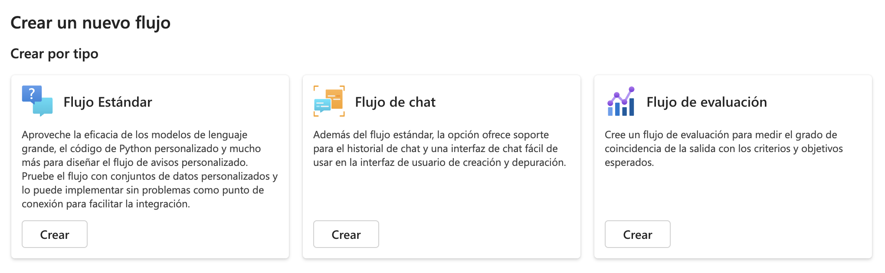
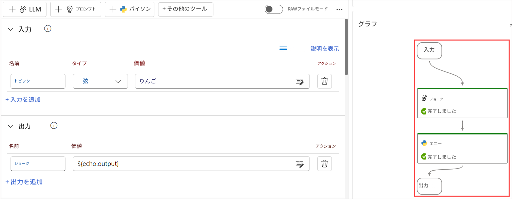
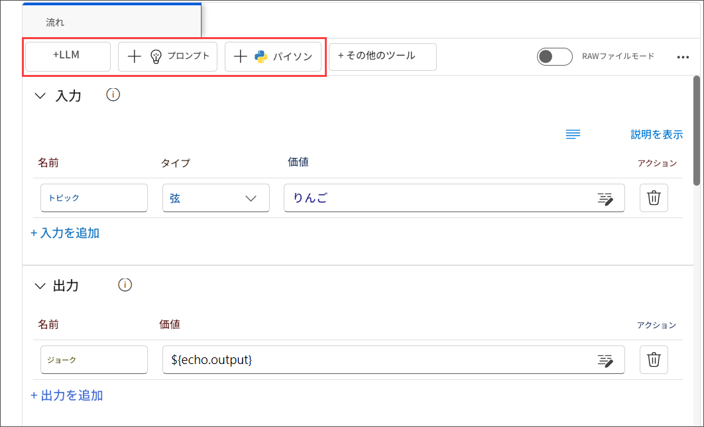

# 演習 1: フロー開発のライフサイクルの理解

## ラボの概要
このラボでは、Azure AI Foundry の Prompt Flow を使用して AI アプリケーションを開発するライフサイクルを探索します。初期化、実験、評価、改良、および運用の各段階を理解することから始めます。標準フロー、チャットフロー、評価フローなど、さまざまなフロータイプについて学び、それらがさまざまなアプリケーションニーズにどのように対応するかを理解します。また、Prompt Flow 内のフローとノードの概念についても掘り下げ、シームレスなデータ処理とタスク実行を可能にする方法を学びます。

## ラボの目的

このラボでは、次のことを行います:
- タスク 1: フロー開発のライフサイクルを理解する
  
### タスク 1: フロー開発のライフサイクルを理解する (読み取り専用)

Prompt Flow は、AI アプリケーションのシームレスな開発を促進するための明確なプロセスを提供します。これを使用することで、フローの開発、テスト、調整、および展開の各段階を効果的に進めることができ、最終的には完全な AI アプリケーションを作成することができます。

ライフサイクルは次の段階で構成されます:

- **初期化:** ビジネスユースケースを特定し、サンプルデータを収集し、基本的なプロンプトの作成方法を学び、その機能を拡張するフローを開発します。
- **実験:** サンプルデータに対してフローを実行し、プロンプトのパフォーマンスを評価し、必要に応じてフローを反復します。結果に満足するまで継続的に実験を行います。
- **評価と改良:** より大きなデータセットに対してフローを実行し、プロンプトの有効性を評価し、必要に応じて改良します。結果が望ましい基準を満たす場合、次の段階に進みます。
- **運用:** フローの効率と効果を最適化し、展開し、運用環境でパフォーマンスを監視し、使用データとフィードバックを収集します。この情報を使用してフローを改善し、さらなる反復のために前の段階に貢献します。

  >**注意:** この構造化された方法論的アプローチに従うことで、Prompt Flow はフローを自信を持って開発、厳密にテスト、微調整、および展開する能力を提供し、堅牢で洗練された AI アプリケーションの作成を可能にします。

### タスク 1.1: フローの種類を理解する

このタスクでは、Azure AI Foundry のさまざまなフロータイプを探索します。
1. 次のリンクを使用して Azure AI Foundry に移動します:
    ```
    https://ai.azure.com/
    ```
2. Azure AI Foundry で、左ペインの `Prompt flow` をクリックし、`+ Create` を選択します。ここで、フロータイプまたはギャラリーからテンプレートを選択して新しいフローを開始できます。

- **標準フロー:** 一般的なアプリケーション開発向けに設計されており、LLM ベースのアプリケーションを開発するための幅広い組み込みツールを使用してフローを作成できます。さまざまなドメインでアプリケーションを開発するための柔軟性と多用途性を提供します。
- **チャットフロー:** 会話型アプリケーション開発向けに特化されており、標準フローの機能を基にして、チャット入力/出力およびチャット履歴管理のサポートを強化します。ネイティブの会話モードと組み込み機能を使用して、会話のコンテキスト内でアプリケーションをシームレスに開発およびデバッグできます。
- **評価フロー:** 評価シナリオ向けに設計されており、以前のフロー実行の出力を入力として使用するフローを作成できます。このフロータイプを使用すると、以前の実行結果のパフォーマンスを評価し、関連する指標を出力して、モデルやアプリケーションの評価と改善を促進できます。

  

### タスク 1.2: フローを理解する
このタスクでは、Azure AI Foundry 内の機能である **Prompt flow** を探索します。

1. Prompt flow のフローは、LLM ベースの AI アプリケーションの開発を合理化する実行可能なワークフローとして機能します。アプリケーション内のデータフローと処理を管理するための包括的なフレームワークを提供します。

2. Prompt flow は、Azure AI Foundry 内の機能であり、フローを作成できます。フローは通常、次の 3 つの部分で構成される実行可能なワークフローです:

    - **入力:** フローに渡されるデータを表します。文字列、整数、またはブール値など、さまざまなデータ型が使用できます。
    - **ノード:** データ処理、タスク実行、またはアルゴリズム操作を実行するツールを表します。
    - **出力:** フローによって生成されるデータを表します。

      
      
3. フロー内では、ノードが中心的な役割を果たし、特定のツールを表します。これらのノードは、入力と出力を伴うデータ処理、タスク実行、およびアルゴリズム操作を処理します。ノードを接続することで、アプリケーション内のデータフローをガイドするシームレスな操作チェーンを確立します。

4. ノードの構成と微調整を容易にするために、DAG (Directed Acyclic Graph) グラフを通じてワークフロー構造の視覚的な表現が提供されます。このグラフは、ノード間の接続性と依存関係を示し、ワークフロー全体の概要を明確に示します。

### タスク 1.3: Prompt flow で利用可能なツールを探索する

このタスクでは、Azure AI Foundry 内の Prompt Flow で利用可能なツールを探索します。

1. ツールはフローの基本的な構成要素です。

2. 一般的なツールは次の 3 つです:

    - **LLM ツール:** 大規模言語モデルを利用してカスタムプロンプトを作成できます。
    - **Python ツール:** カスタム Python スクリプトの実行を許可します。
    - **Prompt ツール:** 複雑なシナリオや他のツールとの統合のためにプロンプトを文字列として準備します。

    
   
3. 各ツールは特定の機能を持つ実行可能なユニットです。ツールを使用して、テキストの要約や API 呼び出しなどのタスクを実行できます。1 つのフロー内で複数のツールを使用し、1 つのツールを複数回使用することができます。

4. Prompt flow ツールの主な利点の 1 つは、サードパーティの API や Python オープンソースパッケージとのシームレスな統合です。これにより、大規模言語モデルの機能が向上し、開発プロセスが効率化されます。
   
## レビュー
このラボでは、次のタスクを完了しました:
- フロー開発のライフサイクルを理解しました

### ラボを無事に終了しました。次の演習に進むには、**Next >>** をクリックしてください。
