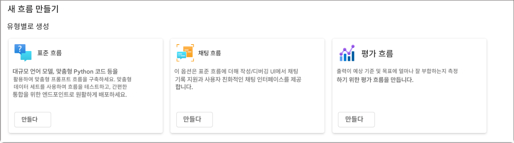
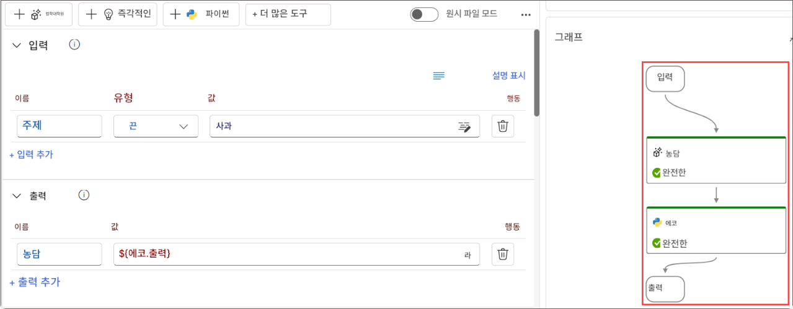
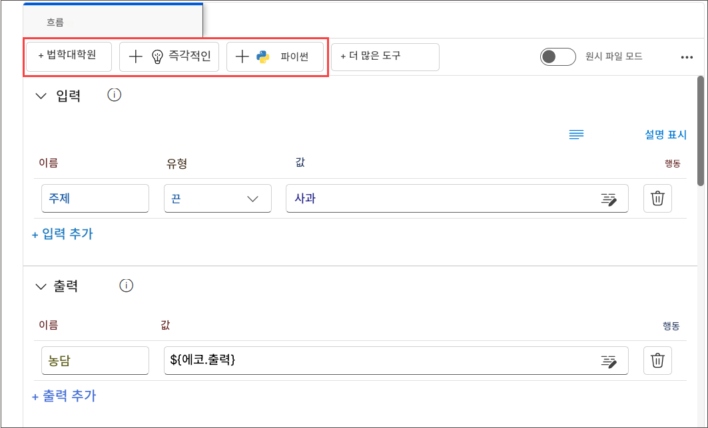

# 실습 1: 흐름 개발 생명 주기 이해하기

## 개요
이 실습에서는 Azure AI Foundry의 프롬프트 흐름을 활용하여 AI 애플리케이션을 개발하는 전체 생명 주기를 탐색합니다. 초기화(Initialization), 실험(Experimentation), 평가(Evaluation), 개선(Refinement), 프로덕션(Production) 단계로 구성된 구조화된 개발 프로세스를 이해하는 것부터 시작합니다. 또한, 다양한 애플리케이션 요구 사항에 맞게 설계된 표준(Standard), 채팅(Chat), 평가(Evaluation) 흐름의 유형에 대해서도 학습합니다. 더불어, 프롬프트 흐름 내에서 데이터 처리를 원활하게 수행하고 작업을 실행하는 데 핵심 역할을 하는 흐름(Flow)와 노드(Node)의 개념도 함께 살펴보게 됩니다.


## 목표

이 실습에서 여러분은 다음을 수행하게 됩니다:
- 과제 1: 흐름 개발 생명 주기 이해하기
  
## 과제 1: 흐름 개발 생애주기 이해하기 (읽기 전용)

프롬프트 흐름는 AI 애플리케이션을 원활하게 개발할 수 있도록 잘 정의된 프로세스를 제공합니다. 이를 활용하면 흐름을 개발하고, 테스트하고, 조정하고, 배포하는 일련의 단계를 효과적으로 진행할 수 있으며, 결과적으로 완성도 높은 AI 애플리케이션을 구축할 수 있습니다.

이 생명 주기는 다음과 같은 단계로 구성됩니다:

- **초기화 (Initialization)**: 비즈니스 활용 사례를 식별하고, 샘플 데이터를 수집하며, 기본 프롬프트를 작성하는 방법을 학습한 뒤, 이를 확장하는 흐름을 개발합니다.
- **실험 (Experimentation)**: 흐름을 샘플 데이터에 대해 실행하고, 프롬프트의 성능을 평가하며, 필요한 경우 흐름을 반복적으로 개선합니다. 만족할 만한 결과가 나올 때까지 실험을 지속합니다.
- **평가 및 개선 (Evaluation and Refinement)**: 더 큰 데이터셋을 사용하여 흐름의 성능을 평가하고, 프롬프트의 효과를 검토한 후, 필요에 따라 개선합니다. 결과가 목표 기준을 충족하면 다음 단계로 진행합니다.
- **프로덕션 (Production)**: 흐름의 효율성과 효과성을 고려하여 최적화한 후 배포하고, 운영 환경에서 성능을 모니터링합니다. 사용 데이터와 피드백을 수집하여 흐름을 개선하고, 초기 단계로 피드백을 반영하여 반복적으로 발전시킵니다.
> **참고**: 이와 같은 구조적이고 체계적인 접근 방식을 따르면, Prompt Flow를 통해 흐름을 자신 있게 개발하고, 철저히 테스트하며, 정밀하게 조정하고 배포할 수 있습니다. 그 결과, 견고하고 정교한 AI 애플리케이션을 구축할 수 있습니다.

### 과제 1.1 흐름의 유형 이해하기

이 작업에서는 Azure AI Foundry에서 제공하는 다양한 흐름의 유형을 살펴봅니다. 

1. 아래 링크를 통해 Azure AI Foundry에 접속하세요:

   ```
   https://ai.azure.com/
   ```
1. Azure AI Foundry에서 왼쪽 메뉴의 `프롬프트 흐름`를 클릭한 후, `+ 만들기`를 선택합니다. 여기에서 새로운 흐름을 생성하거나, 갤러리에서 템플릿을 선택하여 시작할 수 있습니다.

- **표준 흐름**: 일반적인 애플리케이션 개발을 위해 설계된 흐름. 다양한 내장 도구들을 활용하여 LLM 기반 애플리케이션을 개발할 수 있으며, 여러 도메인에 걸쳐 유연하고 다양한 방식으로 활용할 수 있습니다.
- **채팅 흐름**: 대화형 애플리케이션 개발에 최적화된 흐름입니다. 표준 흐름의 기능을 기반으로 하여, 채팅 입력/출력과 대화 이력 관리를 위한 확장 기능을 제공합니다. 기본 제공되는 대화 모드와 내장 기능들을 통해 대화형 환경에서 애플리케이션을 손쉽게 개발하고 디버깅할 수 있습니다.
- **평가 흐름**: 평가 시나리오를 위해 설계된 흐름입니다. 이전 흐름 실행 결과를 입력으로 받아 해당 성능을 평가하고, 관련 지표를 출력할 수 있습니다. 이 흐름 유형은 모델이나 애플리케이션의 품질을 분석하고 개선하는 데 유용합니다.

  

### 과제 1.2: 흐름 이해하기

이 과제에서는 Azure AI Foundary내의 **프롬프트 흐름** 기능을 살펴봅니다. 

1. 프롬프트 흐름의 흐름은 LLM 기반 AI 애플리케이션 개발을 손쉽게 개발하여 실행할 수 있는 워크플로우입니다. 애플리케이션 내에서 데이터 흐름과 처리를 체계적으로 관리할 수 있는 통합 프레임워크를 제공합니다.

1. 프롬프트 흐름는 Azure AI Foundry의 기능 중 하나로, 사용자가 흐름을 생성할 수 있도록 해줍니다. 흐름는 일반적으로 다음 세 가지 구성 요소로 구성됩니다:

   - **입력**: 흐름에 전달되는 데이터로, 문자열, 정수, 불리언 등 다양한 데이터 유형을 포함할 수 있습니다.
   - **노드**: 데이터 처리, 작업 실행, 알고리즘 연산 등을 수행하는 도구입니다.
   - **출력**: 흐름에서 생성된 결과 데이터입니다.

     

1. 흐름 내에서는 노드가 핵심 역할을 하며, 각 노드는 고유한 기능을 갖춘 도구를 나타냅니다. 이 노드들은 입력을 받아 데이터를 처리하고, 작업을 수행하며, 출력 결과를 생성합니다. 노드를 연결함으로써 데이터가 애플리케이션을 따라 흐르는 일련의 작업 체인을 구성할 수 있습니다.

1. 노드 구성을 보다 용이하게 하기 위해, 워크플로우 구조를 시각화한 **DAG(Directed Acyclic Graph, 방향성 비순환 그래프)** 형태의 그래프가 제공됩니다. 이 DAG 그래프는 노드 간의 연결 관계 및 종속성을 보여주며, 전체 흐름의 구조를 직관적으로 파악할 수 있게 해줍니다.

### 과제 1.3: 프롬프트 흐름에서 사용 가능한 도구 살펴보기

이 과제에서는 Azure AI Foundry 내 프롬프트 흐름에서 제공하는 도구들을 살펴봅니다.

1. 도구는 흐름을 구성하는 기본적인 구성 요소입니다.

1. 대표적인 세 가지 도구는 다음과 같습니다:

   - LLM 도구: 대형 언어 모델(Large Language Model)을 활용하여 사용자 지정 프롬프트를 생성할 수 있습니다.
   - Python 도구: 사용자 지정 Python 스크립트를 실행할 수 있습니다.
   - Prompt 도구: 문자열 형태의 프롬프트를 준비하여 복잡한 시나리오나 다른 도구와의 통합에 활용할 수 있습니다.

     

1. 각 도구는 특정 기능을 수행하는 실행 가능한 단위입니다. 예를 들어, 텍스트 요약을 하거나 API 호출을 수행하는 작업에 사용할 수 있습니다. 하나의 흐름 내에서 여러 도구를 사용할 수 있으며, 동일한 도구를 여러 번 사용할 수도 있습니다.

1. Prompt Flow 도구의 핵심 장점 중 하나는 타사 API 및 파이썬 오픈소스 패키지와의 원활한 통합입니다. 이러한 통합은 대형 언어 모델의 기능을 강화할 뿐만 아니라, 개발자에게 더욱 효율적인 개발 환경을 제공합니다.
   
## 복습
이번 실습에서는 다음 과제를 완료하였습니다.
- 흐름 개발 생명 주기(Flow Development Lifecycle)에 대한 이해

### 실습을 성공적으로 완료하였습니다. 다음 연습 과제로 진행하려면 다음 >> 버튼을 클릭하세요.