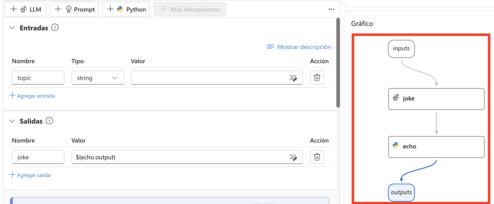
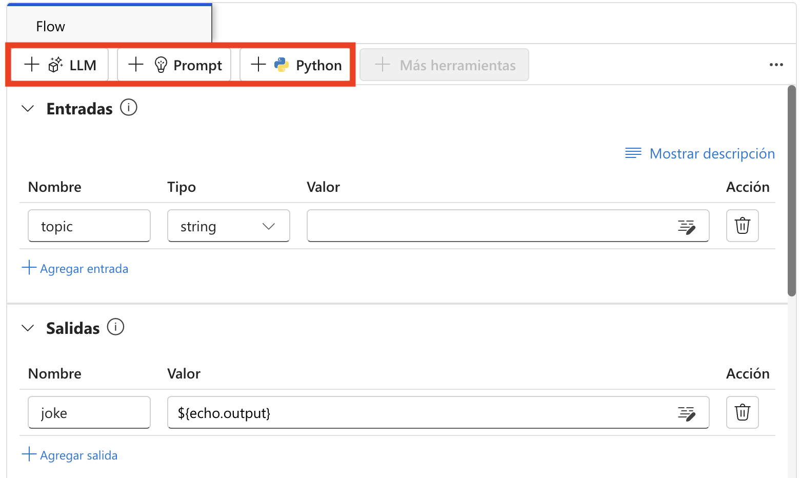

# 練習 1：瞭解流程開發的生命週期

## 實驗概覽

在本實驗中，您將探索使用 Azure AI Foundry 的 Prompt Flow 來開發 AI 應用程式的生命週期。您將從瞭解結構化流程開始，包括初始化、實驗、評估、優化與進入生產階段。您將學習不同的流程類型，例如標準流程 (Standard Flow)、聊天流程 (Chat Flow) 與評估流程 (Evaluation Flow)，以及它們如何滿足各種應用需求。您也將深入了解 Prompt Flow 中的流程與節點概念，這些元件能實現無縫的資料處理與任務執行。

### 任務 1: 設置先決條件資源

1.  登錄到 Azure 門戶頁面
    +++[https://portal.azure.com+++](https://portal.azure.com+++/) 使用
    **“資源”選項卡中的**用戶名**和** TAP。

    

2.  選擇 **Azure AI Foundry**.

    

3.  在 AI Foundry 的左側導航窗格中，選擇**AI Hubs**. 在“AI
    中心”頁面上，單擊“**創建**”，然後 **從下拉列表中選擇**“中心”。

    

4.  在 **Create an Azure AI hub** 窗格中輸入以下詳細信息：

    -  訂閱 : **Leave default subscription**

    -  資源組 : **AgenticAI**

    -  地區 : **EastUS**

    -  名字 : <+++ai-foundry-hub@lab.LabInstance.Id>+++

    -  連接人工智能服務，包括。開放人工智能 : 點擊 **Create New**

    -  連接 AI 服務，包括。開放人工智能 :
        提供名稱<+++my-ai-service@lab.LabInstance.Id>+++

    -  點擊 **Save**, 然後**Next:Storage**

    

    

5.  點擊 **Review + Create** 選項卡，然後是**創建。**

    

6.  等待部署完成，然後單擊**Go to resource**.

7.  在“概述”窗格上, 點擊 **Launch Azure AI Foundry**. 這會導航到 Azure
    AI Foundry 門戶。

    

8.  在中心概述上，選擇 **+ New project** 

    

9.  將項目名稱提供為<+++ai-foundry-project@lab.LabInstance.Id>+++
    然後選擇 **Create**.

    

10.  在你的 **AI Foundry project**, 導航到 **My assets** 部分,
    然後選擇 **Models + endpoints**. 點擊 **Deploy model**,
    然後選擇 **Deploy base model** 以繼續.

11.  在 **Select a model** 窗口, 搜索**gpt-4o**,
    選擇 **gpt-4o** 並選擇 **Confirm**


12.  在 **Deploy model gpt-4o** 窗口, 選擇 **Customize**.

    - Deployment 名稱: **gpt-4o**

    - Deployment 類型: **Global Standard**

    - 修改 **Model version to 2024-08-06 (Default)**

    - 將每分鐘令牌數速率限制更改為 **200K**

    - 點擊 **Deploy (5)**

13.  導航回 **Azure Portal**並搜索 **+++Open AI+++** 並選擇 **Azure Open
    AI** 資源。

14.  在 **AI Foundry | Azure OpenAI** 頁面, 選擇 **+ Create -\> Azure
    OpenAI** 以創建 Azure OpenAI 資源。

    

15.   在**Create Azure OpenAI**  頁面, 提供以下設置，然後選擇 **Next
    (6)**:

    |  設置 | 價值  |
    |:----|:-----|
    | 訂閱  | 保留默認訂閱  |
    | 資源組  | **AgenticAI**  |
    | 地區  |  **East US** |
    | 名稱  | +++my-openai-service@lab.LabInstance.Id+++  |
    | 定價層  |  **Standard S0** |

    

16.  選擇 **Next** 直到出現“審閱 + 提交”選項卡.

17.  在 **Review + submit** 頁面上, 選擇 **Create**

  

### 任務 1：理解流程開發的生命週期 (僅閱讀)

Prompt Flow 提供一個明確定義的流程，有助於順利開發 AI 應用程式。透過這個流程，您可以有效地完成開發、測試、調整與部署的各個階段，最終建立出完整的 AI 應用程式。

其生命週期包含以下階段：

- **初始化（Initialization）**：識別業務使用案例、收集樣本資料、學習建立基本 Prompt，並開發一個可擴展功能的流程。
- **實驗（Experimentation）**：使用樣本資料執行流程，評估 Prompt 的效能，並在必要時反覆調整流程。持續實驗直到結果令人滿意為止。
- **評估與優化（Evaluation and refinement）**：使用更大的資料集來評估流程效能，檢視 Prompt 的有效性，並根據需要進行優化。如果結果符合預期標準，即可進入下一階段。
- **生產（Production）**：優化流程的效率與效能，部署流程，並在生產環境中監控其表現，收集使用數據與回饋。利用這些資訊來改進流程，並回饋至前一階段以進行進一步迭代。

  >**注意**：透過遵循這種結構化與系統化的方法，Prompt Flow 能讓您自信地開發、嚴格測試、精細調整並部署流程，最終打造出穩健且先進的 AI 應用程式。

### 任務 1.1：了解流程的類型

在此任務中，您將探索 Azure AI Foundry 中的不同流程類型：
1. 使用以下連結前往 Azure AI Foundry：

    ```
    https://ai.azure.com/
    ```

2. 在 Azure AI Foundry 中，點選左側選單的 `Prompt Flow`，然後選擇 `+ Create`，您可以從這裡開始建立新流程，選擇流程類型或從範本庫中挑選範本。

- **標準流程**：設計用於一般應用程式開發，標準流程提供多種內建工具，可用於開發基於 LLM 的應用程式。它具備高度彈性與多樣性，適用於不同領域的應用開發。
- **聊天流程**：專為對話式應用程式開發所設計，聊天流程建立在標準流程的基礎上，並提供強化的聊天輸入/輸出與對話歷史管理功能。透過原生對話模式與內建功能，您可以在對話情境中順利開發與除錯應用程式。
- **評估流程**：設計用於評估情境，評估流程可建立一個流程，將先前流程執行的輸出作為輸入。此流程類型可用於評估先前執行結果的效能並輸出相關指標，有助於模型或應用程式的評估與改進。

  

### 任務 1.2：了解一個流程
在此任務中，您將探索 Azure AI Foundry 中的 **Prompt Flow** 功能。

1. 在 Prompt Flow 中，一個流程是一個可執行的工作流程，用於簡化基於 LLM 的 AI 應用程式開發。它提供一個完整的框架，用來管理應用程式中的資料流程與處理。

2. Prompt Flow 是 Azure AI Foundry 中的一項功能，可讓您撰寫流程。流程通常由三個部分組成：

    - **輸入**：代表傳入流程的資料，可為字串、整數或布林值等不同資料型別。
    - **節點**：代表執行資料處理、任務執行或演算法操作的工具。
    - **輸出**：代表流程所產生的資料。

      
      
3. 在流程中，節點是核心，代表具有特定功能的工具。這些節點負責資料處理、任務執行與演算法操作，透過輸入與輸出連接節點，建立一條無縫的操作鏈，導引資料在應用程式中的流動。

4. 為了協助節點設定與微調，系統會透過 DAG（有向無環圖）圖形提供流程結構的視覺化表示。此圖形展示節點之間的連接與依賴關係，提供整體流程的清晰概覽。

### 任務 1.3：探索 Prompt Flow 中可用的工具

在此任務中，您將探索 Azure AI Foundry 中 Prompt Flow 所提供的工具。

1. 工具是流程的基本組成單位。

2. 三種常見的工具包括：

    - **LLM 工具**：可使用大型語言模型建立自訂 Prompt 。
    - **Python 工具**：可執行自訂的 Python 腳本。
    - **Prompt 工具**：將 Prompt 準備為字串，適用於複雜情境或與其他工具整合。

    
   
3. 每個工具都是具有特定功能的可執行單元。您可以使用工具來執行摘要文字、呼叫 API 等任務。您可以在一個流程中使用多個工具，也可以重複使用同一個工具。

4. Prompt flow 工具的一大優勢是能與第三方 API 與 Python 開源套件無縫整合。這不僅提升大型語言模型的功能，也讓開發流程對開發者來說更加高效。
   
## 回顧

在本實驗中，您已完成以下任務：
- 理解流程開發的生命週期

### 恭喜！您已成功完成本次實驗課程！
### 請點選導覽連結，以繼續進行下一個實驗課程。
