# Exercício 2: Construindo e Personalizando Fluxos de Prompt

## Visão Geral do Laboratório

Neste laboratório, você terá experiência prática em inicializar um projeto de Prompt Flow no Azure AI Foundry, configurando o ambiente necessário para começar a desenvolver, testar e refinar aplicações de IA. Você criará e personalizará prompts dentro do Prompt Flow do Azure AI Foundry. Começando pela criação de um novo fluxo, você adicionará e configurará a ferramenta Prompt e desenvolverá um fluxo que incorpora ferramentas de LLM (Large Language Model) e Prompt. Ao criar um fluxo de exemplo e executá-lo com entradas personalizadas, você aprenderá a monitorar a execução do fluxo e avaliar os resultados, compreendendo assim os passos práticos envolvidos no desenvolvimento, teste e refinamento de workflows orientados por IA.

## Objetivos do Laboratório

Neste laboratório, você irá realizar o seguinte:

- Tarefa 1: Criar e Personalizar Prompts
- Tarefa 2: Desenvolver um Fluxo com as Ferramentas LLM e Prompt

### Tarefa 1: Criar e Personalizar Prompts

Criar e personalizar prompts envolve projetar perguntas ou declarações específicas e direcionadas para obter as respostas ou ações desejadas. Esse processo inclui definir objetivos claros, entender o público-alvo e usar uma linguagem precisa para garantir clareza e relevância. A personalização pode refinar ainda mais os prompts para alinhá-los a contextos ou necessidades específicas do usuário, aumentando o engajamento e a eficácia em diversas aplicações, como educação, atendimento ao cliente e interações com IA.

1. Abra uma nova aba no navegador e acesse o portal do Azure AI Foundry pelo link abaixo:

   ```
   https://ai.azure.com/
   ```

2. Clique no ícone **Azure AI Foundry** no canto superior esquerdo.

3. Selecione o projeto AI Foundry que você criou anteriormente no laboratório, por exemplo: **ai-foundry-project-{suffix} (1)**.

4. No painel de navegação à esquerda, selecione **Prompt flow (1)** > **+ Criar (2)** para adicionar a ferramenta Prompt ao seu fluxo.

   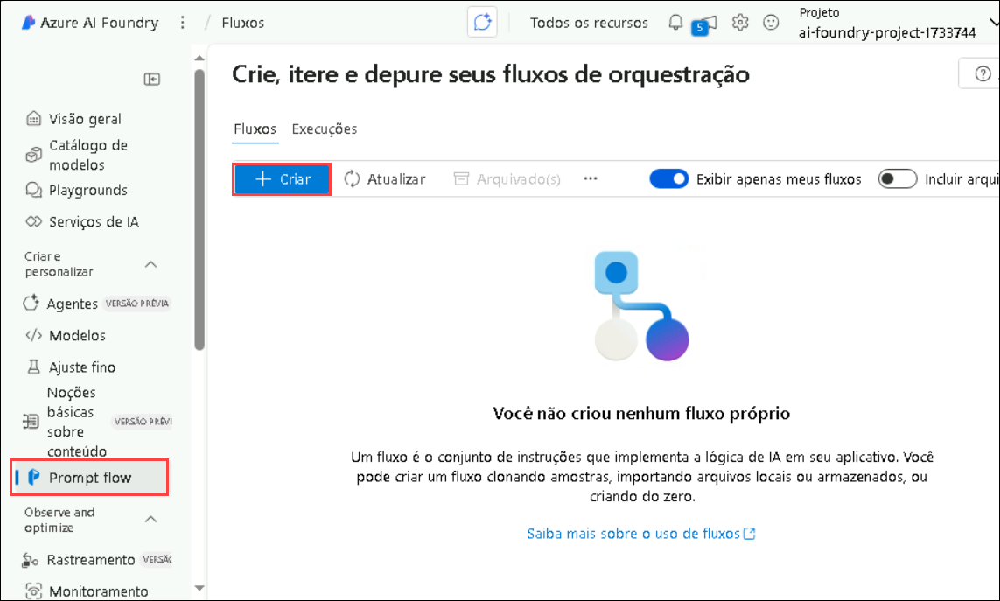

5. No painel **Criar um novo fluxo**, em **Fluxo padrão**, clique em **Criar (1)**, depois insira o nome da pasta conforme indicado abaixo e clique em **Criar (3)**

   ```
   promptflow-{suffix}
   ```

   

   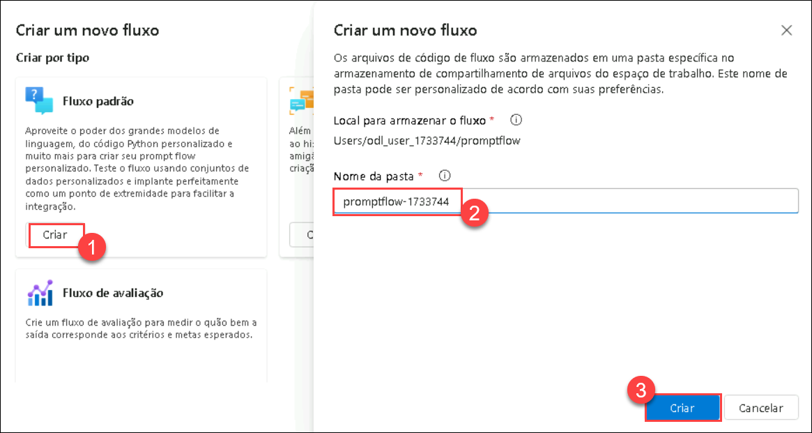

   > **Nota:** Se ocorrer algum erro de permissão, aguarde 5 minutos e recrie o fluxo de prompt com um nome único caso apareça o erro "Nome da pasta já existe". Após a criação do fluxo, renomeie-o para **promptflow-{suffix} (2)** selecionando o **ícone de edição (1)** e clicando em **Salvar (3)**.

   

### Tarefa 2: Desenvolver um Fluxo com Ferramentas LLM e Prompt

Desenvolver um fluxo com modelos de linguagem grande (LLMs) e ferramentas de prompt envolve criar uma interação estruturada onde o LLM é orientado por prompts cuidadosamente elaborados para gerar os resultados desejados. Esse processo geralmente inclui definir o objetivo, selecionar LLMs apropriados e refinar iterativamente os prompts com base nas respostas do modelo para garantir precisão e relevância. As ferramentas de prompt ajudam a gerenciar e otimizar essa interação, permitindo um uso mais eficiente e eficaz dos LLMs em tarefas como criação de conteúdo, análise de dados e suporte automatizado ao cliente.

1. A página de autoria do fluxo de prompt será aberta. Você pode começar a criar seu fluxo. Por padrão, verá um fluxo de exemplo, que contém nós para as ferramentas LLM e Python.

2. Opcionalmente, você pode adicionar mais ferramentas ao fluxo. As ferramentas visíveis são **LLM, Prompt e Python**. Para ver mais ferramentas, selecione **+ Mais ferramentas**.

3. No **Gráfico**, selecione o nó **joke (1)**. Escolha uma conexão existente **ai-odluser{suffix}xxxxxxxx_aoai (2)** no menu suspenso e para o deployment, selecione **gpt-4o (3)** no editor da ferramenta LLM.

   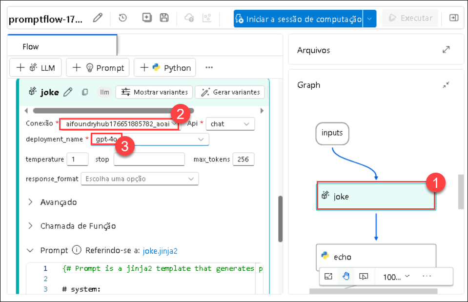

4. Role para cima e em **Entrada**, digite o nome de uma fruta à sua escolha, por exemplo, **Apple (1)**.

   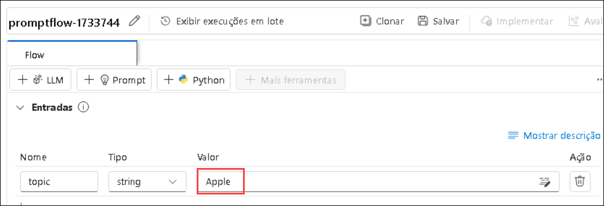

5. Selecione **Salvar (1)** e depois **Iniciar sessão de computação (2)**.

   !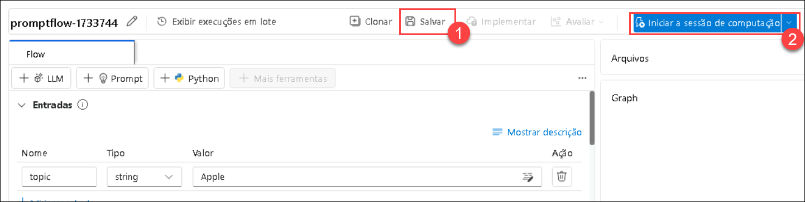

   > **Nota:** Pode levar de **10 a 15 minutos** para iniciar a sessão. Aguarde até que a sessão de computação comece.

6. Quando a sessão de computação estiver completa, clique no botão de play dentro do nó **joke** para executar primeiro esse nó, depois execute o nó **echo**.

   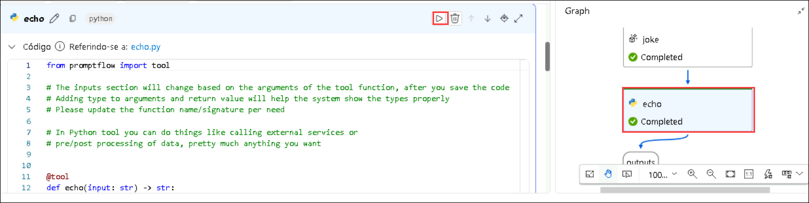

7. Clique no nó **echo (1)** no gráfico e clique no botão **Play (2)**.

   

8. Após a execução bem-sucedida de todos os nós, selecione **Executar** na barra de ferramentas.

   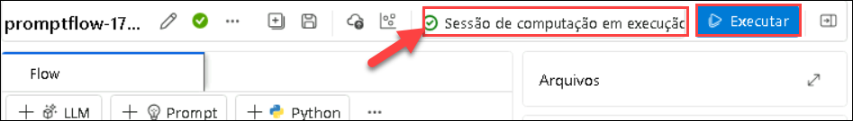

9. Ao finalizar a execução do fluxo, selecione Visualizar saídas para ver os resultados do fluxo. A saída será semelhante à imagem abaixo.

   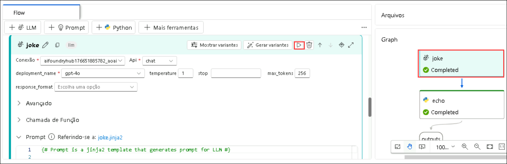

10. Você pode acompanhar o status da execução e a saída na seção **Outputs**.

11. No menu superior, selecione **+ Prompt (1)** para adicionar a ferramenta Prompt ao seu fluxo, dê o nome do fluxo como **modelflow (2)** e selecione **Adicionar (3)**.

      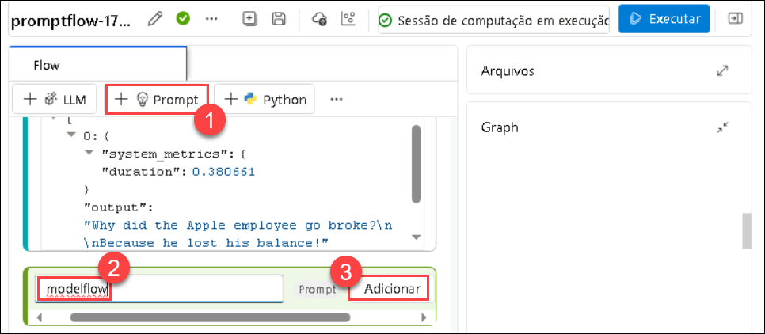


12. Adicione este código dentro da ferramenta Prompt **modelflow (1)** e selecione **Validar e analisar entrada (2)**

    ```jinja
    Welcome to Joke Bot !
    
     Hello, {{ user_name }}!
    
     Hello there!
    
    Pick a category from the list below and get ready to laugh:
    1. 🐶 Animal Jokes – From pets to wildlife, it’s a zoo of laughs.
    2. 💼 Office Humor – Relatable jokes for the 9-to-5 grind.
    3. 💻 Tech & Programmer Jokes – Debug your mood with geeky giggles.
    4. 📚 School & Exam Jokes – A+ comedy for students and survivors.
    5. ⚡ One-Liners – Quick, witty, and straight to the funny bone.
    6. 😏 Sarcastic Jokes – Dry, sharp, and deliciously savage.
    ```

    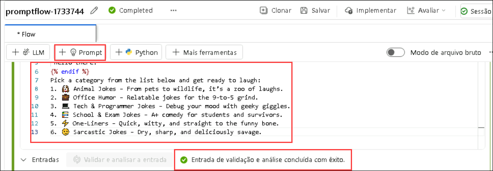

13. Na seção de entrada, adicione o seguinte valor, selecione **Salvar (2)** e **Executar (3)**.

    * user_name: **John (1)**

      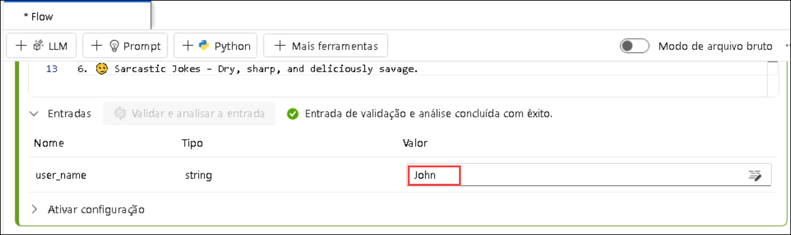

14. Se você receber algum aviso ao executar, como mostrado na imagem abaixo, clique em **Executar mesmo assim**.

    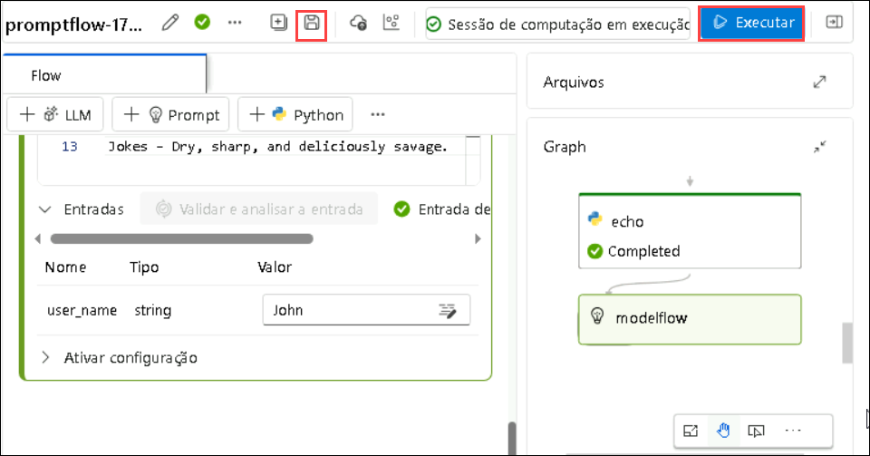

15. Ao concluir a execução do fluxo, selecione **Visualizar saídas** para ver os resultados. A saída será semelhante à imagem abaixo.

    

16. Você pode ver o status da execução e a saída na seção **Outputs**.

    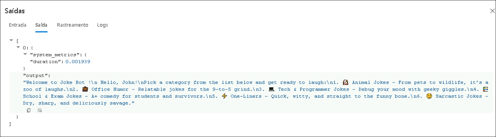

## Revisão

Neste laboratório você completou as seguintes tarefas:

- Criou e Personalizou Prompts
- Desenvolveu um Fluxo com Ferramentas LLM e Prompt

### Você completou com sucesso o laboratório. Clique em **Próximo >>** para continuar para o próximo exercício.
