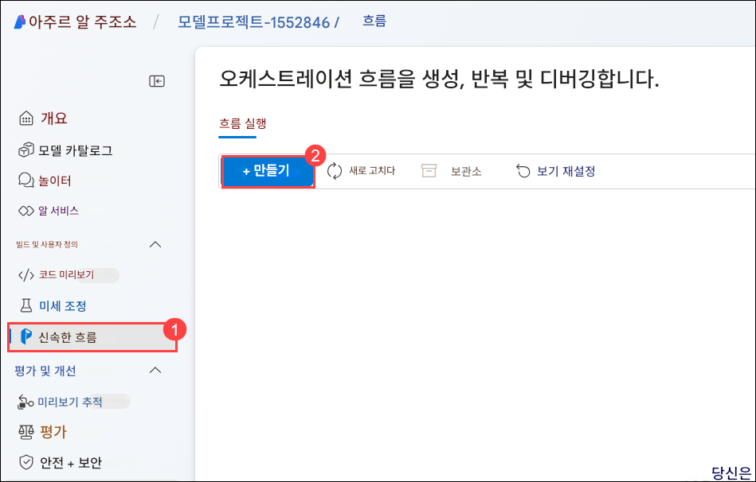

# 실습 2: 프롬프트 흐름 구축 및 사용자 정의

## 개요

이 실습에서는 Azure AI Foundry에서 프롬프트 흐름(Prompt Flow) 프로젝트를 초기화하고, AI 애플리케이션을 개발, 테스트, 개선할 수 있는 환경을 직접 구성하는 과정을 학습합니다. Azure AI Foundry의 프롬프트 흐름 기능을 통해 프롬프트를 생성하고 커스터마이징합니다. 새 프롬프트 흐름을 생성하는 것부터 시작하여, 프롬프트 도구를 추가하고 구성한 뒤, LLM(대형 언어 모델, Large Language Model)과 프롬프트 도구를 통합한 흐름을 개발합니다. 샘플 프롬프트 흐름을 작성하고 사용자 정의 입력값으로 실행함으로써, 흐름 실행을 모니터링하고 출력 결과를 평가하는 방법을 익히며, AI 기반 워크플로우를 개발하고 테스트하며 개선하는 실질적인 단계를 이해하게 됩니다.

## 목표

이 실습에서 여러분은 다음 과제를 수행하게 됩니다:

- 과제 1: 프롬프트 생성 및 커스터마이징
- 과제 2: LLM 및 프롬프트 도구를 활용한 프롬프트 흐름 개발

## 과제 1: 프롬프트 생성 및 사용자 정의

프롬프트를 생성하고 커스터마이징하는 과정은 원하는 응답이나 행동을 이끌어내기 위한 구체적이고 명확한 질문 또는 문장을 설계하는 작업입니다. 이 과정에는 명확한 목표 정의, 대상 사용자에 대한 이해, 그리고 명료성과 관련성을 확보하기 위한 정밀한 언어 사용이 포함됩니다. 프롬프트를 특정 상황이나 사용자 요구에 맞게 커스터마이징하면, 교육, 고객 서비스, AI 상호작용 등 다양한 응용 분야에서 사용자 참여도와 효과성을 더욱 향상시킬 수 있습니다.

1. 브라우저에서 새 탭을 열고 아래 링크를 통해 Azure AI Foundry 포털에 접속합니다.

   ```
   https://ai.azure.com/
   ```

1. 좌측 상단에 있는 **Azure AI Foundry** 아이콘을 클릭합니다.

1. 실습에서 이전에 생성한 AI Foundry 프로젝트, 즉 **ai-foundry-project-{suffix} (1)** 을 선택합니다.

1. 왼쪽 탐색 창에서 **프롬프트 흐름 (1)** > **+ 만들기 (2)** 를 선택하여 흐름에 프롬프트 도구를 추가합니다.

   

1. **새 흐름 만들기** 블레이드에서 **표준 흐름** 아래의 **만들기 (1)** 를 클릭한 뒤, 아래와 같이 제공된 폴더 이름을 입력하고 **만들기 (3)** 를 클릭합니다.

   ```
   promptflow-{suffix}
   ```

   

   > **참고:** 권한 오류가 발생하면, 5번 정도 기다린 후에 오류시 나타난 폴더 이름과 다른 이름으로 폴더 이름을 재생성 해 보십시오. 흐름이 생성된 이후에 **promptflow-{suffix} (2)** 로 이름을 변경하십시오. 이름을 변경하려면 **편집 아이콘 (1)** 을 클릭한 후 **저장(Save) (3)** 을 클릭합니다.

   

## 과제 2: LLM 및 프롬프트 도구를 활용한 프롬프트 흐름 개발

대형 언어 모델(LLM)과 프롬프트 도구를 활용한 플로우를 개발하는 과정은, LLM이 원하는 출력을 생성할 수 있도록 정교하게 설계된 프롬프트를 통해 구조화된 상호작용을 구성하는 것을 의미합니다. 이 과정에는 일반적으로 목표 정의, 적절한 LLM 선택, 모델의 응답을 기반으로 한 프롬프트의 반복적인 개선이 포함되며, 이를 통해 응답의 정확성과 관련성을 보장합니다. 프롬프트 도구는 이러한 상호작용을 관리하고 최적화하는 데 도움을 주어, 콘텐츠 생성, 데이터 분석, 자동화된 고객 지원과 같은 다양한 작업에서 LLM을 보다 효율적이고 효과적으로 활용할 수 있게 해줍니다.

1. **프롬프트 흐름 작성 페이지**가 열리면, 이제 프롬프트 흐름을 작성할 수 있습니다. 기본적으로 샘플 흐름이 표시되며, 이 예제 흐름에는 LLM 도구와 Python 도구 노드가 포함되어 있습니다.

1. 선택적으로, 흐름에 더 많은 도구를 추가할 수 있습니다. 기본적으로 표시되는 도구 옵션에는 **LLM, Prompt, Python** 이 있습니다. 더 많은 도구를 보려면 **+ 추가 도구**를 선택하세요.

   

1. **그래프** 에서 **joke (1)** 노드를 선택합니다. 드롭다운 메뉴에서 기존 연결인 **ai-odluser{suffix}xxxxxxxx\_aoai (2)** 를 선택하고, deployment_name으로는 **gpt-4o (3)** 를 선택합니다.

   

1. 위로 스크롤하여 **Input** 필드에 원하는 과일 이름(예: **Apple (1)**)을 입력합니다.

   

1. **저장 (1)** 를 클릭하고, **컴퓨팅 세션 시작 (2)** 을 선택합니다.

   

   > **참고:** 컴퓨팅 세션을 시작하는 데 **10\~15분** 정도 소요될 수 있습니다. 세션이 시작될 때까지 기다리세요.

1. 컴퓨팅 세션이 시작되면, **joke** 노드를 클릭한 뒤, **실행(Play)** 버튼을 클릭하여 joke 노드를 먼저 실행합니다. 

   

1. 다음으로, **그래프** 에서 **echo (1)** 노드를 클릭한 뒤, **실행 (2)** 버튼을 클릭합니다.

   

1. 모든 노드가 성공적으로 실행되면, 툴바에서 **실행** 을 선택합니다.

   

1. 흐름 실행이 완료되면, **출력 보기** 를 클릭하여 실행 결과를 확인합니다. 출력은 아래 이미지와 유사하게 나타납니다.

   

1. **세부 정보** 섹션에서 흐름 실행 상태 및 출력 결과를 확인할 수 있습니다.

    

1. 상단 메뉴에서 **+ Prompt (1)** 를 선택하여 프롬프트 도구를 흐름에 추가합니다. 흐름 이름은 **modelflow (2)** 로 입력하고, **추가 (3)** 를 클릭합니다.

    
    .png)

1. **modelflow** 프롬프트 도구 안에 아래 코드를 입력한 후, **입력 유효성 검사 및 구문 분석 (2)** 버튼을 선택합니다.

    ```jinja
    Welcome to Joke Bot !
    
     Hello, {{ user_name }}!
    
     Hello there!
    
    Pick a category from the list below and get ready to laugh:
    1. 🐶 Animal Jokes – From pets to wildlife, it’s a zoo of laughs.
    2. 💼 Office Humor – Relatable jokes for the 9-to-5 grind.
    3. 💻 Tech & Programmer Jokes – Debug your mood with geeky giggles.
    4. 📚 School & Exam Jokes – A+ comedy for students and survivors.
    5. ⚡ One-Liners – Quick, witty, and straight to the funny bone.
    6. 😏 Sarcastic Jokes – Dry, sharp, and deliciously savage.
    ```

    

1. **입력** 섹션에 다음 값을 입력하고, **저장 (2)** 및 **실행 (3)** 을 선택합니다.

    - user\_name: **John (1)**

      

1. 실행 중 경고 메시지가 표시되면, 아래 스크린샷처럼 **무시하고 실행** 를 클릭합니다.

    

1. 흐름 실행이 완료되면, **세부 정보 보기** 를 클릭하여 실행 결과를 확인합니다. 출력은 아래 이미지와 유사하게 나타납니다.

    

1. **세부 정보** 섹션에서 실행 상태와 출력 결과를 확인할 수 있습니다.

    

## 복습

이번 실습에서는 다음 과제를 완료했습니다:

- 프롬프트 생성 및 커스터마이징
- LLM 및 프롬프트 도구를 활용한 프롬프트 흐름 개발

### 실습을 성공적으로 완료하였습니다. 다음 연습 과제로 진행하려면 다음 >> 버튼을 클릭하세요.