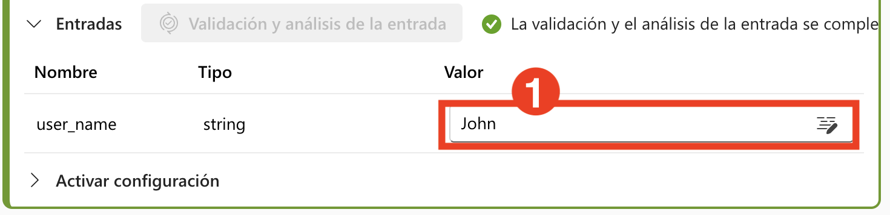
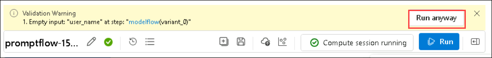

# 演習 2: プロンプト フローの構築とカスタマイズ

## ラボの概要

このラボでは、Azure AI Foundry で Prompt Flow プロジェクトを初期化し、AI アプリケーションの開発、テスト、および改良を開始するための必要な環境を設定する実践的な経験を積みます。Azure AI Foundry の Prompt Flow 内でプロンプトを作成およびカスタマイズします。新しいフローの作成から始め、Prompt ツールを追加および構成し、LLM (大規模言語モデル) と Prompt ツールを組み込んだフローを開発します。サンプル フローを作成し、カスタム入力で実行することで、フローの実行を監視し、出力を評価する方法を学び、AI 駆動のワークフローを開発、テスト、および改良するための実践的な手順を理解します。

## ラボの目的

このラボでは、次のことを行います:

- タスク 1: プロンプトの作成とカスタマイズ
- タスク 2: LLM と Prompt ツールを使用したフローの開発

### タスク 1: プロンプトの作成とカスタマイズ

プロンプトの作成とカスタマイズには、望ましい応答やアクションを引き出すための特定の質問や声明を設計することが含まれます。このプロセスには、明確な目的の定義、対象者の理解、明確さと関連性を確保するための正確な言語の使用が含まれます。カスタマイズにより、特定のコンテキストやユーザーのニーズに合わせてプロンプトをさらに洗練し、教育、カスタマー サービス、AI インタラクションなどのさまざまなアプリケーションでエンゲージメントと効果を向上させることができます。

1. ブラウザーで新しいタブを開き、次のリンクを使用して Azure AI Foundry ポータルに移動します。

   ```
    https://ai.azure.com/
   ```
2. 左上の **Azure AI Foundry** アイコンをクリックします。
3. ラボで以前に作成した AI Foundry プロジェクト **ai-foundry-project-{suffix} (1)**を選択します。
4. 左のナビゲーション ペインから **プロンプト フロー (1)** > **+ 作成 (2)** を選択して、フローに Prompt ツールを追加します。

   

5. **新しフローを作成** ブレードで、**標準フロー** の下にある **作成 (1)** をクリックし、以下のフォルダー名を入力して **作成 (3)** をクリックします。

   ```
   promptflow@lab.labInstance.Id
   ```

   

   > **注意:** 権限エラーが発生した場合は、5 分待ってから、フォルダー名が既に存在するエラーが表示された場合は一意の名前でプロンプト フローを再作成してください。フローが作成されたら **promptflow-{suffix} (2)** に名前を変更し、**編集 (1)** アイコンを選択して **保存 (3)** をクリックします。

   


### タスク 2: LLM と Prompt ツールを使用したフローの開発

大規模言語モデル (LLM) とプロンプト ツールを使用してフローを開発することは、LLM が慎重に作成されたプロンプトによって導かれて望ましい出力を生成する構造化されたインタラクションを設計することを含みます。このプロセスには通常、目的の定義、適切な LLM の選択、およびモデルの応答に基づいてプロンプトを反復的に改良して精度と関連性を確保することが含まれます。プロンプト ツールは、このインタラクションの管理と最適化を支援し、コンテンツ作成、データ分析、自動カスタマー サポートなどのタスクで LLM をより効率的かつ効果的に使用できるようにします。

1. プロンプト フロー作成ページが開きます。今すぐフローの作成を開始できます。デフォルトではサンプル フローが表示されます。この例のフローには、LLM と Python ツールのノードがあります。

2. 必要に応じて、フローにさらにツールを追加できます。表示されるツール オプションは **LLM、Prompt、および Python** です。さらに多くのツールを表示するには、**+ その他のツール** を選択します。

   


3. **Graph** から **joke (1)** を選択します。ドロップダウン メニューから既存の接続 **ai-odluser{suffix}xxxxxxxx_aoai (2)** を選択し、LLM ツール エディターでデプロイメント **gpt-4o (3)** を選択します。

   

4. 上にスクロールして、**入力** に好きな果物の名前を入力します。例: **Apple (1)**。

   

5. **保存** (1) を選択し、**Start compute session (2)** を選択します。

   

   > **注意:** セッションの開始には **10-15 分** かかる場合があります。コンピュート セッションが開始されるまで待ちます。

6. コンピュート セッションが完了したら、**joke** ノード内の再生ボタンをクリックして **joke ノード** を最初に実行し、その後 **echo ノード** を実行します。

   

7. グラフから **echo (1)** ノードをクリックし、**Play (2)** ボタンをクリックします。

   

8. すべてのノードが正常に実行されたら、ツールバーから **実行** を選択します。

   

9. フローの実行が完了したら、**出力を表示** を選択してフローの結果を表示します。出力は以下の画像のようになります。

   

10. **出力** セクションでフローの実行ステータスと出力を確認できます。

   

11. 上部メニューから **+ プロンプト (1)** を選択してフローに プロンプト ツールを追加し、フローの名前を **modelflow (2)** として **追加 (3)** を選択します。

   
   .png>)

12. **modelflow** プロンプト ツール **(1)** に次のコードを追加し、**Validate and parse input (2)** を選択します。

   ```jinja
   Welcome to Joke Bot !
   
    Hello, {{ user_name }}!
   
    Hello there!
   
   Pick a category from the list below and get ready to laugh:
   1. 🐶 Animal Jokes – From pets to wildlife, it’s a zoo of laughs.
   2. 💼 Office Humor – Relatable jokes for the 9-to-5 grind.
   3. 💻 Tech & Programmer Jokes – Debug your mood with geeky giggles.
   4. 📚 School & Exam Jokes – A+ comedy for students and survivors.
   5. ⚡ One-Liners – Quick, witty, and straight to the funny bone.
   6. 😏 Sarcastic Jokes – Dry, sharp, and deliciously savage.
   ```

   

13. 入力セクションに次の値を追加し、**保存** (2) および **実行 (3)** を選択します。

   - user_name: **John (1)**

     

14. 実行中に警告が表示された場合は、以下のスクリーンショットに示されているように **実行を続行** をクリックします。

   

15. フローの実行が完了したら、**出力を表示** を選択してフローの結果を表示します。出力は以下の画像のようになります。

   

16. **出力** セクションでフローの実行ステータスと出力を確認できます。

   

## レビュー

このラボでは、次のタスクを完了しました:

- プロンプトの作成とカスタマイズ
- LLM と Prompt ツールを使用したフローの開発

### ラボを無事に終了しました。次の演習に進むには、**Next >>** をクリックしてください。
