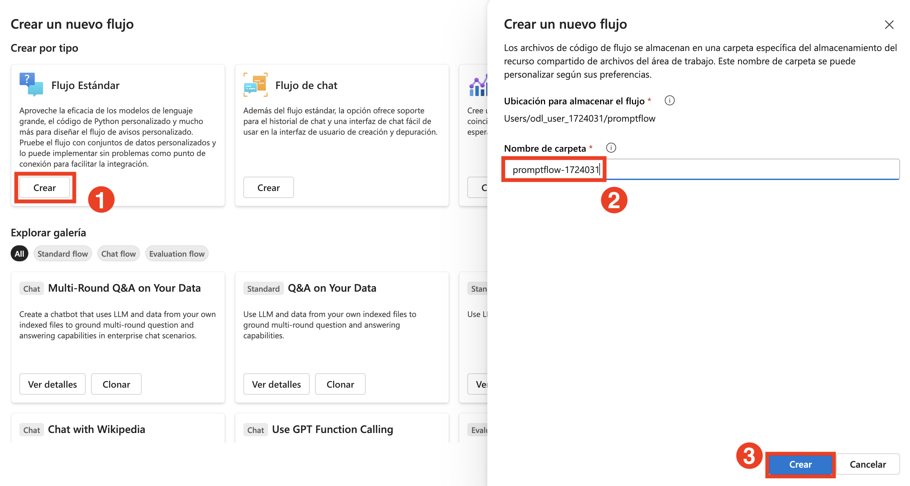
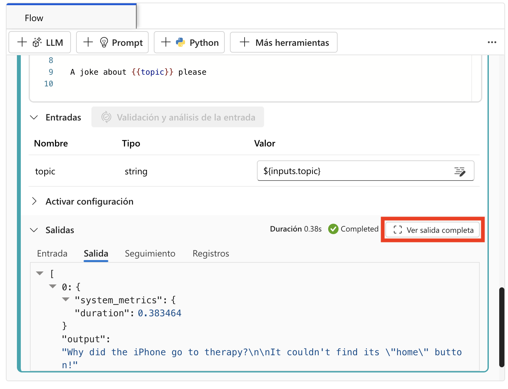

# 练习 2：构建和自定义提示流

## 实验概述

在本实验中，您将获得在 Azure AI foundry 中初始化 Prompt Flow 项目的实践经验，设置必要的环境以开始开发、测试和改进 AI 应用程序。您将在 Azure AI foundry 的 Prompt Flow 中创建和自定义提示。从创建新流程开始，您将添加和配置提示工具，并开发一个包含 LLM（大型语言模型）和提示工具的流程。通过创作示例流程并使用自定义输入运行它，您将学习如何监控流程执行和评估输出，从而了解开发、测试和改进 AI 驱动工作流的实际步骤。

## 实验目标

在本实验中，您将完成以下任务：

- 任务 1：创建和自定义提示
- 任务 2：使用 LLM 和提示工具开发流程

### 任务 1：创建和自定义提示

创建和自定义提示涉及设计特定的、有针对性的问题或陈述以引出所需的响应或行动。这个过程包括定义明确的目标、了解受众，并使用精确的语言以确保清晰度和相关性。自定义可以进一步改进提示，使其与特定上下文或用户需求保持一致，从而提高教育、客户服务和 AI 交互等各种应用中的参与度和有效性。

1. 在浏览器中打开新标签页，使用以下链接导航到 Azure AI Foundry 门户：

   ```
    https://ai.azure.com/
   ```
2. 点击左上角的 **Azure AI Foundry** 图标。
3. 选择您之前在实验中创建的 AI foundry 项目，即 **ai-foundry-project-{suffix} (1)**。
4. 从左侧导航窗格中，选择 **Prompt flow (1)** > **+ Create (2)** 将提示工具添加到您的流程中。

   

5. 在 **创建新流程** 页面上，在 **标准流程** 下，点击 **创建 (1)**，然后输入以下提供的文件夹名称，并点击 **创建 (3)**：

   ```
   promptflow-{suffix}
   ```

   

   > **注意：** 如果遇到任何权限错误，请等待 5 分钟，当看到文件夹名称已存在错误时，使用唯一名称重新创建提示流。一旦流程创建完成，通过选择 **编辑图标 (1)** 将其重命名为 **promptflow-{suffix} (2)**，然后点击 **保存 (3)**。

   


### 任务 2：使用 LLM 和提示工具开发流程

使用大型语言模型 (LLM) 和提示工具开发流程涉及设计一个结构化的交互，其中 LLM 由精心制作的提示引导以生成所需的输出。这个过程通常包括定义目标、选择适当的 LLM，并根据模型的响应迭代改进提示以确保准确性和相关性。提示工具帮助管理和优化这种交互，使 LLM 在内容创建、数据分析和自动客户支持等任务中更加高效和有效。

1. 提示流创作页面打开。您现在可以开始创作您的流程。默认情况下，您会看到一个示例流程。这个示例流程有用于 LLM 和 Python 工具的节点。

2. 您可以选择向流程添加更多工具。可见的工具选项有 **LLM、提示和 Python**。要查看更多工具，请选择 **+ 更多工具**。

3. 从 **图表** 中，选择 **笑话 (1)**。从下拉菜单中选择现有连接 **ai-odluser{suffix}xxxxxxxx_aoai (2)**，对于部署，在 LLM 工具编辑器中选择部署 **gpt-4o (3)**。

   

4. 向上滚动，对于 **输入**，输入您选择的任何水果名称，如 **苹果 (1)**。

   

5. 选择 **保存 (1)**，然后选择 **启动计算会话 (2)**。

   

   > **注意：** 启动会话可能需要 **10-15 分钟**。等待计算会话启动。

6. 计算会话完成后，先点击 **笑话** 节点内的播放按钮运行 **笑话节点**，然后运行 **回显节点**。

   

7. 从图中点击 **回显 (1)** 节点，然后点击 **播放 (2)** 按钮。

   

8. 所有节点成功执行后，从工具栏中选择 **运行**。

   

9. 流程运行完成后，选择查看输出以查看流程结果。输出将类似于下图所示。

   

10. 您可以在 **输出** 部分查看流程运行状态和输出。

    

11. 从顶部菜单中，选择 **+ 提示 (1)** 将提示工具添加到您的流程中，将流程命名为 **模型流程 (2)**，然后选择 **添加 (3)**。

    
    .png>)

12. 在 **模型流程** 提示工具中添加此代码 **(1)**，然后选择 **验证并解析输入 (2)**：

      **英文：**
      ```jinja
      Welcome to Joke Bot !
      
      Hello, {{ user_name }}!
      
      Hello there!
      
      Pick a category from the list below and get ready to laugh:
      1. 🐶 Animal Jokes – From pets to wildlife, it's a zoo of laughs.
      2. 💼 Office Humor – Relatable jokes for the 9-to-5 grind.
      3. 💻 Tech & Programmer Jokes – Debug your mood with geeky giggles.
      4. 📚 School & Exam Jokes – A+ comedy for students and survivors.
      5. ⚡ One-Liners – Quick, witty, and straight to the funny bone.
      6. 😏 Sarcastic Jokes – Dry, sharp, and deliciously savage.
      ```

      **中文：**

      ```jinja
      欢迎来到笑话机器人！
      
      你好，{{ user_name }}！
      
      你好啊！
      
      从下面的列表中选择一个类别，准备开怀大笑：
      1. 🐶 动物笑话 – 从宠物到野生动物，这里是笑声的动物园
      2. 💼 办公室幽默 – 朝九晚五的生活中的笑料
      3. 💻 科技与程序员笑话 – 用极客笑话调试你的心情
      4. 📚 学校与考试笑话 – A+ 级别的学生笑料
      5. ⚡ 单行笑话 – 简短、机智、直击笑点
      6. 😏 讽刺笑话 – 干练、尖锐、令人回味的冷幽默
      ```

      

13. 在输入部分添加以下值，选择 **保存 (2)** 和 **运行 (3)**：
    - 用户名称: **小明 (1)**

    

14. 如果运行时遇到任何警告，如下图所示，点击 **继续运行**。

    

15. 流程运行完成后，选择查看输出以查看流程结果。输出将类似于下图所示。

    

16. 您可以在 **输出** 部分查看流程运行状态和输出。

    

## 回顾

在本实验中，您已完成以下任务：

- 创建和自定义了提示
- 使用 LLM 和提示工具开发了流程

### 您已成功完成实验。点击 **下一步** 继续下一个练习。
