# 演習 3: 評価フローの設定

## ラボの概要
このラボでは、組み込みの評価指標を使用して自動評価パイプラインを設定し、より深い洞察を得るために手動評価を構成します。まず、精度、適合率、再現率、F1 スコアなどの組み込み指標を活用して、モデルのパフォーマンスを自動的に評価します。次に、手動評価プロセスを設定し、人間のレビュアーがモデル出力に関する定性的なフィードバックを提供できるようにします。この実践的な演習では、自動評価と手動評価の方法を統合して、モデルの精度と信頼性を向上させる方法を理解します。

## ラボの目的
このラボでは、次のことを行います:
- タスク 1: 手動評価の設定
- タスク 2: 組み込み評価指標を使用した自動評価の設定

## タスク 1: 手動評価の設定

基準を定義し、人間のフィードバックを収集し、モデルの精度とバイアスを分析してパフォーマンスを向上させることで、手動評価を設定します。

1. 左側のナビゲーションメニューの「**アクセスと改善**」セクションで、「 **評価 (1)** 」を選択します。「**AIアプリケーションのパフォーマンスの評価と比較**」で、「**手動評価 (2)**」タブを選択します。「**+ 新しい手動評価 (3)**」を選択します。

   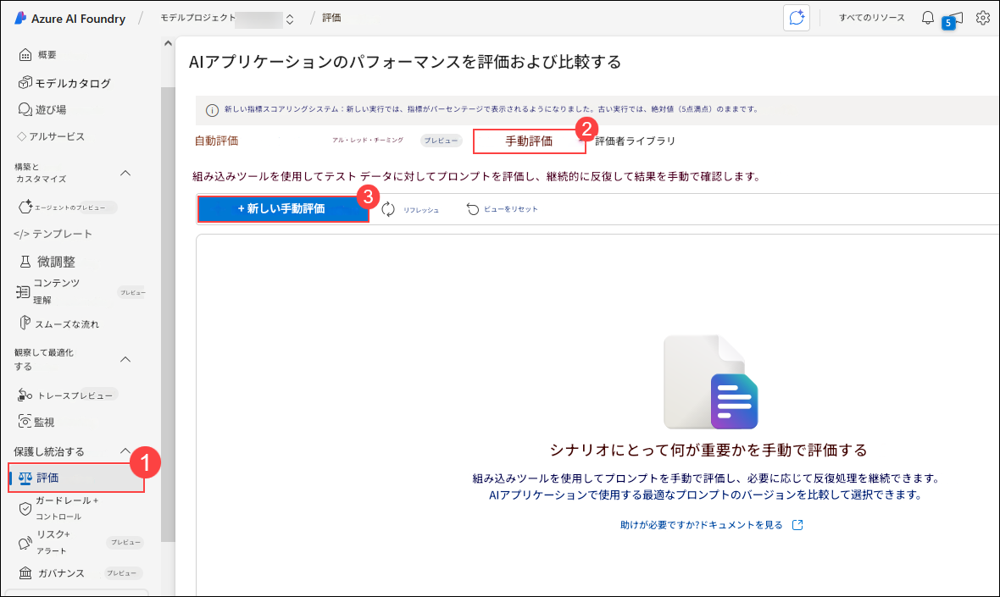

2. 前の **システムメッセージ** が既に入力されており、デプロイされたモデルが選択された新しいウィンドウが開きます。

   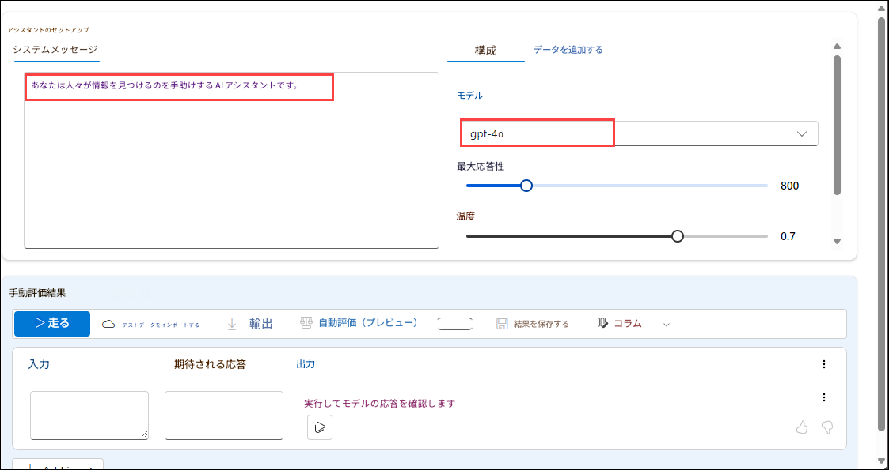

3. **手動評価結果** セクションで、出力をレビューするための 5 つの入力を追加します。**+ 入力を追加** を選択して、次の 5つの質問を 5つの別々の入力として入力します:

   プロンプト : 
   `Can you provide a list of the top-rated budget hotels in Rome?`
   `ローマの高評価な格安ホテルのリストを提供できますか？`

   `I'm looking for a vegan-friendly restaurant in New York City. Can you help?`
   `ニューヨーク市でビーガン向けのレストランを探しています。手伝ってもらえますか？`

   `Can you suggest a 7-day itinerary for a family vacation in Orlando, Florida?`
   `オーランド（フロリダ州）での家族旅行のための7日間の旅程を提案できますか？`

   `Can you help me plan a surprise honeymoon trip to the Maldives?`
   `モルディブへのサプライズ新婚旅行を計画するのを手伝ってもらえますか？`

   `Are there any guided tours available for the Great Wall of China?`
   `万里の長城で利用できるガイド付きツアーはありますか？`

5. 上部バーから **実行** を選択して、入力として追加したすべての質問の出力を生成します。

    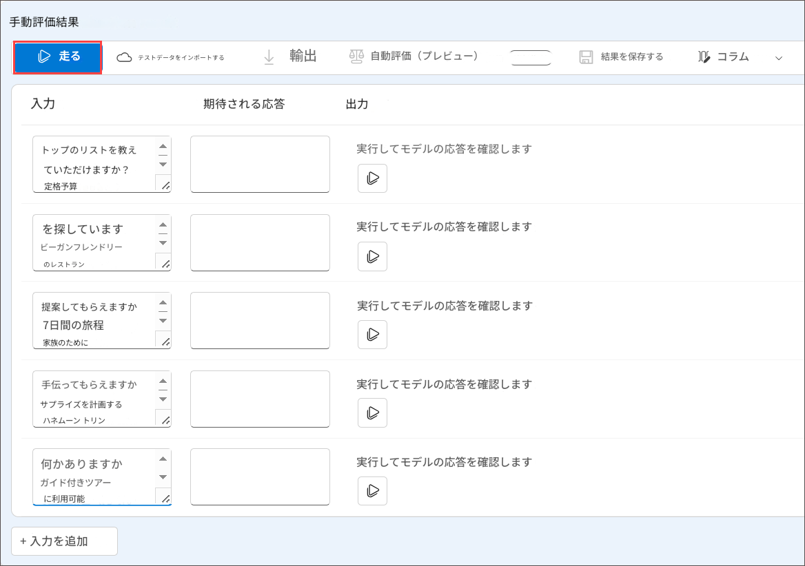

6. 各質問の **出力** を手動でレビューし、応答の右下にあるサムズアップまたはサムズダウン アイコンを選択します。少なくとも 1 つのサムズアップと 1 つのサムズダウンの応答を含めて評価します。

   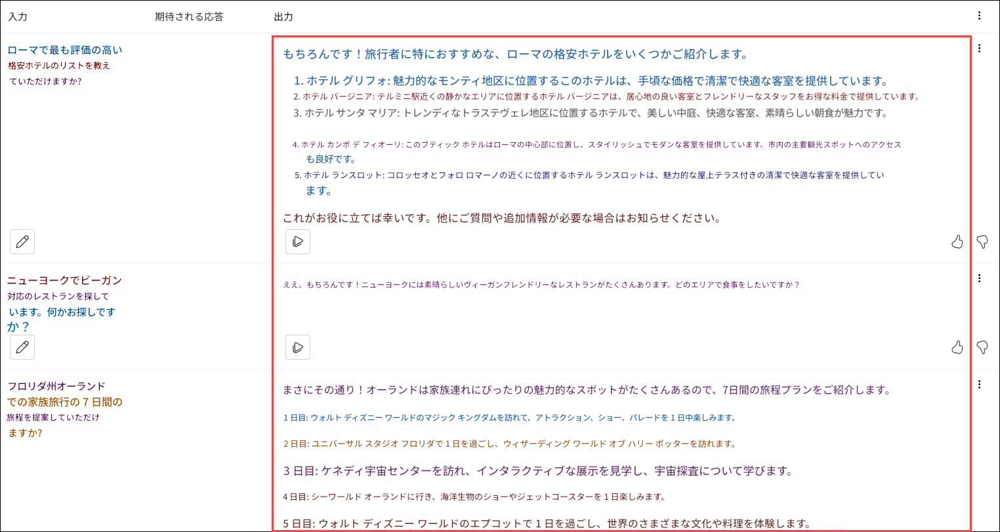

   > **注意:** 実行中に出力で「現在の AI サービスのトークン レート制限を超えました」というエラーが発生した場合は、数分後に失敗したものを再実行してください。

7. 上部バーから **結果を保存 (1)** を選択します。結果の名前として **manual_evaluation_results (2)** を入力し、保存 (3)** を選択します。

   
   
8. 左側のメニューから**評価 (1)** へ移動します。**手動評価 (2)** タブを選択すると、**(3)** で保存した手動評価が表示されます。以前に作成した手動評価を参照することもできます。中断したところから作業を続行し、更新した評価を保存します。

   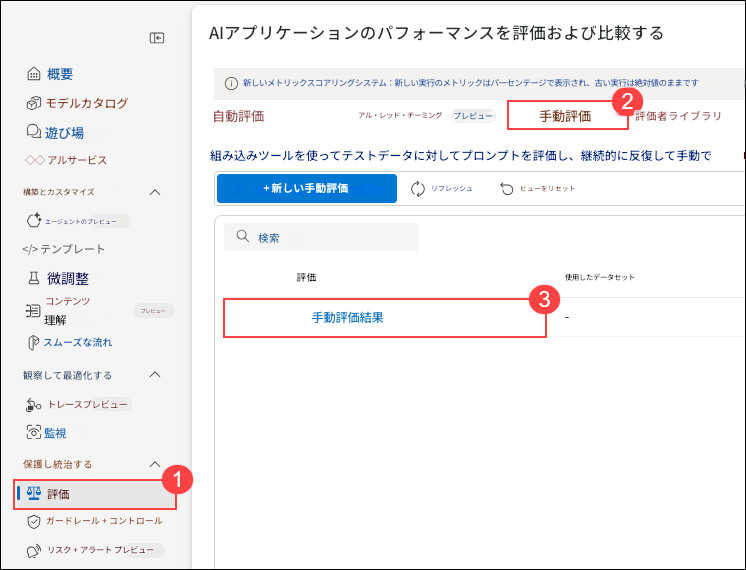

## タスク 2: 組み込み評価指標を使用した自動評価の設定

このラボでは、組み込み指標を使用してモデルのパフォーマンスを迅速かつ正確に測定するための自動評価を構成します。

1. 左側のナビゲーション メニューの [**保護と管理**] セクションで、[**評価 (1)**] を選択します。[**AI アプリケーションのパフォーマンスの評価と比較**] で、[**自動評価 (2)**] タブを選択します。[**+ 新しい評価 (3)**] を選択します。

   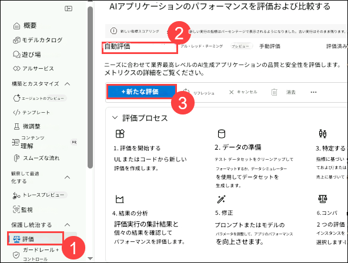

2. **+ 新しい評価** ペインで、**既存のクエリ応答データセットを評価する (1)** を選択し、**次へ (2)** をクリックします。

   

3. 新しいタブを開き、新しいリンク **https://raw.githubusercontent.com/MicrosoftLearning/mslearn-ai-studio/main/data/travel-qa.jsonl** JSONL ファイルを貼り付けます。**Ctrl A** を押してすべてを選択し、**Ctrl C** を押してコピーします。
  
    - Windows の検索バーで **Visual Studio (1)** を検索し、**Visual Studio (2)** を選択します。

       

    - **ファイル (1)** メニューから **新しいテキストファイル (2)** を選択します。 

       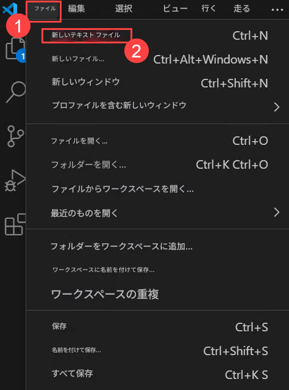

    - **コピーしたコードを貼り付けます。**

    - **ファイル (1)** に移動し、**名前を付けて保存 (2)** をクリックします。    

       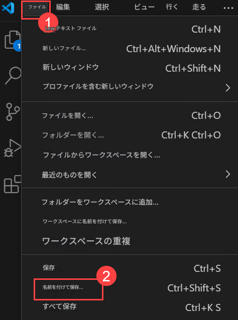    

    - **デスクトップ (1)** をクリックし、ファイル名を **Sample (1)** と入力し、保存形式として **JSON Lines (3)** を選択し、**保存 (4)** をクリックします。

       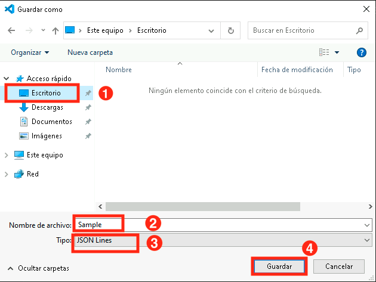

   > **注記：** 正しいファイル形式を選択してください。AI Foundryポータルは**JSON Lines**形式のファイルのみを受け付けます。他のファイル形式を選択した場合、ファイルは受け付けられません。
      

1. **Azure AI Foundry** に戻ります。そこで、**新しい評価を作成** していました。
   
    - **テスト データを構成し**ます。**新しいデータセットをアップロード**を選択します。
  
         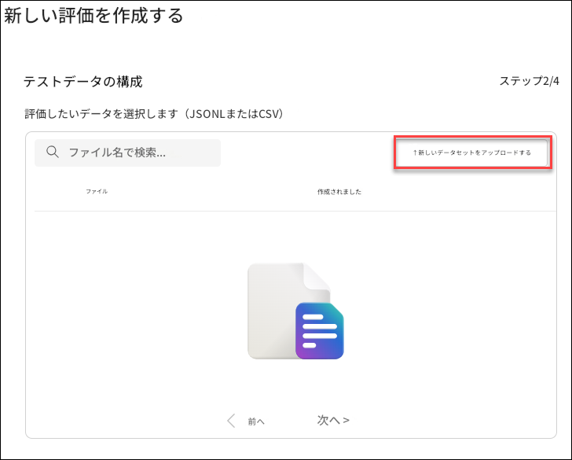

    - **デスクトップ (1)** に移動します。**Sample.jsonl** **(2)** ファイルを選択し、**開く** **(3)** をクリックします。

         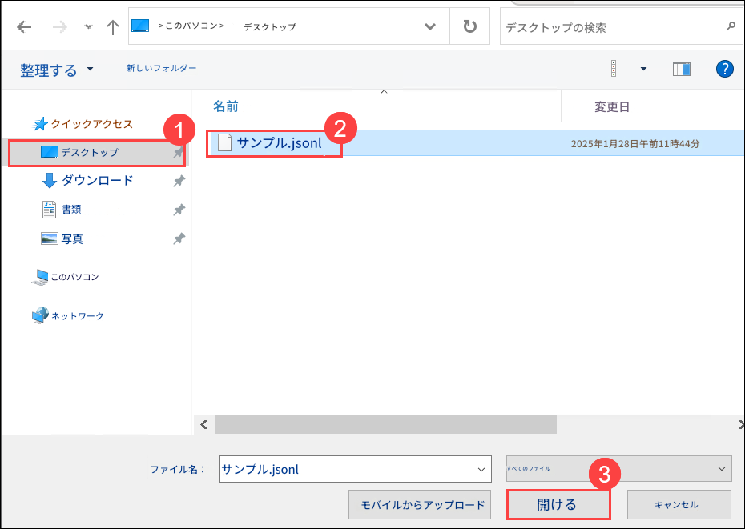   

    - **次へ**を選択します。 

    - **評価者を設定**します。**+ 追加**をクリックし、**リッカート尺度評価者**を選択します。
      
        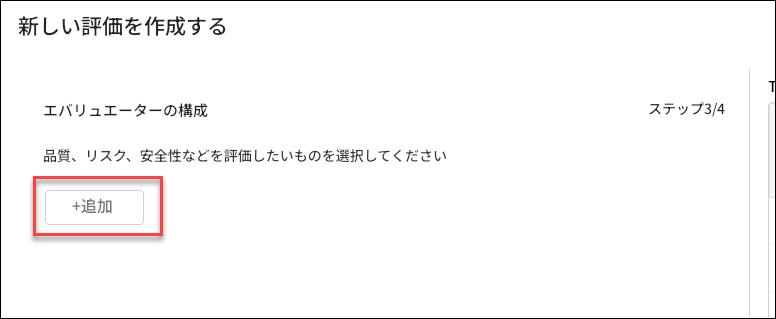
      
        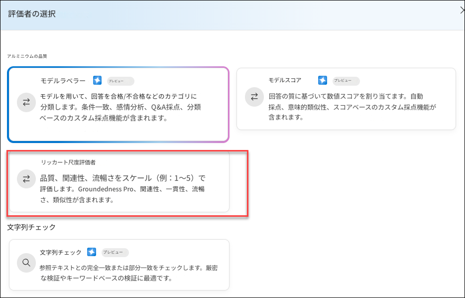
      
    - 条件名に**Coherence (1)**と入力します。プリセットには**Coherence (2)**を入力します。下にスクロールします。クエリには**{{item.query}}** **(3)**を選択します。レスポンスには**${item.response}** **(4)**を選択します。**追加 (5)**をクリックします。

         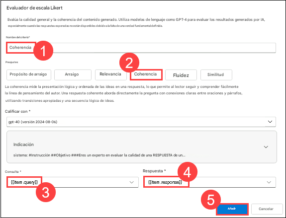

    - **評価者を設定**します。**+ 追加** をクリックし、**リッカート尺度評価者** を選択します。
         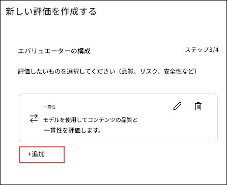
      
         

    - 条件名に**Fluency (1)**と入力します。プリセットに**Fluency (2)**を入力します。下にスクロールして、クエリに**{{item.query}}** **(3)**を選択します。応答に**${item.response}** **(4)**を選択し、**追加 (5)**をクリックします。

         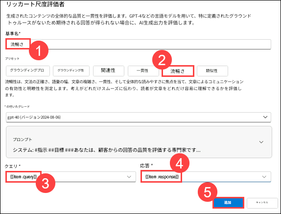

    - 追加したら、「次へ」をクリックします。
      
         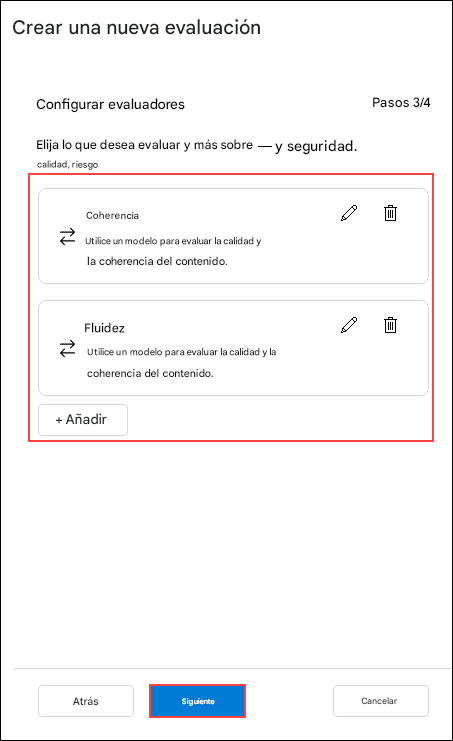

   - 今。モデル評価名を に更新します。  **Modelevaluation-{suffix}(1)** . **送信 (2)** をクリックします。
     
        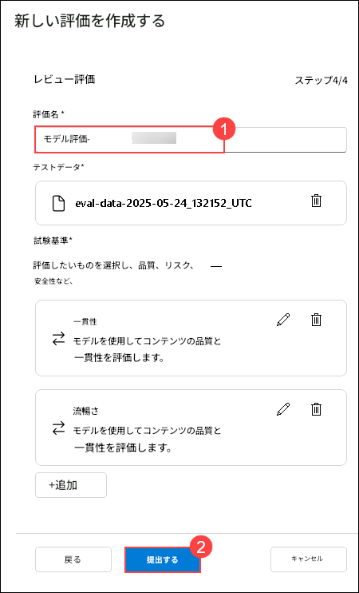
        
1. 評価ステータスが「**完了**」に変わるまでお待ちください。ステータスが「**キューに追加**」および「**実行中**」と表示されている場合は、最新の更新内容を確認するためにページを更新する必要がある場合があります。
   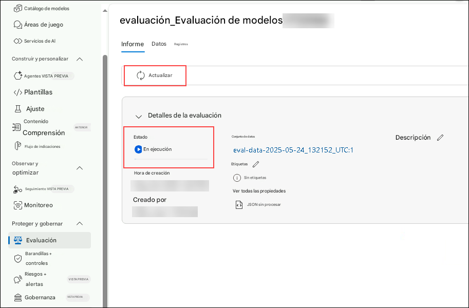

1. 左側のナビゲーション メニューから **評価 (1)** を選択します。**自動評価 (2)** の下で、新しく作成された評価実行 **(3)** を選択します。
   
   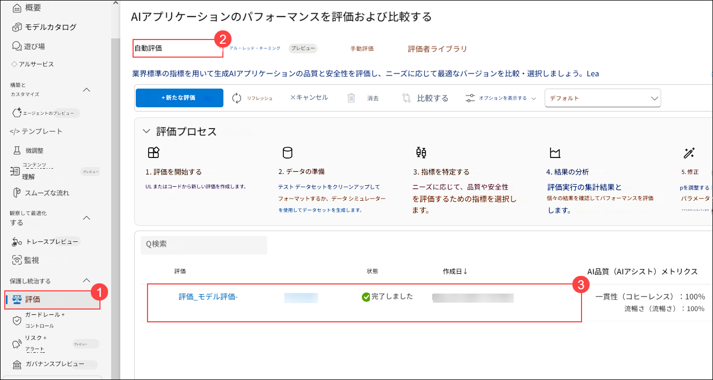

1. **レポート** タブの下で、下にスクロールして **メトリック ダッシュボード** を確認します。

    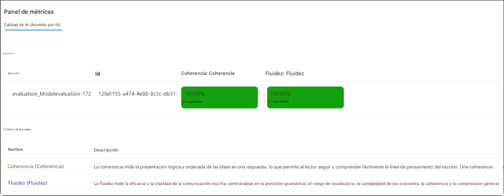

1. **詳細なメトリクス結果 (2)** を表示するには、上部のメニューから **データ (1)** タブに移動します。    

    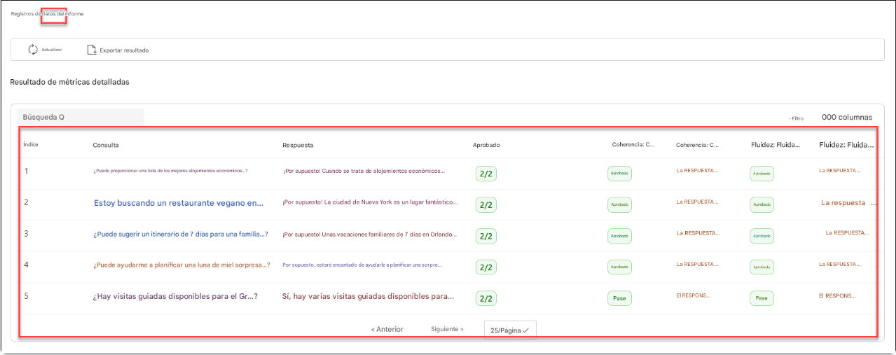

## レビュー
このラボでは、次のタスクを完了しました:
- 手動評価の設定
- 組み込み評価指標を使用した自動評価の設定

### ラボを無事に終了しました。次の演習に進むには、**Next >>** をクリックしてください。
