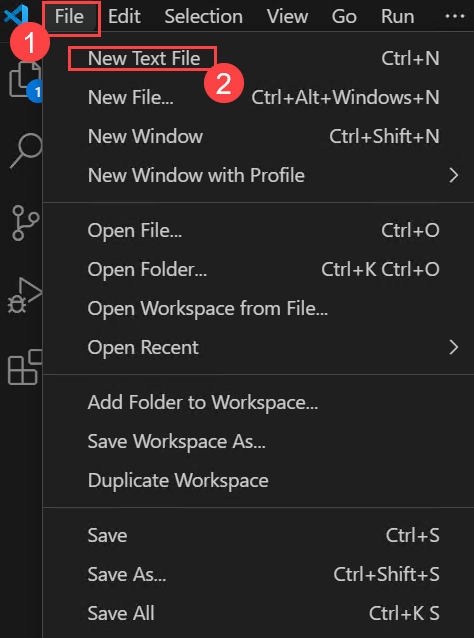

# 실습 3: 평가 흐름 설정

## 개요

이 실습에서는 내장된 평가 지표를 활용하여 자동 평가 파이프라인을 설정하고, 심층적인 분석을 위한 수동 평가 구성을 진행합니다. 먼저 정확도(accuracy), 정밀도(precision), 재현율(recall), F1 점수(F1-score)와 같은 내장된 지표를 통해 모델 성능을 자동으로 평가합니다. 이후, 사람 평가자가 모델 출력에 대해 정성적인 피드백을 제공할 수 있는 수동 평가 프로세스를 설정합니다. 이 실습을 통해 자동 평가와 수동 평가를 통합하여 모델의 정확성과 신뢰성을 개선하는 방법을 이해하게 됩니다.

## 목표

이 실습에서 여러분은 다음 과제를 수행하게 됩니다:

- 과제 1: 수동 평가 설정
- 과제 2: 내장 평가 지표를 활용한 자동 평가 설정

## 과제 1: 수동 평가 설정

명확한 평가 기준을 정의하고, 사람 평가자의 피드백을 수집하여 모델의 정확성과 편향을 분석하고 성능을 개선합니다.

1. 왼쪽 탐색 메뉴에서 **평가 및 개선** 섹션 아래의 **평가 (1)** 을 선택합니다. **AI 애플리케이션 성능 평가 및 비교** 화면에서 **수동 평가 (2)** 탭을 클릭한 후, **+ 새로운 수동 평가 (3)** 을 선택합니다.

   

1. 새 창이 열리며, 이전에 설정한 **시스템 메시지**와 배포된 모델이 자동으로 채워집니다.

   

1. **수동 평가 결과** 섹션에서 출력 결과를 평가할 5개의 입력값을 추가합니다. **+ 입력 추가** 버튼을 클릭하고 다음 다섯 가지 질문을 각각 별도의 입력으로 추가합니다:

   ```
   Can you provide a list of the top-rated budget hotels in Rome?
   I'm looking for a vegan-friendly restaurant in New York City. Can you help?
   Can you suggest a 7-day itinerary for a family vacation in Orlando, Florida?
   Can you help me plan a surprise honeymoon trip to the Maldives?
   Are there any guided tours available for the Great Wall of China?
   ```
   ```
   로마에서 평점이 높은 저예산 호텔 목록을 알려줄 수 있나요?
   뉴욕시에서 비건 친화적인 레스토랑을 찾고 있어요. 도와주실 수 있나요?
   올랜도(플로리다)에서의 7일 가족 여행 일정을 추천해줄 수 있나요?
   몰디브로의 깜짝 신혼여행 계획을 도와주실 수 있나요?  
   만리장성에서 이용할 수 있는 가이드 투어가 있나요?
   ```

1. 상단 바에서 **실행** 을 선택하여 위 입력값들에 대한 출력을 생성합니다.

   

1. 생성된 출력에 대해 수동으로 평가를 진행합니다. 각 응답 우측 하단에 있는 엄지손가락 아이콘(좋아요/싫어요)을 클릭하여 평가하세요. 최소한 하나 이상의 좋아요와 싫어요 평가를 포함해야 합니다.

   

   > **참고:** 출력 실행 중 `"현재 사용 중인 AI 서비스의 토큰 속도 제한을 초과했습니다."` 오류가 발생하면, 몇 분 후에 실패한 항목을 다시 실행하세요.

1. 상단 바에서 **결과 저장 (1)** 를 클릭합니다. 결과 이름은 **manual\_evaluation\_results (2)** 로 입력하고 **저장 (3)** 를 클릭합니다.

   

1. 왼쪽 메뉴에서 **평가 (1)** > **수동 평가 (2)** 탭으로 이동하여 방금 저장한 수동 평가를 확인할 수 있습니다 **(3)**. 이전에 수행한 수동 평가들을 탐색하고, 이어서 계속하거나 업데이트된 내용을 다시 저장할 수 있습니다.

   

## 과제 2: 내장 평가 지표를 활용한 자동 평가 설정

이 과제에서는 내장된 평가 지표를 활용해 모델 성능을 빠르고 정확하게 측정하는 자동 평가를 구성합니다.

1. 왼쪽 탐색 메뉴에서 **평가 및 개선** 섹션의 **평가 (1)** 을 선택한 뒤, **자동화된 평가 (2)** 탭에서 **새 평가 만들기 (3)** 을 선택합니다.

   

1. **새 평가 만들기** 창에서 **기존 쿼리-응답 데이터 세트 계산(1)**을 선택하고 **다음(2)**을 클릭합니다.

   

1. 새 탭에서 아래 링크를 열고 JSONL 파일 전체를 복사합니다:
   [https://raw.githubusercontent.com/MicrosoftLearning/mslearn-ai-studio/main/data/travel-qa.jsonl](https://raw.githubusercontent.com/MicrosoftLearning/mslearn-ai-studio/main/data/travel-qa.jsonl)

   - **Ctrl + A** → **Ctrl + C** 로 전체 선택 및 복사

1. Windows VM의 검색창에서 **Visual Studio (1)** 를 검색하여 실행하고 **Visual Studio (2)** 를 선택합니다.

   

1. **File (1)** > **New Text File (2)** 을 선택하고 복사한 코드를 붙여넣습니다.

   

1. **File (1)** > **Save As (2)** 클릭

   

1. **Desktop (1)** 위치 선택, 파일 이름은 **Sample (1)**, 파일 형식은 **JSON Lines (3)** 로 설정 후 **Save (4)** 클릭

   

1. **Azure AI Foundry**로 다시 이동하여 **새 평가 생성**을 진행합니다.

   * **테스트 데이터 구성**: **새 데이터셋 업로드**를 선택합니다.

   

   * **Desktop  (1)**으로 이동하여 **Sample.jsonl** 파일을 선택하고 **Open (3)**를 클릭합니다.

   

   * **다음**을 선택합니다.

   * **평가자 구성**: **+ 추가**를 클릭하고 **Likert 척도 평가자**를 선택합니다.

   
   
   

   * **Coherence (1)**을 선택하고, 아래의 Query에는 **{{item.query}}** (2), Response에는 **\${item.response}** (3)를 입력한 후 **추가 (4)**를 클릭합니다.

   

   * **평가자 구성**: 다시 **+ 추가**를 클릭하고 **Likert 척도 평가자**를 선택합니다.

   

   

   * **Fluency (1)**를 선택하고, 아래의 Query에는 **{{item.query}}** (2), Response에는 **\${item.response}** (3)를 입력한 후**추가 (4)**를 클릭합니다.

   

   * 모두 추가되었으면 **다음**을 클릭합니다.

   

   * 모델 평가 이름을 **Modelevaluation-{suffix} (1)**로 업데이트하고**제출 (2)**을 클릭합니다.

   

1. 평가 상태가 **완료됨(Completed)**으로 변경될 때까지 기다립니다. 상태가 **대기 중(Queued)** 또는 **실행 중(Running)**으로 표시되면, 최신 상태를 확인하려면 페이지를 새로 고쳐야 할 수 있습니다.

   

1. 왼쪽 탐색 메뉴에서 **평가(Evaluation) (1)**를 선택한 다음, **자동 평가(Automated Evaluation) (2)** 아래에서 새로 생성한 평가 실행 항목 **(3)**을 선택합니다.

   

1. **보고서(Report)** 탭에서 아래로 스크롤하여 **메트릭 대시보드(Metric dashboard)**를 확인합니다.

   

1. 상단 메뉴에서 **데이터(Data) (1)** 탭으로 이동하여 **세부 메트릭 결과(Detailed metrics results) (2)**를 확인합니다. 

   

## 복습
이번 실습에서는 다음 과제를 완료했습니다:
- 수동 평가 설정
- 내장 평가 지표를 활용한 자동 평가 설정

### 실습을 성공적으로 완료하였습니다. 다음 연습 과제로 진행하려면 다음 >> 버튼을 클릭하세요.