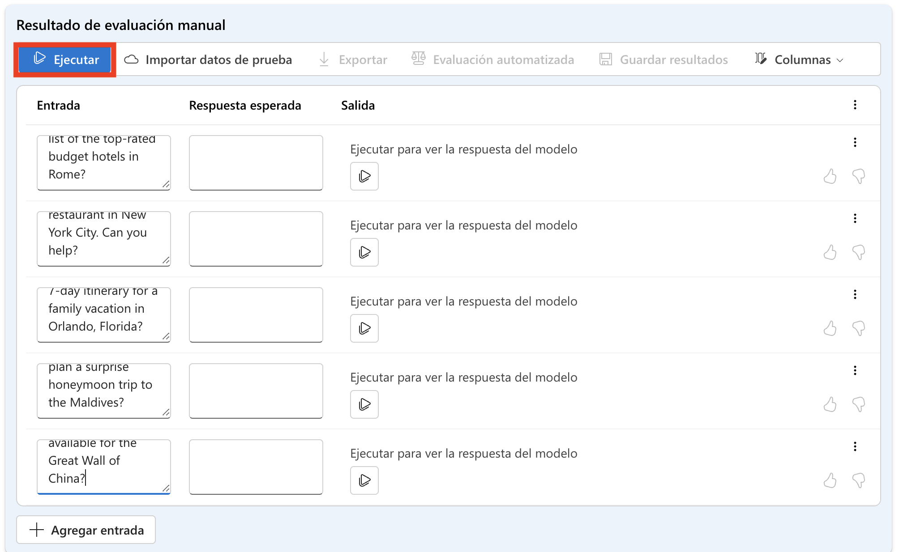
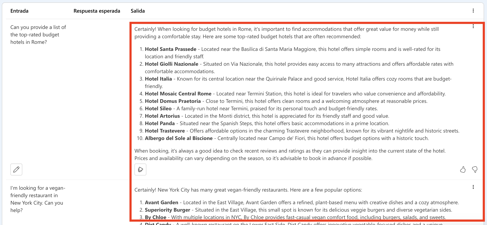
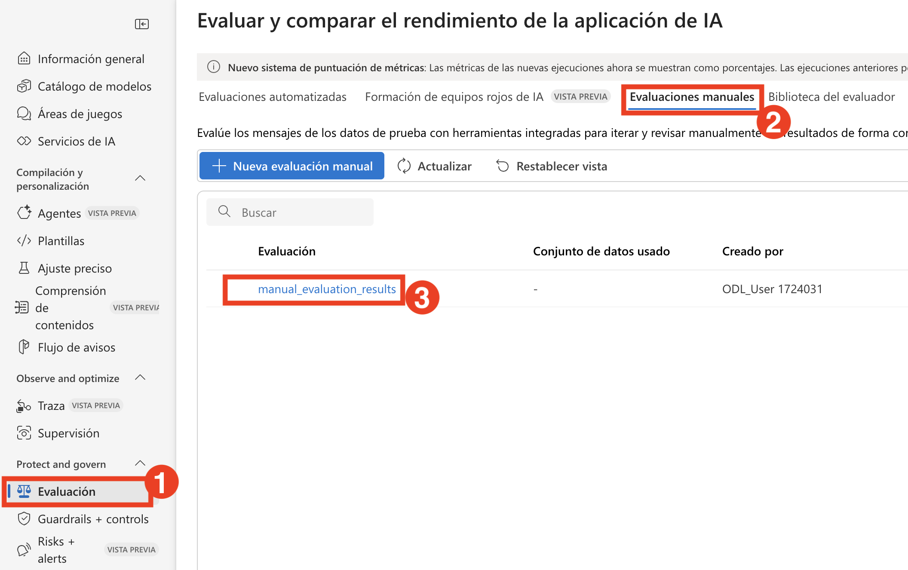
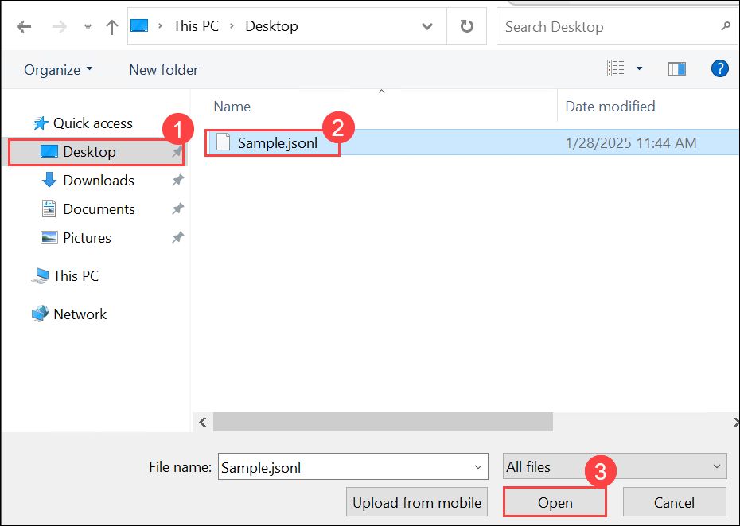

# Ejercicio 3: Configuración de Evaluation Flow

## Descripción del laboratorio
En este laboratorio, configurarás un pipeline de evaluación automatizada usando métricas integradas y configurarás la evaluación manual para obtener información cualitativa. Comenzarás aprovechando métricas integradas como accuracy, precision, recall y F1-score para evaluar automáticamente el rendimiento del modelo. Luego, configurarás un proceso de evaluación manual donde revisores humanos pueden proporcionar retroalimentación cualitativa sobre las salidas del modelo. Este ejercicio práctico te ayudará a comprender la integración de métodos de evaluación automatizados y manuales para mejorar la precisión y confiabilidad del modelo.

## Objetivos del laboratorio
En este laboratorio, realizarás lo siguiente:
- Tarea 1: Configurar evaluación manual
- Tarea 2: Configurar evaluación automatizada con métricas integradas

## Tarea 1: Configurar evaluación manual

Configura la evaluación manual definiendo criterios, recopilando retroalimentación humana y analizando la precisión y sesgos del modelo para mejorar el rendimiento.

1. Desde el menú de navegación izquierdo, en la sección **Access and Improve**, selecciona **Evaluation (1)**. En **Assess and compare AI application performance** selecciona la pestaña **Manual evaluations (2)**. Selecciona **+ New manual evaluation (3)**.

   

1. Se abrirá una nueva ventana con tu **system message** previa ya poblada y tu modelo desplegado seleccionado.

   

1. En la sección **Manual evaluation result**, agregarás cinco entradas para las que revisarás la salida. Ingresa las siguientes cinco preguntas como cinco entradas separadas seleccionando **+ Add Inputs**:

   `Can you provide a list of the top-rated budget hotels in Rome?`

   `I'm looking for a vegan-friendly restaurant in New York City. Can you help?`

   `Can you suggest a 7-day itinerary for a family vacation in Orlando, Florida?`

   `Can you help me plan a surprise honeymoon trip to the Maldives?`

   `Are there any guided tours available for the Great Wall of China?`

1. Selecciona **Run** en la barra superior para generar salidas para todas las preguntas que agregaste como entradas.

    

1. Ahora puedes revisar manualmente las **Outputs** de cada pregunta seleccionando el icono de pulgar arriba o abajo en la parte inferior derecha de una respuesta. Califica cada respuesta, asegurándote de incluir al menos una respuesta positiva y una negativa en tus calificaciones.

   

   > **Nota:** Si recibes un error en alguna de las salidas al ejecutar el run "exceeded token rate limit of your current AIService", vuelve a ejecutar las fallidas después de un par de minutos.

1. Selecciona **Save results (1)** en la barra superior. Ingresa **manual_evaluation_results (2)** como nombre para los resultados y selecciona **Save (3)**.

   
   
1. Usando el menú de la izquierda, navega a **Evaluations (1)**. Selecciona la pestaña **Manual evaluations (2)** para encontrar las evaluaciones manuales que acabas de guardar **(3)**. Observa que puedes explorar tus evaluaciones manuales previas, continuar donde lo dejaste y guardar las evaluaciones actualizadas.

   

## Tarea 2: Configurar evaluación automatizada con métricas integradas

En esta tarea, configurarás la evaluación automatizada utilizando métricas integradas para medir el rendimiento del modelo de manera rápida y precisa.

1. Desde el menú de navegación izquierdo, en la sección **Protect and govern**, selecciona **Evaluation (1)**. En **Assess and compare AI application performance** selecciona la pestaña **Automated evaluations (2)**. Selecciona **+ New evaluation (3)**.

   

1. En el panel **+ New evaluation**, selecciona **Ecaluate an existing query-response dataset (1)** y haz clic en **Next (2)**.

   

1. Abre una nueva pestaña y pega el nuevo enlace **https://raw.githubusercontent.com/MicrosoftLearning/mslearn-ai-studio/main/data/travel-qa.jsonl** del archivo JSONL. Presiona **Ctrl A** y **Ctrl C** para seleccionar todo y **Copiar**.
  
    - Busca **Visual Studio Code (1)** en la barra de búsqueda de Windows de la vm y selecciona **Visual Studio Code(2)**.

       

    - Desde el menú **File (1)**, selecciona **New Text File (2)**, 

       

    - **Pega el código copiado**.

    - Navega a **File (1)** y haz clic en **Save as (2)**.    

         

        > **Nota:** Este error se puede ignorar ya que se elegirá **"Save as type"** en el siguiente paso.
  
    - Haz clic en **Desktop (1)**, ingresa el nombre del archivo como **Sample (1)**, selecciona **JSON Lines (3)** como tipo de archivo y luego haz clic en **Save (4)**.

        

       > **Nota:** Asegúrate de seleccionar el tipo de archivo correcto. El portal de AI Foundry solo acepta archivos en formato **JSON Lines**. Si se selecciona cualquier otro tipo de archivo, no será aceptado.
       
1. Navega de regreso a **Azure AI Foundry**, donde estabas **creating a new evaluation**.
   
    - **Configure test data**: selecciona **Upload new dataset**

         
   
    - Navega a **Desktop (1)**, selecciona el archivo **Sample.jsonl (2)** y haz clic en **Open (3)**.

            

    - Selecciona **Next**.

    - **Configure Evaluators**: Haz clic en **+ Add** y selecciona **Likert-scale evaluator**.
  
         

         

    - Proporciona el nombre como **Coherence (1)** para **Criteria Name**, **Coherence (2)** para **presets**, desplázate hacia abajo y selecciona **{{item.query}} (3)** para **query**, selecciona **${item.response} (4)** para **Response** y haz clic en **Add (5)**.

         

    - **Configure Evaluators**: Haz clic en **+ Add** y selecciona **Likert-scale evaluator**

         

         
    
    - Proporciona el nombre como **Fluency (1)** para **Criteria Name**, **Fluency (2)** para **presets**, desplázate hacia abajo y selecciona **{{item.query}} (3)** para **query**, selecciona **${item.response} (4)** para **Response** y haz clic en **Add (5)**.

         

    - Una vez agregado, haz clic en **Next**.

         

    - Ahora, actualiza el nombre de la evaluación del modelo a **Modelevaluation- (1)** y haz clic en **Submit (2)**.

        

1. Espera hasta que el estado de la evaluación cambie a **Completed**. Si el estado muestra **Queued** o **Running**, es posible que necesites actualizar la página para ver la última actualización.

    

1. Selecciona **Evaluation (1)** desde el menú de navegación izquierdo y, bajo **Automated Evaluation (2),** elige la nueva ejecución de evaluación creada.

   

1. En la pestaña **Report**, desplázate hacia abajo para explorar el **Metric dashboard**.

    

1. Navega a la pestaña **Data (1)** desde el menú superior para ver los **Detailed metrics results (2)**.

    

## Revisión
En este laboratorio completaste las siguientes tareas:
- Configurar evaluación manual
- Configurar evaluación automatizada con métricas integradas

### Has completado exitosamente el laboratorio. Haz clic en **Next >>** para continuar con el siguiente ejercicio.
