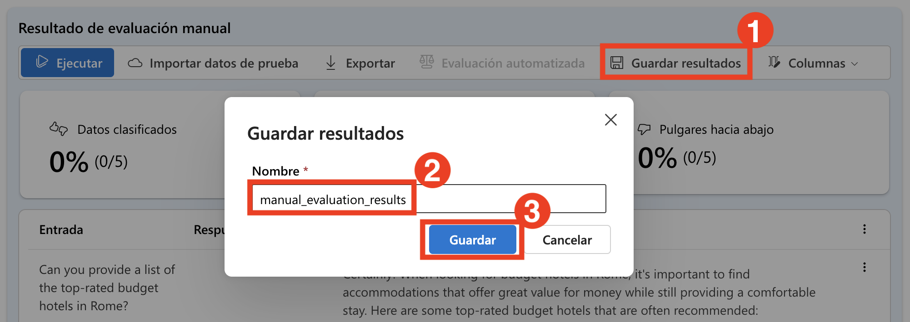
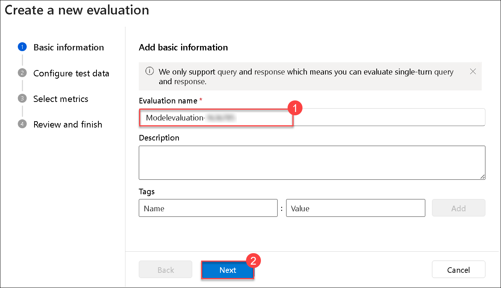
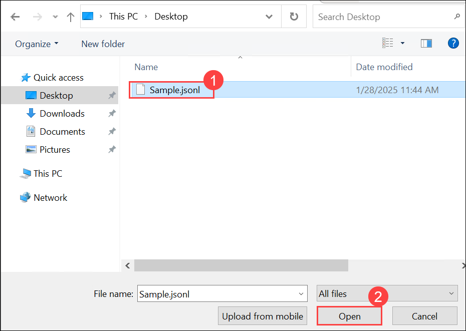
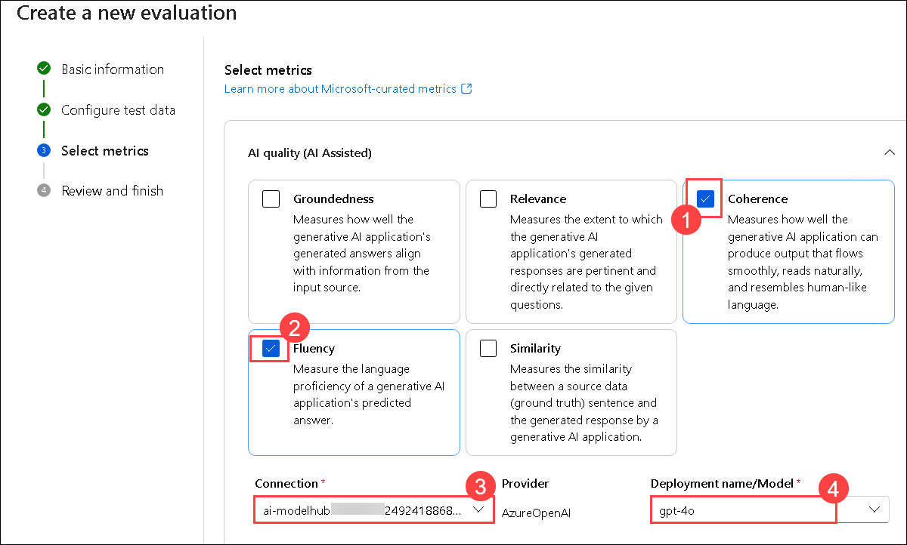
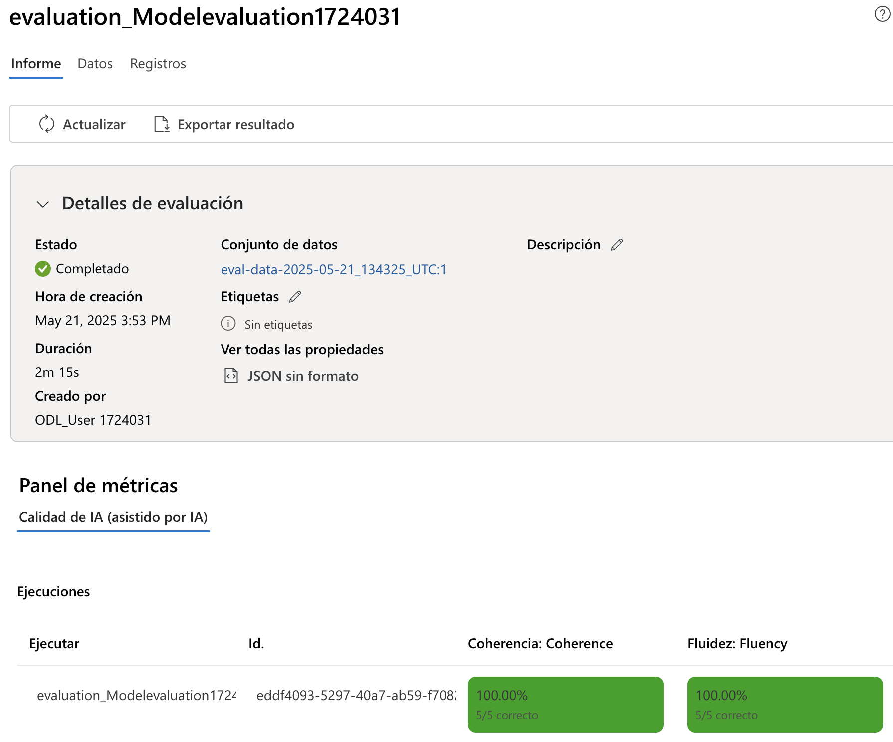

# 练习 3：评估流程设置

## 实验概述
在本实验中，您将使用内置评估指标设置自动评估流程，并配置人工评估以获得更深入的见解。首先，您将利用内置指标（如准确率、精确率、召回率和 F1 分数）来自动评估模型性能。然后，您将设置一个人工评估流程，让人工审核员对模型输出提供定性反馈。这个实践练习将帮助您理解如何整合自动和人工评估方法，以提高模型的准确性和可靠性。

## 实验目标
在本实验中，您将完成以下任务：
- 任务 1：设置人工评估
- 任务 2：使用内置评估指标设置自动评估

## 任务 1：设置人工评估

通过定义评估标准、收集人工反馈以及分析模型准确性和偏差来设置人工评估，从而提高性能。

1. 从左侧导航菜单的 **评估和改进** 部分，选择 **评估 (1)**。在 **评估和比较 AI 应用性能** 页面上选择 **人工评估 (2)** 标签页。选择 **+ 新建人工评估 (3)**。

   

2. 新窗口打开时，您之前的 **系统消息** 已经预填充，并且已选择您部署的模型。

   

3. 在 **人工评估结果** 部分，您将添加五个输入用于审查输出。通过选择 **+ 添加输入** 分别输入以下五个问题：

   `您能提供一份罗马最受好评的经济型酒店列表吗？`

   `我在纽约寻找一家素食友好的餐厅，您能帮忙吗？`

   `您能为一个家庭在奥兰多佛罗里达的7天假期提供行程建议吗？`

   `您能帮我策划一次马尔代夫的蜜月惊喜旅行吗？`

   `长城有提供导游服务的观光团吗？`

4. 从顶部栏选择 **运行** 以生成所有添加为输入的问题的输出。

    

5. 现在您可以通过选择每个响应右下角的点赞或点踩图标来手动审查每个问题的 **输出**。对每个响应进行评分，确保您的评分中至少包含一个点赞和一个点踩响应。

   

   > **注意：** 如果在执行运行时在任何输出中收到错误"超出当前 AI 服务的令牌速率限制"，请在几分钟后重新运行失败的部分。

6. 从顶部栏选择 **保存结果 (1)**。输入 **人工评估结果 (2)** 作为结果名称，然后选择 **保存 (3)**。

   
   
7. 使用左侧菜单导航到 **评估 (1)**。选择 **人工评估 (2)** 标签页以找到您刚刚保存的人工评估 **(3)**。请注意，您可以浏览之前创建的人工评估，继续未完成的工作，并保存更新的评估。

   

## 任务 2：使用内置评估指标设置自动评估

在本实验中，您将使用内置指标配置自动评估，以快速准确地衡量模型性能。

1. 从左侧导航菜单的 **评估和改进** 部分，选择 **评估 (1)**。在 **评估和比较 AI 应用性能** 页面上选择 **自动评估 (2)** 标签页。选择 **创建新评估 (3)**。

   

2. 在 **您想评估什么？** 面板上，选择 **数据集**。

   

3. 使用以下设置创建新的评估：
    - **评估名称**：**模型评估-{suffix}(1)**
    - 选择 **下一步 (2)**。
       
       

    - 打开新标签页并粘贴新链接 **https://raw.githubusercontent.com/MicrosoftLearning/mslearn-ai-studio/main/data/travel-qa.jsonl** JSONL 文件。按 **Ctrl A** 
      和 **Ctrl C** 全选并 **复制**。
  
    - 在虚拟机的 Windows 搜索栏中搜索 **Visual Studio (1)** 并选择 **Visual Studio (2)**。

       

    - 从 **文件 (1)** 菜单中，选择 **新建文本文件 (2)**。

       

    - **粘贴复制的代码**。

    - 导航到 **文件 (1)** 并点击 **另存为 (2)**。    

           

    - 点击 **桌面 (1)**，输入文件名为 **示例 (2)**，选择 **JSON Lines (3)** 作为保存类型，然后点击 **保存 (4)**。

               

4. 返回到 **Azure AI foundary**，您正在 **创建新的评估**。
   
    - **选择要评估的数据**：**添加数据集 (1)**，然后选择 **上传文件 (2)**。
  
         

    - 选择您创建的文件 **(1)** 并点击 **打开 (2)**

             

    - 选择 **下一步 (2)** 

    - **选择指标**：**连贯性 (1), 流畅性 (2)**
    - **连接**：您的 AI Services 连接 - **ai-odluser{suffix}xxxxxxxx_aoai (3)**
    - **部署名称/模型**：**gpt-4o 模型 (4)**

           

    - 向下滚动到 **数据集如何映射到评估输入**。确保为 **查询** 选择了 **${data.query} (1)**，为 **响应** 选择了 **${data.response} (2)**。

    - 选择 **下一步 (3)**

           

    - 选择 **提交**

      >**注意：** 等待评估完成，您可能需要刷新。

5. 从左侧导航菜单选择 **评估 (1)**，在 **自动评估 (2)** 下选择新创建的评估运行。

   

6. 浏览 **指标仪表板** 并从顶部菜单选择 **数据** 以查看 **详细指标结果**。

    

    

## 回顾
在本实验中，您已完成以下任务：
- 设置了人工评估
- 使用内置评估指标设置了自动评估

### 您已成功完成实验。点击 **下一步** 继续下一个练习。
