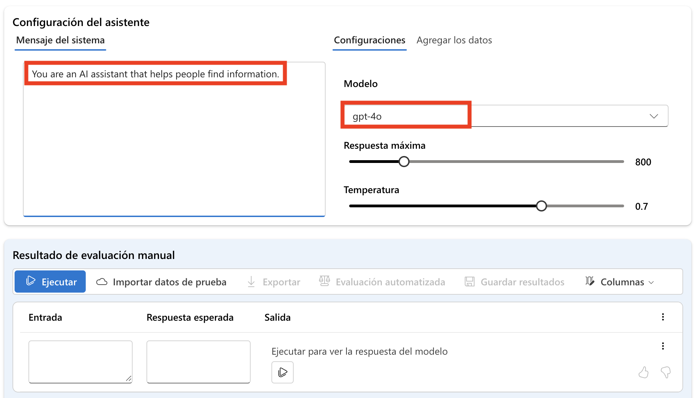
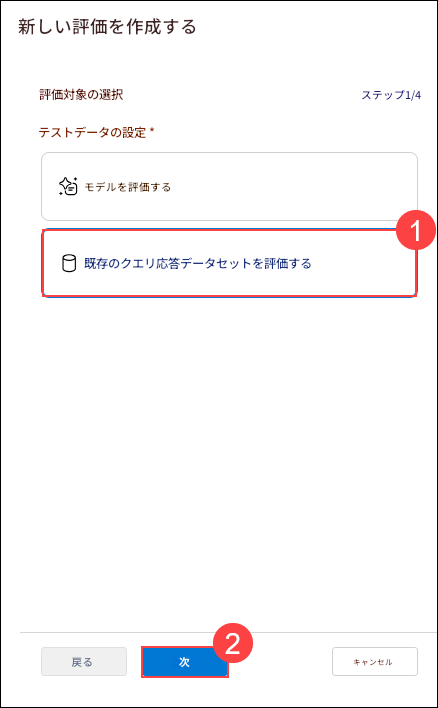
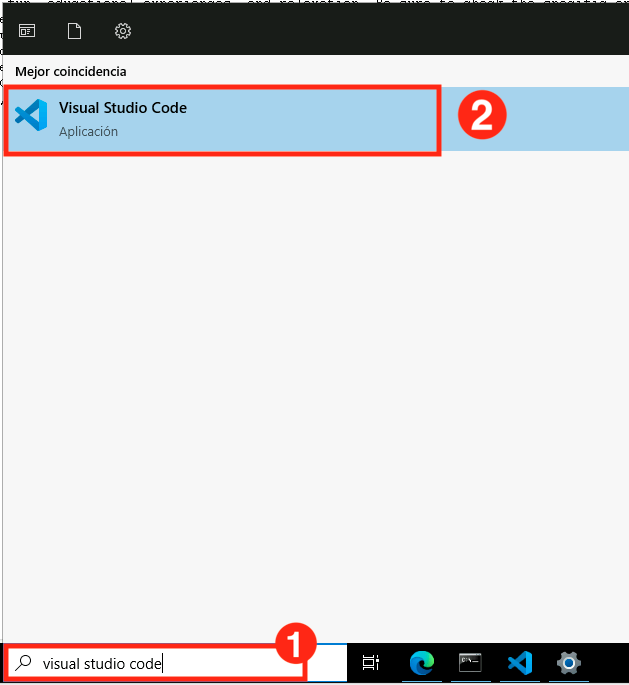
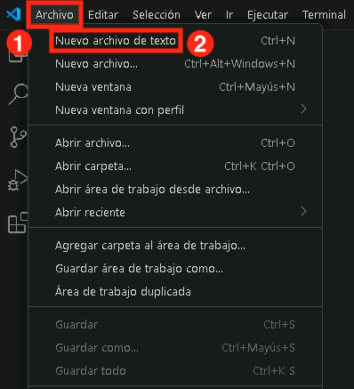

# 練習 3：設定評估流程

## 實驗概覽

在本實驗中，您將建立一個自動化的評估流程，使用內建的評估指標，並設定人工評估以獲得更深入的見解。您將首先利用如準確率（accuracy）、精確率（precision）、召回率（recall）與 F1 分數（F1-score）等內建指標，自動評估模型效能。接著，您將設定人工評估流程，讓人工審查者對模型輸出提供質性回饋。這項實驗練習將幫助您理解如何整合自動與人工評估方法，以提升模型的準確性與可靠性。

## 實驗目標

在本實驗中，您將執行以下任務：
- 任務 1：設定人工評估
- 任務 2：使用內建評估指標設定自動化評估

## 任務 1：設定人工評估

透過定義評估標準、收集人工回饋，以及分析模型的準確性與偏誤來設定人工評估，以提升模型效能。

1. 在左側導覽選單中，於 **保護和控管** 區段下，選擇 **評估** **(1)**。在 **評定並比較 AI 應用程式效能** 頁面中，切換至 **手動評估** **(2)** 分頁，然後選擇  **+ 新增手動評估** **(3)**。

   

2. 將會開啟一個新視窗，系統會自動填入您先前的 **系統信息** ，並選取已部署的 gpt-4o 模型。

   

3. 在 **手動評估結果** 區段中，您將新增五筆輸入資料以供審查輸出結果。點選 **+ 新增輸入**，並輸入以下五個問題作為五筆獨立輸入：

   `你可以提供一份羅馬評價最高的平價飯店清單嗎？`

   `我正在找紐約市適合純素者的餐廳。你可以幫忙嗎？`

   `你可以建議一個佛羅里達奧蘭多的七天家庭旅遊的行程嗎？`

   `你可以幫我規劃一趟驚喜的馬爾地夫蜜月旅行嗎？`

   `有沒有可參加的中國長城導覽行程？`

4. 從上方工具列中選擇 **執行** ，以產生這些問題的輸出結果。

    

5. 現在您可以手動審查每個問題的 **輸出** ，在回應右下角選擇「讚」或「倒讚」圖示來評分。請確保至少有一筆評分為「讚」與一筆為「倒讚」。

   

   > **注意**： 若在執行過程中出現錯誤訊息「exceeded token rate limit of your current AIService」，請等待幾分鐘後重新執行失敗的項目。

6. 從上方工具列中選擇 **儲存結果** **(1)** ，將結果命名為 **手動評估結果** **(2)** ，然後點選 **儲存** **(3)**。

   
   
7. 使用左側選單返回 **評估** **(1)**，切換至 **手動評估** **(2)** 分頁，即可找到您剛儲存的人工評估結果 **(3)**。您可以瀏覽先前所建立的手動評估、從中斷處繼續，並儲存更新後的評估內容。

   

## 任務 2：使用內建評估指標設定自動化評估

在本實驗中，您將設定自動化評估，使用內建指標快速且準確地衡量模型效能。

1. 在左側導覽選單中，於 **保護和控管** 區段下，選擇 **評估** **(1)**。在 **評定並比較 AI 應用程式效能** 頁面中，切換至 **自動化評估** **(2)** 分頁，然後選擇  **建立新的評估** **(3)**。

   

2. 在 **建立新的評估** 視窗中，選擇 **評估現有的查詢回應資料集** **(1)**，然後點擊 **下一個** **(2)**。

   

3. 開啟新分頁，貼上連結 **https://raw.githubusercontent.com/MicrosoftLearning/mslearn-ai-studio/main/data/travel-qa.jsonl** 來瀏覽一個 JSONL 檔案。在此 JSONL 檔案分頁，按下 **Ctrl + A** ，接著按下 **Ctrl + C** ，來進行全選並 **複製**。
  
    - 在虛擬機的 Windows 搜尋列中搜尋 **Visual Studio Code** **(1)** ，並選擇 **Visual Studio Code** **(2)**。

       

    - 在 **文件** **(1)** 選單中選擇 **新增文字檔案** **(2)**。

       

    - **貼上剛才複製的程式碼。**.

    - 前往 **文件** **(1)** ，點選 **另存檔案為...** **(2)**。

           

    - 點選 **Desktop** **(1)**，將檔案命名為 **Sample** **(1)** ，儲存類型選擇 **JSON Lines** **(3)** 格式，然後點選 **儲存** **(4)**。 

          

       > **Note:** 必須選擇正確的檔案格式。AI Foundry 入口網站僅接受 **JSON Lines** 格式的檔案。若選擇其他格式，檔案將不被接受。
     
4. 回到 **Azure AI Foundary**，繼續您正在進行的 **建立新的評估** 的步驟。
   
    - **設定測試資料**：選擇 **上傳新資料集**。

         

    - 移動到 **Desktop** **(1)** 位置後，選擇 **Sample.jsonl** **(2)** 檔案，然後點擊 **開啟** **(3)**。

             

    - 點選 **下一個** 

    - **設定評估工具**: 點擊 **+ 新增**，然後選擇 **李克特氏量表評估工具**

      

      

    - 選擇 **一致性** **(1)** 後，把 **準則名稱** 改為 `Coherence` 。在下方的 **查詢** 欄位中選擇 **{{item.query}}** **(2)**，在 **回應** 欄位中選擇 **{{item.response}}** **(3)**，然後點擊 **新增** **(4)**。

      

   - **設定評估工具**: 點擊 **+ 新增**，然後選擇 **李克特氏量表評估工具**

      
      
      

   - 選擇 **流暢性** **(1)** 後，把 **準則名稱** 改為 `Fluency` 。在下方的 **查詢** 欄位中選擇 **{{item.query}}** **(2)**，在 **回應** 欄位中選擇 **{{item.response}}** **(3)**，然後點擊 **新增** **(4)**。

      

   - 新增後，點擊 **下一個**。

      

   - 現在請將 **評估名稱** 更新為 **Modelevaluation-{suffix}** **(1)**，然後點擊 **提交** **(2)** 按鈕。

      

5. 請等待新增的評估的狀態變更為 **已完成**。如果狀態顯示為 **待處理** 或 **正在運行**，可能需要重新整理頁面以查看最新更新。

   

6. 從左側導覽功能表中，選擇 **評估** **(1)**，然後在 **自動化評估** **(2)** 下，選擇點擊新增的評估 **Modelevaluation-<inject key="DeploymentID" enableCopy="false"/>** **(3)**。

   

7. 在 **報告** 分頁中，向下捲動至下方，以瀏覽 **計量儀表板**。

   

8. 點擊頂部選單中的 **資料** **(1)**標籤，以查看**詳細的計量結果** **(2)**

    

## 回顧

在本次實驗中，您已完成以下任務：

- 任務 1：設定人工評估
- 任務 2：使用內建評估指標設定自動化評估

### 恭喜！您已成功完成本次實驗課程！
### 請點選導覽連結，以繼續進行下一個實驗課程。
