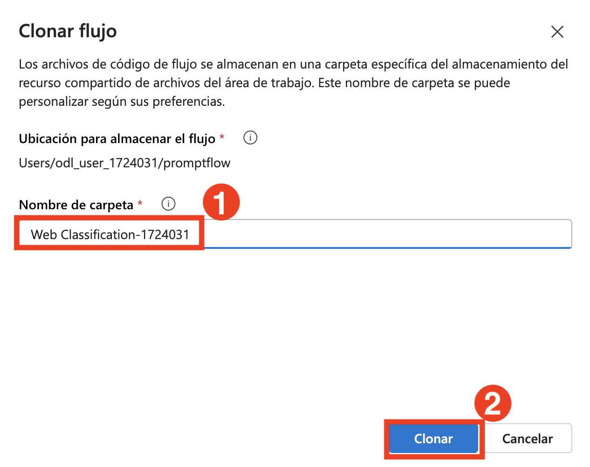
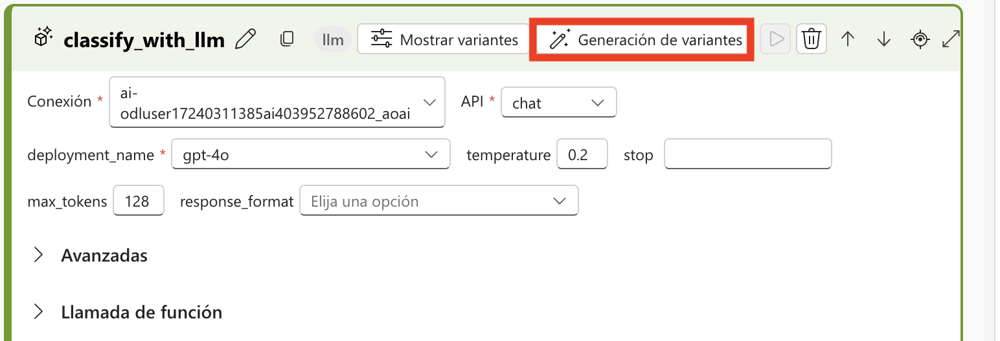
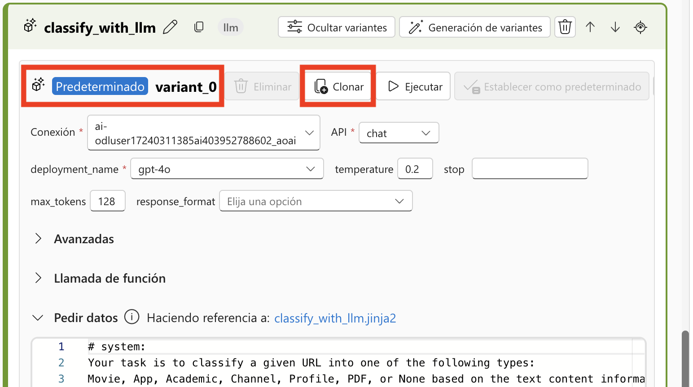
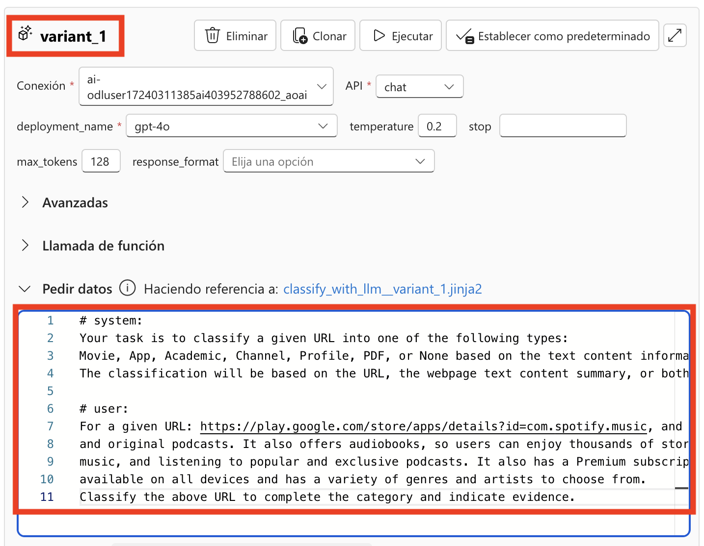
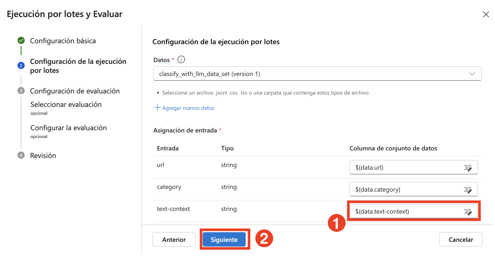
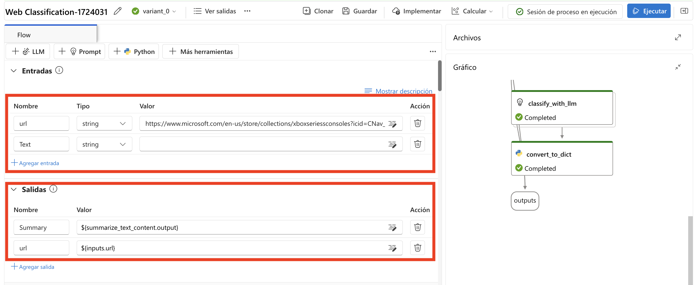
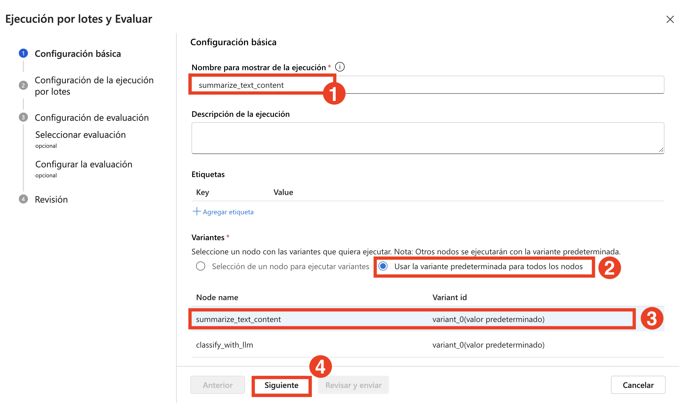
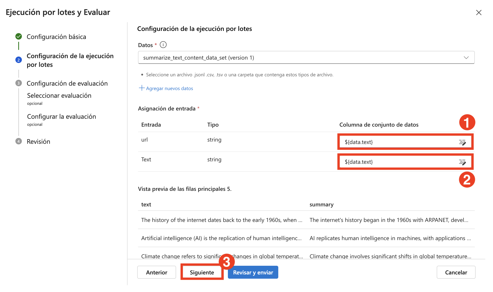

# 練習 4：微調 Prompts 以達最佳效能

> **注意**：由於需求量較大，部分使用者可能無法使用 AML 計算配額，這可能會導致無法執行本練習中的某些實驗步驟。不過，這不會影響您的實驗進度。您可以通讀步驟，理解練習內容，然後執行更新後的驗證—進度仍會被記錄。感謝您的體諒。

## 實驗概覽

在這個實驗實驗中，您將探索如何微調 Prompt 以達到最佳效能，學習如何撰寫精準且有效的輸入查詢，以最大化 AI 回應的準確性、相關性與效率。您將嘗試不同的 Prompt 結構來引導 AI 行為，加入上下文、限制條件與期望的輸出格式，以獲得更一致的結果。透過反覆設計 Prompt 並分析 AI 回應，您將建立最佳實務，針對各種應用情境（如摘要、資料擷取、創意寫作與技術問題解決）優化輸入設計。

## 實驗目標

在本實驗中，您將執行以下任務：
- 任務 1：執行 Prompt 的反覆調整與變體比較
- 任務 2：優化流程效能以進入生產環境

## 任務 1：執行 Prompt 的反覆調整與變體比較
透過在多次迭代中調整 Prompt 來優化模型回應。這個過程可系統性地評估不同輸出變體之間的差異，確保模型效能隨著每次迭代而提升，並產出更準確且具相關性的回應。

1. 前往 [Azure AI foundry](https://ai.azure.com/?reloadCount=1)，在 **建置及自訂** 區段中選擇 **提示流程** **(1)**，然後點選 **+ 建立 (2)** 開啟流程建立精靈。

   

2. 在 **建立新的流程** 頁面中，於 **探索資源庫** 區段選擇 **Web Classification** 方塊，點選 **複製**。

     

3. 在 **複製流程** 頁面中，輸入名稱 **Web Classification-{suffix}** **(1)** ，然後點選 **複製** **(2)**。

      

4. 向下捲動至 **classify_with_llm** **(1)** 節點，並設定以下內容：

    - 連線：選擇連線 **ai-odluser{suffix}xxxxxxxx_aoai** **(2)**

    - deployment_name：**gpt-4o** **(3)**

      
   
5. 將 classify_with_llm 節點中的現有 **提示** 替換為新的基準提示：

   ```
   # system:
    您的任務是根據文字內容資訊，將給定的 URL 分類為以下其中一種類型：
    Movie（電影）、App（應用程式）、Academic（學術）、Channel（頻道）、Profile（個人檔案）、PDF 或 None（無）。
    分類將根據 URL、本網頁的文字內容摘要，或兩者共同判斷。

   # user:
   對於給定的 URL：https://arxiv.org/abs/2303.04671，以及文字內容：Visual ChatGPT 是一個系統，讓使用者能夠與 ChatGPT 互動，不僅能傳送與接收語言，還能處理圖像，提供複雜的視覺問題或視覺編輯指令，並提供回饋與要求修正結果。它整合了不同的視覺基礎模型，並已公開提供。實驗顯示，Visual ChatGPT 在視覺基礎模型的協助下，開啟了探索 ChatGPT 視覺角色的大門。

   請對上述 URL 進行分類，並指出分類的依據。
   ```

6. 點選 LLM 節點右上角的 **顯示變體** 按鈕。現有的 LLM 節點為 variant_0，為預設變體。

      

7. 點選 variant_0 上的 **複製** 按鈕以建立 variant_1，然後可在 variant_1 中設定不同的參數值。

     
   
8. 向下捲動，在 **variant_1** 中將現有 **提示** 替換為新的基準提示 ：

    ```  
    # system:  
    您的任務是根據文字內容資訊，將給定的 URL 分類為以下其中一種類型：
    Movie（電影）、App（應用程式）、Academic（學術）、Channel（頻道）、Profile（個人檔案）、PDF 或 None（無）。
    分類將根據 URL、本網頁的文字內容摘要，或兩者共同判斷。

    # user:
    對於給定的 URL：https://play.google.com/store/apps/details?id=com.spotify.music，以及文字內容：Spotify 是一款免費的音樂與 Podcast 串流應用程式，擁有數百萬首歌曲、專輯與原創 Podcast。它也提供有聲書，讓使用者可以享受成千上萬的故事。它具備多種功能，例如建立與分享音樂播放清單、發掘新音樂，以及收聽熱門與獨家 Podcast。它也提供 Premium 訂閱選項，讓使用者可以離線下載與收聽，並享受無廣告的音樂體驗。此應用程式可在所有裝置上使用，並提供多樣的音樂類型與藝人選擇。

    請對上述 URL 進行分類，並指出分類的依據。

    ```

    
     
9. 點選 **隱藏變體** 以停止新增變體。所有變體將被摺疊，節點將顯示預設的 variant 。 對於 classify_with_llm 節點，基於 variant_0：

     

10. 向上捲動至 **summarize_text_content** 節點，並設定以下內容：

   - 連線：選擇連線 **ai-odluserxxxxxxxx_aoai** **(1)**

   - deployment_name： **gpt-4o** **(2)**

11. 將 summarize_text_content 節點中的 **提示** 替換為新的基準提示 ，並根據 variant_0 建立 variant_1 **(3)**：
     
   ```  
   # system:
    請將以下文字摘要為一段話，限 100 個單詞內。
    請勿加入原文中未提及的任何資訊。

   # user:
   文字：網際網路的歷史可追溯至 1960 年代初期，當時首次提出全球電腦網路的構想。1960 年代末，美國國防部開發了高等研究計畫署網路（ARPANET），這是第一個可運作的封包交換網路，也是現代網際網路的前身。1970 與 1980 年代期間，各種協定與標準陸續發展，例如 TCP/IP，讓不同網路之間能夠互相通訊。1990 年代，Tim Berners-Lee 發明了萬維網（World Wide Web），徹底改變了網際網路，使其對大眾開放。自此以來，網際網路迅速成長，成為全球數十億人日常生活中不可或缺的一部分。

   助手：
   摘要：
   ```

12. 點選 LLM 節點右上角的 **顯示變體** **(4)** 按鈕。現有節點為 variant_0，為預設變體。

    
   
13. 點選 **variant_0** 上的 **複製** 按鈕以建立 variant_1，然後可在 variant_1 中設定不同的參數值。

14. 向下捲動，在 **variant_1** 中將 **提示** 替換為新的基準提示 ：

   ```
   # system:
   請將以下文字摘要為一段話，限 100 個單詞內。
   請勿加入原文中未提及的任何資訊。

   # user:
   文字：人工智慧（AI）是指在機器中模擬人類智慧的技術，這些機器被程式設計用來思考與學習。AI 在當今社會中有多種應用，包括機器人技術、自然語言處理與決策系統。AI 可分為狹義 AI（專為特定任務設計）與廣義 AI（能執行任何人類能完成的智慧任務）。儘管 AI 帶來許多好處，但也引發了隱私侵犯與工作被取代等倫理問題。
   助手：
   摘要：

   ```
15. 點選上方選單中的 **儲存** 按鈕，然後選擇  **開始計算工作階段**。最後，點選右上角的 **執行** 按鈕。

    

16. 在開啟的 **提交流程執行** 視窗中，於 **選取具有您要執行之變體的 LLM 節點。** 區段中選擇 **選取要執行變體的節點** ，然後選擇 **summarize_text_content** **(1)**，接著點選 **提交** **(2)**。

    
   
17. 當運算階段成功執行後，選擇每個變體以檢視其輸出結果。

18. 在上方選單中，從下拉選單選擇  **Variant 0** **(1)** ，然後點選 **檢視完整輸出** **(2)** 以檢視 **summarize_text_content** 的 **variant 0** 輸出。請檢視您所選變體的輸出結果。

    

    

   >**注意**： 實驗中顯示的輸出可能與您實際看到的結果有所不同。

## 任務 2：優化流程效能以進入生產環境

這個任務涉及分析與優化工作流程，以確保最大效率與最小停機時間。這包括識別瓶頸、實施最佳實務，以及運用進階工具與技術來簡化操作流程。持續監控與反覆改進是維持高效能並因應生產需求變化的關鍵，最終可提升生產力並降低營運成本。

1. 在編輯 Flow 的區域，向上捲動。在 **輸入** 區段中，點選 **+ 新增輸入**，新增 **類別** 與 **文字內容**。在 **輸出** 區段中，點選 **+ 新增輸出**，新增 **類別** 與 **證據**，然後點選 **儲存**。

    

   >**注意**： 若 **輸出** 區段已經有輸出項目，請確認其 **值** 是否正確，然後才點選 **儲存**。
   
2. 選擇 **評估** **(1)** > **自訂評估** **(2)**。

   

3. 在 **批次執行與評估** 頁面中，將 **執行顯示名稱** 命名為 **classify-{suffix}** **(1)**，在 **變異** 區段中選擇 **classify_with_llm** **(2)**，然後點選 **下一個** **(3)**。

   

4. 在 **批次執行與評估** 頁面中的 **資料** 區段，選擇 **+ 新增資料**。

   

5. 在開啟的 **新增資料** 視窗中，輸入名稱 **classify_with_llm_data_set** **(1)**，選擇 **從本機檔案上傳** **(2)**，然後點選 **瀏覽** **(3)**。

   

6. 瀏覽至 **C:\LabFiles\Day-4-Developing-AI-App-with-Azure-AI-Foundry\Model-Evaluation-and-Model-Tunning\Labs\data**，按下 **Enter** **(1)**，選擇 **classify.jsonl (2)** 檔案，然後點選 **Open (3)**。

     

7. 點選 **新增**。

     

8. 在 **輸入對應** 區段中，將 **文字內容** 對應至 **${data.text-context}** **(1)**，然後點選 **下一個** **(2)**。

     
   
9. 在 **選取評估** 頁面中，選擇 **Classification Accuarancy Evaluation** **(1)** ，然後點選 **下一個** **(2)**。

   

10. 在 **設定評估** 頁面中，展開 **Classification Accuracy Evaluation** **(1)** ，選擇資料集 **classify_with_llm_data_set (2)**。在 **groundtruth** 資料來源中，選擇 **資料輸入** 部分下的 **類別** **(3)**；在 **prediction** 中，選擇 **流程輸出** 部分下的 **類別** **(4)**，然後點選 **下一個** **(5)**.

     .png)

11. 在 **檢閱** 頁面中檢查設定，然後點選  **提交**。

12. 回到 **提示流程** 頁面，從上方點選 **檢視執行清單** 連結。

    

13. 當批次執行與評估完成後，在執行詳細頁面中，**多選** **(1)** 各變體的批次執行，然後選擇 **將輸出視覺化** **(2)**。

    

14. 確認哪個變體表現最佳後，您可以返回流程編輯頁面，將該變體設為該節點的預設變體。

15. 接下來將評估 summarize_text_content 節點的變體。

16. 回到 **提示流程** 頁面，在 **輸入** 區段中，移除所有輸入項目，只保留 **url**，然後點選 **+ 新增輸入** 並輸入 **文字**。在 **輸出** 區段中，刪除現有輸出，點選 **+ 新增輸出**，新增 **摘要** 並將值設為 **${summarize_text_content.output}**，同時新增 **url** 並設為 **${inputs.url}**。

    

17. 點選 **儲存**。

18. 選擇 **評估** **(1)** ，然後選擇 **自訂評估** **(2)**。

    

19. 在 **批次執行與評估** 頁面中，將 **R執行顯示名稱** 命名為 **summarize_text_content-{suffix}** **(1)**，在 **變異** 區段中選擇 **對所有節點使用預設變體** **(2)**，然後選擇 **summarize_text_content** **(3)**，點選 **下一個** **(4)**。

    

20. 在 Batch run settings 頁面中，點選 **+ 新增資料**。

21. 在 **新增資料** 視窗中，輸入名稱 **summarize_text_content_data_set** **(1)**，選擇 **從本機檔案上傳** **(2)**，然後點選 **瀏覽** **(3)**。

    

22. 瀏覽至 **C:\LabFiles\Day-4-Developing-AI-App-with-Azure-AI-Foundry\Model-Evaluation-and-Model-Tunning\Labs\data**，選擇 **summarize.jsonl** **(2)** 檔案，然後點選 **Open** **(3)**。

    

23. 點選 **新增**。

    

24. 在 **輸入對應** 區段中，將 **url** 對應至 **${data.text}** **(1)**， **文字** 對應至 **${data.text}** **(2)**，然後點選 **下一個** **(3)**。

    

25. 在 **選取評估** 頁面中，選擇 **Classification Accuarancy Evaluation** **(1)** ，然後點選 **下一個** **(2)**。

    

26. 在 **設定評估** 頁面中，展開 **Classification Accuracy Evaluation** **(1)**，選擇資料集 **summarize_text_content_data_set** **(2)**，確認 **groundtruth** 資料來源為 **輸入資料** 部分下的 **摘要** **(3)**；在 **prediction** 中，選擇 **流程輸出** 部分下的 **摘要** **(4)**，然後點選 **檢閱 + 提交** **(5)**。

    

27. 在 **檢閱** 頁面中檢查設定，然後點選 **提交**。

    .png)

28. 回到 **提示流程** 頁面，從上方點選 **檢視執行清單** 連結。

   
   
29. 當批次執行與評估完成後，在執行詳細頁面中，**多選** **(1)** 各變體的批次執行，然後選擇 **將輸出視覺化** **(2)**。您將能看到 classify_with_llm 節點與 LLM 的兩個變體的評估指標與每筆資料的預測輸出。

    

30. 確認哪個變體表現最佳後，您可以返回流程編輯頁面，將該變體設為該節點的預設變體。

## 回顧

在本次實驗中，您已完成以下任務：

- 任務 1：執行 Prompt 的反覆調整與變體比較
- 任務 2：優化流程效能以進入生產環境

### 恭喜！您已成功完成本次實驗課程！
### 請點選導覽連結，以繼續進行下一個實驗課程。

