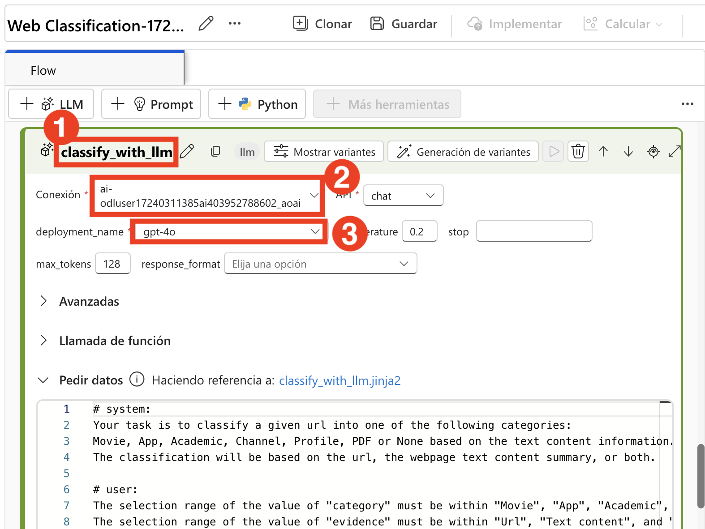
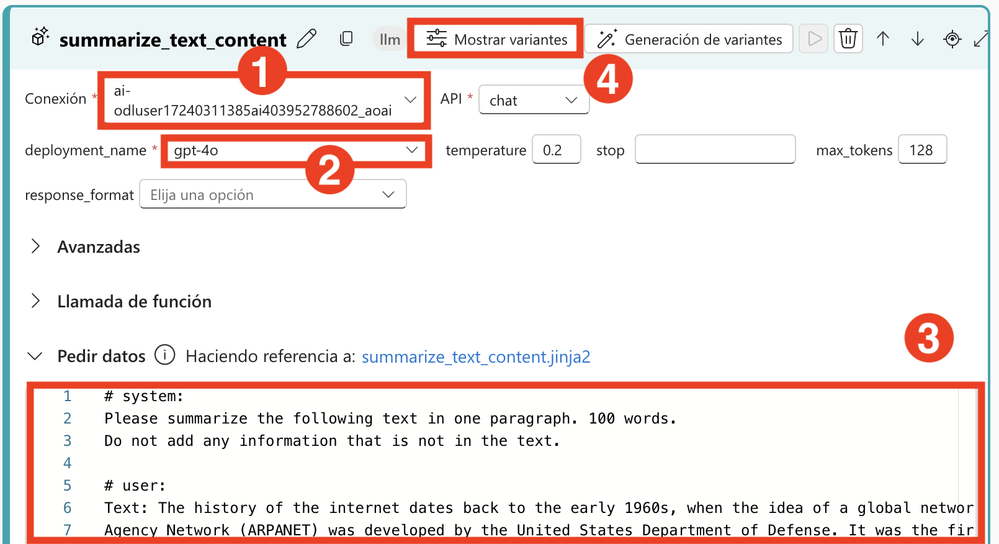
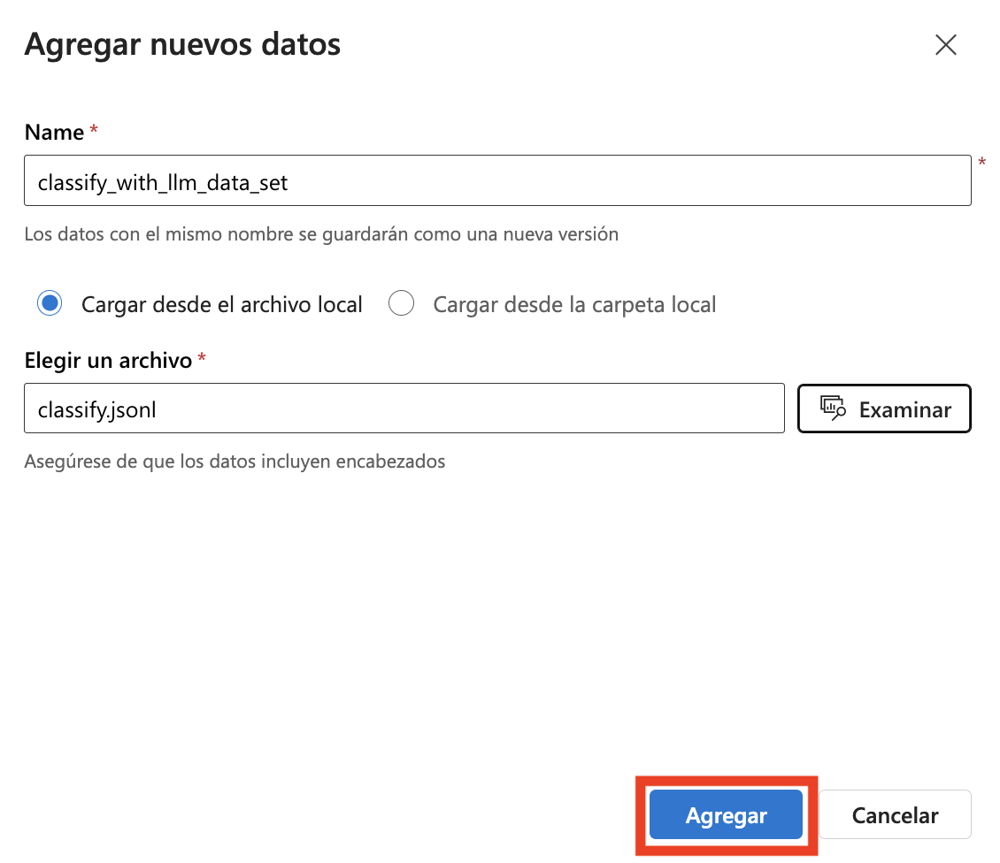
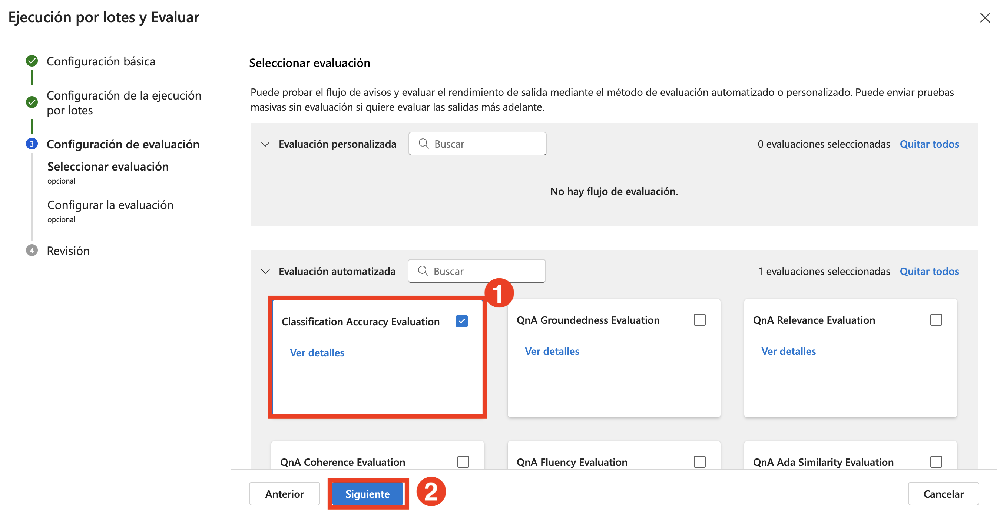

# Ejercicio 4: Ajuste Fino de Prompts para un Rendimiento Óptimo

> **Nota**: Debido a la alta demanda, es posible que la cuota de AML Compute no esté disponible para algunos usuarios, lo que podría impedir la ejecución de ciertos pasos del laboratorio en este ejercicio. Sin embargo, esto no afectará su progreso en el laboratorio. Puede leer los pasos, comprender el ejercicio y luego ejecutar la validación actualizada; el progreso se seguirá registrando. Gracias por su comprensión.

## Descripción del laboratorio
En este laboratorio práctico, explorarás el ajuste fino de prompts para lograr un rendimiento óptimo, aprendiendo a crear consultas de entrada precisas y efectivas que maximicen la precisión, relevancia y eficiencia de las respuestas generadas por IA. Experimentarás con la estructuración de prompts para guiar el comportamiento de la IA, incorporando contexto, restricciones y formatos de salida deseados para obtener resultados más consistentes. Al iterar en el diseño de prompts y analizar las respuestas de la IA, desarrollarás buenas prácticas para refinar las entradas según distintos casos de uso, desde resumen y extracción de datos hasta redacción creativa y resolución técnica de problemas.

## Objetivos del laboratorio
En este laboratorio, realizarás lo siguiente:
- Tarea 1: Realizar ajuste iterativo de prompts y comparación de variantes
- Tarea 2: Optimizar el rendimiento del flujo para producción

## Tarea 1: Realizar ajuste iterativo de prompts y comparación de variantes
Refina las respuestas del modelo ajustando los prompts en iteraciones sucesivas. Este proceso permite evaluar sistemáticamente las diferencias entre variantes de salida, asegurando que el rendimiento del modelo mejore con cada iteración y produzca respuestas más precisas y relevantes.

1. En [Azure AI Foundry](https://ai.azure.com/?reloadCount=1), en la sección **Build and customize** selecciona **Prompt flow (1)**. Selecciona **+ Create (2)** para abrir el asistente de creación de flujos.

   

1. En **Create a new flow**, dentro de **Explore gallery**, en el cuadro de **Web Classification**, haz clic en **Clone**.


     

1. En la página **Clone Flow**, ingresa el nombre **Web Classification-{suffix} (1)** y haz clic en **Clone (2)**.

      

1. Desplázate hasta el nodo **classify_with_llm (1)** y selecciona lo siguiente:

    - Connection: Selecciona la conexión ****my-ai-service-{suffix}_aoai**
    - Deployment_name: **gpt-4o (3)**

      
   
1. Reemplaza el prompt existente con el siguiente prompt como prompt base en el nodo classify_with_llm.

   ```
   # system:
   Your task is to classify a given URL into one of the following types:
   Movie, App, Academic, Channel, Profile, PDF, or None based on the text content information.
   The classification will be based on the URL, the webpage text content summary, or both.

   # user:
   For a given URL: https://arxiv.org/abs/2303.04671, and text content: Visual ChatGPT is a system that enables users to interact with ChatGPT by sending and receiving not only languages but also images, providing complex visual questions or visual editing instructions, and providing feedback and asking for corrected results. It incorporates different Visual Foundation Models and is publicly available. Experiments show that Visual ChatGPT opens the door to investigating the visual roles of ChatGPT with the help of Visual Foundation Models. 
   Classify the above URL to complete the category and indicate evidence.
   ```

1. Selecciona el botón **Show variants** en la parte superior derecha del nodo LLM. El nodo LLM existente es variant_0 y es la variante por defecto.

      

1. Selecciona el botón **Clone** en variant_0 para generar variant_1, luego puedes configurar parámetros con valores diferentes en variant_1.

     
   
1. Desplázate hacia abajo, en **variant_1** reemplaza el prompt existente con el siguiente prompt:

    ```  
    # system:  
    Your task is to classify a given URL into one of the following types:
    Movie, App, Academic, Channel, Profile, PDF, or None based on the text content information.
    The classification will be based on the URL, the webpage text content summary, or both.

    # user:
    For a given URL: https://play.google.com/store/apps/details?id=com.spotify.music, and text content: Spotify is a free music and podcast streaming app with millions of songs, albums, 
    and original podcasts. It also offers audiobooks, so users can enjoy thousands of stories. It has a variety of features such as creating and sharing music playlists, discovering new 
    music, and listening to popular and exclusive podcasts. It also has a Premium subscription option which allows users to download and listen offline, and access ad-free music. It is 
    available on all devices and has a variety of genres and artists to choose from.
    Classify the above URL to complete the category and indicate evidence.

    ```

    
     
1. Selecciona **Hide variants** para dejar de agregar variantes. Todas las variantes se pliegan. La variante por defecto se muestra para el nodo. Para el nodo classify_with_llm, basado en variant_0:

     

1. Desplázate hasta el nodo **summarize_text_content** y selecciona lo siguiente:

   - Connection: Selecciona la conexión **my-ai-service-{suffix}_aoai (1)**
   - Deployment_name: **gpt-4o (2)**

1. Reemplaza el prompt existente con el siguiente prompt como prompt base en summarize_text_content, basado en variant_0. Puedes crear variant_1 **(3)**.
     
   ```  
   # system:
   Please summarize the following text in one paragraph. 100 words.
   Do not add any information that is not in the text.

   # user:
   Text: The history of the internet dates back to the early 1960s, when the idea of a global network of computers was first proposed. In the late 1960s, the Advanced Research Projects 
   Agency Network (ARPANET) was developed by the United States Department of Defense. It was the first operational packet-switching network and the precursor to the modern internet. The 
   1970s and 1980s saw the development of various protocols and standards, such as TCP/IP, which allowed different networks to communicate with each other. In the 1990s, the invention 
   of the World Wide Web by Tim Berners-Lee revolutionized the internet, making it accessible to the general public. Since then, the internet has grown exponentially, becoming an 
   integral part of daily life for billions of people around the world.

   assistant:
   Summary:
   ```

1. Selecciona el botón **Show variants (4)** en la parte superior derecha del nodo LLM. El nodo LLM existente es variant_0 y es la variante por defecto.

    
   
1. Selecciona el botón **Clone** en **variant_0** para generar variant_1, luego puedes configurar parámetros con valores diferentes en variant_1.

1. Desplázate hacia abajo, en **variant_1** reemplaza el prompt existente con el siguiente prompt:

   ```
   # system:
   Please summarize the following text in one paragraph. 100 words.
   Do not add any information that is not in the text.

   # user:
   Text: Artificial intelligence (AI) refers to the simulation of human intelligence in machines that are programmed to think and learn. AI has various applications in today's society, 
   including robotics, natural language processing, and decision-making systems. AI can be categorized into narrow AI, which is designed for specific tasks, and general AI, which can 
   perform any intellectual task that a human can. Despite its benefits, AI also poses ethical concerns, such as privacy invasion and job displacement.

   assistant:
   Summary:

   ```
1. Haz clic en el botón **Save** desde el menú superior y luego selecciona **Start Compute Session**. Una vez iniciada la sesión, haz clic en el botón **Run** en la esquina superior derecha.

    

1. En la ventana Submit flow run, bajo **Select the LLM node with variants that you want to run** elige **Select a node to run variants**, luego selecciona **summarize_text_content (1)** y haz clic en **Submit (2)**. 

   
   
1. Una vez que la sesión se ejecute correctamente, revisa la salida seleccionando cada variante.

1. En el menú superior selecciona **Variant 0 (1)** del menú desplegable y selecciona **View full output (2)** para **summarize_text_content** para **variant 0**. Ahora, revisa la salida de la variante que seleccionaste.

   

   

     >**Nota:** La salida mostrada en la imagen puede diferir en tu laboratorio.

## Tarea 2: Optimizar el rendimiento del flujo para producción
Implica analizar y refinar los procesos del flujo de trabajo para asegurar la máxima eficiencia y el mínimo tiempo de inactividad. Esto incluye identificar cuellos de botella, implementar buenas prácticas y utilizar herramientas y tecnologías avanzadas para optimizar las operaciones. El monitoreo continuo y las mejoras iterativas son esenciales para mantener un alto rendimiento y adaptarse a las demandas cambiantes de producción, lo que lleva a una mayor productividad y menores costos operativos.

1. En la parte superior, bajo **Inputs**, haz clic en **+ Add input** y luego agrega **category** y **text-context** en **Name**. Bajo **Output**, haz clic en **+ Add output** y luego agrega **category** y **evidence**. Haz clic en **Save**.

    

    >**Nota:** En la sección Output, si las salidas ya están agregadas, revisa los **valores** y luego selecciona **Save**.

1. Selecciona **Evaluate (1)** > **Custom Evaluation (2)**.

    

1. En **Batch run & Evaluate** ingresa **Run display name** como **classify-{suffix} (1)**, luego en **Variants** selecciona **classify_with_llm (2)** y haz clic en **Next (3)**.

    

1. En **Batch run settings** selecciona **+ Add new data**.

    

1. En la ventana **Add new data**, ingresa el nombre **classify_with_llm_data_set (1)**, selecciona **Upload from local file (2)** y haz clic en **Browse (3)**.

    

1. Navega a **C:\LabFiles\Day-4-Developing-AI-App-with-Azure-AI-Foundry\Developing-AI-Applications-with-Azure-AI-Studio-main\Labs\data**, selecciona el archivo **classify.jsonl (2)** y haz clic en **Open (3)**.

    

1. Haz clic en **Add**.

    

1. Navega a **C:\LabFiles\Day-4-Developing-AI-App-with-Azure-AI-Foundry\Model-Evaluation-and-Model-Tunning\Labs\data**, selecciona el archivo **classify.jsonl (2)** y haz clic en **Open (3)**.

     
   
1. En la página **Select evaluation**, selecciona **Classification Accuarancy Evaluation (1)** y haz clic en **Next (2)**.

   

1. En la página de **Configure evaluation**, expande **Classification Accuracy Evaluation (1)** y selecciona **classify_with_llm_data_set (2)**. Para la fuente de datos de **ground truth**, selecciona **category** bajo **Data input**, y para **prediction**, selecciona **category (4)** y haz clic en **Next (5)**.

     .png)

1. En la página **Review** revisa la configuración y haz clic en **Submit**

1. De vuelta en la página de Prompt flow, desde la parte superior haz clic en el enlace **View run list**.

    
   
1. Después de que el batch run y la evaluación finalicen, en la página de detalles del run, **selecciona múltiples batch runs para cada variante (1)**, luego selecciona **Visualize outputs (2)**. Podrás ver las métricas de las 2 variantes para el nodo classify_with_llm y LLM, junto con las salidas predichas para cada dato registrado.

   

1. Después de identificar cuál variante es la mejor, puedes volver a la página de autoría del flujo y establecer esa variante como la variante por defecto del nodo.

1. Ahora, también evaluaremos las variantes del nodo **summarize_text_content**.

1. De vuelta en la página de **Prompt flow**, en la sección **Input**, elimina todas las entradas excepto **url**, luego haz clic en **+ Add input** y escribe **Text** en **Name**. En la sección **Outputs**, elimina las salidas existentes, haz clic en **+ Add output**, luego agrega **Summary** y asigna el valor **${summarize_text_content.output}**. También agrega **url** y asigna el valor **${inputs.url}**.

   

1. Haz clic en **Save**.

1. Selecciona **Evaluate (1)** y luego **Custom Evaluation (2)**.

   

1. En **Batch run & Evaluate** ingresa **Run display name** como **summarize_text_content-{suffix} (1)**, luego en variantes selecciona **Use default variants for all nodes (2)**, y selecciona **summarize_text_content (3)** haz clic en **Next (4)**.

   

1. En **Batch run settings**, haz clic en **+ Add new data**.

1. En la nueva ventana de datos, ingresa el nombre **summarize_text_content_data_set (1)**, selecciona **Upload from local file (2)** y haz clic en **browse (3)**.

   

1. Navega a **C:\LabFiles\Day-4-Developing-AI-App-with-Azure-AI-Foundry\Developing-AI-Applications-with-Azure-AI-Studio-main\Labs\data**, luego selecciona el archivo **summarize.jsonl (2)** y haz clic en **Open (3)**.

   

1. Haz clic en **Add**.

   

1. Bajo **Input mapping** para **url** selecciona **${data.text} (1)**, y para **text** selecciona **${data.text} (2)**. Selecciona **Next (3)**.

   

1. En la página **Select evaluation** selecciona **Classification Accuaracy Evaluation (1)** y haz clic en **Next (2)**.

   

1. En la página **Configure evaluation**, expande **Classification Accuracy Evaluation (1)**, selecciona **summarize_text_content_data_set (2)**, y asegúrate de que la fuente de datos **groundtruth** esté configurada como **summary (3)** bajo la sección **Data input**. Para **prediction**, selecciona **summary (4)** bajo **Flow output**, y luego haz clic en **Review + submit (5)**.

    

1. En la página **Review** revisa la configuración y haz clic en **Submit**.

    .png)

1. De vuelta en la página de Prompt flow, desde la parte superior haz clic en el enlace **View run list**.

   
   
1. Después de que el batch run y la evaluación finalicen, en la página de detalles del run, **selecciona múltiples (1)** batch runs para cada variante, luego selecciona **Visualize outputs (2)**. Verás las métricas de las 2 variantes para el nodo classify_with_llm y las salidas predichas por LLM para cada registro de datos.

   

1. Después de identificar cuál variante es la mejor, puedes volver a la página de autoría del flujo y establecer esa variante como la variante por defecto del nodo.

## Revisión
En este laboratorio completaste las siguientes tareas:
- Realizaste ajuste iterativo de prompts y comparación de variantes
- Optimizaste el rendimiento del flujo para producción

### Has completado exitosamente el laboratorio. Haz clic en **Next >>** para continuar con el siguiente ejercicio.
