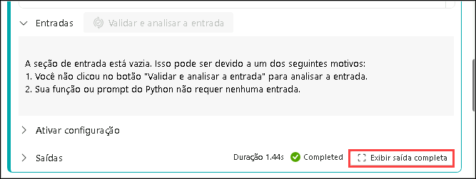
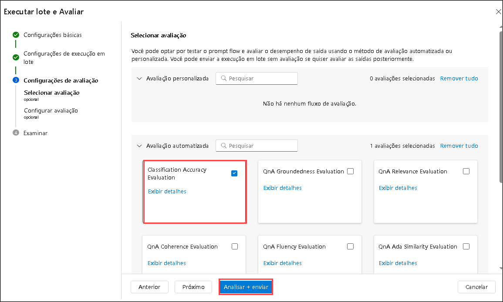

# Exercício 4: Ajuste Fino de Prompts para Desempenho Ideal

> **Observação**: Devido à alta demanda, a cota do AML Compute pode estar indisponível para alguns usuários, o que pode impedir a execução de determinadas etapas do laboratório neste exercício. No entanto, isso não afetará seu progresso no laboratório. Você pode ler as etapas, entender o exercício e, em seguida, executar a validação atualizada — o progresso ainda será registrado. Agradecemos a sua compreensão.

## Visão Geral do Laboratório

Neste laboratório prático, você explorará o ajuste fino de prompts para desempenho ideal, aprendendo a criar consultas de entrada precisas e eficazes que maximizam a precisão, relevância e eficiência das respostas geradas por IA. Você experimentará formas de estruturar prompts para orientar o comportamento da IA, incorporando contexto, restrições e formatos de saída desejados para alcançar resultados mais consistentes. Ao iterar no design de prompts e analisar as respostas da IA, você desenvolverá boas práticas para refinar entradas que atendam a diferentes casos de uso, como resumo, extração de dados, escrita criativa e resolução de problemas técnicos.

## Objetivos do Laboratório

Neste laboratório, você realizará as seguintes atividades:

- Tarefa 1: Realizar Ajuste Iterativo de Prompt e Comparação de Variantes
- Tarefa 2: Otimizar o Desempenho do Fluxo para Produção

## Tarefa 1: Realizar Ajuste Iterativo de Prompt e Comparação de Variantes

Refina as respostas do modelo ajustando os prompts em iterações sucessivas. Esse processo permite a avaliação sistemática das diferenças entre variantes de saída, garantindo que o desempenho do modelo melhore a cada iteração e produza respostas mais precisas e relevantes.

1. No [Azure AI Foundry](https://ai.azure.com/?reloadCount=1), na seção **Build and customize**, selecione **Prompt flow (1)**. Clique em **+ Create (2)** para abrir o assistente de criação de fluxo.

   

2. Em **Create a new flow**, na seção **Explore gallery**, na caixa **Web Classification**, selecione **Clone**.

   

3. Na página **Clone Flow**, insira o nome **Web Classification-{suffix} (1)** e clique em **Clone (2)**.

      

4. Role até o nó **classify_with_llm (1)** e selecione o seguinte:

   - Conexão: selecione a conexão **ai-odluser{suffix}xxxxxxxx_aoai (2)**
   - deployment_name: **gpt-4o (3)**

5. Substitua o prompt existente pelo prompt base abaixo no nó classify_with_llm:

   ```
   # system:
   Sua tarefa é classificar uma URL fornecida em um dos seguintes tipos:
   Filme, Aplicativo, Acadêmico, Canal, Perfil, PDF ou Nenhum com base nas informações do conteúdo do texto.
   A classificação será baseada na URL, no resumo do conteúdo textual da página ou em ambos.

   # user:
   Para a URL fornecida: https://arxiv.org/abs/2303.04671, e conteúdo textual: Visual ChatGPT é um sistema que permite aos usuários interagir com o ChatGPT enviando e recebendo não apenas linguagem, mas também imagens, fornecendo perguntas visuais complexas ou instruções de edição visual, e fornecendo feedback e solicitando resultados corrigidos. Ele incorpora diferentes Modelos Fundamentais Visuais e está disponível publicamente. Experimentos mostram que o Visual ChatGPT abre a porta para investigar os papéis visuais do ChatGPT com a ajuda desses modelos.  
   Classifique a URL acima completando a categoria e indicando evidências.
   ```

   

6. Clique no botão **Show variants** no canto superior direito do nó LLM. O nó existente é o **variant_0**, definido como variante padrão.

      

7. Clique em **Clone** na variant_0 para gerar variant_1, onde você pode configurar parâmetros diferentes.

     

8. No **variant_1**, substitua o prompt existente pelo seguinte:

   ```
   # system:  
   Sua tarefa é classificar uma URL fornecida em um dos seguintes tipos:
   Filme, Aplicativo, Acadêmico, Canal, Perfil, PDF ou Nenhum com base nas informações do conteúdo textual.
   A classificação será baseada na URL, no resumo do conteúdo da página ou em ambos.

   # user:
   Para a URL fornecida: https://play.google.com/store/apps/details?id=com.spotify.music, e conteúdo textual: Spotify é um aplicativo gratuito de streaming de músicas e podcasts com milhões de músicas, álbuns e podcasts originais. Também oferece audiolivros, permitindo aos usuários curtir milhares de histórias. Possui recursos como criação e compartilhamento de playlists, descoberta de novas músicas e acesso a podcasts exclusivos. Tem uma opção Premium para ouvir offline e sem anúncios. Está disponível em todos os dispositivos, com diversos gêneros e artistas para escolher.  
   Classifique a URL acima completando a categoria e indicando evidências.
   ```

9. Clique em **Hide variants** para parar de adicionar variantes. O variant_0 permanecerá como padrão para o nó classify_with_llm.

     

10. Role até o nó **summarize_text_content** e selecione:

    - Conexão: **ai-odluser{suffix}xxxxxxxx_aoai (1)**

    - deployment_name: **gpt-4o (2)**

11. Substitua o prompt existente com o prompt base abaixo. Baseado em variant_0, você pode criar variant_1:

    ```
    # system:
    Por favor, resuma o seguinte texto em um parágrafo de 100 palavras.
    Não adicione nenhuma informação que não esteja no texto.

    # user:
    Texto: A história da internet remonta ao início dos anos 1960, quando a ideia de uma rede global de computadores foi proposta. No fim dos anos 1960, a ARPANET foi desenvolvida pelo Departamento de Defesa dos EUA. Foi a primeira rede operacional com comutação de pacotes e precursora da internet moderna. Nos anos 1970 e 1980, surgiram vários protocolos e padrões como o TCP/IP, permitindo a comunicação entre redes. Nos anos 1990, a invenção da World Wide Web por Tim Berners-Lee revolucionou a internet, tornando-a acessível ao público geral. Desde então, a internet cresceu exponencialmente, tornando-se parte essencial da vida diária de bilhões de pessoas.

    assistant:
    Resumo:
    ```

    

12. Selecione o botão **Mostrar variantes (4)** no canto superior direito do nó LLM. O nó LLM existente é o **variant_0** e é a variante padrão.

13. Selecione o botão **Clonar** em **variant_0** para gerar o **variant_1**, assim poderemos configurar parâmetros com valores diferentes no **variant_1**.

    

14. Role a página para baixo e, no **variant_1**, substitua o prompt existente pelo seguinte prompt:

    ```
    # system:
    Por favor, resuma o seguinte texto em um parágrafo de 100 palavras.
    Não adicione nenhuma informação que não esteja no texto.

    # user:
    Texto: Inteligência Artificial (IA) refere-se à simulação da inteligência humana em máquinas programadas para pensar e aprender. A IA tem diversas aplicações na sociedade atual, incluindo robótica, processamento de linguagem natural e sistemas de tomada de decisão. Pode ser classificada como IA estreita (para tarefas específicas) ou IA geral (capaz de realizar qualquer tarefa intelectual humana). Apesar dos benefícios, a IA também levanta preocupações éticas, como invasão de privacidade e substituição de empregos.

    assistant:
    Resumo:
    ```
    

15. Clique em **Save** no menu superior, depois em **Start Compute Session** e, por fim, clique em **Run** no canto superior direito.

    

    

16. Na janela **Executar fluxo de envio**, em **Selecionar o nó LLM com variantes que você deseja executar**, escolha **Selecionar um nó para executar variantes**, selecione **summarize_text_content (1)** e clique em **Enviar (2)**.
   
    

    

    


17. Após a execução da sessão ser concluída com sucesso, revise a saída selecionando cada variante.

18. No menu superior, selecione **Variant 0 (1)** no menu suspenso e clique em **Ver saída completa (2)** para **summarize_text_content** da **variant 0**. Agora, revise a saída da variante que você selecionou.

    

    

   > **Nota:** A saída exibida na imagem pode ser diferente da que aparece no seu laboratório.


## Tarefa 2: Otimizar o Desempenho do Fluxo para Produção

Envolve analisar e refinar os processos de fluxo de trabalho para garantir máxima eficiência e mínimo tempo de inatividade. Isso inclui identificar gargalos, aplicar boas práticas e usar ferramentas avançadas para agilizar operações. Monitoramento contínuo e melhorias iterativas são essenciais para manter alto desempenho e se adaptar às mudanças de demanda, aumentando a produtividade e reduzindo custos.

1. Em **Inputs**, clique em **+ Add input** e adicione **category** e **text-context**. Em **Output**, adicione **category** e **evidence**. Clique em **Save**.


     

> **Nota:** Se as saídas já existirem, verifique os **valores** antes de salvar.

2. Selecione **Evaluate (1)** > **Custom Evaluation (2)**.

   

3. Em **Batch run & Evaluate**, insira o nome **classify-{suffix} (1)**, selecione o nó **classify_with_llm (2)** e clique em **Next (3)**.

   

4. Clique em **+ Add new data**, dê o nome **classify_with_llm_data_set (1)**, selecione **Upload from local file (2)** e clique em **Browse (3)**.

   

5. Navegue até `C:\LabFiles\Day-4-Developing-AI-App-with-Azure-AI-Foundry\Model-Evaluation-and-Model-Tunning\Labs\data`, selecione o arquivo **classify.jsonl (2)** e clique em **Open (3)**.

     

5. Clique em **Add**.

     

6. Para **text-context**, selecione **${data.text-context} (1)** e clique em **Next (2)**.

     

1. Na página **Configurar avaliação**, expanda **Avaliação de Precisão de Classificação (1)** e selecione **classify_with_llm_data_set (2)**. Para a fonte de **verdade base** (*ground truth*), selecione **category** em **Entrada de dados**, e para **previsão**, selecione **category (4)** em **Saída do fluxo**, depois clique em **Avançar (5)**.

     

     

9. Em **Review**, revise as configurações e clique em **Submit**

10. No topo da página de Prompt flow, clique em **View run list**

    
   
11. Após a execução, **selecione os runs das variantes (1)**, clique em **Visualize outputs (2)** para visualizar as métricas e saídas previstas de cada variante.

    

12. Depois de identificar qual variante é a melhor, você pode voltar para a página de criação do fluxo e definir essa variante como a variante padrão do nó.

13. Agora, vamos avaliar as variantes do nó **summarize_text_content** também.

14. De volta à página do **Prompt flow**, na seção **Entrada**, remova todas as entradas, exceto **url**, depois clique em **+ Adicionar entrada** e insira **Text**. Na seção **Saídas**, exclua as saídas existentes, clique em **+ Adicionar saída**, depois adicione **Summary** e defina o valor como **${summarize_text_content.output}**. Também adicione **url** e defina o valor como **${inputs.url}**.

   

15. Clique em **Salvar**.

16. Selecione **Avaliar (1)** e depois selecione **Avaliação personalizada (2)**.

    

17. Na tela de Execução em lote e Avaliação, forneça o **Nome da execução** como **summarize_text_content-{suffix} (1)**, depois em variantes selecione **Usar variantes padrão para todos os nós (2)** e selecione **summarize_text_content (3)** e clique em **Avançar (4)**.

    

18. Em **Configurações da execução em lote**, clique em **+ Adicionar novos dados**.

19. Na janela de novos dados, insira o nome **summarize_text_content_data_set (1)**, selecione **Fazer upload de arquivo local (2)** e clique em **procurar (3)**.

20. Navegue até **C:\LabFiles\Day-4-Developing-AI-App-with-Azure-AI-Foundry\Model-Evaluation-and-Model-Tunning\Labs\data**, selecione o arquivo **summarize.jsonl (2)** e depois clique em **Abrir (3)**.

     

21. Clique em **Adicionar**.

     

22. Em **Mapeamento de entrada**, para **url** selecione **${data.text} (1)**, e para **text** selecione **${data.text} (2)**. Selecione **Avançar (3)**.

     

23. Na página **Selecionar avaliação**, selecione **Avaliação de Precisão de Classificação (1)** e clique em **Avançar (2)**.

    

    

24. Na página **Configurar avaliação**, expanda **Avaliação de Precisão de Classificação (1)**, selecione **summarize_text_content_data_set (2)**, e certifique-se de que a fonte de **verdade base** esteja definida como **summary (3)** na seção **Entrada de dados**. Para **previsão**, selecione **summary (4)** na seção **Saída do fluxo**, e então clique em **Revisar + enviar (5)**.

     

25. Na página **Revisar**, revise as configurações e clique em **Enviar**.

     .png)

26. Volte para a página **Prompt flow** e, no topo, clique no link **Ver lista de execuções**.

     

27. Após a execução em lote e a execução da avaliação serem concluídas, na página de detalhes da execução, **selecione múltiplos (1)** lotes para cada variante e depois selecione **Visualizar saídas (2)**. Você verá as métricas das 2 variantes para o nó **classify_with_llm** e as saídas previstas pelo LLM para cada registro de dados.

     

28. Depois de identificar qual variante é a melhor, você pode voltar para a página de criação do fluxo e definir essa variante como a variante padrão do nó.


## Revisão

Neste laboratório, você completou as seguintes tarefas:

- Realizou o Ajuste Iterativo de Prompt e Comparação de Variantes
- Otimizou o Desempenho do Fluxo para Produção

### Você concluiu com sucesso o laboratório. Clique em **Próximo >>** para prosseguir com o próximo exercício.
