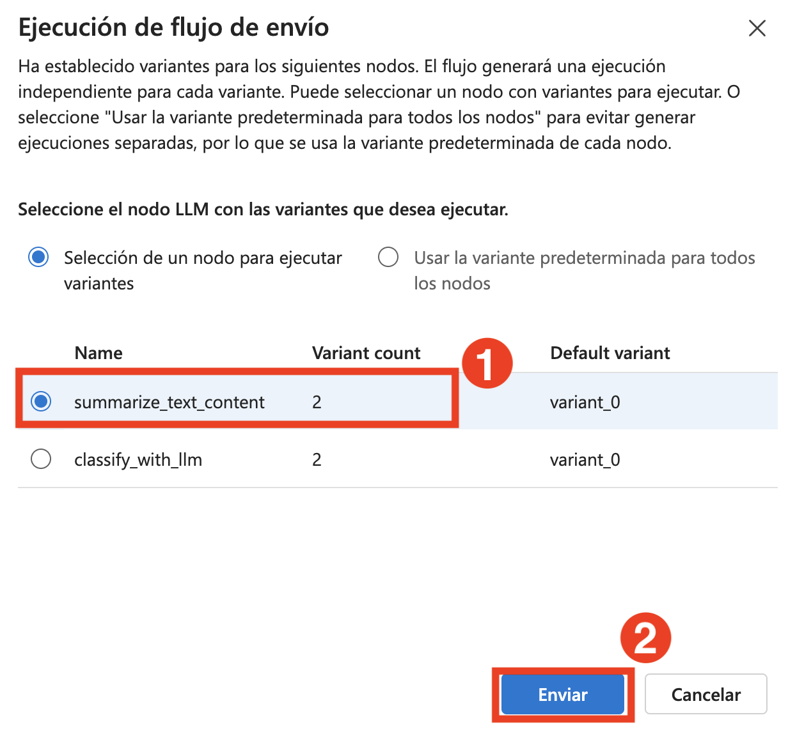
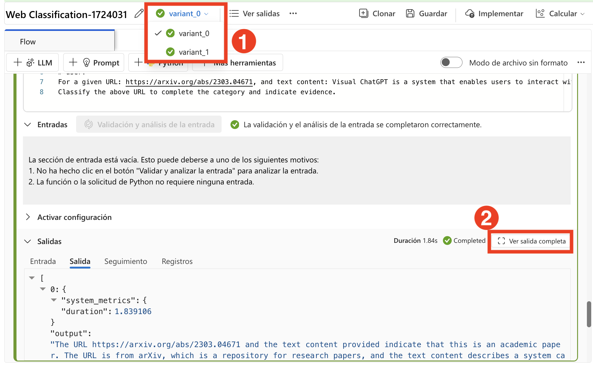
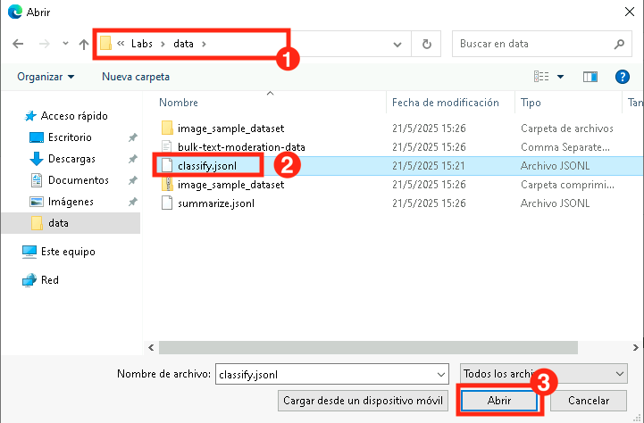
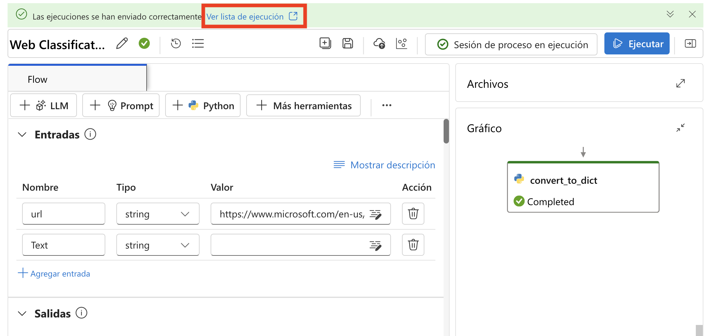

# 练习 4：优化提示以获得最佳性能

> **注意**：由于需求量较大，部分用户可能无法使用 AML 计算配额，这可能会导致无法执行本练习中的某些实验步骤。不过，这不会影响您的实验进度。您可以通读步骤，理解练习内容，然后运行更新后的验证——进度仍会被记录。感谢您的理解。

## 实验概述
在本实践实验中，您将探索如何优化提示以获得最佳性能，学习如何制作精确和有效的输入查询，以最大限度地提高 AI 生成响应的准确性、相关性和效率。您将尝试构建提示来引导 AI 行为，包含上下文、约束和所需的输出格式，以获得更一致的结果。通过迭代提示设计和分析 AI 响应，您将开发最佳实践来完善输入，以适应各种用例，从摘要和数据提取到创意写作和技术问题解决。

## 实验目标
在本实验中，您将完成以下任务：
- 任务 1：执行迭代提示调优和变体比较
- 任务 2：优化流程性能以用于生产环境

## 任务 1：执行迭代提示调优和变体比较
通过在连续迭代中调整提示来改进模型响应。这个过程允许系统地评估输出变体之间的差异，确保模型的性能随着每次迭代而提高，并产生最准确和相关的响应。

1. 在 [Azure AI foundry](https://ai.azure.com/?reloadCount=1) 的 **构建和自定义** 部分下，选择 **提示流量 (1)**。选择 **+ 创建 (2)** 打开流程创建向导。

   

2. 在 **创建新流程** 下的 **浏览示例库** 中，在 **网页分类** 框中选择 **克隆**。

   

3. 在 **克隆流量** 页面上，输入名称 **网页分类-{suffix} (1)** 并点击 **克隆 (2)**。

   

4. 向下滚动到 **classify_with_llm (1)** 节点并选择以下内容：

    - 连接：选择连接 **ai-odluser{suffix}xxxxxxxx_aoai (2)**
    - deployment_name：**gpt-4o (3)**

   

5. 在 classify_with_llm 节点中用以下提示替换现有提示作为基准提示：

   **英文：**

   ```
    # system:
    Your task is to classify a given URL into one of the following types:
    Movie, App, Academic, Channel, Profile, PDF, or None based on the text content information.
    The classification will be based on the URL, the webpage text content summary, or both.

    # user:
    For a given URL: https://arxiv.org/abs/2303.04671, and text content: Visual ChatGPT is a system that enables users to interact with ChatGPT by sending and receiving not only languages but also images, providing complex visual questions or visual editing instructions, and providing feedback and asking for corrected results. It incorporates different Visual Foundation Models and is publicly available. Experiments show that Visual ChatGPT opens the door to investigating the visual roles of ChatGPT with the help of Visual Foundation Models. 
    Classify the above URL to complete the category and indicate evidence.
   ```

     **中文：**
      ```
   # system:
   您的任务是将给定的 URL 分类为以下类型之一：
   Movie（电影）、App（应用程序）、Academic（学术）、Channel（频道）、Profile（个人资料）、PDF 或 None（无），基于文本内容信息。
   分类将基于 URL、网页文本内容摘要或两者。

   # user:
   给定 URL：https://arxiv.org/abs/2303.04671，文本内容：Visual ChatGPT 是一个系统，使用户能够与 ChatGPT 进行交互，不仅可以发送和接收语言，还可以处理图像，提供复杂的视觉问题或视觉编辑指令，并提供反馈和请求更正结果。它整合了不同的 Visual Foundation Models 并且可公开使用。实验表明，在 Visual Foundation Models 的帮助下，Visual ChatGPT 为研究 ChatGPT 的视觉角色开辟了新的途径。
   请对上述 URL 进行分类并提供证据。
   ```


6. 选择 LLM 节点右上角的 **显示变体** 按钮。现有的 LLM 节点是 variant_0 并且是默认变体。

   

7. 选择 variant_0 上的 **克隆** 按钮生成 variant_1，然后我们可以在 variant_1 上配置不同的参数值。

   

8. 向下滚动，在 **variant_1** 中用以下提示替换现有提示：

   **英文：**

   ```
    # system:  
    Your task is to classify a given URL into one of the following types:
    Movie, App, Academic, Channel, Profile, PDF, or None based on the text content information.
    The classification will be based on the URL, the webpage text content summary, or both.

    # user:
    For a given URL: https://play.google.com/store/apps/details?id=com.spotify.music, and text content: Spotify is a free music and podcast streaming app with millions of songs, albums, 
    and original podcasts. It also offers audiobooks, so users can enjoy thousands of stories. It has a variety of features such as creating and sharing music playlists, discovering new 
    music, and listening to popular and exclusive podcasts. It also has a Premium subscription option which allows users to download and listen offline, and access ad-free music. It is 
    available on all devices and has a variety of genres and artists to choose from.
    Classify the above URL to complete the category and indicate evidence.
   ```

     **中文：**
    ```  
    # system:  
    您的任务是将给定的 URL 分类为以下类型之一：
    Movie（电影）、App（应用程序）、Academic（学术）、Channel（频道）、Profile（个人资料）、PDF 或 None（无），基于文本内容信息。
    分类将基于 URL、网页文本内容摘要或两者。

    # user:
    给定 URL：https://play.google.com/store/apps/details?id=com.spotify.music，文本内容：Spotify 是一个免费的音乐和播客流媒体应用程序，拥有数百万首歌曲、专辑和原创播客。它还提供有声读物，用户可以享受数千个故事。它具有多种功能，如创建和分享音乐播放列表、发现新音乐以及收听流行和独家播客。它还提供高级订阅选项，允许用户离线下载和收听，并访问无广告音乐。它可在所有设备上使用，并提供各种流派和艺术家供选择。
    请对上述 URL 进行分类并提供证据。
    ```

9. 选择 **隐藏变体** 停止添加更多变体。所有变体都被折叠。显示节点的默认变体。对于 classify_with_llm 节点，基于 variant_0：

   

10. 向上滚动到 **summarize_text_content** 节点并选择以下内容：

    - 连接：选择连接 **ai-odluser{suffix}xxxxxxxx_aoai (1)**
    - deployment_name：**gpt-4o (2)**

11. 在 summarize_text_content 节点中用以下提示替换现有提示作为基准提示，基于 variant_0，您可以创建 variant_1 **(3)**：

    **英文：**

    ```
    # system:
    Please summarize the following text in one paragraph. 100 words.
    Do not add any information that is not in the text.

    # user:
    Text: The history of the internet dates back to the early 1960s, when the idea of a global network of computers was first proposed. In the late 1960s, the Advanced Research Projects 
    Agency Network (ARPANET) was developed by the United States Department of Defense. It was the first operational packet-switching network and the precursor to the modern internet. The 
    1970s and 1980s saw the development of various protocols and standards, such as TCP/IP, which allowed different networks to communicate with each other. In the 1990s, the invention 
    of the World Wide Web by Tim Berners-Lee revolutionized the internet, making it accessible to the general public. Since then, the internet has grown exponentially, becoming an 
    integral part of daily life for billions of people around the world.

    assistant:
    Summary:
    ```

    **中文：**


    ```  
    # system:
    请用一段话总结以下文本，100字以内。
    不要添加文本中没有的信息。

    # user:
    文本：互联网的历史可以追溯到20世纪60年代早期，当时首次提出了全球计算机网络的想法。在60年代末，美国国防部开发了高级研究计划局网络（ARPANET）。它是第一个运行的分组交换网络，也是现代互联网的前身。20世纪70年代和80年代见证了各种协议和标准的发展，如TCP/IP，使不同网络能够相互通信。在90年代，Tim Berners-Lee发明的万维网彻底改变了互联网，使其对公众开放。从那时起，互联网呈指数级增长，成为全球数十亿人日常生活中不可或缺的一部分。

    assistant:
    总结：
    ```

12. 选择 LLM 节点右上角的 **显示变体 (4)** 按钮。现有的 LLM 节点是 variant_0 并且是默认变体。

    

13. 选择 **variant_0** 上的 **克隆** 按钮生成 variant_1，然后我们可以在 variant_1 上配置不同的参数值。

14. 向下滚动，在 **variant_1** 中用以下提示替换现有提示：

    **英文：**

    ```
    # system:
    Please summarize the following text in one paragraph. 100 words.
    Do not add any information that is not in the text.

    # user:
    Text: Artificial intelligence (AI) refers to the simulation of human intelligence in machines that are programmed to think and learn. AI has various applications in today's society, 
    including robotics, natural language processing, and decision-making systems. AI can be categorized into narrow AI, which is designed for specific tasks, and general AI, which can 
    perform any intellectual task that a human can. Despite its benefits, AI also poses ethical concerns, such as privacy invasion and job displacement.

    assistant:
    Summary:
    ```

    **中文：**

    ```
    # system:
    请用一段话总结以下文本，100字以内。
    不要添加文本中没有的信息。

    # user:
    文本：人工智能（AI）是指在机器中模拟人类智能，使其能够思考和学习的技术。AI在当今社会有各种应用，包括机器人技术、自然语言处理和决策系统。AI可以分为针对特定任务设计的狭义AI和可以执行任何人类智能任务的通用AI。尽管AI带来诸多益处，但也引发了隐私侵犯和就业替代等伦理问题。

    assistant:
    总结：
    ```

15. 从顶部菜单点击 **保存** 按钮，然后选择 **启动计算会话**。最后，点击右上角的 **运行** 按钮。

    

16. 在打开的提交流程运行窗口中，在 **选择要运行变体的 LLM 节点** 下选择 **选择要运行的节点**，然后选择 **summarize_text_content (1)**，并点击 **提交 (2)**。

    

17. 会话运行成功后，通过选择每个变体来查看输出。

18. 在顶部菜单中从下拉菜单选择 **变体 0 (1)**，然后为 **summarize_text_content** 的 **变体 0** 选择 **查看完整输出 (2)**。现在，查看您选择的变体的输出。

    

    

    >**注意：** 图片中显示的输出可能与您的实验中的不同。

## 任务 2：优化流程性能以用于生产环境
这涉及分析和改进工作流程以确保最大效率和最小停机时间。这包括识别瓶颈、实施最佳实践以及利用先进的工具和技术来简化操作。持续监控和迭代改进对于保持高性能和适应不断变化的生产需求至关重要，最终导致生产力提高和运营成本降低。

1. 在 **输入** 下，点击 **+ 添加输入** 然后添加 **category** 和 **text-context**。在 **输出** 下，点击 **+ 添加输出** 然后添加 **category** 和 **evidence**。点击 **保存**。

    

    >**注意：** 在输出部分，如果输出已经添加，请检查 **values** 然后选择 **保存**。

2. 选择 **评估 (1)** > **自定义评估 (2)**。

   

3. 在 **批量运行和评估** 中，将 **运行显示名称** 设为 **classify-{suffix} (1)**，然后在 **变体** 下选择 **classify_with_llm (2)**，并点击 **下一步 (3)**。

   

4. 在 **批量运行设置** 中选择 **+ 添加新数据**。

   

5. 在打开的 **添加新数据** 窗口中，输入名称 **classify_with_llm_data_set (1)**，选择 **从本地文件上传 (2)** 并点击 **浏览 (3)**。

   

6. 导航到 **C:\LabFiles\Day-4-Developing-AI-App-with-Azure-AI-Foundry\Model-Evaluation-and-Model-Tunning\Labs\data** 按 **Enter** **(1)**，然后选择 **classify.jsonl (2)** 文件并点击 **打开 (3)**。

   

7. 点击 **添加**。

   

8. 为 text-context 选择 **${data.text-context} (1)** 并选择 **下一步 (2)**。

   

9. 在 **选择评估** 页面上，选择 **分类准确度评估 (1)** 并点击 **下一步 (2)**。

   

10. 在 **配置评估** 页面上，展开 **分类准确度评估 (1)** 并选择 **classify_with_llm_data_set (2)**。对于 **基准真值** 数据源，在 **数据输入** 下选择 **category**，对于 **预测**，在 **流程输出** 下选择 **category (4)**，然后选择 **下一步 (5)**。

    .png)

11. 在 **审查** 页面上查看设置并点击 **提交**。

12. 返回提示流程页面，从顶部点击 **查看运行列表** 链接。

    

13. 批处理运行和评估运行完成后，在运行详情页面中，**多选每个变体的批处理运行 (1)**，然后选择 **可视化输出 (2)**。您将能够看到 classify_with_llm 节点和 LLM 的 2 个变体的指标，以及每个记录数据的预测输出。

    

14. 在确定哪个变体最好之后，您可以返回到流程创作页面，将该变体设置为节点的默认变体。

15. 现在我们也将评估 summarize_text_content 节点的变体。

16. 返回到 **提示流程** 页面，在 **输入** 部分下，删除除 **url** 之外的所有输入，然后点击 **+ 添加输入** 并输入 **Text**。在 **输出** 部分下，删除现有输出，点击 **+ 添加输出**，然后添加 **Summary** 并将值设置为 **${summarize_text_content.output}**。同时添加 **url** 并将值设置为 **${inputs.url}**。

    

17. 点击 **保存**。

18. 选择 **评估 (1)** 然后选择 **自定义评估 (2)**。

    

19. 在批量运行和评估中，将 **运行显示名称** 设为 **summarize_text_content-{suffix} (1)**，然后在变体下选择 **使用所有节点的默认变体 (2)**，选择 **summarize_text_content (3)** 点击 **下一步 (4)**。

    

20. 在批量运行设置中，点击 **+ 添加新数据**。

21. 在新数据窗口中，输入名称 **summarize_text_content_data_set (1)**，选择 **从本地文件上传 (2)** 并点击 **浏览 (3)**。

    

22. 导航到 **C:\LabFiles\Day-4-Developing-AI-App-with-Azure-AI-Foundry\Model-Evaluation-and-Model-Tunning\Labs\data**，然后选择 **summarize.jsonl (2)** 文件并点击 **打开 (3)**。

    

23. 点击 **添加**。

    

24. 在 **输入映射** 下，为 **url** 选择 **${data.text} (1)**，为 **text** 选择 **${data.text} (2)**。选择 **下一步 (3)**。

    

25. 在 **选择评估** 页面上选择 **分类准确度评估 (1)** 并点击 **下一步 (2)**。

    

26. 在 **配置评估** 页面上，展开 **分类准确度评估 (1)**，选择 **summarize_text_content_data_set (2)**，并确保 **基准真值** 数据源在 **数据输入** 部分下设置为 **summary (3)**。对于 **预测**，在 **流程输出** 下选择 **summary (4)**，然后点击 **审查并提交 (5)**。

    

27. 在 **审查** 页面上查看设置并点击 **提交**。

    .png)

28. 返回提示流程页面，从顶部点击 **查看运行列表** 链接。

    

29. 批处理运行和评估运行完成后，在运行详情页面中，**多选 (1)** 每个变体的批处理运行，然后选择 **可视化输出 (2)**。您将看到 classify_with_llm 节点和 LLM 的 2 个变体的指标以及每条数据记录的预测输出。

    

30. 在确定哪个变体最好之后，您可以返回到流程创作页面，将该变体设置为节点的默认变体。

## 回顾
在本实验中，您已完成以下任务：
- 执行了迭代提示调优和变体比较
- 优化了流程性能以用于生产环境

### 您已成功完成实验。点击 **下一步** 继续下一个练习。
