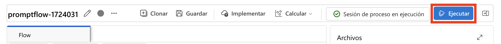

# 演習 4: 最適なパフォーマンスのためのプロンプトの微調整

> **注**：需要の高まりにより、一部のユーザーにおいてAML Computeのクォータが利用できない場合があります。そのため、この演習の特定のラボステップを実行できない場合があります。ただし、ラボの進行状況には影響しません。手順を読み、演習の内容を理解した上で、更新された検証を実行してください。進捗状況は引き続き記録されます。ご理解のほどよろしくお願いいたします。

## ラボ概要
このハンズオンラボでは、最適なパフォーマンスのためのプロンプトの微調整を探求し、AI生成の応答の精度、関連性、効率を最大化するための正確で効果的な入力クエリの作成方法を学びます。AIの行動を導くためのプロンプトの構造化を実験し、コンテキスト、制約、および望ましい出力形式を組み込んで、より一貫した結果を達成します。プロンプト設計を繰り返し、AIの応答を分析することで、要約やデータ抽出から創造的な執筆や技術的な問題解決まで、さまざまなユースケースに適した入力を洗練するためのベストプラクティスを開発します。

## ラボの目的
このラボでは、以下のタスクを実行します：
- タスク 1: プロンプトの反復調整とバリアント比較の実施
- タスク 2: 生産のためのフローパフォーマンスの最適化

## タスク 1: プロンプトの反復調整とバリアント比較の実施 
プロンプトを連続的に調整することでモデルの応答を洗練します。このプロセスにより、出力バリアント間の違いを体系的に評価し、モデルのパフォーマンスが各反復で改善され、最も正確で関連性の高い応答を生成することを保証します。

1. [Azure AI foundry](https://ai.azure.com/?reloadCount=1)の **構築とカスタマイズ** セクションで **プロンプト フロー (1)** を選択します。**+ 作成 (2)** を選択してフロー作成ウィザードを開きます。

   

2. **新しいフローを作成** の **ギャラリーを探索** で **ウェブ分類** ボックスの **複製** を選択します。

     

3. **フローを複製** ページで、名前 **Web Classification-<inject key="DeploymentID" enableCopy="false"/> (1)** を入力し、**複製 (2)** をクリックします。

      

4. **classify_with_llm (1)** ノードまでスクロールし、以下を選択します：

    - 接続: 接続 **ai-odluser<inject key="DeploymentID" enableCopy="false"/>xxxxxxxx_aoai (2)** を選択

    - deployment_name : **gpt-4o (3)**

      
   
5. classify_with_llm ノードのベースラインプロンプトとして、既存のプロンプトを以下のプロンプトに置き換えます。

   ```
   # system:
   Your task is to classify a given URL into one of the following types:
   Movie, App, Academic, Channel, Profile, PDF, or None based on the text content information.
   The classification will be based on the URL, the webpage text content summary, or both.

   # user:
   For a given URL: https://arxiv.org/abs/2303.04671, and text content: Visual ChatGPT is a system that enables users to interact with ChatGPT by sending and receiving not only languages but also images, providing complex visual questions or visual editing instructions, and providing feedback and asking for corrected results. It incorporates different Visual Foundation Models and is publicly available. Experiments show that Visual ChatGPT opens the door to investigating the visual roles of ChatGPT with the help of Visual Foundation Models. 
   Classify the above URL to complete the category and indicate evidence.
   ```

6. LLMノードの右上にある **バリエーションを表示** (4) ボタンを選択します。既存のLLMノードはvariant_0であり、デフォルトのバリアントです。

      

7. variant_0 の **複製** ボタンを選択してvariant_1を生成し、variant_1でパラメータを異なる値に設定できます。

     
   
8. 下にスクロールし、**variant_1** で既存のプロンプトを以下のプロンプトに置き換えます：

    ```  
    # system:  
    Your task is to classify a given URL into one of the following types:
    Movie, App, Academic, Channel, Profile, PDF, or None based on the text content information.
    The classification will be based on the URL, the webpage text content summary, or both.

    # user:
    For a given URL: https://play.google.com/store/apps/details?id=com.spotify.music, and text content: Spotify is a free music and podcast streaming app with millions of songs, albums, 
    and original podcasts. It also offers audiobooks, so users can enjoy thousands of stories. It has a variety of features such as creating and sharing music playlists, discovering new 
    music, and listening to popular and exclusive podcasts. It also has a Premium subscription option which allows users to download and listen offline, and access ad-free music. It is 
    available on all devices and has a variety of genres and artists to choose from.
    Classify the above URL to complete the category and indicate evidence.

    ```

    
     
9. 追加のバリアントを追加するのを停止するために **バリエーションを非表示** を選択します。すべてのバリアントが折りたたまれます。ノードのデフォルトバリアントが表示されます。classify_with_llmノードの場合、variant_0に基づいて：

     

10. **summarize_text_content** ノードまでスクロールし、以下を選択します： 

   - 接続: 接続 **ai-odluser<inject key="DeploymentID" enableCopy="false"/>xxxxxxxx_aoai (1)** を選択

   - deployment_name: **gpt-4o (2)**

11. summarize_text_contentノードのベースラインプロンプトとして、既存のプロンプトを以下のプロンプトに置き換えます。variant_0に基づいて、variant_1 **(3)** を作成できます。  
     
   ```  
   # system:
   Please summarize the following text in one paragraph. 100 words.
   Do not add any information that is not in the text.

   # user:
   Text: The history of the internet dates back to the early 1960s, when the idea of a global network of computers was first proposed. In the late 1960s, the Advanced Research Projects 
   Agency Network (ARPANET) was developed by the United States Department of Defense. It was the first operational packet-switching network and the precursor to the modern internet. The 
   1970s and 1980s saw the development of various protocols and standards, such as TCP/IP, which allowed different networks to communicate with each other. In the 1990s, the invention 
   of the World Wide Web by Tim Berners-Lee revolutionized the internet, making it accessible to the general public. Since then, the internet has grown exponentially, becoming an 
   integral part of daily life for billions of people around the world.

   assistant:
   Summary:
   ```

12. LLMノードの右上にある **バリエーションを表示 (4)** ボタンを選択します。既存のLLMノードはvariant_0であり、デフォルトのバリアントです。

    
   
13. **variant_0** の **複製** ボタンを選択してvariant_1を生成し、variant_1でパラメータを異なる値に設定できます。

14. **variant_1** で既存のプロンプトを以下のプロンプトに置き換えます：

   ```
   # system:
   Please summarize the following text in one paragraph. 100 words.
   Do not add any information that is not in the text.

   # user:
   Text: Artificial intelligence (AI) refers to the simulation of human intelligence in machines that are programmed to think and learn. AI has various applications in today's society, 
   including robotics, natural language processing, and decision-making systems. AI can be categorized into narrow AI, which is designed for specific tasks, and general AI, which can 
   perform any intellectual task that a human can. Despite its benefits, AI also poses ethical concerns, such as privacy invasion and job displacement.

   assistant:
   Summary:

   ```
15. 上部メニューの **保存** ボタンをクリックし、次に **Start Compute Session** を選択します。最後に、右上の **実行** ボタンをクリックします。

    

16. Submit flow run ウィンドウが開いたら、**Select the LLM node with variants that you want to run** で **Select a node to run variants** を選択し、**summarize_text_content (1)** を選択して **提出 (2)** をクリックします。 

   
   
17. セッションが正常に実行されたら、各バリアントを選択して出力を確認します。

18. 上部メニューで **Variant 0 (1)** をドロップダウンから選択し、**summarize_text_content** の **variant 0** の **View full output (2)** を選択します。選択したバリアントの出力を確認します。

   

   

   >**注:** 画像に表示されている出力は、ラボで異なる場合があります。

## タスク 2: 生産のためのフローパフォーマンスの最適化 
ワークフロープロセスを分析および洗練して、最大の効率と最小のダウンタイムを確保します。これには、ボトルネックの特定、ベストプラクティスの実施、および高度なツールと技術を利用して運用を合理化することが含まれます。継続的な監視と反復的な改善は、高いパフォーマンスを維持し、変化する生産要求に適応するために不可欠であり、最終的には生産性の向上と運用コストの削減につながります。

1. **入力** で **+ 入力を追加** をクリックし、**カテゴリー** と **text-context** を追加します。**出力** で **+ 出力を追加** をクリックし、**カテゴリー** と **証拠** を追加します。**保存** をクリックします。

    

   >**注意:** 出力セクションで、出力がすでに追加されている場合は、**値** を確認して **保存** を選択してください。
   
2. **評価 (1)** > **カスタム評価 (2)** を選択します。

   

3. **バッチ実行と評価** で **実行表示名** を **classify-{suffix} (1)** **Variants** で **classify_with_llm (2)** を選択し、**次へ (3)** をクリックします。*.

   

4. **バッチ実行設定** で **+ 新しいデータを追加** を選択します。

   

5. **新しいデータを追加** ウィンドウが開いたら、名前を **classify_with_llm_data_set (1)** として入力し、**ローカルファイルからアップロード (2)** を選択して **参照 (3)** をクリックします。

   

6. **C:\LabFiles\Day-4-Developing-AI-App-with-Azure-AI-Foundry\Model-Evaluation-and-Model-Tunning\Labs\data** に移動し、**Enter (1)** を押して **classify.jsonl (2)** ファイルを選択し、**開く (3)** をクリックします。

     

7. **追加** をクリックします。

     

8.  **text-context** に **${data.text-context} (1)** を選択し、**次へ** (2) を選択します。

     
   
9. **評価を選択** ページで **分類精度評価 (1)** を選択し、**次へ (2)** をクリックします。

   

10. **評価を設定** ページで **分類精度評価 (1)** を展開し、**classify_with_llm_data_set (2)** を選択します。**ground truth** データソースとして **カテゴリー** を **データ入力** で選択し、**予測** として **カテゴリー (4)** を **フロー出力** で選択し、**次へ** (5) を選択します。

     .png)

11. **レビュー** ページで設定を確認し、**提出** をクリックします。

12. Prompt flowページに戻り、上部から **View run list** リンクをクリックします。

    
   
13. バッチ実行と評価実行が完了したら、実行詳細ページで **各バリアントのバッチ実行を multi-select (1)** し、**Visualize outputs (2)** を選択します。classify_with_llmノードとLLMの2つのバリアントのメトリクス、および各記録データの予測出力を確認できます。

   

14. 最良のバリアントを特定したら、フロー作成ページに戻り、そのバリアントをノードのデフォルトバリアントとして設定できます。

15. summarize_text_contentノードのバリアントも評価します。

16. **プロンプト フロー** ページに戻り、**入力** セクションで **url** 以外のすべての入力を削除し、**+ 入力を追加** をクリックして **Text** を入力します。**出力** セクションで既存の出力を削除し、**+ 出力を追加** をクリックして **Summary** を追加し、値を **${summarize_text_content.output}** に設定します。また、**url** を追加し、値を **${inputs.url}** に設定します。

   

17. **保存** をクリックします。

18. **評価 (1)** を選択し、次に **カスタム評価 (2)** を選択します。

   

19. **バッチ実行と評価** で **実行表示名** を **summarize_text_content-<inject key="DeploymentID" enableCopy="false"/> (1)** として入力し、バリアントで **Use default variants for all nodes (2)** を選択し、**summarize_text_content (3)** を選択して **次へ (4)** をクリックします。

   

20. **バッチ実行設定** で **+ 新しいデータを追加** を選択します。

21. 新しいデータウィンドウで名前を **summarize_text_content_data_set (1)** として入力し、**ローカルファイルからアップロード (2)** を選択して **参照 (3)** をクリックします。

   

22. **C:\LabFiles\Day-4-Developing-AI-App-with-Azure-AI-Foundry\Model-Evaluation-and-Model-Tunning\Labs\data** に移動し、**summarize.jsonl (2)** ファイルを選択して **開く (3)** をクリックします。

   

23. **追加** をクリックします。.

   

24. **入力マッピング** で **url** に **${data.text} (1)** を選択し、**text** に **${data.text} (2)** を選択します。**次へ (3)** を選択します。

   

25. **評価を選択** ページで **分類精度評価 (1)** を選択し、**次へ (2)** をクリックします。

   

26. **評価を設定** ページで **分類精度評価 (1)** を展開し、**summarize_text_content_data_set (2)** を選択します。**データ入力** セクションで **ground truth** データソースが **summary (3)**。**フロー出力** で **予測** に **summary (4)** を選択し、**レビューと提出** (5) をクリックします。

    

27. **レビュー** ページで設定を確認し、**提出** をクリックします。

    .png)

28. Prompt flowページに戻り、上部から **View run list** リンクをクリックします。

   
   
29. バッチ実行と評価実行が完了したら、実行詳細ページで各バリアントのバッチ実行を **multi-select (1)** し、**Visualize outputs (2)** を選択します。classify_with_llmノードとLLMの2つのバリアントのメトリクス、および各記録データの予測出力を確認できます。

   

30. 最良のバリアントを特定したら、フロー作成ページに戻り、そのバリアントをノードのデフォルトバリアントとして設定できます。

## レビュー
このラボでは、以下のタスクを完了しました：
- プロンプトの反復調整とバリアント比較の実施
- 生産のためのフローパフォーマンスの最適化

### ラボを正常に完了しました。次の演習に進むには **Next >>** をクリックしてください。
