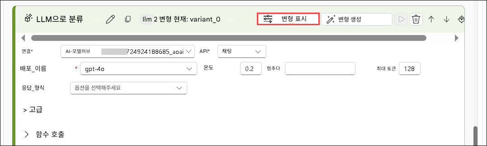
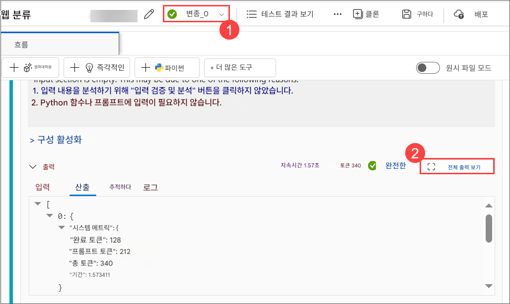

# 실습 4: 최적 성능을 위한 프롬프트 미세 조정

> **참고**: 수요 급증으로 인해 일부 사용자의 AML 컴퓨팅 할당량이 부족하여 이 연습의 특정 랩 단계를 실행하지 못할 수 있습니다. 하지만 이는 랩 진행 상황에 영향을 미치지 않습니다. 단계를 읽고 연습 내용을 이해한 후 업데이트된 검증을 실행해도 진행 상황은 계속 기록됩니다. 양해해 주셔서 감사합니다.

## 개요

이 실습에서는 최적의 성능을 달성하기 위해 프롬프트를 정밀하게 조정하는 방법을 학습합니다. 정확도, 관련성, 처리 효율을 극대화할 수 있도록 정교하고 효과적인 입력 쿼리를 작성하는 방법을 실습합니다. AI의 동작을 유도할 수 있도록 프롬프트의 구조를 실험하며, 문맥, 제약 조건, 원하는 출력 형식을 포함시켜 보다 일관된 결과를 얻는 방법을 배웁니다. 프롬프트 디자인을 반복하고 AI 응답을 분석함으로써, 요약, 데이터 추출, 창의적 글쓰기, 기술 문제 해결 등 다양한 사용 사례에 맞는 입력 최적화의 모범 사례를 습득하게 됩니다.

## 목표

이 실습에서 여러분은 다음 과제를 수행하게 됩니다:

- 과제 1: 반복적인 프롬프트 튜닝 및 변형 비교 수행
- 과제 2: 프로덕션 환경을 위한 흐름 성능 최적화

## 과제 1: 반복적인 프롬프트 튜닝 및 변형 비교 수행

프롬프트를 반복적으로 조정함으로써 모델의 응답을 점진적으로 개선합니다. 이 과정은 다양한 출력 변형 간의 차이를 체계적으로 평가할 수 있도록 하며, 각 반복에서 모델 성능이 향상되어 보다 정확하고 관련성 높은 결과를 생성할 수 있도록 합니다.

1. [Azure AI Foundry 포털](https://ai.azure.com/?reloadCount=1) 에서 **빌드 및 사용자 지정** 섹션 아래의 **프롬프트 흐름 (1)** 을 선택합니다. **+ 만들기 (2)** 를 선택하여 흐름 생성 마법사를 엽니다.
   
   

1. **새 흐름 만들기** 페이지에서 **갤러리 탐색** > **Web Classification** 상자에서 **복제** 을 선택합니다.
   
   

1. **흐름 복제** 페이지에서 이름을 **Web Classification-<DeploymentID> (1)** 로 입력하고 **복제 (2)** 을 클릭합니다.
   
   

1. 아래로 스크롤하여 **classify\_with\_llm (1)** 노드를 선택하고 다음 항목을 구성합니다:

   * **연결**: **ai-odluser<DeploymentID>xxxxxxxx\_aoai (2)**
   * **deployment\_name**: **gpt-4o (3)**
     
     

1. 해당 노드에 **프롬프트**를 아래 내용으로 변경 합니다.

   ```jinja
   # system:
   Your task is to classify a given URL into one of the following types:
   Movie, App, Academic, Channel, Profile, PDF, or None based on the text content information.
   The classification will be based on the URL, the webpage text content summary, or both.

   # user:
   For a given URL: https://arxiv.org/abs/2303.04671, and text content: Visual ChatGPT is a system that enables users to interact with ChatGPT by sending and receiving not only languages but also images, providing complex visual questions or visual editing instructions, and providing feedback and asking for corrected results. It incorporates different Visual Foundation Models and is publicly available. Experiments show that Visual ChatGPT opens the door to investigating the visual roles of ChatGPT with the help of Visual Foundation Models. 
   Classify the above URL to complete the category and indicate evidence.
   ```
   ```
   # system:
   당신의 과제는 주어진 URL을 다음 유형 중 하나로 분류하는 것입니다:
   텍스트 내용 정보를 바탕으로 영화, 앱, 학술, 채널, 프로필, PDF 또는 해당 없음
   분류는 URL, 웹페이지 텍스트 내용 요약, 또는 둘 모두를 기반으로 이루어집니다.

   # users:
   주어진 URL: https://arxiv.org/abs/2303.04671 과 텍스트 내용: Visual ChatGPT는 사용자가 언어뿐만 아니라 이미지를 주고받으며 ChatGPT와 상호작용할 수 있게 해주는 시스템입니다. 이를 통해 복잡한 시각적 질문이나 이미지 편집 지시를 제공하고, 결과에 대한 피드백을 주거나 수정된 결과를 요청할 수 있습니다. 이 시스템은 다양한 시각 기반 모델(Visual Foundation Models)을 통합하고 있으며, 공개적으로 이용 가능합니다. 실험 결과, Visual ChatGPT는 시각 기반 모델의 도움을 받아 ChatGPT의 시각적 역할을 탐구할 수 있는 가능성을 열어줍니다.
   ```

1. LLM 노드 우측 상단에서 **변형 표시** 버튼을 선택합니다. 현재 노드는 **variant\_0** 이며 기본값입니다.
   
   

1. **복제** 버튼을 클릭하여 **variant\_1** 을 생성하고, **variant\_1** 에서 다른 프롬프트를 구성합니다.
   
   

1. 아래로 스크롤하여 **variant\_1** 의 프롬프트를 다음으로 변경합니다:

   ```jinja
   # system:  
   Your task is to classify a given URL into one of the following types:
   Movie, App, Academic, Channel, Profile, PDF, or None based on the text content information.
   The classification will be based on the URL, the webpage text content summary, or both.

   # user:
   For a given URL: https://play.google.com/store/apps/details?id=com.spotify.music, and text content: Spotify is a free music and podcast streaming app with millions of songs, albums, and original podcasts. It also offers audiobooks, so users can enjoy thousands of stories. It has a variety of features such as creating and sharing music playlists, discovering new music, and listening to popular and exclusive podcasts. It also has a Premium subscription option which allows users to download and listen offline, and access ad-free music. It is available on all devices and has a variety of genres and artists to choose from.
   Classify the above URL to complete the category and indicate evidence.
   ```

   ```jinja
   # system:
   당신의 과제는 주어진 URL을 다음 유형 중 하나로 분류하는 것입니다:
   텍스트 내용 정보를 바탕으로 영화, 앱, 학술, 채널, 프로필, PDF 또는 해당 없음
   분류는 URL, 웹페이지 텍스트 내용 요약, 또는 둘 모두를 기반으로 이루어집니다.

   # user:
   주어진 URL: https://play.google.com/store/apps/details?id=com.spotify.music 과 텍스트 내용: Spotify는 수백만 곡의 노래, 앨범, 오리지널 팟캐스트를 제공하는 무료 음악 및 팟캐스트 스트리밍 앱입니다. 또한 오디오북도 제공하여 사용자는 수천 편의 이야기를 즐길 수 있습니다. 음악 플레이리스트 생성 및 공유, 새로운 음악 발견, 인기 및 독점 팟캐스트 청취 등 다양한 기능을 갖추고 있습니다.
   또한 프리미엄 구독 옵션을 통해 오프라인 재생 및 광고 없는 음악 이용이 가능하며, 모든 기기에서 사용할 수 있고 다양한 장르와 아티스트를 선택할 수 있습니다.
   위 URL을 이용하여 분류를 수행하고, 해당 분류의 근거를 제시하세요.
   ```

1. **변형 숨기기** 를 클릭하여 추가 생성을 종료하고, 기본 variant\_0 으로 접습니다.
   
   

1. 다시 **summarize\_text\_content** 노드로 이동하여 다음을 설정합니다:

   - **연결**: **ai-odluser<DeploymentID>xxxxxxxx\_aoai (1)**
   - **deployment\_name**: **gpt-4o (2)**

1. 해당 노드의 프롬프트를 다음과 같이 **기본 프롬프트** 로 변경합니다. 이제 추가로 variant\_1 변형을 생성할 수 있습니다. **(3)**:

   ```jinja
   # system:
   Please summarize the following text in one paragraph. 100 words.
   Do not add any information that is not in the text.

   # user:
   Text: The history of the internet dates back to the early 1960s, when the idea of a global network of computers was first proposed. In the late 1960s, the Advanced Research Projects Agency Network (ARPANET) was developed by the United States Department of Defense. It was the first operational packet-switching network and the precursor to the modern internet. The 1970s and 1980s saw the development of various protocols and standards, such as TCP/IP, which allowed different networks to communicate with each other. In the 1990s, the invention of the World Wide Web by Tim Berners-Lee revolutionized the internet, making it accessible to the general public. Since then, the internet has grown exponentially, becoming an integral part of daily life for billions of people around the world.

   assistant:
   Summary:
   ```
   ```jinja
   # system:
   다음 텍스트를 100단어 이내의 단락 하나로 요약하세요.
   텍스트에 없는 정보는 추가하지 마세요.

   # user:
   텍스트: 인터넷의 역사는 1960년대 초로 거슬러 올라가며, 이때 전 세계 컴퓨터를 연결하는 네트워크라는 개념이 처음 제안되었습니다. 1960년대 후반, 미국 국방부의 고등연구계획국(ARPA)은 ARPANET을 개발했으며, 이는 최초의 패킷 교환 네트워크이자 현대 인터넷의 전신이었습니다. 1970~80년대에는 TCP/IP와 같은 다양한 프로토콜과 표준이 개발되어 서로 다른 네트워크 간 통신이 가능해졌습니다. 1990년대에는 팀 버너스 리가 월드 와이드 웹을 발명하면서 대중이 인터넷에 접근할 수 있게 되었고, 이후 인터넷은 폭발적으로 성장하여 현재 수십억 인구의 일상에 없어서는 안 될 존재가 되었습니다.

   assistant:
   Summary:
   ```

1. LLM 노드의 오른쪽 상단에 있는 **변형 보기(Show variants) (4)** 버튼을 선택합니다. 기존 LLM 노드는 **variant\_0**이며 기본 변형입니다.

   

1. **variant\_0**에서 **복제(Clone)** 버튼을 선택하여 **variant\_1**을 생성한 후, **variant\_1**에서 매개변수를 다른 값으로 구성할 수 있습니다.


1. 다시 **변형 표시** 를 클릭한 후, **복제** 를 클릭 하여 **variant\_1** 을 생성하고 아래 프롬프트로 변경합니다:

   ```jinja
   # system:
   Please summarize the following text in one paragraph. 100 words.
   Do not add any information that is not in the text.

   # user:
   Text: Artificial intelligence (AI) refers to the simulation of human intelligence in machines that are programmed to think and learn. AI has various applications in today's society, including robotics, natural language processing, and decision-making systems. AI can be categorized into narrow AI, which is designed for specific tasks, and general AI, which can perform any intellectual task that a human can. Despite its benefits, AI also poses ethical concerns, such as privacy invasion and job displacement.

   assistant:
   Summary:
   ```
   ```jinja
   # system:
   다음 텍스트를 한 단락, 100단어 이내로 요약하세요.
   텍스트에 없는 정보는 추가하지 마세요.

   # user:
   텍스트: 인공지능(AI)은 인간의 지능을 모방하도록 프로그래밍된 기계에서 나타나는 지능을 의미합니다. AI는 로봇공학, 자연어 처리, 의사결정 시스템 등 오늘날 사회에서 다양한 분야에 활용되고 있습니다. AI는 특정 작업만 수행하도록 설계된 narrow AI와, 인간처럼 지적 작업 전반을 수행할 수 있는 일반 general AI로 나뉩니다. AI는 많은 이점을 제공하지만, 동시에 개인 정보 침해나 일자리 감소와 같은 윤리적 문제도 제기되고 있습니다.

   assistant:
   Summary:
   ```

1. 상단 메뉴에서 **저장** 를 클릭한 후, **컴퓨팅 세션 시작** 을 선택합니다. 마지막으로 우측 상단의 **실행** 버튼을 클릭합니다.
   
    

1. **흐름 실행 제출** 창에서 **실행할 변경이 있는 LLM 노드를 선택합니다** 항목에 대해 **summarize\_text\_content (1)** 을 선택한 후, **제출 (2)** 를 클릭합니다.
   
    

1. 세션이 성공적으로 실행되면 각 변형의 출력을 검토합니다.

1. 상단 메뉴에서 드롭다운에서 **Variant 0 (1)** 을 선택한 후, **출력 보기** 를 선택합니다.
   
    
   
    

> **참고:** 출력은 실습 환경에 따라 이미지와 다를 수 있습니다.

## 과제 2: 프로덕션 환경을 위한 흐름 성능 최적화

워크플로우 프로세스를 분석하고 정제하여 최대 효율과 최소 다운타임을 보장합니다. 이에는 병목 현상을 식별하고, 모범 사례를 적용하며, 고급 도구 및 기술을 활용하여 운영을 간소화하는 작업이 포함됩니다. 지속적인 모니터링과 반복적인 개선을 통해 높은 성능을 유지하고 변화하는 프로덕션 요구에 적응함으로써 생산성을 높이고 운영 비용을 절감할 수 있습니다.

1. **입력** 섹션에서 **+ 입력 추가** 을 클릭하고 **category**, **text-context** 를 추가합니다.
   **출력** 섹션에서도 **+ 출력 추가** 을 클릭하여 **category**, **evidence** 를 추가합니다.
   그런 다음 **저장** 을 클릭합니다.

   

   > **참고:** Output 항목이 이미 있을 경우, 값이 정확한지 확인하고 **저장** 을 클릭하세요.

1. 상단 메뉴에서 **평가 (1)** > **사용자 지정 평가 (2)** 를 선택합니다.

   

1. **일괄 실행 및 평가** 창에서 **표시 이름 실행** 을 **classify-<DeploymentID> (1)** 로 입력합니다.
   **변형**에서 **classify\_with\_llm (2)** 을 선택하고 **다음 (3)** 을 클릭합니다.

    

1. **배치 실행 설정** 페이지에서 **+ 새 데이터 추가** 선택 합니다.

   

1. **새 데이터 추가** 창에서 다음을 입력 합니다. 

   * 이름: **classify\_with\_llm\_data\_set (1)**
   * **로컬 파일에서 업로드 (2)** 선택 후 **찾아보기 (3)** 를 클릭합니다. 

      

1. 경로 이동:
   **C:\LabFiles\Day-4-Developing-AI-App-with-Azure-AI-Foundry\Model-Evaluation-and-Model-Tunning\Labs\data**
   → **classify.jsonl (2)** 파일을 선택하고 → **Open (3)** 클릭합니다. 

    

1. **추가** 를 클릭합니다.

   

1. text-context에서 **${data.text-context} (1)**를 선택한 후, **다음 (2)** 을 클릭합니다.

   

1. **평가 선택** 페이지에서 **Classification Accuracy Evaluation (1)** 선택 후 **다음 (2)** 을 클릭 합니다.

    

1. **평가 구성** 페이지에서 다음과 같이 설정을 변경합니다:

    - **Classification Accuracy Evaluation (1)** 확장
    - 평가를 위한 데이터 자산 선택: **classify\_with\_llm\_data\_set (2)**
    - **ground truth**: **category** (Data input)
    - **prediction**: **category (4)** (Flow output)
    - **다음 (5)** 클릭
    
      .png)

1. **검토** 페이지에서 설정 확인 후 **제출** 을 클릭합니다. 

1. 프롬프트 흐름 페이지로 돌아가 상단의 **실행 목록 보기** 링크를 클릭합니다.

    

1. 실행 완료 후, 실행 상세 페이지에서 **각 variant 실행을 다중 선택 (1)** 하고 **출력 시각화 (2)** 를 클릭합니다. 
    → `classify_with_llm` 노드에 대한 variant별 지표 및 예측 출력 확인 가능

    

1. 가장 우수한 변형을 확인한 후, 흐름 작성 페이지로 돌아가 해당 변형을 노드의 기본 변형으로 설정할 수 있습니다.

1. 이제 `summarize_text_content` 노드의 다양한 **변형(variants)** 도 평가해 보겠습니다.

1. **프롬프트 흐름** 페이지로 다시 이동하여 **Input** 섹션에서 `url`을 제외한 모든 입력을 제거합니다. 이후 **+ 입력 추가**을 클릭하여 **Text**를 입력합니다. **Outputs** 섹션에서는 기존 출력을 삭제하고 **+ Add output**을 클릭하여 **Summary**를 추가한 뒤, 값으로 `${summarize_text_content.output}`를 설정합니다. 또한 **url**을 추가하고 값으로 `${inputs.url}`을 설정합니다.

   

1. **저장**를 클릭합니다.

1. **평가 (1)** 를 선택한 후, **사용자 지정 평가 (2)** 를 선택합니다.

   

1. **일괄 실행 및 평가** 화면에서 **표시 이름 실행**을 `summarize_text_content-{suffix} (1)`로 지정합니다. 그런 다음 **변형** 항목에서 **모든 노드에 기본 변형 사용 (2)** 을 선택하고, **summarize\_text\_content (3)** 를 선택한 후 **다음** 을 클릭합니다.

   

1. **배치 실행 설정**에서 **+ 새 데이터 추가** 를 클릭합니다.

1. 새로운 데이터 추가 창에서 이름을 `summarize_text_content_data_set (1)`로 입력하고, **로컬파일에서 업로드** 를 선택한 뒤 **찾아보기 (3)** 를 클릭합니다.

   

1. `C:\LabFiles\Day-4-Developing-AI-App-with-Azure-AI-Foundry\Model-Evaluation-and-Model-Tunning\Labs\data` 경로로 이동하여 `summarize.jsonl (2)` 파일을 선택하고, **Open (3)** 을 클릭합니다.

   

1. **추가** 를 클릭합니다.

   

1. **입력 매핑** 단계에서 `url`에 대해 **\${data.text} (1)** 를, `Text`에 대해서도 **${data.text} (2)**을 각각 선택하고, **다음 (3)** 을 클릭합니다.

    

1. **평가 선택** 페이지에서 **Classification Accuracy Evaluation (1)** 을 선택한 후 **다음 (2)** 을 클릭합니다.

    

1. **평가 구성** 페이지에서 **Classification Accuracy Evaluation (1)** 을 확장한 후, 평가를 위한 데이터 자산 선택에서 **summarize\_text\_content\_data\_set (2)** 를 선택합니다. **groundtruth** 데이터 소스를 **데이터 입력** 항목의 **summary (3)**로 설정하고, **prediction**을 **흐름 출력** 항목의  **summary (4)** 로 설정합니다. 이후 **검토 + 제출** 을 클릭합니다.

    

1. **검토** 페이지에서 설정을 검토한 뒤, **제출** 을 클릭합니다.

    .png)

1. 다시 **프롬프트 흐름** 페이지 상단에서 **실행 목록 보기** 링크를 클릭합니다.

    

1. 배치 실행 및 평가가 완료되면, 실행 세부 정보 페이지에서 각 변형의 배치 실행 항목을 **다중 선택 (1)** 한 다음, **출력 시각화 (2)** 를 선택합니다. 그러면 `classify_with_llm` 노드의 두 가지 변형에 대한 메트릭과 각 데이터 레코드에 대한 LLM 예측 결과를 확인할 수 있습니다.

    

1. 어떤 변형이 가장 우수한지 파악한 후, 플로우 작성 페이지로 돌아가 해당 노드를 기본 변형으로 설정할 수 있습니다.

## 복습
이번 실습에서는 다음 과제를 완료했습니다:
- 반복적인 프롬프트 튜닝과 다양한 변형(Variant) 비교 수행
- 프로덕션 환경을 위한 플로우 성능 최적화

### 실습을 성공적으로 완료하였습니다. 다음 연습 과제로 진행하려면 다음 >> 버튼을 클릭하세요.
