# Exercício 5: Implementando Fluxo de Chat e Integração com Ferramentas

> **Observação**: Devido à alta demanda, a cota do AML Compute pode estar indisponível para alguns usuários, o que pode impedir a execução de determinadas etapas do laboratório neste exercício. No entanto, isso não afetará seu progresso no laboratório. Você pode ler as etapas, entender o exercício e, em seguida, executar a validação atualizada — o progresso ainda será registrado. Agradecemos a sua compreensão.

## Visão Geral do Laboratório
Neste laboratório, você irá projetar e implementar um fluxo de chat para interagir com um modelo de linguagem implantado. Você começará criando um fluxo de chat básico usando o Azure AI Foundry, integrando entradas, um nó de LLM e configurando a saída para refletir as respostas do chat. Em seguida, testará o fluxo de chat, garantirá seu funcionamento correto e o implantará em um ambiente de produção. As etapas finais envolvem verificar a implantação, testar o fluxo implantado com consultas de exemplo e explorar opções para integrar o fluxo de chat em aplicações como um copiloto personalizado.

## **Objetivos do Laboratório**

Neste laboratório, você irá:

- Tarefa 1: Projetar e Implementar um Fluxo de Chat
- Tarefa 2: Usar LLM e Ferramentas de Prompt em Fluxos

## Tarefa 1: Projetar e Implementar um Fluxo de Chat

Projete e implemente um fluxo de chat usando o Azure AI Foundry para interagir com um modelo de linguagem implantado, teste sua funcionalidade e implante-o para uso em produção.

1. No menu de navegação à esquerda, em **Meus ativos**, selecione **Modelos + endpoints (1)**.

2. Na página **Gerenciar implantações de seus modelos, apps e serviços**, na aba **Implantações de modelo**, selecione **+ Implantar modelo (2)** e, no menu suspenso, escolha **Implantar modelo base (3)**.

   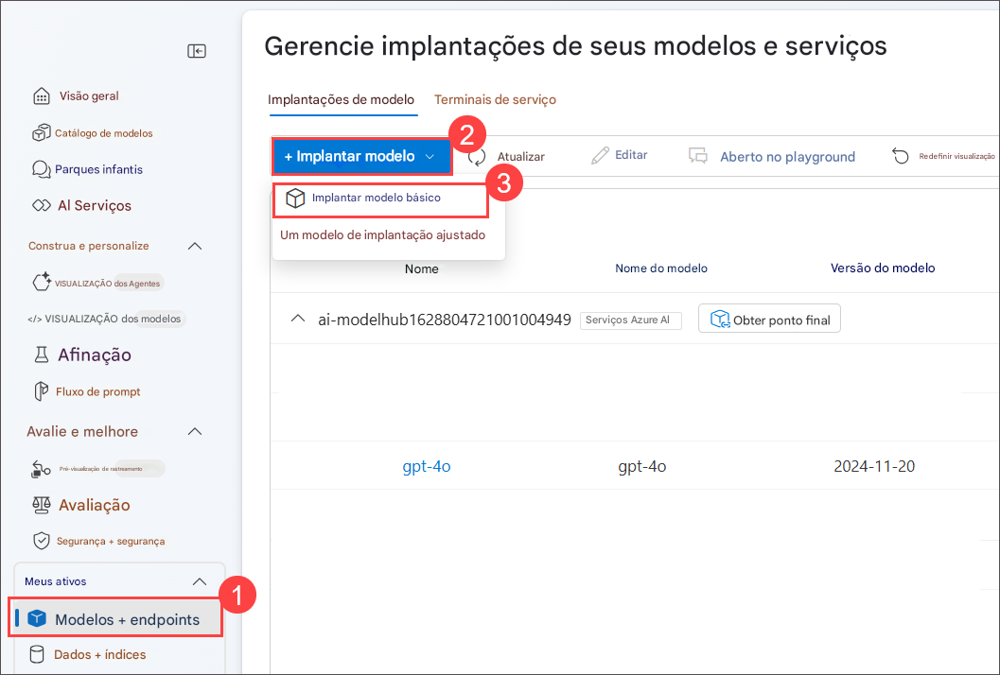

3. Na página **Selecionar um modelo**, pesquise por **gpt-35-turbo (1)**, selecione **gpt-35-turbo (2)** e clique em **Confirmar (3)**.

   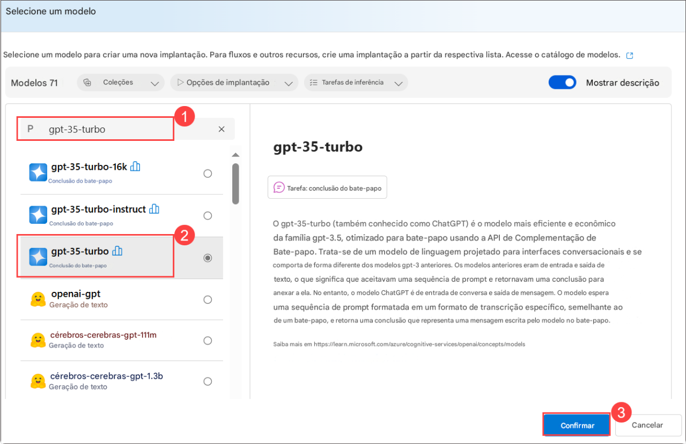

4. Em **Implantar modelo gpt-35-turbo**, digite o nome da implantação: **gpt-35-turbo** e clique em **Personalizar**.

5. Em **Implantar modelo gpt-35-turbo**, siga estas instruções para criar a implantação:

   - Nome da Implantação: **gpt-35-turbo (1)**
   - Tipo de Implantação: **Padrão (2)**
   - Selecione **Personalizar**
   - Atualizações automáticas de versão: **Ativado (3)**
   - Versão do modelo: **0125 (4)**
   - Recurso de IA conectado: selecione o recurso criado na tarefa anterior **(5)**
   - Limite de Taxa por Minuto em Tokens (milhares): **10K (6)**
   - Filtro de conteúdo: **DefaultV2 (7)**
   - Cota dinâmica: **Ativado (8)**
   - Selecione **Implantar (9)**

     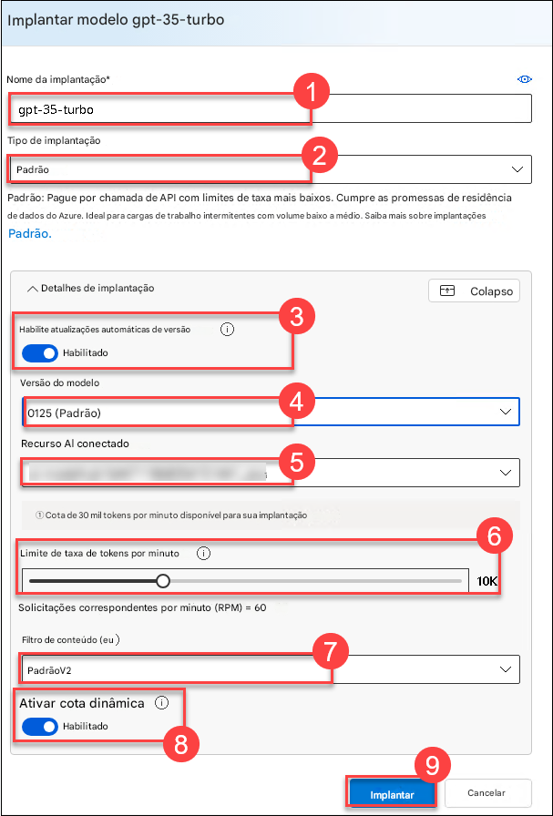
     
6. No [Azure AI Foundry](https://ai.azure.com/), em **Meus ativos**, selecione **Modelos + endpoints**. Na página **Modelos + implantações**, selecione **gpt-35-turbo (1)** e clique em **Abrir no playground (2)**.

7. Na janela de chat, insira a consulta: **What can you do?**

   > **Nota:** A resposta será genérica, pois ainda não há instruções específicas para o assistente. Para focar em uma tarefa, é possível alterar o prompt do sistema.
   > Aguarde 5 minutos se ocorrer erro ao consultar.

     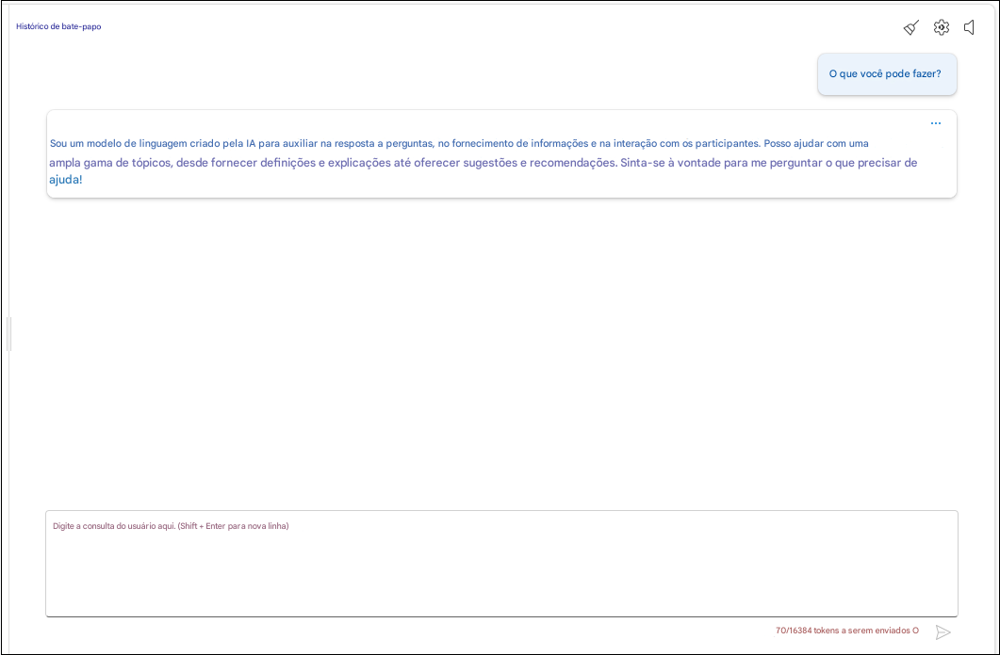

   > **Nota:** A resposta será diferente da imagem, mas similar em estrutura.
   
8. Atualize a **Mensagem do sistema (1)** com o seguinte conteúdo:

   ```markdown
   **Objetivo**: Ajudar usuários com dúvidas relacionadas a viagens, oferecendo dicas, conselhos e recomendações como um agente de viagens experiente.

   **Capacidades**:
   - Fornecer informações atualizadas sobre destinos, acomodações, transportes e atrações locais.
   - Oferecer sugestões personalizadas com base nas preferências, orçamento e datas de viagem do usuário.
   - Compartilhar dicas sobre bagagem, segurança e como lidar com imprevistos.
   - Ajudar no planejamento de roteiros, incluindo trajetos ideais e pontos turísticos imperdíveis.
   - Responder a perguntas comuns e oferecer soluções para possíveis problemas durante a viagem.

   **Instruções**:
   1. Interagir de forma amigável e profissional, como um agente de viagens faria.
   2. Utilizar os recursos disponíveis para fornecer informações precisas e relevantes.
   3. Adaptar as respostas às necessidades e interesses específicos do usuário.
   4. Garantir que as recomendações sejam práticas, considerando segurança e conforto.
   5. Incentivar o usuário a fazer perguntas de acompanhamento para assistência adicional.   
   ```

9. Selecione **Aplicar alterações (2)**.

     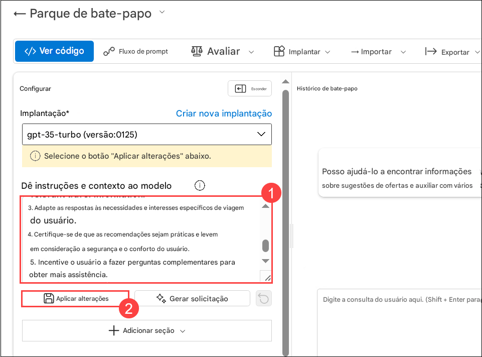

10. Selecione **Continuar**.

11. Na janela de chat, insira novamente a consulta: **What can you do?** e observe a mudança na resposta.

     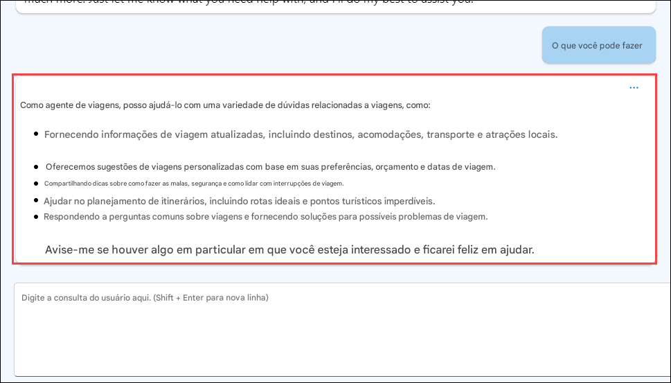

   > **Nota:** A resposta será diferente da imagem, mas similar em estrutura.

12. No menu de navegação à esquerda, selecione **Prompt flow (1) > + Criar (2)** para adicionar a ferramenta Prompt ao seu fluxo.

    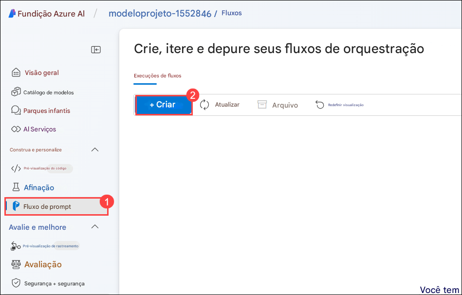

13. Na janela **Criar um novo fluxo**, em **Fluxo de chat**, clique em **Criar**, insira **Travel-Chat** como nome da pasta e clique em **Criar**.

    

14. Um fluxo de chat simples será criado. Observe que há duas entradas (**histórico do chat e pergunta do usuário**), um nó de LLM conectado ao seu modelo de linguagem implantado, e uma saída com a resposta do chat.

    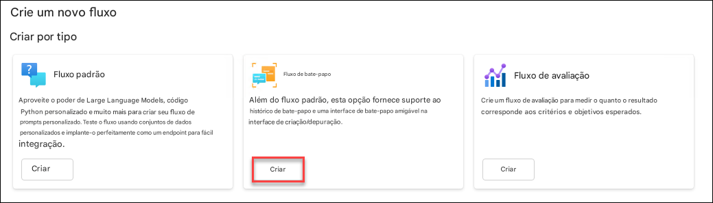

15. Para testar o fluxo, é necessário iniciar uma sessão de computação. Clique em **Iniciar sessão de computação** na barra superior.

    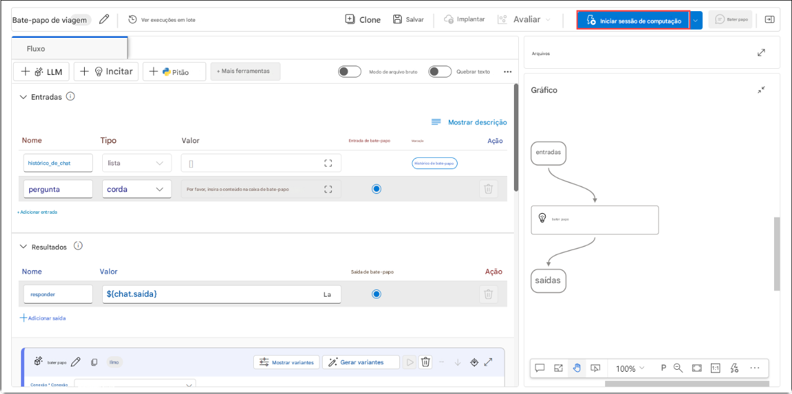
   
    > **Nota:** Pode levar de 1 a 3 minutos para a sessão iniciar.

16. Selecione o nó LLM chamado **chat**. Atualize a mensagem do sistema conforme abaixo:

    ```
    system:
    **Objetivo**: Ajudar usuários com dúvidas relacionadas a viagens, oferecendo dicas, conselhos e recomendações como um agente de viagens experiente.

    **Capacidades**:
    - Fornecer informações atualizadas sobre destinos, acomodações, transportes e atrações locais.
    - Oferecer sugestões personalizadas com base nas preferências, orçamento e datas de viagem do usuário.
    - Compartilhar dicas sobre bagagem, segurança e como lidar com imprevistos.
    - Ajudar no planejamento de roteiros, incluindo trajetos ideais e pontos turísticos imperdíveis.
    - Responder a perguntas comuns e oferecer soluções para possíveis problemas durante a viagem.

    **Instruções**:
    1. Interagir de forma amigável e profissional, como um agente de viagens faria.
    2. Utilizar os recursos disponíveis para fornecer informações precisas e relevantes.
    3. Adaptar as respostas às necessidades e interesses específicos do usuário.
    4. Garantir que as recomendações sejam práticas, considerando segurança e conforto.
    5. Incentivar o usuário a fazer perguntas de acompanhamento para assistência adicional.

    
    user:
    {{item.inputs.question}}
    assistant:
    {{item.outputs.answer}}
    

    user:
    {{question}}
    ```

    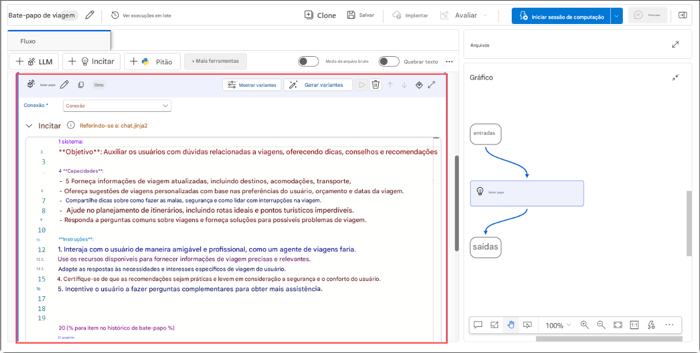

17. Selecione **Salvar**.

18. Agora conecte o nó LLM ao seu modelo implantado:

    * **Conexão**: selecione a conexão criada ao implantar o **gpt-35-turbo (1)**.
    * **API**: selecione **chat (2)**.
    * **deployment_name**: selecione o modelo **gpt-35-turbo (3)**.
    * **response_format**: selecione **{“type”:”text”} (4)**.

      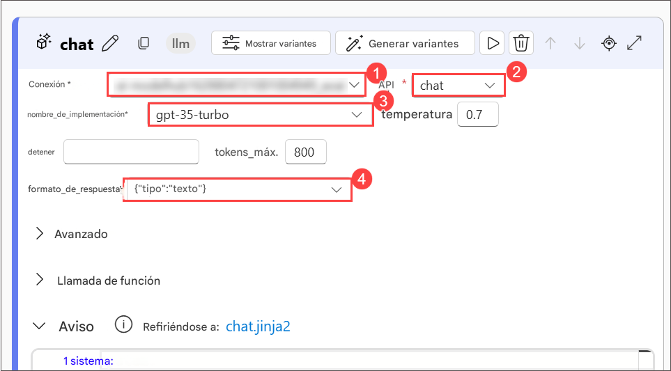
   
## **Tarefa 2: Usar LLM e Ferramentas de Prompt em Fluxos**

Agora que o fluxo está desenvolvido, você pode testá-lo na janela de chat.

1. Verifique se a sessão de computação está ativa. Clique em **Salvar (1)** e selecione **Chat (2)** para testar o fluxo.

   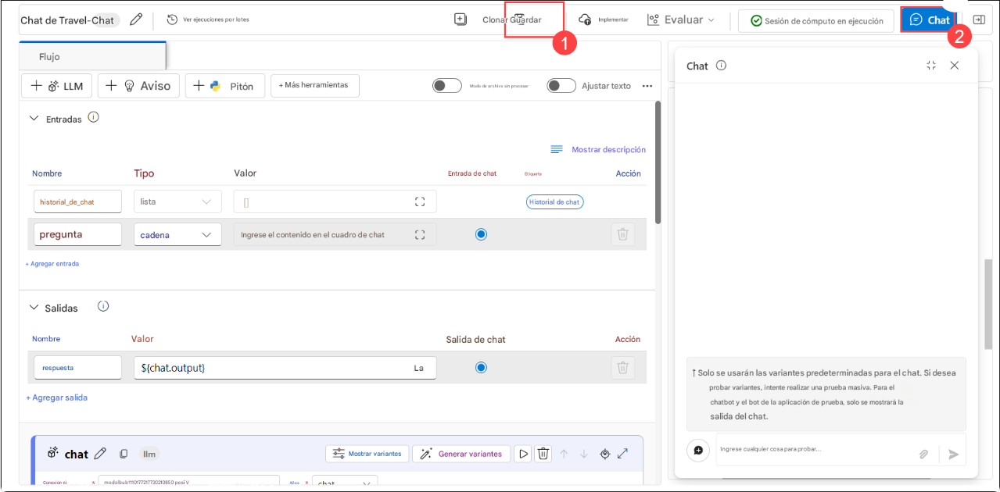

2. Digite a pergunta: **I have one day in London, what should I do?** e revise a resposta.

    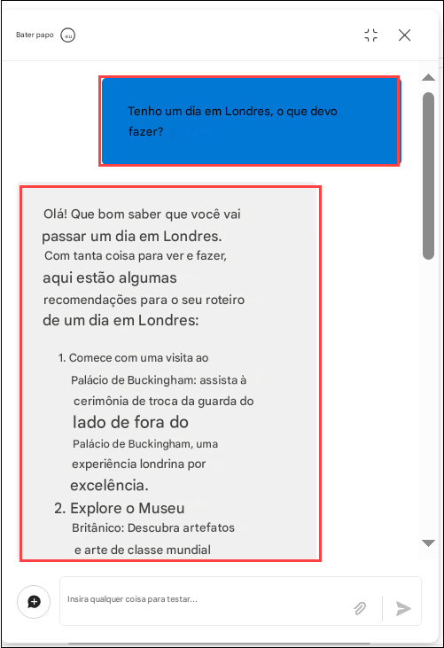

   > **Nota:** A resposta será diferente da imagem, mas similar em estrutura.

3. Selecione **Implantar** para implantar o fluxo com as seguintes configurações:

     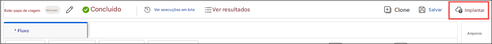
   
   - Configurações básicas:
     - Endpoint: **Novo (1)**
     - Nome do endpoint: **modelendpoint-{suffix}(2)**
     - Nome da implantação: **modeldeploy-{suffix} (3)**
     - Máquina virtual: **Standard_DS3_v2 (4)**
     - Número de instâncias: **3 (5)**
     - Coleta de dados de inferência: **Ativado (6)**
     - Selecione **Revisar + Criar (7)**

         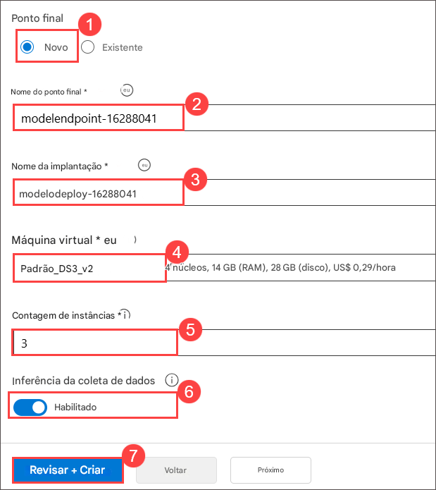

4. Selecione **Criar**.

5. No Azure AI Foundry, no menu à esquerda, vá para **Meus ativos > Modelos + endpoints**

   > **Nota:** Se seu fluxo ainda não foi salvo, selecione **Salvar**.

6. Vá para a aba **Implantações de modelo (1)** para localizar seu fluxo implantado. Pode levar um tempo até a implantação ser exibida. Quando o status da Provisão for Concluído, selecione a implantação recém criada **(2)**.

    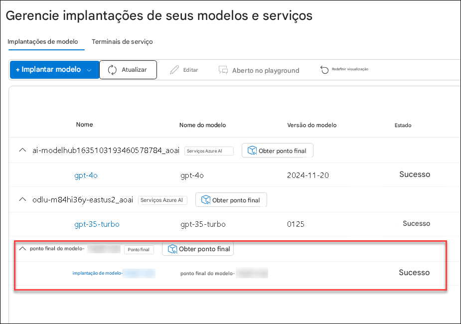

7. Quando o status da Provisão for **Concluído (1)**, a aba **Teste (2)** estará disponível.

8. Vá até a aba **Teste**, insira o prompt **What is there to do in San Francisco?** e revise a resposta.

     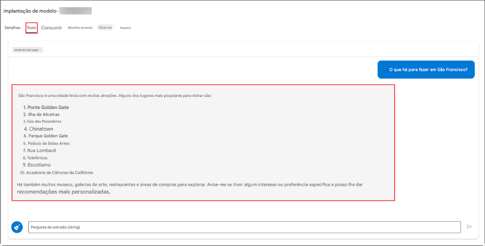

   > **Nota:** A resposta será diferente da imagem, mas similar em estrutura.

9. Insira o prompt **Where else could I go?** e revise a resposta.

     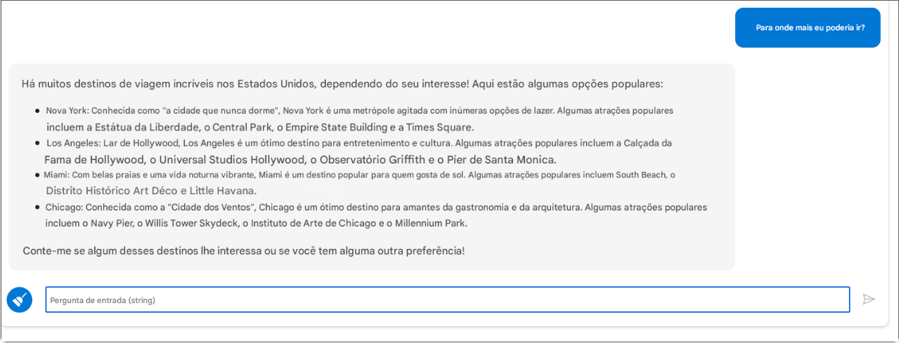

   > **Nota:** A resposta será diferente da imagem, mas similar em estrutura.

10. Acesse a página **Consumir** do endpoint, onde encontrará informações de conexão e código de exemplo para construir um aplicativo cliente — permitindo integrar o fluxo como um copiloto personalizado.

     


## Revisão

Neste laboratório, você realizou as seguintes tarefas:

- Projetou e implementou um fluxo de chat
- Usou ferramentas de LLM e Prompt em fluxos

### Você completou com sucesso o laboratório. Clique em **Próximo >>** para prosseguir com o próximo exercício.
