# 演習 5: チャットフローとツール統合の実装

> **注**：需要の高まりにより、一部のユーザーにおいてAML Computeのクォータが利用できない場合があります。そのため、この演習の特定のラボステップを実行できない場合があります。ただし、ラボの進行状況には影響しません。手順を読み、演習の内容を理解した上で、更新された検証を実行してください。進捗状況は引き続き記録されます。ご理解のほどよろしくお願いいたします。

## ラボ概要
このラボでは、デプロイされた言語モデルと対話するためのチャットフローを設計および実装します。まず、Azure AI foundryを使用して基本的なチャットフローを作成し、入力の統合、LLMノードの追加、チャット応答を反映する出力の設定を行います。次に、チャットフローをテストし、正しく機能することを確認してから、プロダクション環境にデプロイします。最後のステップでは、デプロイメントを確認し、サンプルクエリでデプロイされたフローをテストし、カスタムコパイロットとしてアプリケーションにチャットフローを統合するオプションを探ります。

## ラボの目的
このラボでは、以下のタスクを実行します:
- タスク 1: チャットフローの設計と実装
- タスク 2: フローでのLLMおよびプロンプトツールの使用

## タスク 1: チャットフローの設計と実装
Azure AI foundryを使用してデプロイされた言語モデルと対話するチャットフローを設計および実装し、その機能をテストしてプロダクションで使用できるようにデプロイします。

1. 左側のナビゲーションメニューから **アセット** を選択し、**モデル + エンドポイント (1)** を選択します。

2. **モデル、アプリ、サービスのデプロイ管理** の **モデルデプロイメント** タブで、 **+ モデルをデプロイ (2)** を選択し、ドロップダウンから **ベースモデルをデプロイ (3)** を選択します。

   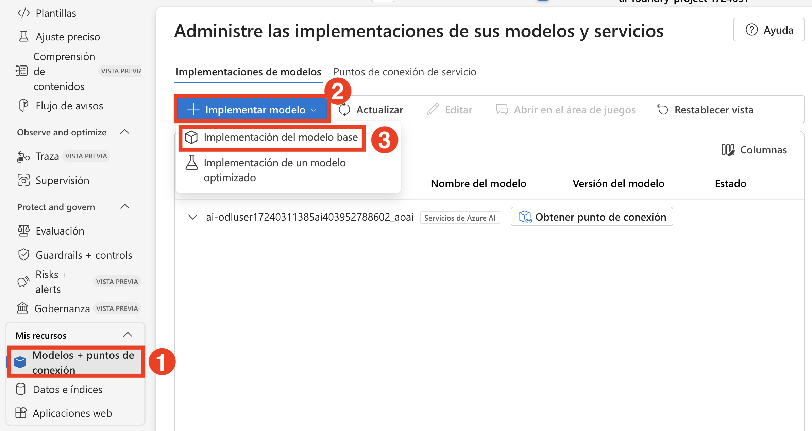

3. **モデルを選択** のページで、 **gpt-35-turbo (1)** を検索し、 **gpt-35-turbo (2)** を選択し、 **確認 (3)** をクリックします。

   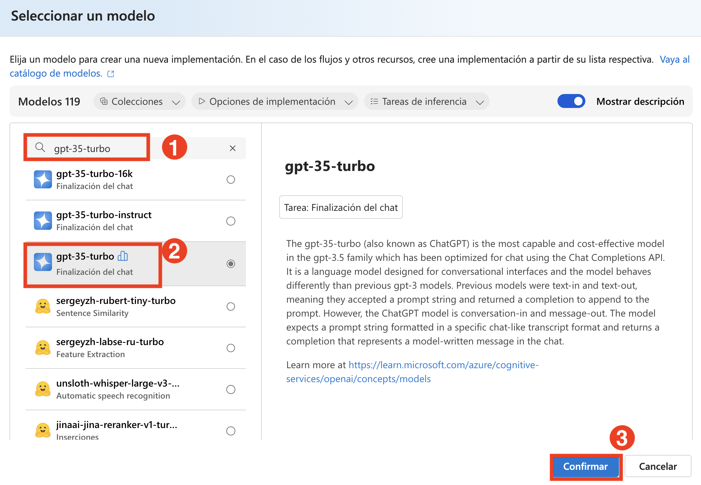

4. **gpt-35-turbo モデルのデプロイ** で、デプロイ名: **gpt-35-turbo** を入力し、 **カスタマイズ** をクリックします。

5. **gpt-35-turbo モデルのデプロイ** で、以下の手順に従ってデプロイを作成します:
   
   - デプロイ名: **gpt-35-turbo (1)**
   - デプロイタイプ: **Standard (2)**
   - **カスタマイズ** を選択
   - 自動バージョン更新の有効化: **Enabled (3)**
   - モデルバージョン: **0125 (4)**
   - 接続された AI リソース: 以前のタスクで作成したリソースを選択 **(5)**
   - 1分あたりのトークンレート制限（千単位）: **10K (6)**
   - コンテンツフィルター: **DefaultV2 (7)**
   - 動的クォータの有効化: **Enabled (8)**
   - **デプロイ (9)** を選択

     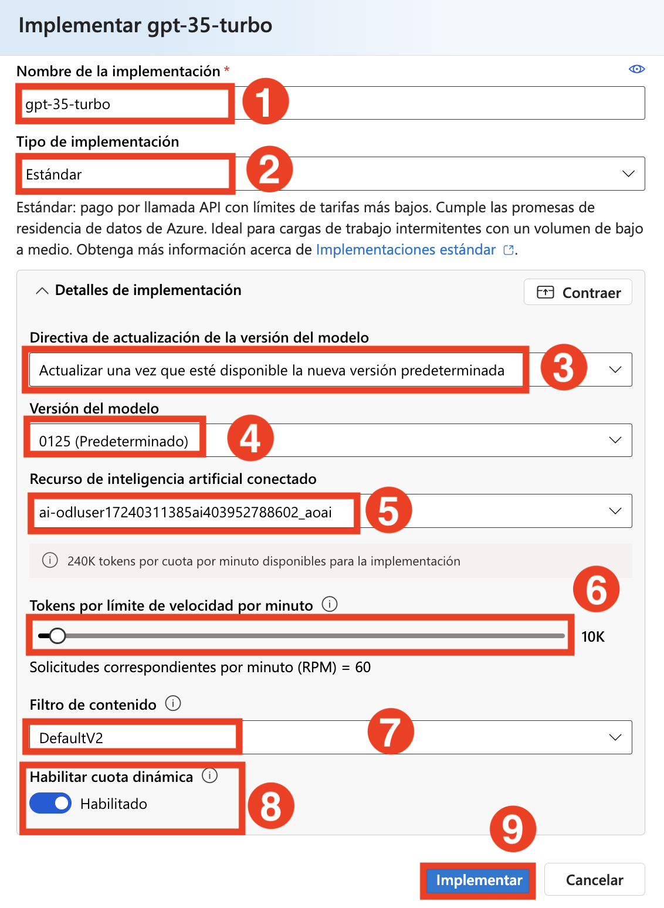
     
6. [Azure AI foundry](https://ai.azure.com/),にアクセスし、**アセット** の中から **モデル + エンドポイント** を選択します。**モデル + デプロイメント** ページで **gpt-35-turbo (1)** を選択し、 **プレイグラウンドで開く (2)** をクリックします。

    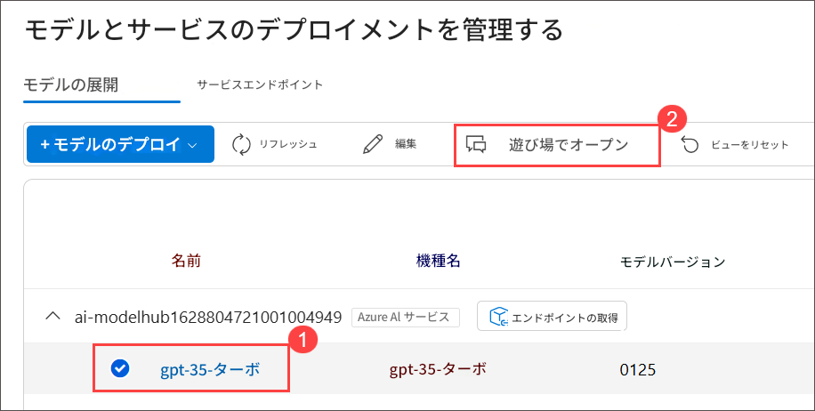

7. チャットウィンドウで、クエリ **What can you do?** を入力します。

   >**注:** 回答は一般的なものですが、アシスタントに特定の指示を与えることで、特定のタスクに焦点を当てることができます。

   >**注:** 問い合わせ時にエラーが発生した場合は、5分ほど待って再試行してください。
   
     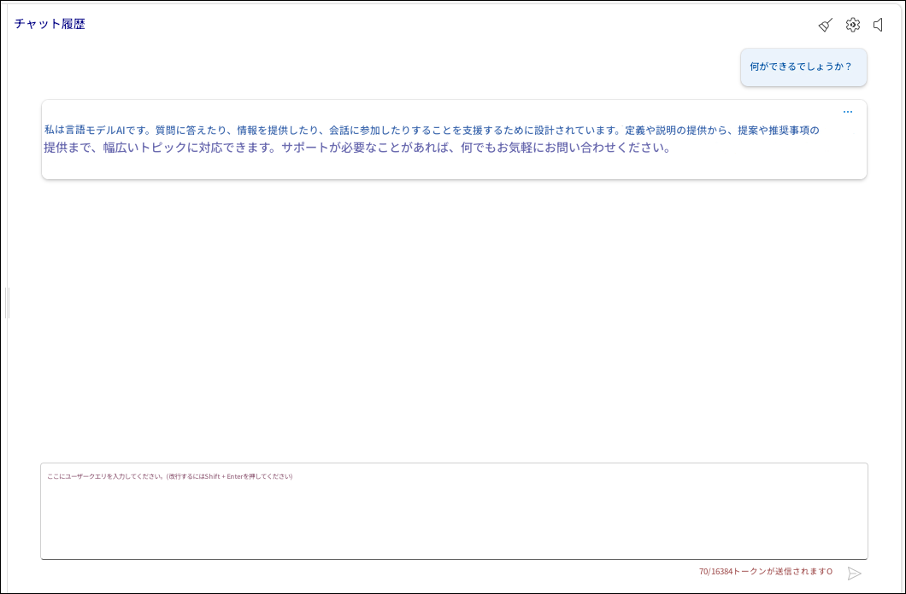

   >**注:** 出力は異なりますが、スクリーンショットと類似する形で表示されます。

8. **システムメッセージ (1)** を以下の内容に更新します:

   ```
   **Objective**: Assist users with travel-related inquiries, offering tips, advice, and recommendations as a knowledgeable travel agent.

   **Capabilities**:
   - Provide up-to-date travel information, including destinations, accommodations, transportation, and local attractions.
   - Offer personalized travel suggestions based on user preferences, budget, and travel dates.
   - Share tips on packing, safety, and navigating travel disruptions.
   - Help with itinerary planning, including optimal routes and must-see landmarks.
   - Answer common travel questions and provide solutions to potential travel issues.
    
   **Instructions**:
   1. Engage with the user in a friendly and professional manner, as a travel agent would.
   2. Use available resources to provide accurate and relevant travel information.
   3. Tailor responses to the user's specific travel needs and interests.
   4. Ensure recommendations are practical and consider the user's safety and comfort.
   5. Encourage the user to ask follow-up questions for further assistance.

   ```
   
9. **変更を適用 (2)** を選択します。

     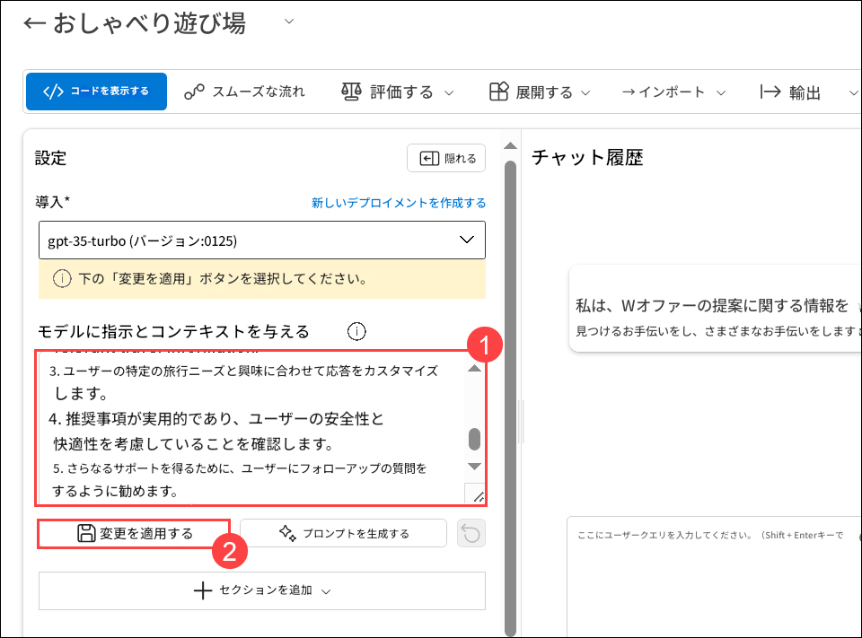

10. **続行** を選択します。     

11. チャットウィンドウで、前回と同じクエリ **What can you do?** を入力します。応答の変化を確認してください。

     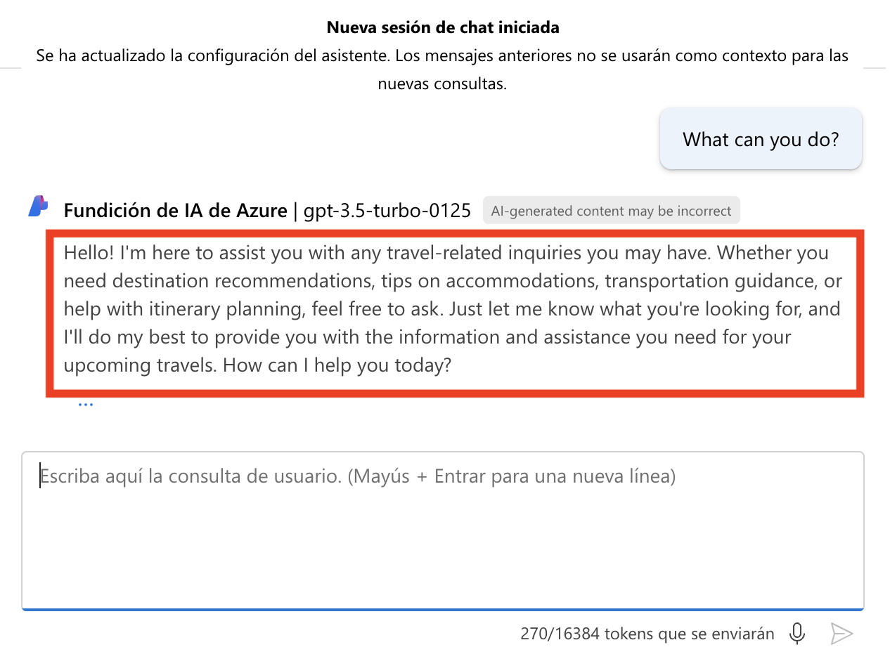

     >**注:** 出力は異なりますが、スクリーンショットと類似する形で表示されます。

12. 左側のナビゲーションペインから、**プロンプト フロー (1) > + 作成 (2)** を選択し、フローにプロンプトツールを追加します。

   

13. **新しいフローを作成** ブレードの **チャットフロー** セクションで **作成** をクリックし、フォルダ名に **Travel-Chat** と入力して **作成** をクリックします。 

   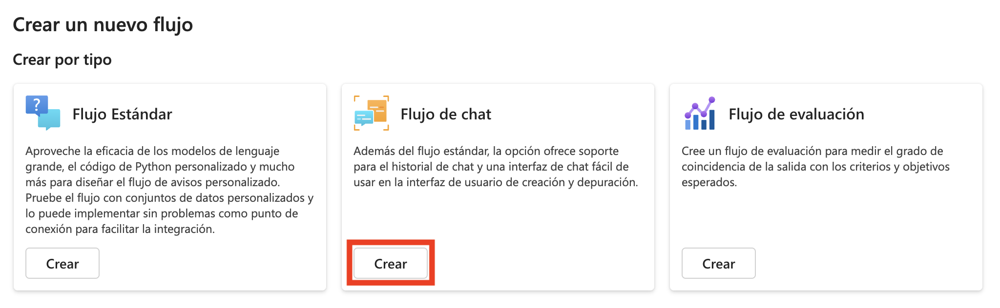

14. シンプルなチャットフローが作成されます。**チャット履歴とユーザーの質問**の2つの入力、デプロイした言語モデルと接続するLLMノード、そしてチャットに応答を反映する出力が含まれます。

   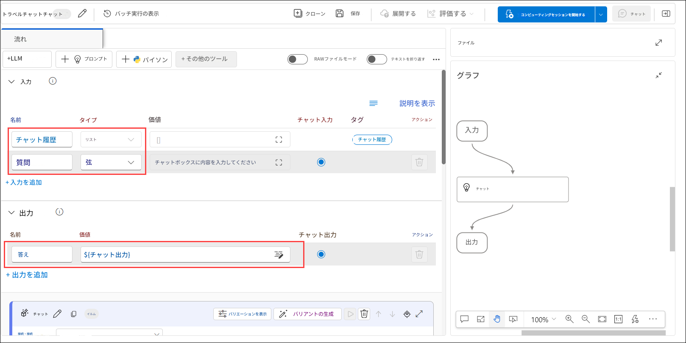

15. フローをテストするには、コンピュートセッションが必要です。トップバーから **Start compute session** を選択します。

   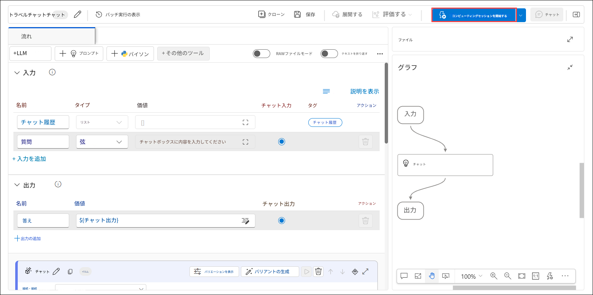
   
   >**注:** コンピュートセッションの開始には1～3分かかります。
   
16. **chat** という名前のLLMノードを選択します。システムメッセージを以下のように更新してください：

   ```
   system:
   **Objective**: Assist users with travel-related inquiries, offering tips, advice, and recommendations as a knowledgeable travel agent.
   
   **Capabilities**:
   - Provide up-to-date travel information, including destinations, accommodations, transportation, and local attractions.
   - Offer personalized travel suggestions based on user preferences, budget, and travel dates.
   - Share tips on packing, safety, and navigating travel disruptions.
   - Help with itinerary planning, including optimal routes and must-see landmarks.
   - Answer common travel questions and provide solutions to potential travel issues.
   
   **Instructions**:
   1. Engage with the user in a friendly and professional manner, as a travel agent would.
   2. Use available resources to provide accurate and relevant travel information.
   3. Tailor responses to the user's specific travel needs and interests.
   4. Ensure recommendations are practical and consider the user's safety and comfort.
   5. Encourage the user to ask follow-up questions for further assistance.
   
   
   user:
   {{item.inputs.question}}
   assistant:
   {{item.outputs.answer}}
   
   
   user:
   {{question}}
   ```

   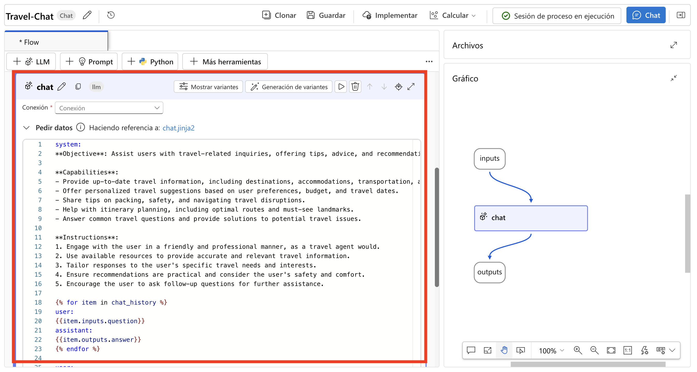

17. **保存** を選択します。

18. デプロイしたモデルと LLM ノードを接続する必要があります。**LLM ノード** のセクションで以下を設定してください: 

   - **接続**: **gpt-35-turbo** **(1)** のデプロイ時に作成された接続を選択
   - **Api**: **chat (2)** を選択  
   - **deployment_name**: デプロイした **gpt-35-turbo (3)** モデルを選択
   - **response_format**: **{“type”:”text”} (4)** を選択 

     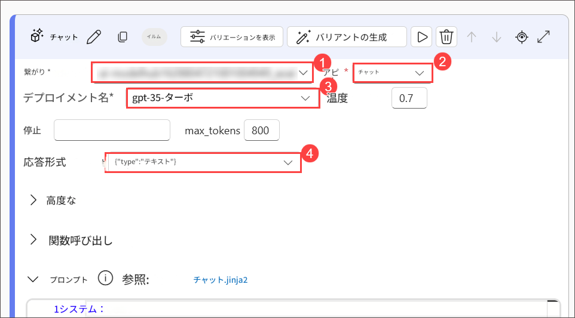
   
## タスク 2: LLM とプロンプトツールをフローで使用する

フローの開発が完了したので、チャットウィンドウを使用してフローをテストできます。

1. コンピュートセッションが稼働していることを確認してください。**保存 (1)** を選択し、**Chat (2)** を選択してフローをテストします。

   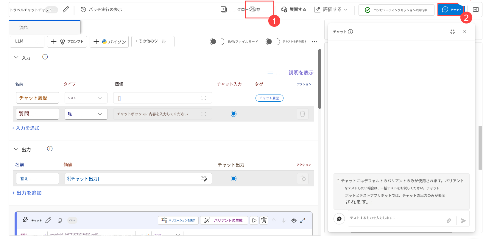

2. クエリ **I have one day in London, what should I do?** を入力し、出力を確認してください。

   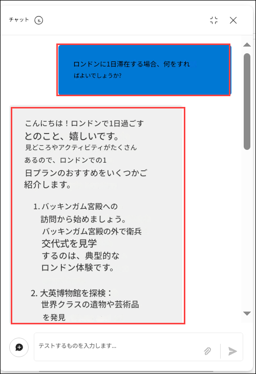

   >**注:** 出力は異なりますが、スクリーンショットと類似する形で表示されます。

3. **デプロイ** を選択し、以下の設定でフローをデプロイします:

   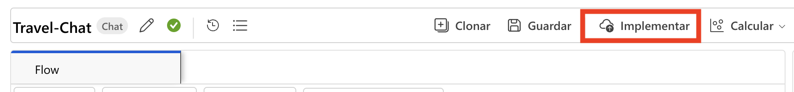
   
   - 基本設定:
     - エンドポイント: **New (1)**
     - エンドポイント名: **modelendpoint-{suffix} (2)**
     - デプロイ名: **modeldeploy-{suffix}(3)**
     - 仮想マシン: **Standard_DS3_v2 (4)**
     - インスタンス数: **3 (5)**
     - 推論データ収集: **Enabled (6)**
     - **レビュー + 作成 (7)** を選択

         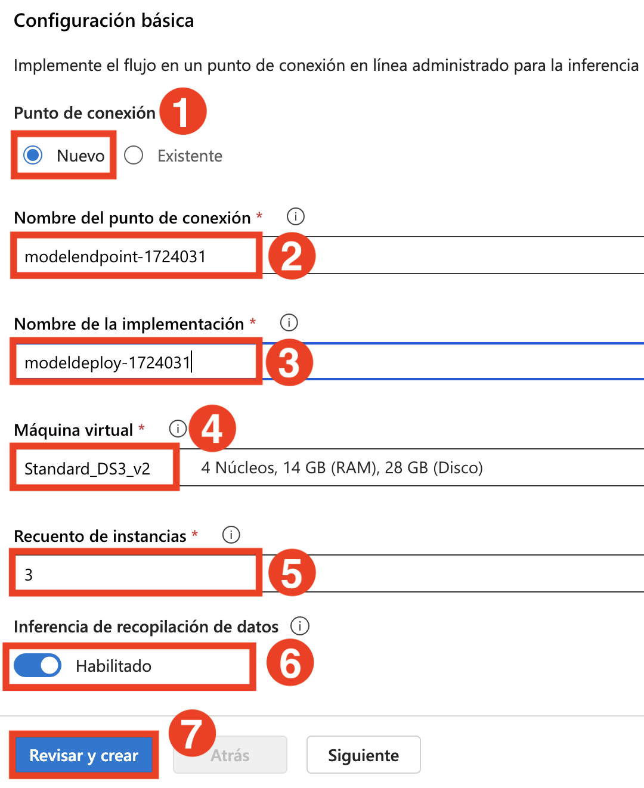

4. **作成** を選択します。    

5. Azure AI Foundry の左側のナビゲーションペインで、**アセット** の下にある **モデル + エンドポイント** を選択します。  

   >**注:** フローが保存されていない場合は **保存** を選択してください。  

6. **モデルデプロイメント (1)** タブを選択し、デプロイ済みのフローを探します。デプロイメントが一覧に表示され、成功するまで時間がかかる場合があります。成功したら、新しく作成されたデプロイメント **(2)** を選択します。

   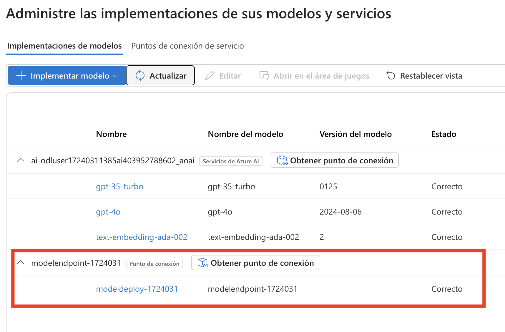

7. **Provisioning state（プロビジョニング状態）** が **Succeeded (1)** になるまで待ってから、**Test (2)** タブが表示されることを確認してください。

   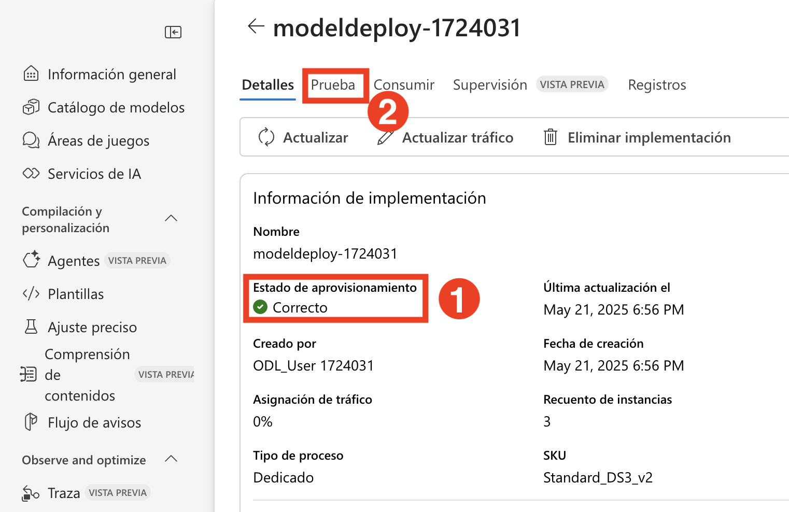

8. **Test** タブに移動し、**What is there to do in San Francisco?** と入力して、応答を確認してください。  

     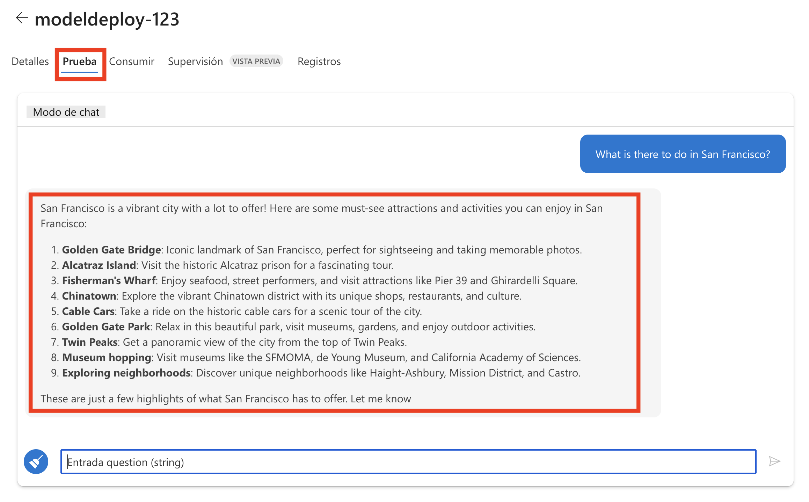

     >**注:** 出力は異なりますが、スクリーンショットと類似する形で表示されます。

9. **Where else could I go?** を入力し、応答を確認してください。  

     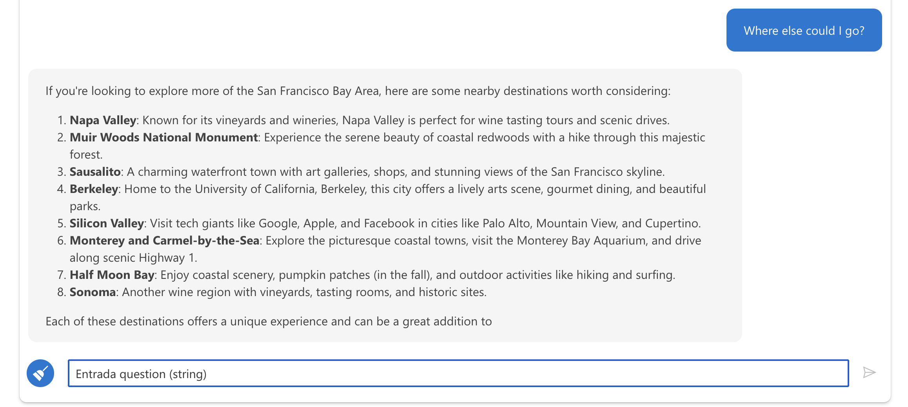

     >**注:** 出力は異なりますが、スクリーンショットと類似する形で表示されます。

10. **Consume** ページを確認し、エンドポイントの接続情報やサンプルコードを確認してください。これらを使用して、カスタムコパイロットを統合するアプリケーションを構築できます。

   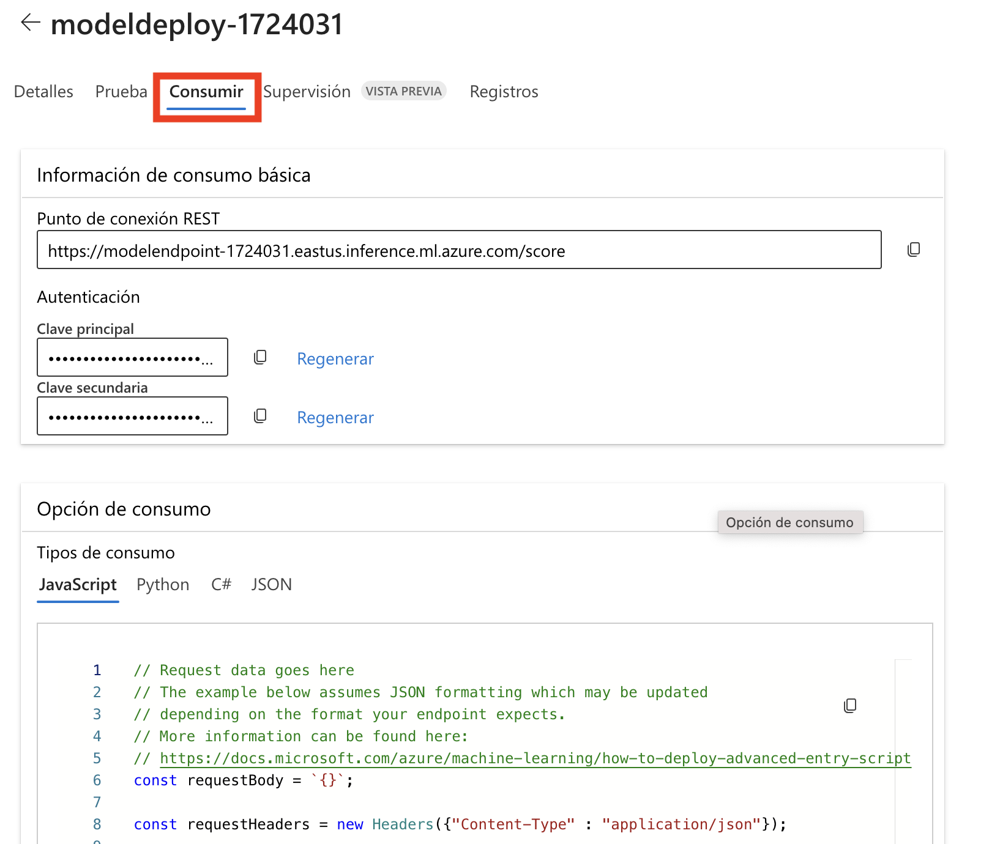

## レビュー
このラボでは、以下のタスクを完了しました：
- チャットフローを設計し、実装しました  
- フローで LLM とプロンプトツールを使用しました  

### ラボを完了しました。**次へ >>** をクリックして、次の演習に進みます。
