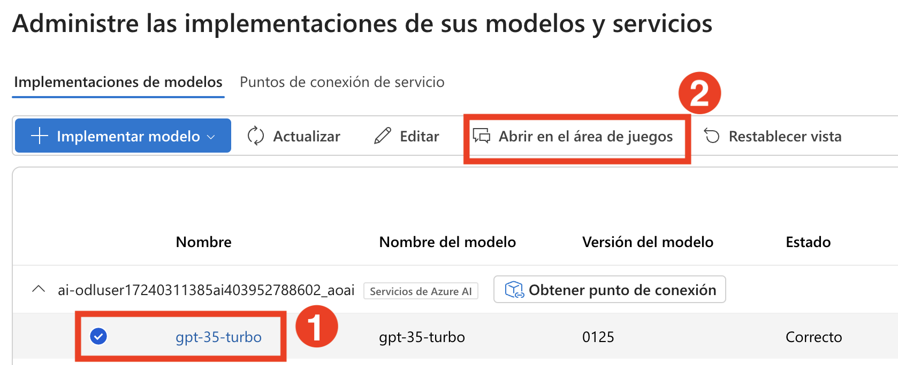
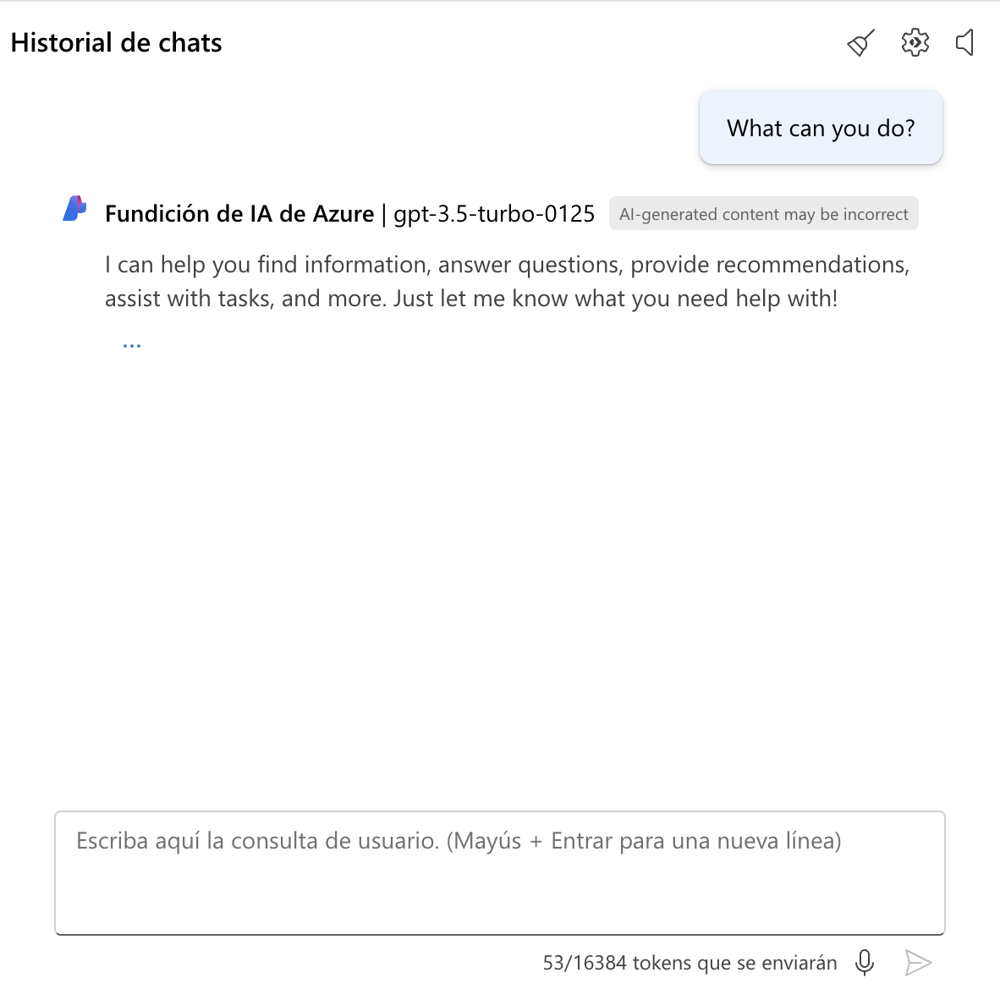
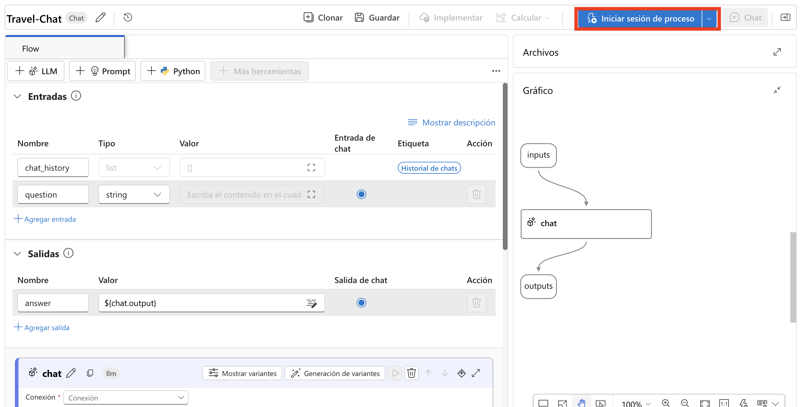
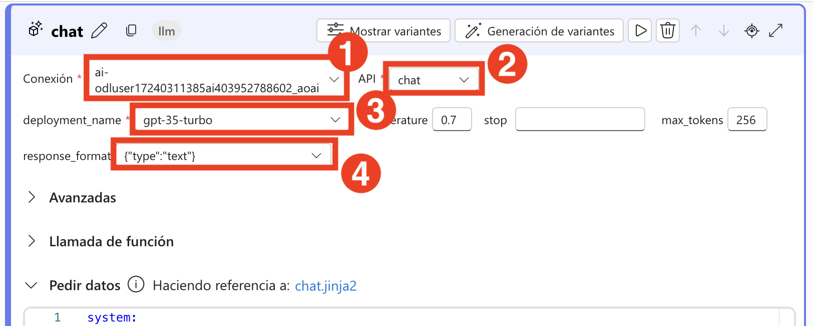
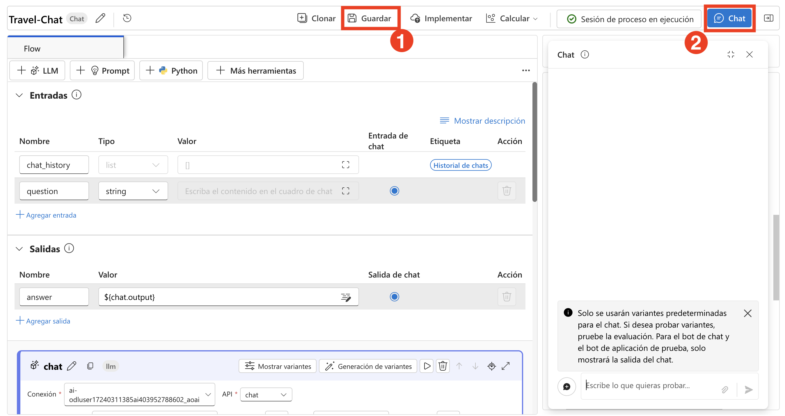

# 練習 5：實驗聊天流程 (Chat Flow) 與工具整合

> **注意**：由於需求量較大，部分使用者可能無法使用 AML 計算配額，這可能會導致無法執行本練習中的某些實驗步驟。不過，這不會影響您的實驗進度。您可以通讀步驟，理解練習內容，然後執行更新後的驗證—進度仍會被記錄。感謝您的體諒。

## 實驗概覽

在本次實驗中，你將設計並實驗一個聊天流程，以與已部署的語言模型互動。你將從使用 Azure AI foundry 建立一個基本的聊天流程開始，這包括整合輸入、LLM 節點，並設定輸出以呈現聊天回應。接著你會測試聊天流程，確保其正常運作，並將其部署至正式環境。最後的步驟包括驗證部署結果、使用範例查詢測試已部署的流程，以及探索將聊天流程整合至應用程式中作為自訂 copilot 的選項。

## 實驗目標

在本次實驗中，你將執行以下任務：
- 任務 1：設計並實驗一個聊天流程
- 任務 2：在流程中使用 LLM 與 Prompt 工具

## 任務 1：設計並實驗一個聊天流程
使用 Azure AI foundry 設計並實驗一個聊天流程，以與已部署的語言模型互動，測試其功能，並部署至正式環境使用。

1. 從左側導覽選單中，在 **我的資產**，選取 **模型 + 端點** **(1)**。

2. 在 **管理模型和服務的部署** 頁面中，於 **模型部署** 分頁下，選取 **+ 部署模型** **(2)**，然後從下拉選單中選擇 **部署基本模型** **(3)**。

   

3. 在 **選取模型** 頁面中，搜尋 **gpt-35-turbo** **(1)**，選取 **gpt-35-turbo** **(2)**，然後在 **gpt-35-turbo** 下選擇 **確認** **(3)**。

   

5. 在 **部署 gpt-35-turbo** 頁面中，依照以下指示建立部署：
   
   - 部署名稱 : **gpt-35-turbo** **(1)**
   - 部署類型: **標準** **(2)**
   - 點選 **自訂**
   - 模型版本升級原則: **當新的預設版本可供使用時升級** **(3)**
   - 模型版本: **0125** **(4)**
   - 已連線的 AI 資源: 選擇你在前一個任務中建立的資源 **(5)**
   - 每分鐘權杖數速率限制: **10K** **(6)**
   - 內容篩選: **DefaultV2** **(7)**
   - 啟用動態配額: **已啟用 (8)**
   - 點擊 **部署** **(9)**

     
     
6. 在 [Azure AI foundry](https://ai.azure.com/)中，於  **我的資產** 下選擇 **模型 + 端點**。在 **管理模型和服務的部署** 頁面中選取 **gpt-35-turbo** **(1)**，然後點選 **在遊樂場中開始** **(2)**。

    

7. 在聊天視窗中輸入查詢： **你能做什麼?**。

   >**注意** 回答會是通用的，因為尚未為助手設定特定指示。若要讓其聚焦於某項任務，可以修改 **提供模型指示和內容**。
   > 若查詢時出現錯誤，請等待 5 分鐘後再試。
   
     

   >**注意**： 輸出內容會有所不同，但會與截圖類似。

8. 更新 **提供模型指示和內容** **(1)** 為以下內容：

   ```
   **目標**：協助使用者解決與旅遊相關的問題，提供建議、技巧與推薦，就像一位專業且知識豐富的旅遊顧問。
   
   **功能**：
   - 提供最新的旅遊資訊，包括目的地、住宿、交通與當地景點。
   - 根據使用者的偏好、預算與旅遊日期，提供個人化的旅遊建議。
   - 分享打包技巧、安全須知與應對旅遊中斷的建議。
   - 協助規劃行程，包括最佳路線與必訪地標。
   - 回答常見的旅遊問題，並提供潛在問題的解決方案。
   
   **使用說明**：
   1. 以親切且專業的態度與使用者互動，如同旅遊顧問一般。
   2. 利用可用資源，提供準確且相關的旅遊資訊。
   3. 根據使用者的具體需求與興趣，量身打造回應內容。
   4. 確保推薦內容實用，並考量使用者的安全與舒適。
   5. 鼓勵使用者提出後續問題，以獲得更多協助。

   ```
   
9. 選擇 **套用變更** **(2)**。

     

10. 在 **更新系統訊息** 視窗中，選擇 **繼續**。   

11. 在聊天視窗中再次輸入相同查詢： **你能做什麼?**，觀察回應的變化。

     

     >**注意**： 輸出內容會有所不同，但會與截圖類似。

12. 從左側導覽窗格中，選擇 **提示流程** **(1)** > **+ 建立** **(2)**，將 Prompt 工具加入你的流程中。

    

13. 在 **建立新的流程** 面板中，於 **聊天流程** 下點選 **建立**，然後輸入資料夾名稱為 **旅遊聊天**，接著點選 **建立** 

    

14. 系統會為你建立一個簡單的聊天流程。請注意，這個流程包含兩個輸入 ( **chat history** 和 用戶的 **question**)，一個會連接到你已部署語言模型的 LLM 節點，以及一個用來顯示聊天回應的輸出 ( **answer**)。

    

15. 為了測試你的流程，你需要啟動運算資源。從上方工具列中選擇 **開始計算工作階段**。

    
   
    >**注意**： 運算資源啟動大約需要 1–3 分鐘。
   
16. 選取名為 **chat** 的 LLM 節點，並更新 **提示** 如下：

   ```
   system:
   **目標**: 協助使用者解決與旅遊相關的問題，提供建議、技巧與推薦，就像一位知識豐富的旅遊顧問。
   
   **功能**:
   - 提供最新的旅遊資訊，包括目的地、住宿、交通與當地景點。
   - 根據使用者的偏好、預算與旅遊日期，提供個人化的旅遊建議。
   - 分享打包技巧、安全須知與應對旅遊中斷的建議。
   - 協助規劃行程，包括最佳路線與必訪地標。
   - 回答常見的旅遊問題，並提供潛在問題的解決方案。
   
   **使用說明**:
   1. 以親切且專業的態度與使用者互動，如同旅遊顧問一般。
   2. 利用可用資源，提供準確且相關的旅遊資訊。
   3. 根據使用者的具體旅遊需求與興趣，量身打造回應內容。
   4. 確保推薦內容實用，並考量使用者的安全與舒適。
   5. 鼓勵使用者提出後續問題，以獲得更多協助。
   
   
   user:
   {{item.inputs.question}}
   assistant:
   {{item.outputs.answer}}
   
   
   user:
   {{question}}
   ```

   

17. 選擇 **儲存**。

18. 你仍需將 **chat** 的 LLM 節點連接到你已部署的模型。在 **Chat** 區段中：

   - **連線**：選擇你在建立 **gpt-35-turbo** **(1)** 部署時新建立的連線。 
   - **API**：選擇 **chat** **(2)**。
   - **deployment_name**：選擇你所部署的 **gpt-35-turbo** **(3)** 模型。
   - **response_format**：選擇 **{“type”:”text”}** **(4)**。

     
   
## 任務 2：在流程中使用 LLM 與 Prompt 工具

現在你已經開發好這個流程，可以使用聊天視窗來測試這個流程。

1. 確保運算資源已啟動。選擇 **儲存** **(1)**，然後選擇 **聊天** **(2)** 來測試流程。

   

2. 輸入查詢： **我在倫敦有一天，我該做什麼?** 並檢視輸出結果。

   

   >**注意**： 輸出內容會有所不同，但會與截圖類似。

3. 選擇  **部署** ，以以下設定部署此流程：

   
   
   - 基本設定:
     - 端點: **新增** **(1)**
     - 端點名稱: **modelendpoint-{suffix}** **(2)**
     - 部署名稱: **modeldeploy-{suffix}** **(3)**
     - 虛擬機器: **Standard_DS3_v2** **(4)**
     - 執行個體計數: **3** **(5)**
     - 推斷資料收集: **已啟用** **(6)**
     - 點選 **檢閱 + 建立** **(7)**

         

4. 選擇 **建立**。 

5. 在 Azure AI foundry 中，從左側導覽窗格的 **我的資產** 下選擇 **模型 + 端點**。

   >**注意**： 若你的流程尚未儲存，請選擇 **儲存**。

6. 選擇 **模型部署** **(1)** 分頁以尋找你已部署的流程。部署可能需要一些時間才會顯示並成功建立。當部署成功後，選擇新建立的部署 **(2)**。

   

7. 等待 **佈建狀態** 變成 **已成功** **(1)**，這樣你才會看到 **測試** **(2)** 分頁。

   

8. 前往 **測試** 分頁，輸入提示詞 **在舊金山有什麼好玩的？** 並檢視回應。

     

     >**注意**： 輸出內容會有所不同，但會與截圖類似。

9. 輸入提示詞 **我還能去哪裡?** 並檢視回應。

     

     >**注意**： 輸出內容會有所不同，但會與截圖類似。

10. 查看 **取用** 頁面，該頁面包含連線資訊與範例程式碼，可用於為你的端點建立用戶端應用程式，讓你能將此 **提示流程** 解決方案整合至應用程式中，作為自訂 copilot。

    

## 回顧

在本次實驗中，您已完成以下任務：

- 任務 1：設計並實驗一個聊天流程
- 任務 2：在流程中使用 LLM 與 Prompt 工具

### 恭喜！您已成功完成本次實驗課程！
### 請點選導覽連結，以繼續進行下一個實驗課程。
