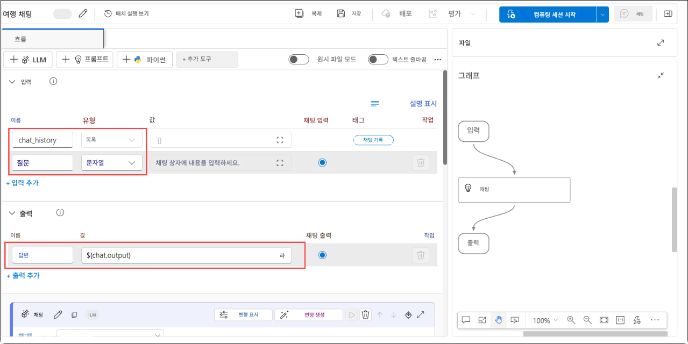

# 실습 5: 채팅 흐름 구현 및 도구 통합

> **참고**: 수요 급증으로 인해 일부 사용자의 AML 컴퓨팅 할당량이 부족하여 이 연습의 특정 랩 단계를 실행하지 못할 수 있습니다. 하지만 이는 랩 진행 상황에 영향을 미치지 않습니다. 단계를 읽고 연습 내용을 이해한 후 업데이트된 검증을 실행해도 진행 상황은 계속 기록됩니다. 양해해 주셔서 감사합니다.

## 개요

이 실습에서는 배포된 언어 모델과 상호작용할 수 있도록 채팅 흐름(chat flow)을 설계하고 구현합니다. 먼저 Azure AI Foundry를 사용하여 기본 채팅 흐름을 생성합니다. 이 흐름에는 입력 구성, LLM 노드 통합, 채팅 응답을 반영하는 출력 구성이 포함됩니다. 이후 채팅 흐름을 테스트하여 정상 작동 여부를 확인하고, 프로덕션 환경에 배포합니다. 마지막 단계에서는 배포를 검증하고, 예제 쿼리로 배포된 흐름을 테스트하며, 해당 채팅 흐름을 사용자 지정 코파일럿(custom copilot)으로 애플리케이션에 통합하는 여러 방법들을 살펴봅니다.

## 목표

이 실습에서 여러분은 다음 과제를 수행하게 됩니다:

- 과제 1: 채팅 흐름 설계 및 구현
- 과제 2: 흐름 내에서 LLM 및 프롬프트 도구 사용

## 과제 1: 채팅 흐름 설계 및 구현

Azure AI Foundry를 사용하여 배포된 언어 모델과 상호 작용하는 채팅 흐름을 설계하고 구현한 후, 해당 흐름의 기능을 테스트하고 프로덕션 환경에 배포합니다.

1. 왼쪽 탐색 메뉴에서 **내 자산** 아래의 **모델 + 엔드포인트 (1)**를 선택합니다.

1. **모델 및 서비스의 배포 관리** 페이지에서 **모델 배포** 탭 아래 **+ 모델 배포 (2)**을 선택한 후 드롭다운에서 **기본 모델 배포 (3)**을 선택합니다.

   

1. **모델 선택** 페이지에서 **gpt-35-turbo (1)** 를 검색하고, **gpt-35-turbo (2)** 를 선택한 다음, **확인 (3)**을 클릭합니다.

   

1. **gpt-35-turbo 배포** 페이지에서 배포 이름을 **gpt-35-turbo**로 입력하고 **사용자 지정**를 클릭합니다.

1. **gpt-35-turbo 배포** 페이지에서 다음과 같이 설정을 구성합니다:

   - 배포 이름: **gpt-35-turbo (1)**
   - 배포 유형: **Standard (2)**
   - 모델 버전 업그레이드 정책: **새 기본 버전을 사용할 수 있게 되면 업그레이드 (3)**
   - 모델 버전: **0125 (4)**
   - 연결된 AI 리소스: 이전에 생성한 리소스 선택 **(5)**
   - 분당 토큰 속도 제한: **10K (6)**
   - 콘텐츠 필터: **DefaultV2 (7)**
   - 동적 할당량 사용: **사용 (8)**
   - **배포 (9)** 선택

   

1. [Azure AI foundry](https://ai.azure.com/)로 이동한 후, **내 자산** 아래에 **모델 + 앤드포인트**를 선택하고, **gpt-35-turbo (1)**를 선택한 후 **플레이그라운드에서 열기 (2)**를 클릭합니다.

   

1. 채팅 입력창에 다음과 같이 입력합니다:
   `What can you do?`(무엇을 할 수 있나요?)

   > **참고:** 시스템 프롬프트가 설정되지 않아 응답이 일반적일 수 있습니다. 특정 작업에 집중하도록 하려면 시스템 메시지를 변경해야 합니다.
   > 오류가 발생할 경우 5분 정도 기다린 후 재시도하세요.

   

1. **모델에 지침 및 컨텍스트 제공 (1)** 아래의 텍스트 창에 다음 내용을 입력 합니다. 

   ```
   **Objective**: Assist users with travel-related inquiries, offering tips, advice, and recommendations as a knowledgeable travel agent.

   **Capabilities**:
   - Provide up-to-date travel information, including destinations, accommodations, transportation, and local attractions.
   - Offer personalized travel suggestions based on user preferences, budget, and travel dates.
   - Share tips on packing, safety, and navigating travel disruptions.
   - Help with itinerary planning, including optimal routes and must-see landmarks.
   - Answer common travel questions and provide solutions to potential travel issues.
    
   **Instructions**:
   1. Engage with the user in a friendly and professional manner, as a travel agent would.
   2. Use available resources to provide accurate and relevant travel information.
   3. Tailor responses to the user's specific travel needs and interests.
   4. Ensure recommendations are practical and consider the user's safety and comfort.
   5. Encourage the user to ask follow-up questions for further assistance.
   ```
   ```
   **목적**: 여행과 관련된 문의에 대해 팁, 조언, 추천을 제공하며, 지식이 풍부한 여행사 직원처럼 사용자에게 도움을 줍니다.

   **기능**:
   - 여행지, 숙소, 교통편, 지역 명소 등 최신 여행 정보를 제공합니다.
   - 사용자 선호도, 예산, 여행 날짜를 바탕으로 맞춤 여행 제안을 합니다.
   - 짐 싸기, 안전, 여행 중 발생할 수 있는 문제 대응에 대한 팁을 공유합니다.
   - 최적의 경로와 꼭 방문해야 할 명소를 포함한 여행 일정 계획을 도와줍니다.
   - 일반적인 여행 관련 질문에 답하고 발생 가능한 문제에 대한 해결책을 제시합니다.
    
   **지침**:
   1. 사용자에게 친절하고 전문적인 태도로 응대하세요. (여행사 직원처럼)
   2. 이용 가능한 자료를 활용해 정확하고 적절한 여행 정보를 제공하세요.
   3. 사용자의 특정한 여행 필요와 관심사에 맞춰 답변을 맞춤화하세요.
   4. 추천은 실용적이어야 하며, 사용자의 안전과 편안함을 고려하세요.
   5. 추가 도움이 필요한 경우, 사용자에게 후속 질문을 유도하세요.
   ```

1. **변경 내용 적용 (2)** 을 클릭합니다.

   

1. **계속** 을 선택합니다.

1. 채팅 입력창에 동일한 쿼리 **What can you do?** (무엇을 할 수 있나요?) 를 다시 입력하여 응답의 어떻게 변화 되는지 확인 합니다. 

    

    > **참고:** 출력 내용은 예시와 완전히 일치하지는 않지만, 유사한 형태로 표시될 것입니다.

1. 왼쪽 탐색 메뉴에서 **프롬프트 흐름 (1)** > **+ 만들기 (2)**를 선택하여 흐름에 프롬프트 도구를 추가합니다.

    

1. **새 흐름 만들기** 창에서 **채팅 흐름** 을 선택하고 **만들기** 를 클릭한 뒤, 폴더 이름을 **Travel-Chat** 으로 입력하고 **만들기** 를 클릭합니다.

    

1. 간단한 채팅 흐름가 생성됩니다. 두 개의 입력(이전 대화 내용과 사용자의 질문), LLM 노드, 출력이 포함된 기본 구조입니다.

    

1. 흐름을 테스트하려면 컴퓨팅 리소스를 시작해야 합니다. 상단 바에서 **컴퓨팅 세션 시작** 을 클릭합니다.

    

    > **참고:** 컴퓨팅 세션 시작에는 1\~3분 정도 소요됩니다.

1. **chat**이라는 이름의 LLM 노드를 선택하고 다음과 같이 시스템 메시지를 업데이트합니다:

   ```
   system:
   **Objective**: Assist users with travel-related inquiries, offering tips, advice, and recommendations as a knowledgeable travel agent.

   **Capabilities**:
   - Provide up-to-date travel information, including destinations, accommodations, transportation, and local attractions.
   - Offer personalized travel suggestions based on user preferences, budget, and travel dates.
   - Share tips on packing, safety, and navigating travel disruptions.
   - Help with itinerary planning, including optimal routes and must-see landmarks.
   - Answer common travel questions and provide solutions to potential travel issues.

   **Instructions**:
   1. Engage with the user in a friendly and professional manner, as a travel agent would.
   2. Use available resources to provide accurate and relevant travel information.
   3. Tailor responses to the user's specific travel needs and interests.
   4. Ensure recommendations are practical and consider the user's safety and comfort.
   5. Encourage the user to ask follow-up questions for further assistance.

   
   user:
   {{item.inputs.question}}
   assistant:
   {{item.outputs.answer}}
   

   user:
   {{question}}
   ```
   ```
   system:
   **목적**: 여행과 관련된 문의에 대해 팁, 조언, 추천을 제공하며, 지식이 풍부한 여행사 직원처럼 사용자에게 도움을 줍니다.

   **기능**:
   - 여행지, 숙소, 교통편, 지역 명소 등 최신 여행 정보를 제공합니다.
   - 사용자 선호도, 예산, 여행 날짜를 바탕으로 맞춤 여행 제안을 합니다.
   - 짐 싸기, 안전, 여행 중 발생할 수 있는 문제 대응에 대한 팁을 공유합니다.
   - 최적의 경로와 꼭 방문해야 할 명소를 포함한 여행 일정 계획을 도와줍니다.
   - 일반적인 여행 관련 질문에 답하고 발생 가능한 문제에 대한 해결책을 제시합니다.
    
   **지침**:
   1. 사용자에게 친절하고 전문적인 태도로 응대하세요. (여행사 직원처럼)
   2. 이용 가능한 자료를 활용해 정확하고 적절한 여행 정보를 제공하세요.
   3. 사용자의 특정한 여행 필요와 관심사에 맞춰 답변을 맞춤화하세요.
   4. 추천은 실용적이어야 하며, 사용자의 안전과 편안함을 고려하세요.
   5. 추가 도움이 필요한 경우, 사용자에게 후속 질문을 유도하세요.

   
   user:
   {{item.inputs.question}}
   assistant:
   {{item.outputs.answer}}
   

   user:
   {{question}}
   ```

   

1. **저장** 을 클릭합니다.

1. 이제 LLM 노드를 배포된 모델에 연결해야 합니다. **LLM node** 설정에서 다음을 구성합니다:

    * **연결**: **gpt-35-turbo** 배포 시 생성된 연결 선택 **(1)**
    * **API**: **chat (2)** 선택
    * **deployment\_name**: **gpt-35-turbo (3)** 선택
    * **response\_format**: **{“type”:”text”} (4)** 선택

    

## 과제 2: 흐름에서 LLM 및 프롬프트 도구 사용

이제 흐름을 개발했으므로, 채팅 창에서 흐름을 테스트할 수 있습니다.

1. 컴퓨트 세션이 실행 중인지 확인합니다. **저장 (1)**를 클릭한 후, **채팅 (2)**을 선택하여 흐름를 테스트합니다.

   

1. 다음 쿼리를 입력합니다:
   `I have one day in London, what should I do?` (런던에서 하루를 보내게 되었는데, 무엇을 하면 좋을까요?)

   출력 결과를 확인합니다.

   

   > **참고:** 출력은 다를 수 있으나, 스크린샷과 유사한 형태로 나타납니다.

1. 흐름를 배포하려면 **배포** 를 선택하고 다음과 같이 설정합니다:

   

   * 기본 설정:

     * 엔드포인트: **새로 만들기 (1)**
     * 엔드포인트 이름: **modelendpoint-{suffix} (2)**
     * 배포 이름: **modeldeploy-{suffix} (3)**
     * 가상 머신: **Standard\_DS3\_v2 (4)**
     * 인스턴스 수: **3 (5)**
     * 유추 데이터 수집 : **사용됨 (6)**
     * **검토 + 만들기 (7)** 선택

     

1. **만들기**를 선택합니다.

1. Azure AI Foundry에서 왼쪽 탐색 메뉴의 **내 자산 > 모델 + 엔드포인트**로 이동합니다.

   > **참고:** 흐름를 저장하지 않았다면 **저장** 을 먼저 선택하세요.

1. **모델 배포 (1)** 탭을 선택하여 배포된 흐름를 확인합니다. 항목이 표시되기까지 시간이 걸릴 수 있습니다. 배포가 완료되면 새로 생성된 배포 항목 **(2)**을 선택합니다.

   

1. **프로비저닝 상태**가 **성공 (1)**로 변경될 때까지 기다립니다. 이 상태가 되어야 **테스트 (2)** 탭이 활성화됩니다.

   

1. **테스트** 탭으로 이동하여 다음 프롬프트를 입력합니다:
   `What is there to do in San Francisco?` (샌프란시스코에서 할 수 있는 일에는 무엇이 있나요?)
   출력 결과를 확인합니다.

   

   > **참고:** 출력은 스크린샷과 동일하지 않지만 유사하게 표시됩니다.

1. 다음 프롬프트를 입력합니다:
   `Where else could I go?` (다른 추천 여행지는 어디인가요?)
   출력 결과를 확인합니다.

   

   > **참고:** 출력은 다를 수 있으며 예시와 비슷한 형태로 나타납니다.

1. **사용** 페이지를 확인합니다. 이 페이지에는 연결 정보와 샘플 코드가 포함되어 있으며, 이를 통해 클라이언트 애플리케이션을 구축하여 해당 엔드포인트를 **맞춤형 Copilot**으로 통합할 수 있습니다.

    

## 복습

이번 실습에서는 다음 작업을 완료했습니다:
- 채팅 흐름을 설계하고 구현했습니다.
- 흐름에서 LLM과 프롬프트 도구를 사용했습니다.

### 실습을 성공적으로 완료하였습니다. 다음 연습 과제로 진행하려면 다음 >> 버튼을 클릭하세요.
