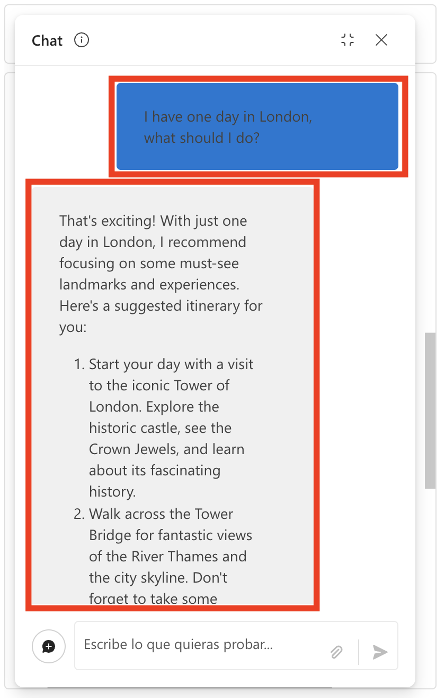

# 练习 5：实现聊天流和工具集成

> **注意**：由于需求量较大，部分用户可能无法使用 AML 计算配额，这可能会导致无法执行本练习中的某些实验步骤。不过，这不会影响您的实验进度。您可以通读步骤，理解练习内容，然后运行更新后的验证——进度仍会被记录。感谢您的理解。

## 实验概述
在本实验中，您将设计和实现一个聊天流来与已部署的语言模型进行交互。您将首先使用 Azure AI foundry 创建一个基本的聊天流，其中包括集成输入、LLM 节点，并配置输出以反映聊天响应。然后，您将测试聊天流，确保其功能正常，并将其部署到生产环境。最后的步骤包括验证部署、使用示例查询测试已部署的流程，以及探索将聊天流作为自定义 copilot 集成到应用程序中的选项。

## 实验目标
在本实验中，您将完成以下任务：
- 任务 1：设计和实现聊天流
- 任务 2：在流程中使用 LLM 和提示工具

## 任务 1：设计和实现聊天流
使用 Azure AI foundry 设计和实现聊天流以与已部署的语言模型进行交互，测试其功能，并将其部署用于生产使用。

1. 从左侧导航菜单中，在 **我的资产** 下，选择 **模型和端点 (1)**。

2. 在 **管理您的模型、应用和服务部署** 页面上，在 **模型部署** 标签下，选择 **+ 部署模型 (2)**，然后从下拉菜单中选择 **部署基础模型 (3)**。

   

3. 在 **选择模型** 页面上，搜索 **gpt-35-turbo (1)**，选择 **gpt-35-turbo (2)**，在 **gpt-35-turbo** 下选择 **确认 (3)**。

   

4. 在 **部署模型 gpt-35-turbo** 页面上输入部署名称：**gpt-35-turbo** 并点击 **自定义**。

5. 在 **部署模型 gpt-35-turbo** 页面上按照以下说明创建部署：

   - 部署名称：**gpt-35-turbo (1)**
   - 部署类型：**标准 (2)**
   - 选择 **自定义**
   - 启用自动版本更新：**已启用 (3)**
   - 模型版本：**0125 (4)**
   - 连接的 AI 资源：选择我们在之前任务中创建的资源 **(5)**
   - 每分钟令牌限制（千）：**10K (6)**
   - 内容过滤器：**DefaultV2 (7)**
   - 启用动态配额：**已启用 (8)**
   - 选择 **部署 (9)**

   

6. 在 [Azure AI foundry](https://ai.azure.com/) 中，在 **我的资产** 下，选择 **模型和端点**。在 **模型和部署** 页面上选择 **gpt-35-turbo (1)** 然后点击 **在游乐场中打开 (2)**。

   

7. 在聊天窗口中，输入查询 **What can you do?**（**您能做什么？**）。

   >**注意：** 答案是通用的，因为没有为助手提供具体的指令。要使其专注于特定任务，您可以更改系统提示。
   > 如果查询时出现错误，请等待 5 分钟。

   

   >**注意：** 输出会有所不同；它不会完全相同。但是，它会与截图类似。

8. 将 **系统消息 (1)** 更新为以下内容：


    **英文：**

    ```
   **Objective**: Assist users with travel-related inquiries, offering tips, advice, and recommendations as a knowledgeable travel agent.

   **Capabilities**:
   - Provide up-to-date travel information, including destinations, accommodations, transportation, and local attractions.
   - Offer personalized travel suggestions based on user preferences, budget, and travel dates.
   - Share tips on packing, safety, and navigating travel disruptions.
   - Help with itinerary planning, including optimal routes and must-see landmarks.
   - Answer common travel questions and provide solutions to potential travel issues.
   
   **Instructions**:
   1. Engage with the user in a friendly and professional manner, as a travel agent would.
   2. Use available resources to provide accurate and relevant travel information.
   3. Tailor responses to the user's specific travel needs and interests.
   4. Ensure recommendations are practical and consider the user's safety and comfort.
   5. Encourage the user to ask follow-up questions for further assistance.

    ```

    **中文：**

   ```
   **目标**：作为一个知识渊博的旅行顾问，协助用户解答旅行相关的询问，提供建议和推荐。

   **能力**：
   - 提供最新的旅行信息，包括目的地、住宿、交通和当地景点。
   - 根据用户偏好、预算和旅行日期提供个性化的旅行建议。
   - 分享打包、安全和处理旅行中断的建议。
   - 协助行程规划，包括最佳路线和必看景点。
   - 回答常见旅行问题并为潜在的旅行问题提供解决方案。

   **指令**：
   1. 以友好和专业的方式与用户互动，就像一个旅行顾问一样。
   2. 使用可用资源提供准确和相关的旅行信息。
   3. 根据用户的具体旅行需求和兴趣定制回应。
   4. 确保建议实用且考虑到用户的安全和舒适。
   5. 鼓励用户提出后续问题以获取更多帮助。
   ```

9. 选择 **应用更改 (2)**。

   

10. 选择 **继续**。

11. 在聊天窗口中，输入与之前相同的查询：**What can you do?**（**您能做什么？**）。注意响应的变化。

    

    >**注意：** 输出会有所不同；它不会完全相同。但是，它会与截图类似。

12. 从左侧导航窗格中，选择 **提示流程 (1) > + 创建 (2)** 将提示工具添加到您的流程中。

    

13. 在 **创建新流程** 页面上，在 **聊天流程** 下，点击 **创建**，然后输入文件夹名称 **Travel-Chat**，然后点击 **创建**。

    

14. 系统会为您创建一个简单的聊天流。注意有两个输入（**聊天历史记录和用户问题**），一个将连接到您部署的语言模型的 LLM 节点，以及一个用于在聊天中反映响应的输出。

    

15. 要能够测试您的流程，您需要计算资源。从顶部栏选择 **启动计算会话**。

    

    >**注意：** 计算会话将需要 1-3 分钟才能启动。

16. 选择名为 **chat** 的 LLM 节点。按如下方式更新系统消息：


    **英文：**

    ```
      system:
      **Objective**: Assist users with travel-related inquiries, offering tips, advice, and recommendations as a knowledgeable travel agent.

      **Capabilities**:
      - Provide up-to-date travel information, including destinations, accommodations, transportation, and local attractions.
      - Offer personalized travel suggestions based on user preferences, budget, and travel dates.
      - Share tips on packing, safety, and navigating travel disruptions.
      - Help with itinerary planning, including optimal routes and must-see landmarks.
      - Answer common travel questions and provide solutions to potential travel issues.

      **Instructions**:
      1. Engage with the user in a friendly and professional manner, as a travel agent would.
      2. Use available resources to provide accurate and relevant travel information.
      3. Tailor responses to the user's specific travel needs and interests.
      4. Ensure recommendations are practical and consider the user's safety and comfort.
      5. Encourage the user to ask follow-up questions for further assistance.

      
      user:
      {{item.inputs.question}}
      assistant:
      {{item.outputs.answer}}
      

      user:
      {{question}}
    ```

    **中文：**

    ```
    system:
    **目标**：作为一个知识渊博的旅行顾问，协助用户解答旅行相关的询问，提供建议和推荐。

    **能力**：
    - 提供最新的旅行信息，包括目的地、住宿、交通和当地景点。
    - 根据用户偏好、预算和旅行日期提供个性化的旅行建议。
    - 分享打包、安全和处理旅行中断的建议。
    - 协助行程规划，包括最佳路线和必看景点。
    - 回答常见旅行问题并为潜在的旅行问题提供解决方案。

    **指令**：
    1. 以友好和专业的方式与用户互动，就像一个旅行顾问一样。
    2. 使用可用资源提供准确和相关的旅行信息。
    3. 根据用户的具体旅行需求和兴趣定制回应。
    4. 确保建议实用且考虑到用户的安全和舒适。
    5. 鼓励用户提出后续问题以获取更多帮助。

    
    user:
    {{item.inputs.question}}
    assistant:
    {{item.outputs.answer}}
    

    user:
    {{question}}
    ```

    

17. 选择 **保存**。

18. 您还需要将 LLM 节点连接到您部署的模型。在 **LLM 节点** 部分中：

    - **连接**：选择在创建 **gpt-35-turbo** **(1)** 部署时为您新创建的连接。
    - **Api**：选择 **聊天 (2)**。
    - **deployment_name**：选择您部署的 **gpt-35-turbo (3)** 模型。
    - **response_format**：选择 **{"type":"text"} (4)**。

    

## 任务 2：在流程中使用 LLM 和提示工具

现在您已经开发了流程，可以使用聊天窗口来测试流程。

1. 确保计算会话正在运行。选择 **保存 (1)**。选择 **聊天 (2)** 来测试流程。

   

2. 输入查询：**I have one day in London, what should I do?**（**我在伦敦只有一天时间，我该做什么？**）并查看输出。

   

   >**注意：** 输出会有所不同；它不会完全相同。但是，它会与截图类似。

3. 选择 **部署** 使用以下设置部署流程：

   

   - 基本设置：
     - 端点：**新建 (1)**
     - 端点名称：**modelendpoint-{suffix} (2)**
     - 部署名称：**modeldeploy-{suffix} (3)**
     - 虚拟机：**Standard_DS3_v2 (4)**
     - 实例数量：**3 (5)**
     - 推理数据收集：**已启用 (6)**
     - 选择 **审查并创建 (7)**

   

4. 选择 **创建**。

5. 在 Azure AI foundry 中，从左侧导航窗格中的 **我的资产** 下，选择 **模型和端点**。

   >**注意：** 如果您的流程未保存，请选择 **保存**。

6. 选择 **模型部署 (1)** 标签以找到您部署的流程。部署可能需要一些时间才会列出并成功创建。当部署成功后，选择新创建的部署 **(2)**。

   

7. 等待 **预配状态** 变为 **成功 (1)**，然后您才会看到 **测试 (2)** 标签。

   

8. 导航到 **测试** 标签，输入提示 **What is there to do in San Francisco?**（**在旧金山有什么可以做的？**）并查看响应。

   

   >**注意：** 输出会有所不同；它不会完全相同。但是，它会与截图类似。

9. 输入提示 **Where else could I go?**（**我还可以去哪里？**）并查看响应。

   

   >**注意：** 输出会有所不同；它不会完全相同。但是，它会与截图类似。

10. 查看端点的 **使用** 页面，注意它包含连接信息和示例代码，您可以使用这些来为您的端点构建客户端应用程序 - 使您能够将提示流解决方案作为自定义 copilot 集成到应用程序中。

    

## 回顾
在本实验中，您已完成以下任务：
- 设计和实现了聊天流
- 在流程中使用了 LLM 和提示工具

### 您已成功完成实验。点击 **下一步** 继续下一个练习。
